# da-cluster 设计说明书

---

## 1 概述

### 1.1 目的

本文档是 da-cluster 多租户统一鉴权网关系统的详细设计说明书，用于描述系统的整体架构、各模块的设计思路、功能实现原理和接口规范，指导开发实施和后续维护。

**读者对象：** 开发工程师、测试工程师、项目经理、运维人员。

### 1.2 范围

本文档覆盖 da-cluster 系统的以下模块：

| 模块 | 覆盖内容 |
|------|---------|
| **Gateway（流量层）** | AgentGateway 路由、ext-authz 鉴权、Header 注入 |
| **Keycloak（身份层）** | 身份联合、JWT 签发、租户/角色/用户/应用/API Key 管理 API |
| **OPA（策略层）** | 动态策略评估、gRPC ext-authz、path_rules + resource_acl 管理 |
| **Resource-Sync（资源层）** | 资源级权限同步、ACL 管理、ext_proc gRPC 集成 |

**不在范围内：** 前端 WebUI 实现细节、具体业务应用（DA App）的开发、数据库表结构的 DDL 设计。

---

## 4 特性/功能实现原理

### 4.1 总体方案

#### 4.1.1 设计思路

##### 业务背景

da-cluster 是一套**多租户统一鉴权网关系统**，面向的核心场景是：产品需要交付给多个企业客户，每个客户拥有各自的员工身份体系（AD/LDAP/企业微信/SAML SSO/OIDC），不可能要求每个客户的员工重新注册一套账号。系统通过联合客户已有的身份源，统一签发标准化 JWT Token，使下游业务服务零改动接入完整的认证与授权能力。

**系统建设带来的核心价值：**

| 价值维度 | 说明 |
|---------|------|
| **身份联合接入** | 客户无需改变现有身份系统，通过 SAML/OIDC 协议联合对接，员工使用已有账号即可登录，降低客户接入成本 |
| **统一安全边界** | 所有微服务共享同一套认证授权基础设施，避免各服务重复实现鉴权逻辑，消除安全短板 |
| **动态策略管理** | 权限规则支持运行时修改，无需重新部署或重启服务即可生效，满足业务快速迭代的需要 |
| **多租户隔离** | 数据与权限天然按租户隔离，新客户接入不影响已有客户，支持独立的角色体系和策略配置 |
| **业务零侵入** | 下游服务只需读取 Gateway 注入的 `X-Auth-*` Headers，不涉及 JWT 解析、密钥管理等鉴权细节 |
| **统一流量治理** | 基于 Envoy 的 Gateway 层天然支持负载均衡、流量控制（限流/熔断）、超时重试、TLS 终止、CORS 管理、可观测性（日志/Metrics/Tracing）等能力，为后续扩展提供基础 |
| **合规审计基础** | ext-authz 链路天然记录了"谁、在什么时间、通过什么角色、访问了什么资源"的完整审计信息 |

##### 三层解耦设计

系统采用**流量层 - 身份层 - 策略层**三层解耦架构，每一层专注解决一个核心问题，层与层之间通过标准协议通信，可以独立演进和扩展。

**流量层（Gateway）：** 基于 AgentGateway（Envoy 内核）构建统一的流量入口。所有外部请求通过 Gateway 的单一端口进入系统，由 HTTPRoute 规则进行路径匹配和后端分发。Gateway 同时承载 ext-authz 外部授权过滤器，在请求到达业务后端之前拦截并调用策略层进行鉴权判定。这一层的核心价值在于将"流量如何路由"和"请求是否放行"两个关注点统一收口，业务服务无需关心网络拓扑和安全策略。

**身份层（Keycloak）：** 基于 Keycloak 构建企业级身份联合平台。每个客户对应一个独立的 Realm（租户），通过 SAML/OIDC Identity Provider 联合客户已有的身份系统。员工通过 SSO 登录后，Keycloak 在本地创建影子用户并签发标准化的 JWT Token，Token 中包含租户标识（`iss` 字段中的 realm）和 `groups` claim（字符串数组，如 `["master-admins", "tenant-admins", "all-users"]`）。这一层将"用户是谁"的问题标准化，下游无需关心客户原来用的是 AD 还是企业微信。

**策略层（OPA）：** 基于 Open Policy Agent 构建动态策略评估引擎。pep-proxy 作为策略执行点（PEP），接收 Gateway 的 ext-authz gRPC 请求，从 JWT 中提取用户身份和 groups 信息，构造策略查询输入提交给 OPA。OPA 基于 Rego 策略进行分组授权判定（app_disabled 检查 / master-admins / tenant-admins / all-users + path_rules + resource_acl）。策略数据通过 bundle-server 持久化到 PostgreSQL (iam DB)，并经 OPAL 实时同步到 OPA 实例。这一层将"用户能做什么"的逻辑从业务代码中完全剥离，支持运行时动态变更。

**资源层（Resource-Sync）：** 新增的 resource-sync 服务提供资源级别的细粒度权限控制。通过 ext_proc gRPC (:8082) 与 Gateway 集成，同时提供 ACL REST API (:8080) 管理资源权限（resource_acl、pending_acl）。部署在独立的 `resource-sync` namespace 中。

##### 关键设计原则

**一个 Realm = 一个租户 = 一个客户：** Keycloak 的 Realm 机制天然提供了租户隔离的基础。每个客户独占一个 Realm，拥有独立的用户目录、角色定义、IDP 配置和 Client 设置。JWT 的 `iss` 字段中嵌入了 Realm 名称（如 `http://localhost/realms/customer-a`），下游系统可以从中直接提取租户标识，无需额外的租户路由逻辑。这种设计确保了租户之间在身份层面的强隔离。

**业务后端零改动接入：** 所有鉴权逻辑都在 Gateway + pep-proxy 层完成，业务后端只需读取 Gateway 注入的 HTTP Headers（`X-Auth-User-Id`, `X-Auth-Tenant`, `X-Auth-Groups` 等）即可获取已验证的用户身份信息。业务服务不需要引入 JWT 库、不需要管理密钥、不需要实现 OIDC 发现协议，接入成本降至最低。新微服务只需注册一条 HTTPRoute 规则即可纳入统一鉴权体系。

**策略动态可变，无需重新部署：** 权限规则以数据的形式存储在 PostgreSQL 中，通过 bundle-server 生成 OPA Bundle 并直接推送到 OPA 实例（绕过轮询延迟），同时通知 OPAL Server 触发多副本同步。这意味着管理员通过 API 创建或修改策略后，新规则在秒级内对所有请求生效，无需重启任何服务或重新部署容器。

**ext-authz 透明鉴权模式：** 采用 Envoy 原生的外部授权协议（ext-authz v3），Gateway 在转发请求之前通过 gRPC 调用 pep-proxy 进行鉴权。这种模式对业务完全透明 — 业务后端不知道也不需要知道鉴权的存在。同时，ext-authz 是 Envoy 生态的标准协议，未来如果替换 Gateway 实现（如迁移到 Istio），鉴权逻辑无需修改。

**路径即权限声明：** 业务 API 路径遵循 `/{tenant-id}/{app}/{resource}` 规范，OPA 从 URL 中自动提取租户标识和资源名称，与 JWT 中的 Realm 做交叉校验实现租户隔离。路径中的 `/admin/` 段作为权限升级标记，OPA 检测到后自动要求 `tenant-admin` 角色。这种设计让权限规则与 URL 结构天然绑定，减少了显式权限配置的工作量。

**默认拒绝（Default Deny）：** Gateway 对所有受保护路由默认拒绝访问，只有通过 ext-authz 鉴权（AuthN + AuthZ）后才放行请求。这种安全姿态确保即使配置遗漏，也不会意外暴露未授权的接口。

##### 典型使用场景

以下场景展示了系统从租户创建到日常使用的完整业务闭环。图中虚线表示通用鉴权协议（ext-authz / JWKS 验证），对所有受保护请求自动生效。

**场景1：超级管理员创建租户（Tenant）**

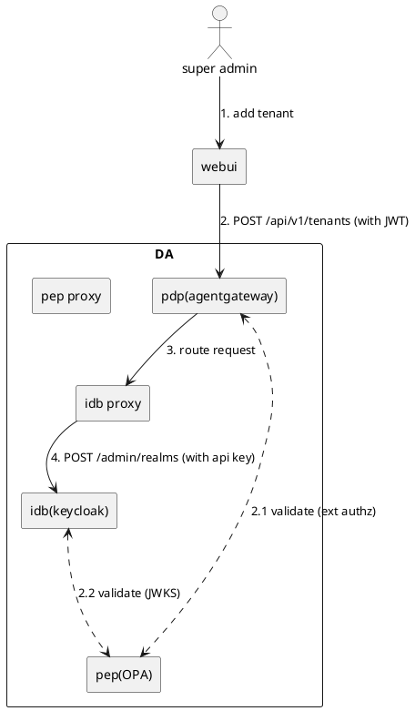

**场景2：租户管理员导入 SAML 2.0 配置**

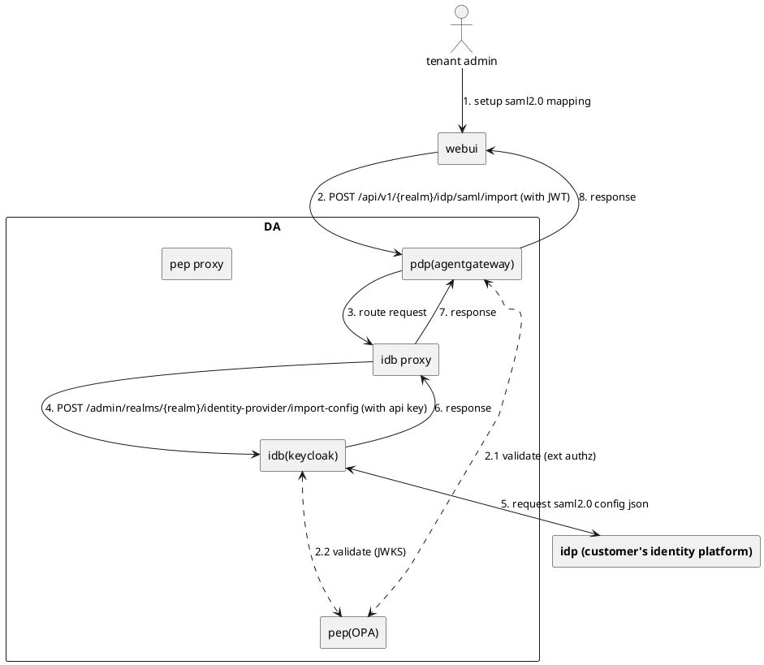

**场景3：租户管理员创建 SAML 2.0 IDP 实例**

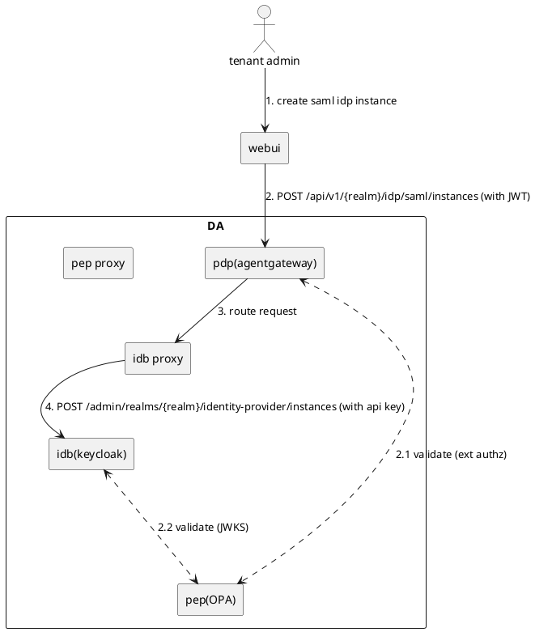

> **场景4（角色与群组管理）** 流程与场景3 相同，调用不同的 API 端点（`/api/v1/{realm}/roles`, `/api/v1/{realm}/groups`）。支持配置强制同步 SAML 2.0 属性到 Keycloak 角色映射。

**场景5：租户管理员配置路径访问规则**

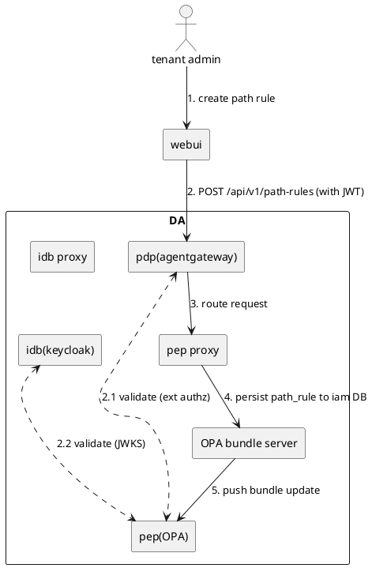

**场景6：用户日常使用 — 完成 AuthN + AuthZ，透传 metadata 至业务应用**

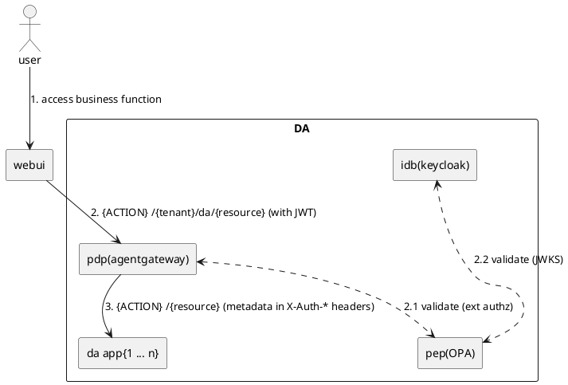

---

#### 4.1.2 实体关系分析

系统核心实体分布在 Keycloak（身份模块）、OPA + pep-proxy（鉴权模块）和 resource-sync（资源权限模块）三侧。Keycloak 通过 JWT 中的 **groups** claim 传递用户组信息，iam DB 中的 **apps.path_prefix** 将请求路径映射到应用，**resource_acl** 通过 subject_id 关联用户/服务账号与资源权限。

##### 实体关系图

```mermaid
erDiagram
    Tenant ||--o{ User : "包含"
    Tenant ||--o{ Group : "划分"
    Tenant ||--o{ IDP : "对接"
    Tenant ||--|| Client : "关联"
    Tenant ||--o{ ResourceACL : "租户隔离"
    Tenant ||--o{ ApiKey : "租户隔离"

    User }o--o{ Group : "归属"

    IDP ||--o{ IDPMapper : "配置"
    Client ||--o{ ProtocolMapper : "配置"

    App ||--o{ ResourcePattern : "定义资源路径"
    App ||--o{ PathRule : "路径保护规则"
    App ||--o{ ResourceACL : "资源权限"
    App ||--o{ ApiKey : "API密钥"

    ResourceACL }o--|| User : "授权给用户"
    ResourceACL }o--|| Group : "授权给组"
    ApiKey ||--o{ ResourceACL : "服务账号授权"

    PendingACL }o--|| ResourceACL : "重试写入"

    Tenant {
        string realm_name PK "Keycloak Realm 名称"
        string display_name "显示名"
    }
    User {
        string id PK "UUID"
        string username "用户名（影子用户）"
        string email "邮箱"
    }
    Group {
        string id PK "UUID"
        string name "组名称"
        string _desc "master-admins / tenant-admins / all-users / {app}-admins"
    }
    IDP {
        string alias PK "IDP 别名"
        string provider_id "saml / oidc"
    }
    Client {
        string client_id PK "data-agent"
        string protocol "openid-connect"
    }
    ProtocolMapper {
        string id PK "UUID"
        string name "映射器名称"
        string protocol_mapper "mapper 类型"
        string _desc "group-mapper: 输出 groups claim 到 JWT"
    }
    IDPMapper {
        string id PK "UUID"
        string name "映射器名称"
        string identity_provider_mapper "mapper 类型"
        string _desc "将外部 IdP 属性映射为 Keycloak 内部属性"
    }
    App {
        string app_name PK "应用名称"
        string path_prefix "URL 前缀（如 /knowledgebase/）"
        string display_name "显示名"
        boolean enabled "License 开关"
        timestamp created_at "创建时间"
    }
    ResourcePattern {
        string app_name PK_FK "所属应用"
        string resource_prefix PK "资源路径前缀（如 /v1/kb）"
        string resource_type "资源类型（如 kb）"
    }
    PathRule {
        int id PK "规则ID"
        string path_prefix "受保护路径前缀"
        string required_group "需要的组（如 memory-admins）"
        string description "描述"
    }
    ResourceACL {
        int id PK "ACL ID"
        string tenant_id FK "租户ID"
        string app_name FK "应用名称"
        string resource_type "资源类型"
        string resource_id "资源实例ID"
        string subject_type "user 或 group 或 service"
        string subject_id "用户ID / 组名 / 服务账号ID"
        string permission "owner / contributor / viewer"
    }
    PendingACL {
        int id PK "ID"
        string tenant_id "租户ID"
        string app_name "应用名称"
        string resource_id "资源ID"
        string action "create / delete"
        int retry_count "重试次数"
        timestamp next_retry "下次重试时间"
    }
    ApiKey {
        string id PK "API Key ID"
        string api_key_hash "SHA256 哈希（不存明文）"
        string key_prefix "前缀（用于日志显示）"
        string tenant_id FK "所属租户"
        string app_name "调用方标识"
        string subject_id "服务账号ID"
        string allowed_paths "路径白名单"
        int rate_limit "每分钟请求上限"
        timestamp expires_at "过期时间"
        boolean enabled "是否启用"
    }
```

##### 实体归属说明

| 实体 | 所属系统 | 存储位置 | 级别 | 说明 |
|------|---------|---------|------|------|
| Tenant (Realm) | Keycloak | keycloak DB | - | 一个 Realm = 一个租户（部门） |
| User | Keycloak | keycloak DB | - | 客户员工，通过 IDP 联合创建的影子用户 |
| Group | Keycloak | keycloak DB | - | 授权分组，JWT 中的 `groups` claim。四类：master-admins / tenant-admins / all-users / {app}-admins |
| IDP | Keycloak | keycloak DB | - | SAML/OIDC 身份源配置 |
| Client | Keycloak | keycloak DB | - | OIDC 客户端（data-agent），承载 Token 签发 |
| ProtocolMapper | Keycloak | keycloak DB | - | group-mapper，输出 groups claim 到 JWT |
| IDPMapper | Keycloak | keycloak DB | - | 将外部 IdP 属性映射为 Keycloak 内部属性 |
| App | keycloak-proxy 写 / pep-proxy 读 | iam DB | 系统级 | 应用注册，path_prefix 用于路由映射，enabled 控制 License |
| ResourcePattern | keycloak-proxy 写 / pep-proxy + resource-sync 读 | iam DB | 系统级 | 资源路径匹配规则，注册应用时自动写入 |
| PathRule | pep-proxy 读写 | iam DB | 系统级 | 路径保护规则，由 bundle-server 推送到 OPA |
| ResourceACL | resource-sync 写 / pep-proxy 读 | iam DB | 租户级 | 资源级访问控制，ext_proc 自动同步 + ACL API 手动管理 |
| PendingACL | resource-sync 读写 | iam DB | 租户级 | ACL 写入失败重试队列，后台定时处理 |
| ApiKey | keycloak-proxy 读写 / pep-proxy 读 | iam DB | 租户级 | API Key 认证凭据，数据库只存 SHA256 哈希 |

##### 跨系统关联

三个系统通过以下机制关联：

**1. Keycloak → OPA：通过 JWT groups claim**

```
Keycloak 侧                              OPA 侧 (iam DB → bundle → OPA 内存)
┌──────────────────────┐                 ┌─────────────────────────────┐
│ Group                 │                 │ PathRule                     │
│  name: "all-users"   │◄── groups ───►│  path_prefix: "/memory/v1/"  │
│  name: "memory-admins"│  (JWT claim)   │  required_group: "memory-    │
└──────────────────────┘                 │    admins"                   │
                                         └─────────────────────────────┘
                                         ┌─────────────────────────────┐
                                         │ App                          │
                                         │  app_name: "knowledgebase"   │
                                         │  path_prefix: "/knowledge…/" │
                                         │  enabled: true               │
                                         └─────────────────────────────┘
```

**2. Keycloak → resource_acl：通过 user_id / group name**

```
Keycloak 侧                              Resource-Sync 侧 (iam DB)
┌──────────────────────┐                 ┌─────────────────────────────┐
│ User                  │                 │ ResourceACL                  │
│  id: "user-uuid-123" │◄── subject ──►│  subject_type: "user"        │
│  username: "zhangsan" │    _id         │  subject_id: "user-uuid-123" │
└──────────────────────┘                 │  resource_id: "kb-001"       │
                                         │  permission: "owner"         │
                                         └─────────────────────────────┘
```

**3. API Key → resource_acl：通过 subject_id（服务账号）**

```
API Key 认证                              Resource-Sync 侧 (iam DB)
┌──────────────────────┐                 ┌─────────────────────────────┐
│ ApiKey                │                 │ ResourceACL                  │
│  subject_id:         │◄── subject ──►│  subject_type: "service"     │
│    "app-a-svc"       │    _id         │  subject_id: "app-a-svc"     │
│  api_key_hash: "…"   │                │  resource_id: "kb-001"       │
└──────────────────────┘                 │  permission: "contributor"   │
                                         └─────────────────────────────┘
```

##### 鉴权数据流

JWT Token 中包含 `groups` claim（字符串数组，如 `["tenant-admins", "all-users"]`）。pep-proxy 认证阶段从 JWT 或 API Key 中提取身份信息，鉴权分两步：

1. **路径级鉴权**：pep-proxy 调 OPA 查询 `apps`（检查 enabled）+ `path_rules`（匹配路径和 groups）
2. **资源级鉴权**：pep-proxy 查 `resource_acl`（匹配 tenant_id + resource_id + subject_id，检查 permission 是否满足 HTTP 方法要求）

resource-sync 通过 ext_proc 在 Gateway 响应阶段自动同步 ACL（创建→owner / 删除→清理），通过 ACL API 支持手动分享/撤销。

---

#### 4.1.3 实现分析

##### 系统结构图

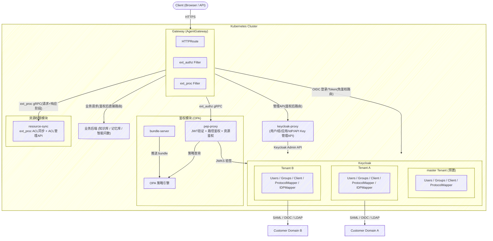

##### 系统分层架构图

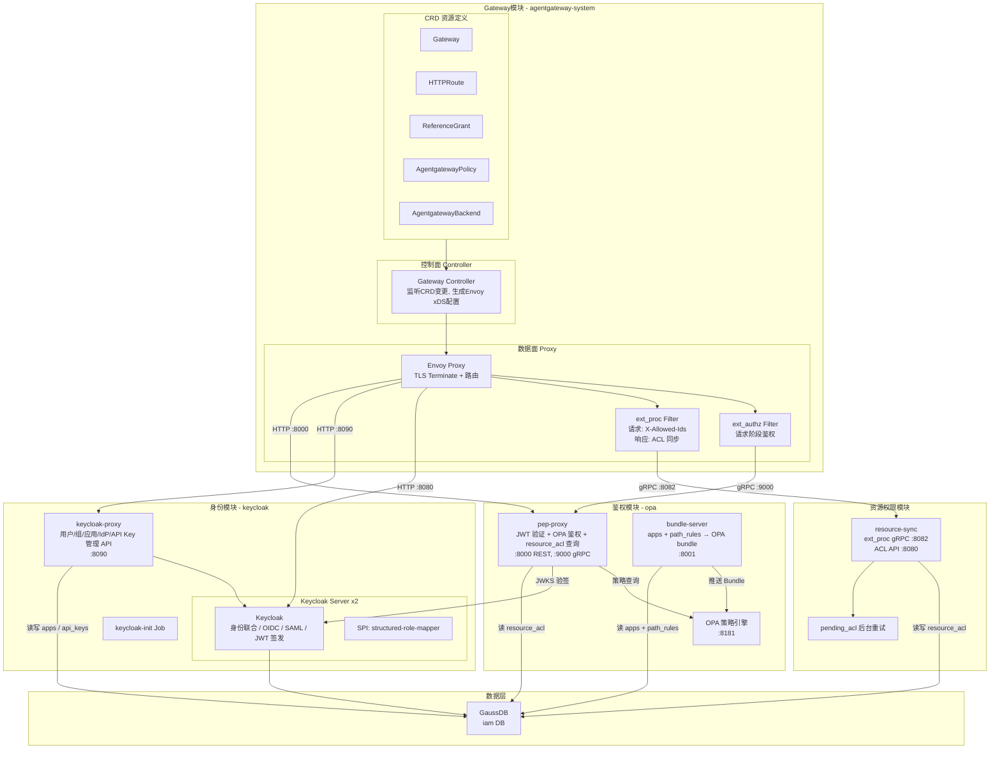

##### 物理部署视图（多节点）

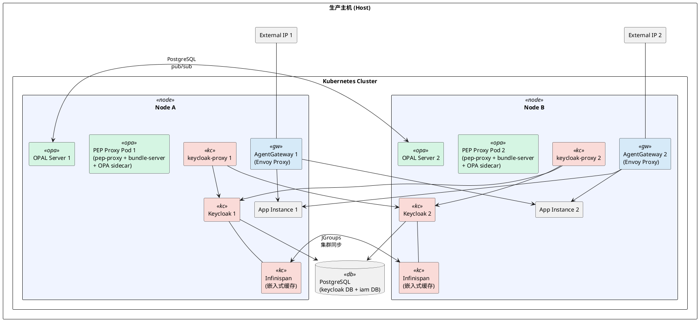

> **注意：** 当前环境不使用 MetalLB（L2 需要宿主 ARP，L3 需要宿主 iptable + BGP 端口），提供 2 个 External IP，路由委托给客户网络。

##### 模块依赖关系图

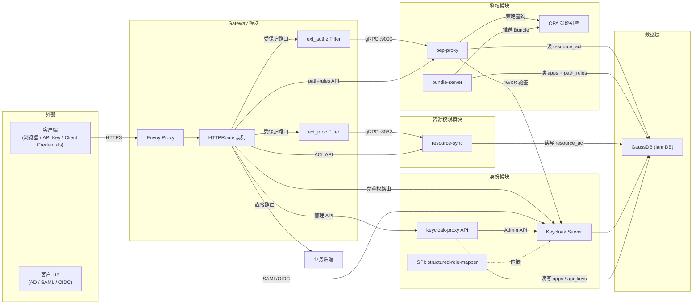

##### 模块职责总览

| 模块 | 命名空间 | 核心组件 | 主要职责 | 对外端口 |
|------|---------|---------|---------|---------|
| **Gateway 模块** | agentgateway-system | Controller, Envoy Proxy, CRDs | 统一流量入口、TLS Terminate、路由分发、ext_authz 鉴权拦截、ext_proc ACL 同步、Header 注入 | 80/443 (HTTP/HTTPS) |
| **身份模块** | keycloak | Keycloak Server x2, keycloak-proxy, keycloak-init | 身份联合（SAML/OIDC）、JWT 签发、用户/组/应用/IdP/API Key 管理 API | 8080 (Keycloak), 8090 (proxy API) |
| **鉴权模块** | opa | pep-proxy, bundle-server, OPA 策略引擎 | JWT 验证、OPA 路径级鉴权、resource_acl 资源级鉴权、path-rules CRUD、API Key 认证 | 8000 (REST), 9000 (gRPC), 8001 (bundle) |
| **资源权限模块** | iam | resource-sync | ext_proc ACL 自动同步（创建→owner / 删除→清理）、ACL 管理 API（分享/撤销）、pending_acl 重试 | 8080 (ACL API), 8082 (ext_proc gRPC) |

##### 各模块功能需求清单

**Gateway（PolicyDecisionPoint）模块：**

| 编号 | 功能需求 | 说明 |
|------|---------|------|
| GW-F1 | 提供 OpenAPI Routing 能力 | 基于 HTTPRoute 的路径匹配和后端分发 |
| GW-F2 | WebUI 通过 oidc-client-ts 与 Gateway 交互 | 前端使用标准 OIDC 客户端库完成认证流程 |
| GW-F3 | 使用 ext-authz 进行 API 身份认证/RBAC 鉴权 | gRPC 调用 pep-proxy 完成 AuthN + AuthZ |
| GW-F4 | 鉴权通过后 metadata 转移至 header，清洗路径为 upstream 格式 | 注入 X-Auth-* Headers，重写路径去除租户前缀 |
| GW-F5 | 默认 deny 所有请求 | 通过 AuthN + AuthZ 后才放行请求 |

**Keycloak（ID Broker）模块：**

| 编号 | 功能需求 | 说明 |
|------|---------|------|
| KC-F1 | 提供 IDB Proxy 服务（Python + FastAPI） | 角色/群组/用户 CRUD，用户-群组-角色关系管理，SAML 属性映射 |
| KC-F2 | 提供 SAML 2.0 接入能力 | 联合客户已有的 SAML IDP |
| KC-F3 | 提供 JWKS 接口校验 Token 合法性 | 供 pep-proxy 和 OPA 验证 JWT 签名 |
| KC-F4 | 提供 Admin Web UI 界面 | Keycloak 原生管理控制台 |

**OPA（PolicyEnforcementPoint）模块：**

| 编号 | 功能需求 | 说明 |
|------|---------|------|
| OPA-F1 | 提供 PEP Proxy 服务（Python + FastAPI） | path-rules CRUD、资源级鉴权、API Key 认证，基于 groups + path_rules + resource_acl 的动态授权 |
| OPA-F2 | 通过 JWT Token issuer 动态组装 JWKS URL 进行验证 | 多租户动态 OIDC Discovery |
| OPA-F3 | 配置 ext-authz 接口进行 API 访问鉴权 | gRPC :9000 实现 Authorization/Check |

##### 各模块非功能需求清单

| 模块 | 编号 | 非功能需求 |
|------|------|-----------|
| **Gateway** | GW-NF1 | 高可用部署，1 node 1 replica |
| | GW-NF2 | 配置 HPA 规则支持弹性扩缩 |
| | GW-NF3 | 打包为 Helm chart 及镜像 |
| **Keycloak** | KC-NF1 | 高可用部署，1 node 1 replica（Infinispan 集群） |
| | KC-NF2 | 配置 HPA 规则支持弹性扩缩 |
| | KC-NF3 | 打包为 Helm chart 及镜像 |
| | KC-NF4 | Helm chart 预置超级管理员账户及角色 |
| | KC-NF5 | 提供 tenant/user 管理 WebUI |
| | KC-NF6 | Helm chart 包含 K8s Job，按序部署 Keycloak 及 keycloak-proxy |
| **OPA** | OPA-NF1 | 高可用部署，1 node 1 replica |
| | OPA-NF2 | 配置 HPA 规则支持弹性扩缩 |
| | OPA-NF3 | 打包为 Helm chart 及镜像 |
| | OPA-NF4 | Helm chart 预置超级管理员策略 |
| | OPA-NF5 | Helm chart 包含 K8s Job，按序部署 OPA 及 OPA proxy |
| | OPA-NF6 | 提供 policy 管理 WebUI |

##### 认证流时序图（用户登录 → 获取 Token）

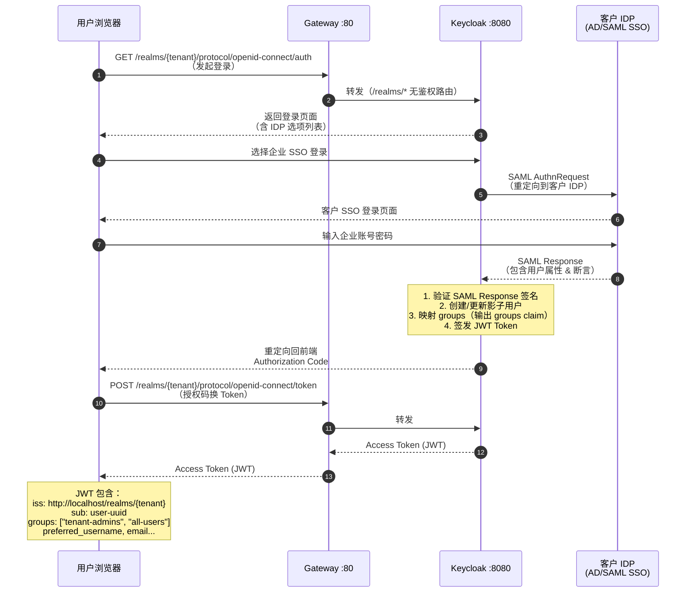

##### 鉴权流时序图（带 Token 请求 → 允许/拒绝）

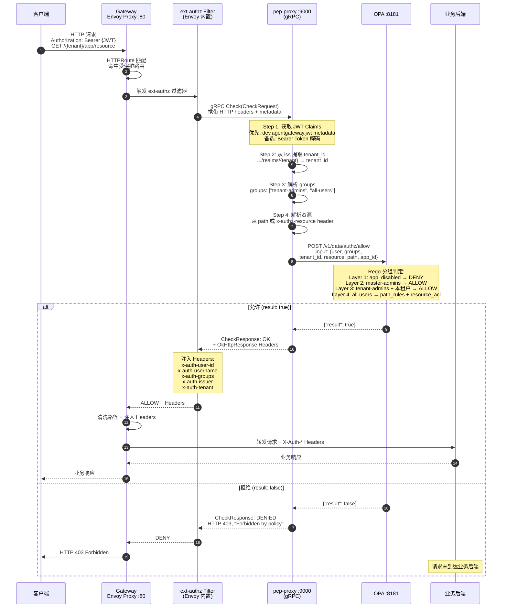

---

### 4.2 Gateway

#### 4.2.1 设计思路

##### 为什么需要统一网关？

在微服务架构下，每个服务独立对外暴露端口会带来严重的管理和安全问题：端口管理混乱、每个服务需要各自实现 TLS/认证/限流、跨服务的安全策略难以统一执行。统一网关将所有外部流量收口到单一入口，由网关统一处理安全策略、路由分发和流量治理，业务服务只需专注于业务逻辑。

##### 为什么选择 AgentGateway？

| 选型考量 | AgentGateway 优势 | 对比 Nginx/Traefik |
|---------|-------------------|-------------------|
| **ext-authz 原生支持** | 基于 Envoy 内核，原生支持 gRPC ext-authz v3 外部授权协议，可将鉴权逻辑完全外置 | Nginx 需要额外模块（auth_request），仅支持 HTTP 子请求，不支持 gRPC |
| **Gateway API 标准** | 基于 Kubernetes Gateway API（HTTPRoute），是 Ingress 的官方继任标准，表达能力更强 | Traefik 支持 Gateway API 但生态较新，Nginx Ingress 仍依赖私有注解 |
| **跨 namespace 路由** | 原生支持 ReferenceGrant 机制，三个 namespace 的服务可统一暴露 | 需要复杂的 ExternalName Service 或手动 Endpoint 配置 |
| **自定义策略 CRD** | 提供 AgentgatewayPolicy CRD，声明式配置 ext-authz 规则 | 通常需要修改全局配置文件或使用注解 |
| **Header 注入** | ext-authz ALLOW 响应可携带 Headers，Envoy 自动注入到原始请求 | auth_request 的 Header 传递需要额外配置 |
| **生产级能力** | 继承 Envoy 的负载均衡、熔断、重试、可观测性等企业级能力 | 功能对等但配置方式不同 |

##### 核心设计决策

**单一 Gateway 实例，多 namespace 路由：** 只创建一个 Gateway 资源（`agentgateway-proxy`），监听 :80 端口，通过 `allowedRoutes.namespaces.from: All` 允许所有 namespace 注册 HTTPRoute。搭配 ReferenceGrant 实现跨 namespace 的安全引用，避免了多 Ingress 的管理复杂度。

**路由分为鉴权组和免鉴权组：** Keycloak OIDC 端点（`/realms/*`, `/resources/*`, `/admin/*`）走免鉴权路由（用户需要先登录才能获取 Token，登录端点本身不能要求 Token）。其余 API 路由通过 AgentgatewayPolicy 挂载 ext-authz 策略，统一走 pep-proxy 鉴权。

**ext-authz 采用 gRPC 协议：** 相比 HTTP ext-authz，gRPC 模式传输效率更高，支持结构化的 CheckRequest/CheckResponse，且 agentgateway 可以在 gRPC metadata 中预注入已验证的 JWT Claims（`dev.agentgateway.jwt`），pep-proxy 无需重复验签。

**默认 Deny + 鉴权后路径清洗：** 所有受保护路由默认拒绝，通过 AuthN + AuthZ 后才放行。鉴权通过后，Gateway 将身份元数据（tenant、user、roles）从 JWT 转移到 HTTP Headers，并清洗 URL 路径为上游服务期望的格式（去除租户前缀），使业务后端完全无感知。

---

#### 4.2.2 功能描述

##### 功能需求清单

| 编号 | 功能 | 说明 |
|------|------|------|
| GW-F1 | **OpenAPI Routing** | 基于 HTTPRoute CRD 的路径匹配和后端分发，支持 PathPrefix 和正则匹配 |
| GW-F2 | **OIDC 客户端交互** | WebUI 使用 oidc-client-ts 与 Gateway 交互，Gateway 透传 OIDC 请求到 Keycloak |
| GW-F3 | **ext-authz 鉴权** | 对受保护路由通过 gRPC ext-authz 调用 pep-proxy 完成身份认证 + RBAC 鉴权 |
| GW-F4 | **Metadata 透传 + 路径清洗** | 鉴权通过后将 JWT 中的身份信息转移到 X-Auth-* Headers，清洗路径为 upstream 格式 |
| GW-F5 | **默认 Deny** | 所有受保护请求默认拒绝，仅通过 AuthN + AuthZ 后放行 |
| GW-F6 | **跨命名空间路由** | 通过 ReferenceGrant 实现 agentgateway-system → keycloak/opa 的跨 namespace 路由 |

##### 用例图

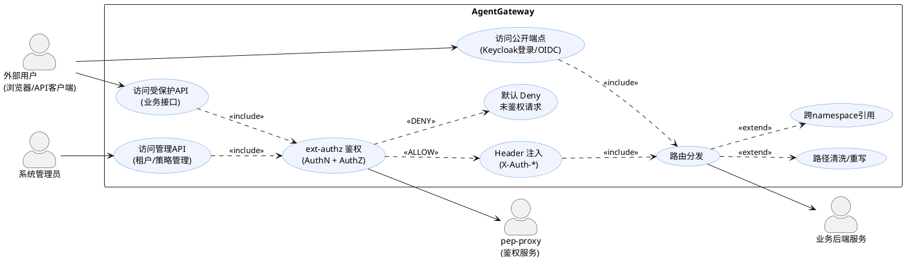

##### Gateway 视角的典型请求流转

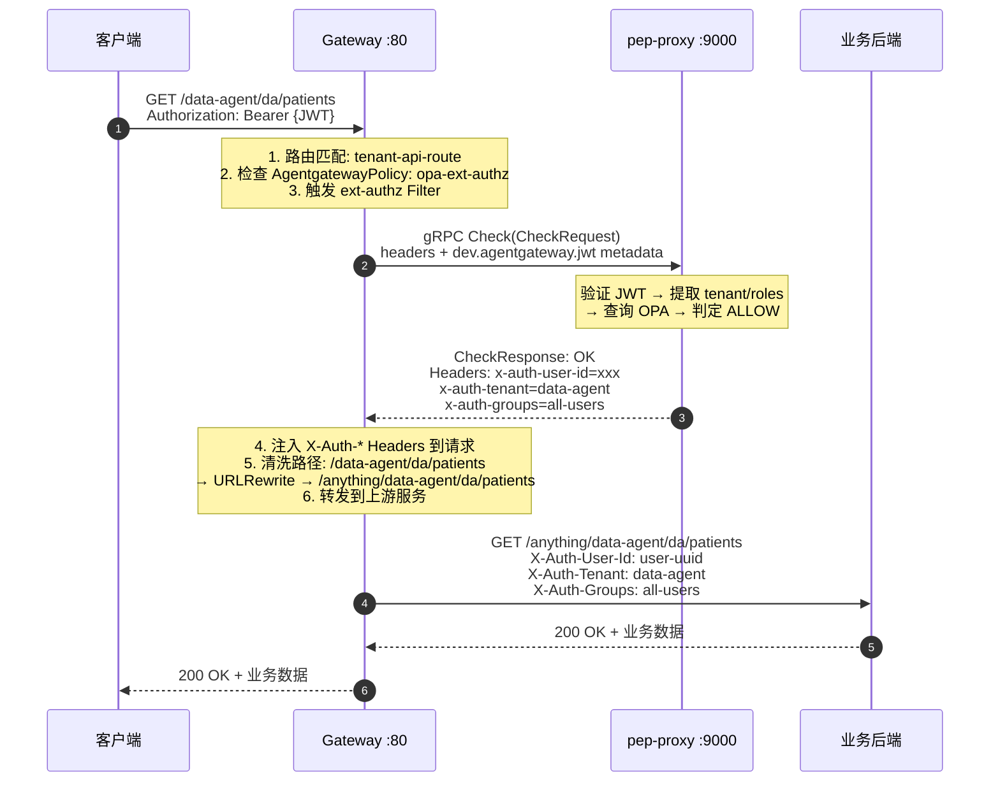

##### 路由规则清单

| 路由名称 | 路径匹配 | 匹配类型 | 目标服务 | 目标 Namespace | 端口 | 是否鉴权 |
|---------|---------|---------|---------|---------------|------|---------|
| keycloak-route | `/realms/*` | PathPrefix | keycloak | keycloak | 8080 | 否 |
| keycloak-static-route | `/resources/*` | PathPrefix | keycloak | keycloak | 8080 | 否 |
| keycloak-admin-route | `/admin/*` | PathPrefix | keycloak | keycloak | 8080 | 否 |
| keycloak-proxy-route | `/api/v1/tenants/*`<br/>`/api/v1/common/*` | PathPrefix | keycloak-proxy | keycloak | 8090 | 是 |
| policy-api-route | `/api/v1/auth/*`<br/>`/api/v1/path-rules/*` | PathPrefix | pep-proxy | opa | 8000 | 是 |
| resource-sync-route | `/acl/v1/resources/*` | PathPrefix | resource-sync | resource-sync | 8080 | 是 |
| identity-api-route | `/api/v1/{realm}/roles\|groups\|users\|idp` | RegularExpression | keycloak-proxy | keycloak | 8090 | 是 |
| tenant-api-route | `/` (catch-all) | PathPrefix | httpbin (测试) | httpbin | 8000 | 是 |

---

#### 4.2.3 实现分析

##### Gateway 组件结构图

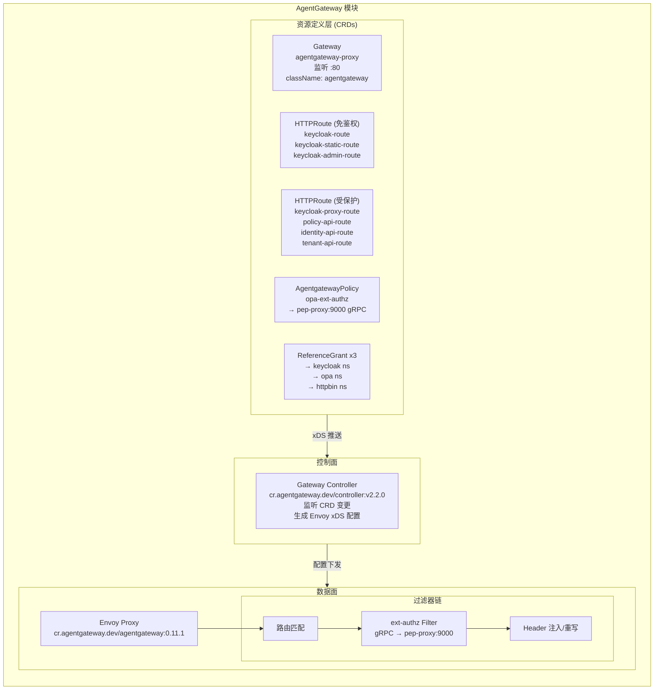

##### Gateway 请求处理时序图

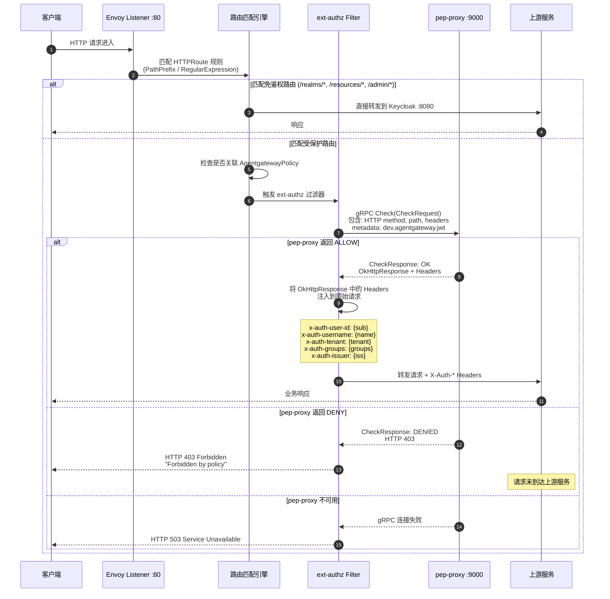

##### 关键实现细节

**1. Gateway 资源定义**

系统只创建一个 Gateway 实例，通过 Helm chart 模板化管理：

```yaml
# charts/agentgateway/templates/gateway.yaml
apiVersion: gateway.networking.k8s.io/v1
kind: Gateway
metadata:
  name: agentgateway-proxy          # 唯一的 Gateway 实例名
  namespace: agentgateway-system
spec:
  gatewayClassName: agentgateway     # 由 AgentGateway Controller 提供
  listeners:
  - name: http
    protocol: HTTP
    port: 80                         # 单一对外端口
    allowedRoutes:
      namespaces:
        from: All                    # 允许所有 namespace 注册路由
```

**2. HTTPRoute 路由配置**

路由分为两组文件管理：

- **`keycloak-routes.yaml`** — 3 条免鉴权路由，将 Keycloak OIDC 端点（登录、静态资源、管理控制台）直接路由到 Keycloak 服务，不经过 ext-authz。
- **`protected-routes.yaml`** — 4 条受保护路由 + 1 条 AgentgatewayPolicy，覆盖租户管理、策略管理、身份管理和业务 API。

路由匹配支持两种模式：
- `PathPrefix`：精确的路径前缀匹配（如 `/api/v1/tenants`）
- `RegularExpression`：正则匹配（如 `/api/v1/[^/]+/(roles|groups|users|idp)(/.*)?`），用于处理路径中包含动态租户名的场景

**3. AgentgatewayPolicy ext-authz 配置**

```yaml
apiVersion: agentgateway.dev/v1alpha1
kind: AgentgatewayPolicy
metadata:
  name: opa-ext-authz
  namespace: agentgateway-system
spec:
  traffic:
    extAuth:
      backendRef:
        name: pep-proxy              # opa namespace 的 pep-proxy Service
        namespace: opa
        port: 9000                   # gRPC ext-authz 端口
      grpc: {}                       # 使用 gRPC 协议
  targetRefs:                        # 对以下 HTTPRoute 生效
  - group: gateway.networking.k8s.io
    kind: HTTPRoute
    name: keycloak-proxy-route       # 租户管理 API
  - group: gateway.networking.k8s.io
    kind: HTTPRoute
    name: policy-api-route           # 路径规则管理 API
  - group: gateway.networking.k8s.io
    kind: HTTPRoute
    name: identity-api-route         # 身份管理 API
  - group: gateway.networking.k8s.io
    kind: HTTPRoute
    name: resource-sync-route        # 资源级权限 API
  - group: gateway.networking.k8s.io
    kind: HTTPRoute
    name: tenant-api-route           # 业务 API (catch-all)
```

**4. 跨命名空间引用（ReferenceGrant）**

Gateway API 默认禁止跨 namespace 引用 Service，必须在目标 namespace 显式创建 ReferenceGrant 授权。系统创建了 3 个 ReferenceGrant：

| ReferenceGrant 名称 | 所在 Namespace | 授权来源 | 允许引用 |
|---------------------|---------------|---------|---------|
| allow-gateway-to-keycloak | keycloak | agentgateway-system 的 HTTPRoute | keycloak ns 中的 Service |
| allow-gateway-to-opa | opa | agentgateway-system 的 HTTPRoute + AgentgatewayPolicy | opa ns 中的 Service |
| allow-gateway-to-resource-sync | resource-sync | agentgateway-system 的 HTTPRoute | resource-sync ns 中的 Service |
| allow-gateway-to-httpbin | httpbin | agentgateway-system 的 HTTPRoute | httpbin ns 中的 Service |

其中 `allow-gateway-to-opa` 同时授权了 HTTPRoute（路由到 pep-proxy REST API）和 AgentgatewayPolicy（ext-authz gRPC 调用），因为两者都需要跨 namespace 引用 opa namespace 中的 pep-proxy Service。

---

#### 4.2.4 资源分析

##### 容器镜像

| 镜像 | 版本 | 来源 | 用途 | 备注 |
|------|------|------|------|------|
| `cr.agentgateway.dev/controller` | v2.2.0-main | AgentGateway 官方 | Gateway Controller（控制面） | 监听 CRD 变更，生成 Envoy 配置 |
| `cr.agentgateway.dev/agentgateway` | 0.11.1 | AgentGateway 官方 | Envoy Proxy（数据面） | 实际处理流量的代理实例 |

##### 部署视图

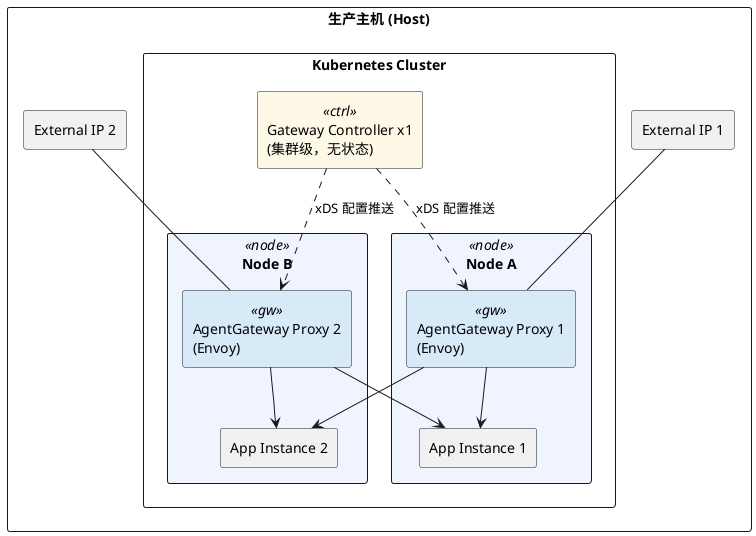

> **部署说明：** 不使用 MetalLB（L2 需要宿主 ARP，L3 需要宿主 iptable + BGP 端口），提供 2 个 External IP，路由委托给客户网络。每个节点部署 1 个 Proxy 副本，Controller 仅需 1 个。

##### 计算资源

| 组件 | 副本数 | 部署策略 | CPU Request | CPU Limit | Memory Request | Memory Limit |
|------|--------|---------|-------------|-----------|----------------|--------------|
| Gateway Controller | 1 | Deployment | 官方默认 | 官方默认 | 官方默认 | 官方默认 |
| Envoy Proxy | 2 | 1 node 1 replica | 官方默认 | 官方默认 | 官方默认 | 官方默认 |

> Gateway 组件为无状态服务，资源配置由 AgentGateway 官方 Helm chart 管理。配置 HPA 规则可根据流量规模水平扩展 Proxy 副本数。

##### 存储资源

Gateway 模块**无持久化存储需求**。路由配置和策略规则以 CRD 资源形式存储在 Kubernetes etcd 中。

##### 网络资源

| 需求 | 说明 |
|------|------|
| 对外端口 | 80 (HTTP)，生产环境建议增加 443 (HTTPS/TLS 终止) |
| External IP | 每节点 1 个，路由委托给客户网络 |
| 集群内网络 | 需要跨 namespace 网络连通（agentgateway-system <-> keycloak / opa / httpbin） |
| DNS 解析 | 依赖 Kubernetes 集群内 DNS（CoreDNS）进行 Service 发现 |

##### 外部依赖

| 依赖项 | 类型 | 必要性 | 说明 |
|--------|------|--------|------|
| Kubernetes Gateway API CRDs | 集群级 CRD | 必需 | 提供 Gateway、HTTPRoute、ReferenceGrant 资源定义 |
| AgentGateway CRDs | 集群级 CRD | 必需 | 提供 AgentgatewayPolicy 等自定义资源定义 |
| pep-proxy Service (opa ns) | ClusterIP Service | 必需 | ext-authz gRPC 鉴权后端，Gateway 核心依赖 |
| keycloak Service (keycloak ns) | ClusterIP Service | 必需 | Keycloak OIDC/SAML 端点 |
| keycloak-proxy Service (keycloak ns) | ClusterIP Service | 必需 | 租户管理 API 后端 |
| ReferenceGrant 资源 | namespace 级 | 必需 | 跨 namespace 路由的授权前提，缺失则路由不生效 |

---

#### 4.2.5 接口标准

##### 对外暴露端口

| 端口 | 协议 | 说明 |
|------|------|------|
| 80 | HTTP/1.1 | 唯一的外部入口端口，所有客户端请求通过此端口进入 |

在 Kind 开发环境中，通过 NodePort 或 `kubectl port-forward` 将 Gateway :80 暴露到宿主机。

##### 内部通信协议

| 通信方向 | 协议 | 端口 | 说明 |
|---------|------|------|------|
| Gateway → pep-proxy (ext-authz) | gRPC | 9000 | Envoy ext-authz v3 Authorization/Check |
| Gateway → Keycloak | HTTP/1.1 | 8080 | Keycloak OIDC/SAML 端点 |
| Gateway → keycloak-proxy | HTTP/1.1 | 8090 | 租户管理 REST API |
| Gateway → pep-proxy (REST) | HTTP/1.1 | 8000 | 策略管理 REST API |
| Gateway → httpbin | HTTP/1.1 | 8000 | 测试后端 |
| Controller → Envoy Proxy | xDS (gRPC) | 内部 | 控制面配置推送 |

##### ext-authz gRPC 接口规范

Gateway 通过 ext-authz 过滤器调用 pep-proxy，遵循 Envoy ext-authz v3 协议：

**Service 定义：**

```protobuf
service Authorization {
  rpc Check(CheckRequest) returns (CheckResponse);
}
```

**请求内容（CheckRequest）：**

Gateway 自动将以下信息封装到 CheckRequest 中：

| 字段 | 来源 | 说明 |
|------|------|------|
| `attributes.request.http.method` | 原始请求 | HTTP 方法 (GET/POST/PUT/DELETE) |
| `attributes.request.http.path` | 原始请求 | 请求路径 |
| `attributes.request.http.headers` | 原始请求 | 全部 HTTP Headers（含 Authorization） |
| gRPC metadata `dev.agentgateway.jwt` | Gateway 预验证 | 已验证的 JWT Claims JSON |

**响应格式（CheckResponse）：**

| 响应类型 | gRPC Status Code | HTTP 行为 | 包含内容 |
|---------|------------------|-----------|---------|
| ALLOW | 0 (OK) | 请求继续转发到上游 | OkHttpResponse: 要注入的 Headers 列表 |
| DENY (401) | 16 (UNAUTHENTICATED) | 直接返回客户端 | DeniedHttpResponse: HTTP 401 + 错误消息 |
| DENY (403) | 7 (PERMISSION_DENIED) | 直接返回客户端 | DeniedHttpResponse: HTTP 403 + 错误消息 |
| DENY (503) | 14 (UNAVAILABLE) | 直接返回客户端 | DeniedHttpResponse: HTTP 503 + 错误消息 |

##### Gateway 注入的 Headers

鉴权通过后，pep-proxy 通过 OkHttpResponse 返回以下 Headers，由 Gateway 注入到转发给业务后端的请求中：

| Header 名称 | 值来源 | 示例值 | 业务用途 |
|-------------|-------|--------|---------|
| `x-auth-user-id` | JWT `sub` claim | `f47ac10b-58cc-4372-a567-0e02b2c3d479` | 识别当前用户 |
| `x-auth-username` | JWT `preferred_username` | `john.doe` | 显示用户名 |
| `x-auth-groups` | JWT `groups` claim | `tenant-admins,all-users` | 分组级权限控制 |
| `x-auth-issuer` | JWT `iss` | `http://localhost/realms/tenant-a` | Token 来源追溯 |
| `x-auth-tenant` | 从 `iss` 提取 | `tenant-a` | 租户标识，数据隔离 |

##### 对外 API 路径规范

Gateway 定义了系统对外的统一 API 路径体系：

**管理面 API（通过 Gateway 鉴权后路由到各后端）：**

| 路径 | 目标 | 说明 |
|------|------|------|
| `POST /api/v1/tenants` | keycloak-proxy | 创建租户 |
| `DELETE /api/v1/tenants/{realm}` | keycloak-proxy | 删除租户 |
| `POST /api/v1/{realm}/idp/saml/import` | keycloak-proxy | 导入 SAML 配置 |
| `POST /api/v1/{realm}/idp/saml/instances` | keycloak-proxy | 创建 SAML IDP |
| `GET/POST/PUT/DELETE /api/v1/{realm}/roles` | keycloak-proxy | 角色 CRUD |
| `GET/POST/PUT/DELETE /api/v1/{realm}/groups` | keycloak-proxy | 群组 CRUD |
| `GET /api/v1/{realm}/users` | keycloak-proxy | 查看用户 |
| `GET/POST/PUT/DELETE /api/v1/path-rules` | pep-proxy | 路径规则 CRUD |
| `GET/POST /api/v1/apps` | keycloak-proxy | 应用注册管理 |
| `GET/POST/DELETE /api/v1/{realm}/api-keys` | keycloak-proxy | API Key 管理 |
| `GET/PUT/DELETE /acl/v1/resources/{id}/permissions` | resource-sync | 资源级权限 CRUD |

**业务面 API（PATH 规范）：**

```
普通用户接口:   /{tenant-id}/{app}/{resource}
管理员接口:     /{tenant-id}/{app}/admin/{resource}
```

Gateway 通过 catch-all 路由将业务请求路由到后端，OPA 从路径中自动提取 tenant-id 和 resource 进行鉴权。

##### CRD 资源接口汇总

| CRD | API Group | 作用 | 关键字段 |
|-----|-----------|------|---------|
| Gateway | gateway.networking.k8s.io/v1 | 定义网关监听器 | `spec.listeners[].port`, `spec.gatewayClassName` |
| HTTPRoute | gateway.networking.k8s.io/v1 | 定义路由规则 | `spec.rules[].matches`, `spec.rules[].backendRefs` |
| ReferenceGrant | gateway.networking.k8s.io/v1beta1 | 跨 namespace 授权 | `spec.from[]`, `spec.to[]` |
| AgentgatewayPolicy | agentgateway.dev/v1alpha1 | ext-authz 策略 | `spec.traffic.extAuth`, `spec.targetRefs` |

---

#### 4.2.6 工作量估计

| 工作项 | 预估工时 | 状态 | 说明 |
|--------|---------|------|------|
| Gateway Helm chart 编写 | 1 人天 | 已完成 | charts/agentgateway/ 模板 |
| HTTPRoute 路由配置（免鉴权组） | 0.5 人天 | 已完成 | keycloak-routes.yaml |
| HTTPRoute 路由配置（受保护组） | 1 人天 | 已完成 | protected-routes.yaml，含正则匹配 |
| AgentgatewayPolicy ext-authz 配置 | 0.5 人天 | 已完成 | gRPC ext-authz 策略 |
| ReferenceGrant 跨 namespace 配置 | 0.5 人天 | 已完成 | 3 个 namespace 的授权 |
| 部署脚本与测试验证 | 1 人天 | 已完成 | setup.sh + test.sh 中 Gateway 相关 |
| TLS/HTTPS 终止配置 | 1 人天 | 待开发 | Gateway listener TLS 证书 |
| HPA 弹性扩缩配置 | 0.5 人天 | 待开发 | 基于 CPU/连接数 |
| 流量限速（Rate Limiting） | 2 人天 | 待开发 | Envoy RateLimit filter + 外部服务 |
| 可观测性（日志/Metrics/Tracing） | 2 人天 | 待开发 | Envoy access log + Prometheus |

##### 后续扩展能力（基于 Envoy）

| 能力 | 实现方式 | 当前状态 |
|------|---------|---------|
| TLS 终止 / HTTPS | Gateway listener 配置 TLS 证书 | 待配置 |
| 流量限速（Rate Limiting） | Envoy RateLimit filter + 外部限速服务 | 待扩展 |
| 负载均衡 | Envoy 内置（Round Robin / Weighted / Least Request） | 已生效（默认 Round Robin） |
| 熔断降级 | Envoy Circuit Breaker（最大连接数/请求数/重试数） | 待配置 |
| 超时与重试 | HTTPRoute filter 或 BackendPolicy | 待配置 |
| CORS 管理 | Gateway API 或 Envoy CORS filter | 待配置 |
| 请求/响应改写 | URLRewrite filter（已用于 catch-all 路由） | 部分已用 |
| 访问日志 | Envoy access log + 文件/gRPC 输出 | 待配置 |
| 指标采集 | Envoy 内置 Prometheus metrics 端点 | 待配置 |
| 链路追踪 | Envoy Tracing（Jaeger/Zipkin/OpenTelemetry） | 待配置 |
