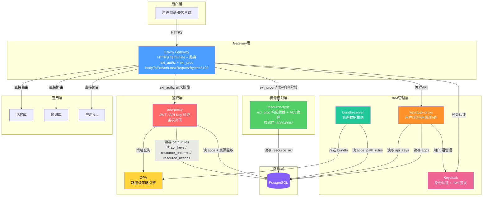
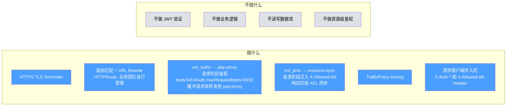
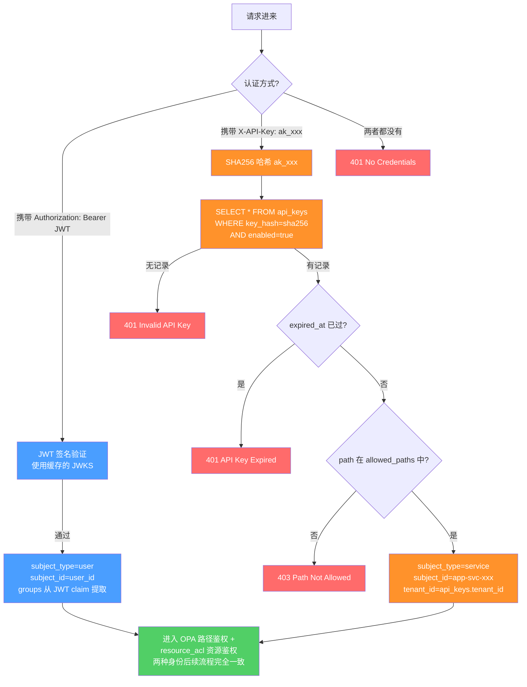
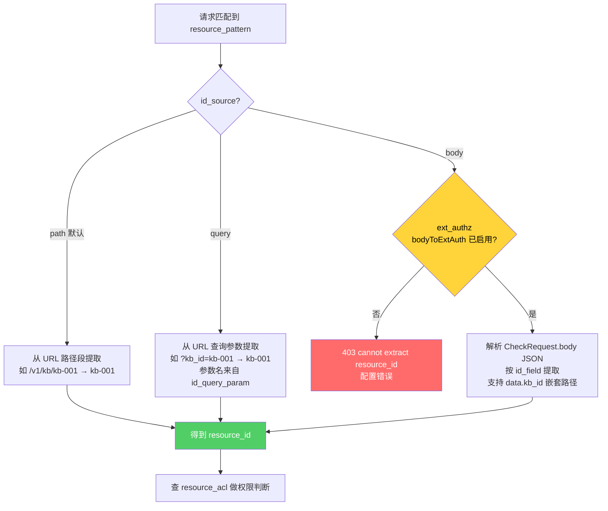
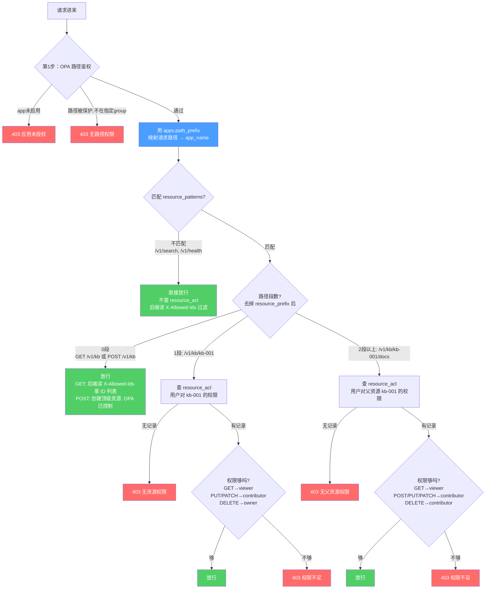
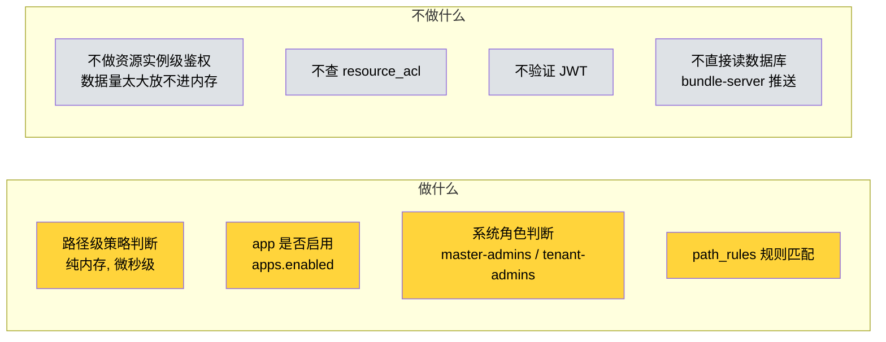
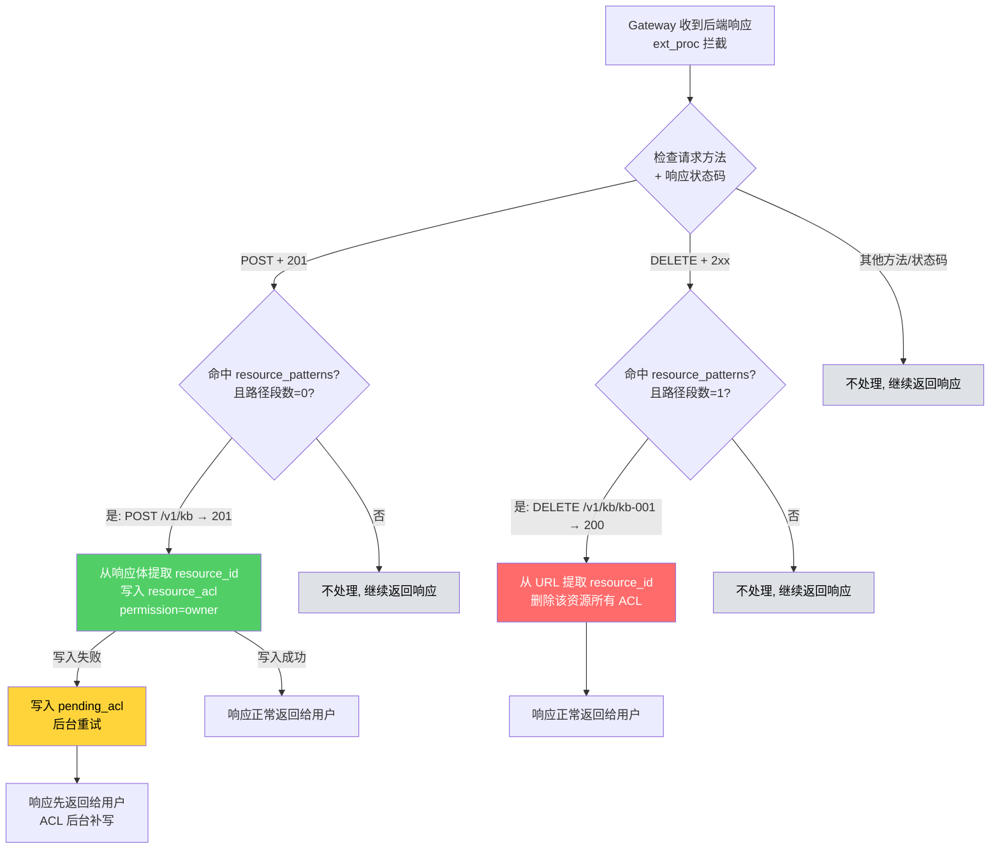
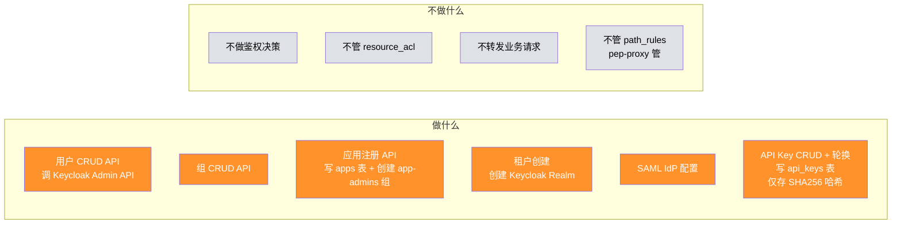
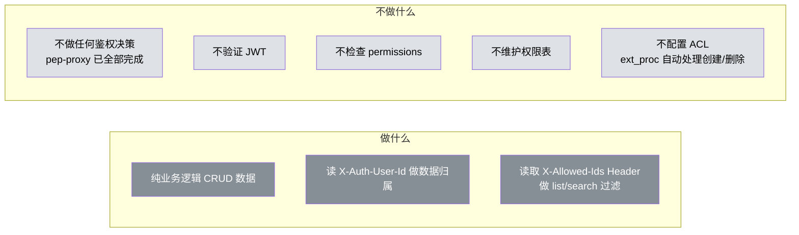

# 组件职责视角 — 谁负责什么、不负责什么

> 版本：v2.1 | 日期：2026-04-09
>
> **v2.0 变更：resource-sync 不再是反向代理。Gateway 直接路由到后端，resource-sync 通过 ext_proc 拦截响应阶段。**
>
> **v2.1 新增：**
> - **API Key 认证（SR12）** — pep-proxy 除了 JWT 外，支持通过 `X-API-Key: ak_xxx` 请求头认证，用于外部应用对接。
> - **灵活的资源 ID 提取** — resource_patterns 表新增 `id_source`（path/query/body）、`id_field`、`id_query_param` 列，支持非 RESTful 风格的遗留 API。
> - **resource_actions 表** — 自定义"操作识别规则"（action/method/path_suffix/success_status/min_permission），为空时使用代码默认规则 `DEFAULT_ACTIONS`，标准 RESTful 应用零迁移。
> - **ext_authz bodyToExtAuth** — SecurityPolicy 设置 `spec.extAuth.bodyToExtAuth.maxRequestBytes=8192`，Envoy Gateway 缓冲请求体并通过 gRPC CheckRequest 的 body 字段转发给 pep-proxy，支持 body 模式的 ID 提取。

---

## 1 组件全景



---

## 2 每个组件的职责边界

### 2.1 Gateway（蓝色）



| 做 | 不做 |
|---|------|
| 接收 HTTPS 请求，TLS 解密 | 不验证 JWT / API Key |
| 按路径匹配路由到后端（HTTPRoute，业务团队自行管理） | 不做任何业务逻辑 |
| ext_authz → pep-proxy（请求阶段鉴权） | 不直接读写数据库 |
| **缓冲请求体并转发给 pep-proxy**（`spec.extAuth.bodyToExtAuth.maxRequestBytes=8192`，是 body 模式 ID 提取的前提） | 不做资源级权限判断 |
| ext_proc → resource-sync（请求阶段注入 X-Allowed-Ids + 响应阶段 ACL 同步） | 不管证书续期（cert-manager 管） |
| URL Rewrite（`/knowledgebase/v1/kb` → `/v1/kb`） | |
| 采集 trace 数据（TrafficPolicy） | |
| 清除客户端传入的 X-Auth-* 和 X-Allowed-Ids Header（防伪造） | |

**ext_authz bodyToExtAuth 说明：**

```yaml
# SecurityPolicy 配置片段
apiVersion: gateway.envoyproxy.io/v1alpha1
kind: SecurityPolicy
spec:
  extAuth:
    grpc:
      backendRef:
        name: pep-proxy
        port: 9191
    bodyToExtAuth:
      maxRequestBytes: 8192        # 必须配置，否则 pep-proxy 收不到请求体
      allowPartialMessage: false
```

- Envoy Gateway 会缓冲最大 8KB 的请求体，通过 gRPC CheckRequest 的 `request.http.body` 字段转发给 pep-proxy
- 没有此配置时 pep-proxy 只能看到请求头/方法/路径，**body 模式的 ID 提取将失败**（见 2.2 pep-proxy 的灵活 ID 提取部分）
- 超出 maxRequestBytes 的请求 Gateway 返回 **413 Payload Too Large**，请求不会进入 pep-proxy

---

### 2.2 pep-proxy（红色）

```mermaid
flowchart LR
    subgraph 做什么
        A1[双认证分支<br/>JWT 签名验证 缓存 JWKS<br/>或 API Key: X-API-Key 头]
        A2[JWT → user_id / tenant_id / groups<br/>API Key → service 身份]
        A3[启动时加载 apps / resource_patterns / resource_actions]
        A4[调 OPA 做路径级鉴权]
        A5[查 resource_acl 做资源实例鉴权]
        A6[resource_actions 映射检查<br/>fallback: DEFAULT_ACTIONS]
        A7[灵活 ID 提取<br/>path / query / body 三种模式]
        A8[子资源鉴权: 检查父资源权限]
        A9[注入 X-Auth-User-Id / X-Auth-Tenant<br/>X-Auth-Groups / X-Auth-Subject-Type]
        A10[path-rules CRUD API<br/>管理路径保护规则]
    end

    subgraph 不做什么
        B1[不签发 JWT<br/>Keycloak 做]
        B2[不管理用户/组<br/>keycloak-proxy 做]
        B3[不写 resource_acl<br/>resource-sync 做]
        B4[不写 api_keys 表<br/>keycloak-proxy 做]
        B5[不转发业务请求]
        B6[不提供资源 ID 列表查询]
    end

    style A1 fill:#ff6b6b,color:#fff
    style A2 fill:#ff6b6b,color:#fff
    style A3 fill:#ff6b6b,color:#fff
    style A4 fill:#ff6b6b,color:#fff
    style A5 fill:#ff6b6b,color:#fff
    style A6 fill:#ff6b6b,color:#fff
    style A7 fill:#ff6b6b,color:#fff
    style A8 fill:#ff6b6b,color:#fff
    style A9 fill:#ff6b6b,color:#fff
    style A10 fill:#ff6b6b,color:#fff
    style B1 fill:#dee2e6,color:#000
    style B2 fill:#dee2e6,color:#000
    style B3 fill:#dee2e6,color:#000
    style B4 fill:#dee2e6,color:#000
    style B5 fill:#dee2e6,color:#000
    style B6 fill:#dee2e6,color:#000
```



| 做 | 不做 |
|---|------|
| **双认证分支**：JWT 签名验证（缓存 JWKS） **或** API Key 验证（`X-API-Key` 头） | 不签发 JWT（Keycloak 做） |
| JWT 路径：从 JWT 提取 user_id / tenant_id / groups | 不管理用户/组（keycloak-proxy 做） |
| **API Key 路径**：SHA256(key) → 查 api_keys 表 → 校验 enabled/expired/allowed_paths → 构造 service 身份（subject_type=service） | **不写 api_keys 表**（keycloak-proxy 做） |
| 启动时加载 apps 表（path_prefix → app_name 映射） | **不写入 resource_acl**（resource-sync 做） |
| 启动时加载 resource_patterns（含 id_source / id_field / id_query_param） | 不转发业务请求 |
| 启动时加载 resource_actions（空表时 fallback 到代码 DEFAULT_ACTIONS） | **不提供资源 ID 列表查询**（resource-sync ext_proc 请求阶段注入 X-Allowed-Ids） |
| 调 OPA 判断路径权限（无论 JWT 还是 API Key 都走同一路径） | |
| **灵活 ID 提取**：按 resource_patterns.id_source 从 path / query / body 中提取 resource_id | |
| 查 resource_acl 判断资源实例权限（有资源 ID 时） | |
| 按 resource_actions 表规则映射操作（action, min_permission） | |
| 子资源鉴权（检查父资源权限） | |
| 注入 `X-Auth-User-Id`, `X-Auth-Tenant`, `X-Auth-Groups`, `X-Auth-Subject-Type` | |
| 路径保护规则增删改查（读写 path_rules 表） | |

**v2.1 新增：双认证分支**



**API Key 认证响应码：**

| 情况 | 响应 | 原因头 |
|-----|------|--------|
| api_keys 无匹配 hash | 401 | `WWW-Authenticate: APIKey error="invalid_key"` |
| enabled=false | 401 | `error="key_disabled"` |
| expired_at < now | 401 | `error="key_expired"` |
| 路径不在 allowed_paths | 403 | `error="path_not_allowed"` |
| 通过 | 继续 OPA + resource_acl 鉴权 | — |

> **关键设计：** API Key 认证通过后，pep-proxy 构造一个 service 身份（subject_type=service），**后续的 OPA 路径鉴权和 resource_acl 资源鉴权完全复用 JWT 路径的代码**，差别仅在注入的 `X-Auth-Subject-Type` 头的值。

**v2.1 新增：灵活的资源 ID 提取**

resource_patterns 表新增三列：

| 列名 | 取值 | 含义 |
|------|------|------|
| `id_source` | `path` / `query` / `body` | resource_id 在请求的哪里 |
| `id_field` | JSON 字段名（支持 `data.kb_id` 等嵌套路径） | body 模式使用 |
| `id_query_param` | 查询参数名 | query 模式使用 |



> **body 模式必须依赖 Gateway 的 `bodyToExtAuth.maxRequestBytes` 配置**。没有此配置 pep-proxy 的 gRPC CheckRequest 中 body 字段为空，提取失败。

**v2.1 新增：resource_actions 操作识别规则**

```
resource_actions (app_name, resource_type, action, method, path_suffix, success_status, min_permission)
```

每一行定义一个"操作识别规则"。pep-proxy 按 method + path_suffix 匹配对应的 action 及其最低权限要求。

**当某个资源在 resource_actions 表中没有任何记录时，pep-proxy 使用代码内置的 `DEFAULT_ACTIONS`：**

| action | method | path_suffix | success_status | min_permission |
|--------|--------|-------------|----------------|----------------|
| create | POST | `null`（集合路径） | 201 | none（由 OPA 控制） |
| list | GET | `null`（集合路径） | 200 | none |
| read | GET | `/{id}` | 200 | viewer |
| update | PUT / PATCH | `/{id}` | 200 | contributor |
| delete | DELETE | `/{id}` | 200 | owner |

> **兼容性保证：** DEFAULT_ACTIONS 与 v2.0 硬编码的行为完全一致。遵循标准 RESTful 的应用**不需要写入 resource_actions 表，零迁移**。只有非标准 API（例如 `POST /legacy/v1/items/detail` 做读取）才需要显式写入规则。

**读写分离原则：pep-proxy 只读 apps（path_prefix → app_name 映射）和 resource_acl（做单资源鉴权决策），resource-sync 写 resource_acl + ext_proc 请求阶段注入 X-Allowed-Ids Header。**

**鉴权分两步：**



**三层创建权限：**

| 创建类型 | 路径示例 | 谁控制 | 怎么控制 |
|---------|---------|--------|---------|
| 管理员资源 | POST /v1/admin/templates | OPA + path_rules | 路径需要 `{app}-admins` 组 |
| 顶级资源 | POST /v1/kb | OPA | 未命中 path_rules + all-users → 放行 |
| 子资源 | POST /v1/kb/kb-001/docs | pep-proxy + resource_acl | 检查父资源权限，需 contributor 以上 |

---

### 2.3 OPA（黄色）



| 做 | 不做 |
|---|------|
| 纯内存策略计算（微秒级） | **不做资源实例级鉴权**（数据量太大） |
| 判断 app 是否启用（apps.enabled） | 不查 resource_acl 表 |
| 判断系统角色（master-admins, tenant-admins） | 不验证 JWT（pep-proxy 做） |
| 匹配 path_rules 保护规则 | 不直接读数据库（bundle-server 推送） |

---

### 2.4 resource-sync（绿色）— 架构重大变更

> **v2.0 变更：resource-sync 不再是反向代理。Gateway 直接路由到后端应用，resource-sync 作为 ext_proc gRPC 服务拦截请求和响应阶段。**

```mermaid
flowchart LR
    subgraph 做什么
        A1[ext_proc gRPC 服务 端口8082<br/>请求阶段注入 X-Allowed-Ids<br/>响应阶段按 resource_actions 规则<br/>检测 create / delete 操作]
        A2[同步写入/清理 resource_acl<br/>创建→owner / 删除→清理全部]
        A3[ACL 管理 API 端口8080<br/>路径 /acl/v1/resources/{resource_id}/permissions<br/>分享/取消分享/查权限]
        A4[ext_proc 请求阶段注入 X-Allowed-Ids<br/>查询 resource_acl 注入可访问资源 ID Header]
        A5[pending_acl 后台重试]
    end

    subgraph 不做什么
        B1[不是反向代理<br/>Gateway 直接路由到后端]
        B2[不转发业务请求]
        B3[不做 JWT 验证]
        B4[不做鉴权决策<br/>pep-proxy 做路径+资源鉴权]
        B5[不管理用户/组]
    end

    style A1 fill:#51cf66,color:#fff
    style A2 fill:#51cf66,color:#fff
    style A3 fill:#51cf66,color:#fff
    style A4 fill:#51cf66,color:#fff
    style A5 fill:#51cf66,color:#fff
    style B1 fill:#dee2e6,color:#000
    style B2 fill:#dee2e6,color:#000
    style B3 fill:#dee2e6,color:#000
    style B4 fill:#dee2e6,color:#000
    style B5 fill:#dee2e6,color:#000
```

| 做 | 不做 |
|---|------|
| ext_proc gRPC 服务（端口 8082），请求阶段注入 X-Allowed-Ids + 响应阶段按 **resource_actions 规则**检测 create/delete（不再硬编码 POST+201/DELETE+2xx） | **不是反向代理**（Gateway 直接路由到后端） |
| 同步写入/清理 resource_acl（create→owner / delete→清理全部） | **不转发业务请求** |
| ACL 管理 API（端口 8080，路径 /acl/v1/resources/{resource_id}/permissions） | 不做 JWT / API Key 验证（pep-proxy 做） |
| ext_proc 请求阶段查询 resource_acl 注入可访问资源 ID Header（X-Allowed-Ids） | 不做鉴权决策（pep-proxy 做路径+资源鉴权） |
| pending_acl 后台重试 | 不管理用户/组（keycloak-proxy 做） |

> **v2.1 变更：** ext_proc 响应阶段的 create/delete 检测不再硬编码 `POST+201` 和 `DELETE+2xx`，而是查询 resource_actions 表：
> - 命中一条 `action=create` 规则（例如 method=POST + path_suffix=null + success_status=201）→ 注册 owner ACL
> - 命中一条 `action=delete` 规则（例如 method=DELETE + path_suffix=/{id} + success_status=200）→ 清理该资源的所有 ACL
> - 非标准 API 可通过自定义规则支持（例如 `POST /legacy/items + status=200` 也能被识别为 create）
> - 当 resource_actions 表为空时，回退到代码内置的 DEFAULT_ACTIONS（与 v2.0 行为一致）

**双端口双职责：**

| 端口 | 类型 | 访问方式 | 职责 |
|------|------|---------|------|
| 8080 | 对外 API | 走 Gateway + ext_authz | ACL 管理（分享/取消分享/查权限） |
| 8082 | ext_proc gRPC | Gateway 请求+响应阶段调用 | 请求阶段：查询 resource_acl 注入 X-Allowed-Ids Header；响应阶段：拦截创建/删除响应，自动同步 ACL |

**ACL 管理 API 端点（端口 8080）：**

> 路径中包含 `{resource_id}`，使得 pep-proxy 可直接从 URL 提取 resource_id 验证 owner 权限，无需读取请求体。

```
POST   /acl/v1/resources/{resource_id}/permissions       分享资源
GET    /acl/v1/resources/{resource_id}/permissions       查看权限列表  
PUT    /acl/v1/resources/{resource_id}/permissions/{id}  修改权限
DELETE /acl/v1/resources/{resource_id}/permissions/{id}  取消分享
```

**注意：ACL API 路由（/acl/）不绑定 ext_proc 策略，避免 ext_proc 误处理 ACL API 自身的响应。**

**核心原则：resource-sync 管"ACL 数据的写入和查询"，pep-proxy 管"鉴权决策"。**

**ext_proc gRPC 双向流说明：** ext_proc 使用 gRPC 双向流，同一请求的请求阶段和响应阶段在同一个 stream 中处理，resource-sync 在 stream 上下文中维护请求元数据（method、path、user_id），无需外部状态存储。

**resource-sync ext_proc 处理逻辑：**



**关键区别（v1.0 vs v2.0）：**

```
v1.0（反向代理模式）：
  用户 → Gateway → resource-sync（反向代理）→ 后端
  resource-sync 在转发链路上，拦截 POST/DELETE 响应

v2.0（ext_proc 模式）：
  用户 → Gateway → 后端（直接路由）
                ↘ ext_proc → resource-sync（请求阶段注入 X-Allowed-Ids + 响应阶段拦截）
  resource-sync 不在请求链路上，通过 ext_proc gRPC 协议拦截请求和响应
```

**注意：子资源（POST /v1/kb/kb-001/docs）的创建不触发 ACL 写入。** 子资源的权限继承父资源——能访问 kb-001 就能访问它下面的文档，不需要每个子资源单独一条 ACL。

---

### 2.5 keycloak-proxy（橙色）



| 做 | 不做 |
|---|------|
| 用户/组增删改查（调 Keycloak Admin API） | 不做任何鉴权判断 |
| 应用注册（写 apps 表 + 自动创建 {app}-admins 组） | **不管 resource_acl**（resource-sync 管） |
| 租户创建（创建 Keycloak Realm） | 不转发业务请求 |
| SAML IdP 配置（导入元数据、创建映射） | **不管 path_rules**（pep-proxy 管） |
| **API Key 管理**（写 api_keys 表，只存哈希；生成明文仅返回一次） | 不参与 API Key 在线验证（pep-proxy 查 api_keys 做验证） |

**v2.1 新增：API Key CRUD 端点**

```
POST   /api/v1/{tenant}/api-keys                 创建 API Key（返回明文 ak_xxx 一次）
GET    /api/v1/{tenant}/api-keys                 列出该租户的 API Key（只显示 prefix / 元数据）
GET    /api/v1/{tenant}/api-keys/{key_id}        查看单个 API Key 的元数据
PATCH  /api/v1/{tenant}/api-keys/{key_id}        修改 enabled / expired_at / allowed_paths
DELETE /api/v1/{tenant}/api-keys/{key_id}        撤销 API Key
POST   /api/v1/{tenant}/api-keys/{key_id}/rotate 轮换 API Key（生成新密钥，旧密钥立刻失效）
```

**api_keys 表写入规则：**
- 生成时：`ak_` + 32 字节随机 → 返回给用户一次 → 立即计算 SHA256 → 只存 `key_hash`
- 数据库中**永远不存明文**
- 支持配置 `allowed_paths`（路径前缀白名单）限制该 Key 能访问的路径范围
- 支持 `expired_at` 时间戳做过期自动失效

---

### 2.6 Keycloak（粉色）

| 做 | 不做 |
|---|------|
| 用户/组存储 | 不对外暴露 API（keycloak-proxy 封装） |
| JWT 签发 | 不做鉴权判断 |
| OIDC/SAML 联邦登录 | 不管业务权限 |
| Session 管理 | |

### 2.7 bundle-server（青色）

| 做 | 不做 |
|---|------|
| 从 PostgreSQL 读 apps + path_rules | 不读 resource_acl（数据量太大，不适合推 OPA） |
| 转换为 OPA bundle 格式 | 不做鉴权 |
| 推送到 OPA | |

### 2.8 后端应用（灰色）



| 做 | 不做 |
|---|------|
| 纯业务逻辑（CRUD 数据） | **不做任何鉴权判断**（pep-proxy 已全部完成） |
| 读 `X-Auth-User-Id` 做数据归属 | 不验证 JWT |
| list/search 时读取 X-Allowed-Ids Header（ext_proc 请求阶段自动注入） | 不检查 permission（pep-proxy 已按方法拦截） |
| | 不维护权限表 |
| | 不配置 ACL（ext_proc 自动处理创建/删除） |

---

## 3 关键分工对比

```mermaid
flowchart LR
    subgraph 鉴权决策<br/>pep-proxy
        P1[路径能不能访问?]
        P2[资源有没有权限?]
        P3[path_rules CRUD]
    end

    subgraph ACL数据管理<br/>resource-sync
        R1[ext_proc 拦截 → 自动注册/清理]
        R2[ACL API → 分享/取消分享]
        R3[ext_proc 请求阶段 → 注入 X-Allowed-Ids]
    end

    subgraph 策略计算<br/>OPA
        O1[app 是否启用?]
        O2[path_rules 匹配]
    end

    subgraph 身份管理<br/>keycloak-proxy
        K1[用户/组 CRUD]
        K2[应用注册]
    end

    style P1 fill:#ff6b6b,color:#fff
    style P2 fill:#ff6b6b,color:#fff
    style P3 fill:#ff6b6b,color:#fff
    style R1 fill:#51cf66,color:#fff
    style R2 fill:#51cf66,color:#fff
    style R3 fill:#51cf66,color:#fff
    style O1 fill:#ffd43b,color:#000
    style O2 fill:#ffd43b,color:#000
    style K1 fill:#ff922b,color:#fff
    style K2 fill:#ff922b,color:#fff
```

| 维度 | pep-proxy | resource-sync | OPA | keycloak-proxy | 后端应用 |
|------|-----------|---------------|-----|----------------|---------|
| **核心职责** | 鉴权决策 | ACL 数据管理 | 策略计算 | 身份管理 | 纯业务 |
| **读 apps** | ✅ 启动时加载 path_prefix→app_name | ❌ | ❌（bundle-server 推送） | ✅ 读写 | ❌ |
| **读 resource_acl** | ✅ 单资源鉴权 | ✅ ACL API + ext_proc 请求阶段查询 | ❌ | ❌ | ❌（通过 X-Allowed-Ids Header 间接读） |
| **写 resource_acl** | ❌ | ✅ ext_proc 自动同步 + ACL API | ❌ | ❌ | ❌ |
| **读 api_keys** | ✅ 认证时查询（SHA256 hash 匹配） | ❌ | ❌ | ❌ | ❌ |
| **写 api_keys** | ❌ | ❌ | ❌ | ✅ API Key CRUD / 轮换 | ❌ |
| **读 resource_patterns** | ✅ 启动时加载（含 id_source / id_field） | ✅ ext_proc 响应检测 | ❌ | ❌ | ❌ |
| **读 resource_actions** | ✅ 启动时加载（空表 fallback DEFAULT_ACTIONS） | ✅ ext_proc 判定 create/delete | ❌ | ❌ | ❌ |
| **读 OPA** | ✅ 调用查询 | ❌ | — | ❌ | ❌ |
| **读写 path_rules** | ✅ CRUD API | ❌ | ❌（bundle-server 推送） | ❌ | ❌ |
| **在请求链路上** | ✅ ext_authz（请求阶段，含 body） | ✅ ext_proc（请求+响应阶段） | ✅ 被调用 | ❌ 独立 API | ✅ 最终处理 |
| **暴露端口** | ext_authz gRPC | 8080 对外 + 8082 ext_proc | — | — | — |

**表级读写关系：**

```
apps 表：
  读 → pep-proxy（启动时加载 path_prefix → app_name 映射，用于匹配 resource_patterns）
  读 → bundle-server（推送 OPA bundle）
  读写 → keycloak-proxy（应用注册管理）

path_rules 表：
  读写 → pep-proxy（路径保护规则 CRUD）
  读 → bundle-server（推送 OPA bundle）

resource_acl 表：
  写入 → resource-sync（ext_proc 自动同步 + ACL API）
  鉴权读 → pep-proxy（单资源实例鉴权）
  列表读 → resource-sync ext_proc 请求阶段查询 → 注入 X-Allowed-Ids Header

resource_patterns 表（v2.1 新增 id_source / id_field / id_query_param）：
  读 → pep-proxy（启动时加载，用于 path/query/body 三模式 ID 提取）
  读 → resource-sync（ext_proc 响应阶段识别资源路径）

resource_actions 表（v2.1 新增）：
  读 → pep-proxy（启动时加载，空表 fallback 到代码 DEFAULT_ACTIONS）
  读 → resource-sync（ext_proc 响应阶段判定 create/delete 操作）

api_keys 表（v2.1 新增）：
  读写 → keycloak-proxy（API Key CRUD / 轮换 / 撤销）
  读 → pep-proxy（认证时按 SHA256 哈希查询）
```

**v2.0 架构核心变化总结：**

```
v1.0: Gateway → resource-sync（反向代理）→ 后端
      resource-sync 在请求链路上，同时承担转发 + ACL 同步

v2.0: Gateway → 后端（直接路由，HTTPRoute 业务团队自管）
      Gateway ← ext_authz → pep-proxy（请求阶段）
      Gateway ← ext_proc → resource-sync（请求阶段注入 X-Allowed-Ids + 响应阶段 ACL 同步）
      resource-sync 不在请求链路上，双端口各司其职
```

**v2.1 增强总结：**

```
1. 双认证路径
   - JWT（原有）：Authorization: Bearer <jwt> → 验证 JWKS 签名 → user 身份
   - API Key（新增）：X-API-Key: ak_xxx → SHA256 → 查 api_keys → service 身份
   - 两种身份通过同一套 OPA + resource_acl 流程鉴权

2. 灵活的 API 适配（非 RESTful 也能接入）
   - resource_patterns 新增 id_source / id_field / id_query_param
   - 支持从 path / query / body 提取 resource_id
   - body 模式依赖 Gateway 的 ext_authz bodyToExtAuth.maxRequestBytes

3. 可配置的操作识别
   - resource_actions 表自定义 action / method / path_suffix / success_status / min_permission
   - 空表时使用代码 DEFAULT_ACTIONS（与 v2.0 硬编码行为完全一致）
   - 标准 RESTful 应用零迁移，非标准 API 显式写规则即可支持

4. Gateway 侧 ext_authz 配置要求
   - spec.extAuth.bodyToExtAuth.maxRequestBytes = 8192（body 模式 ID 提取的硬性前提）
```
