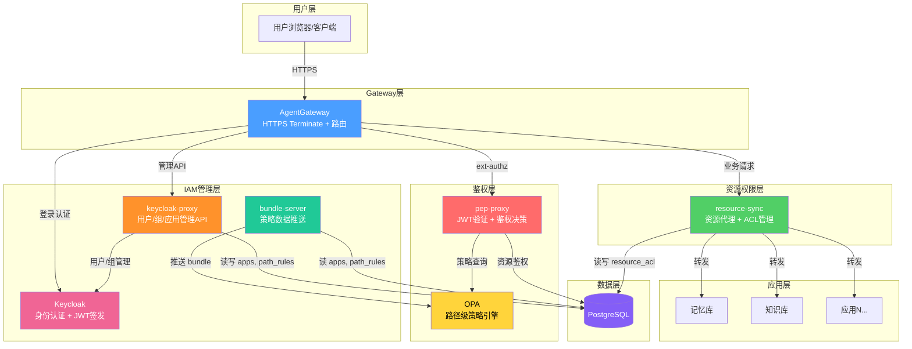
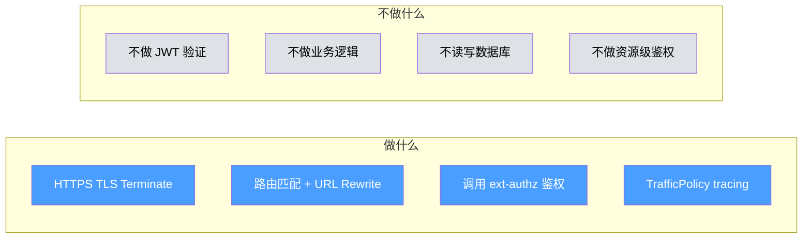
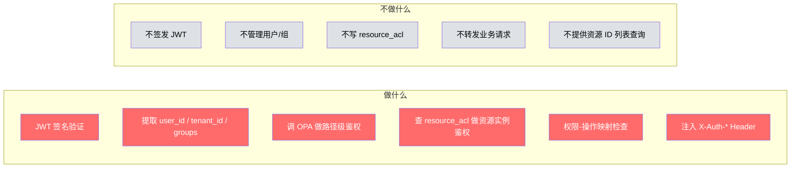
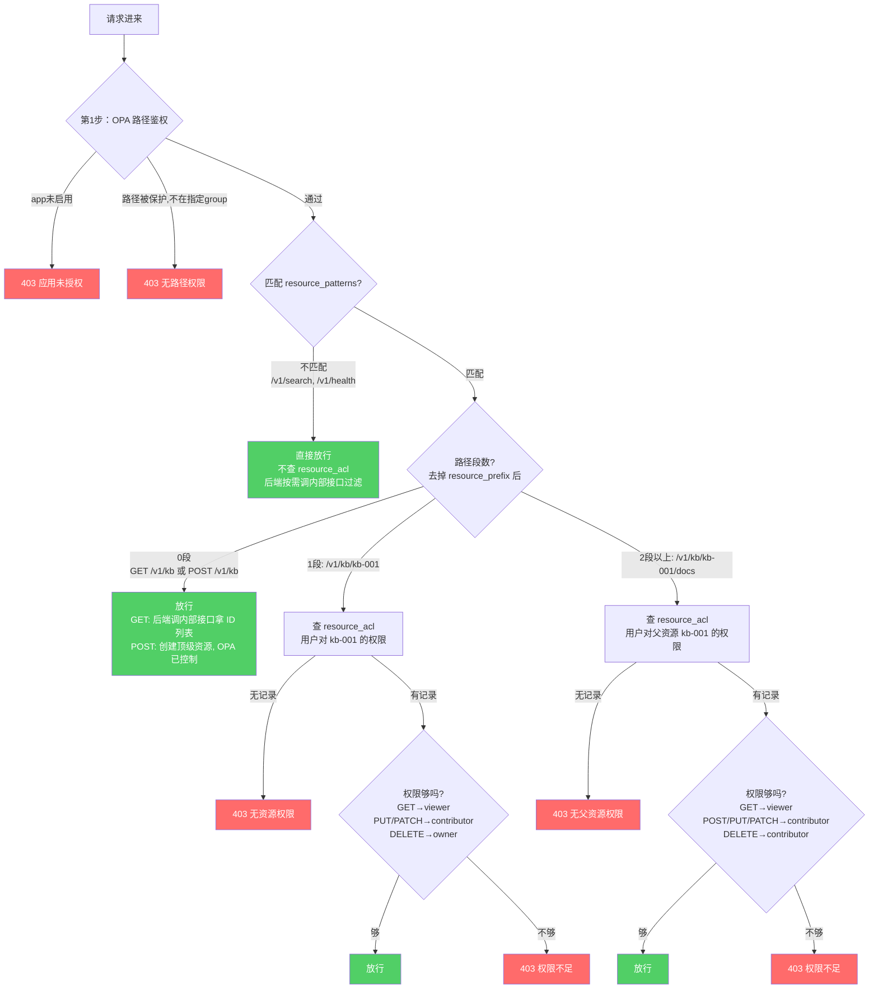
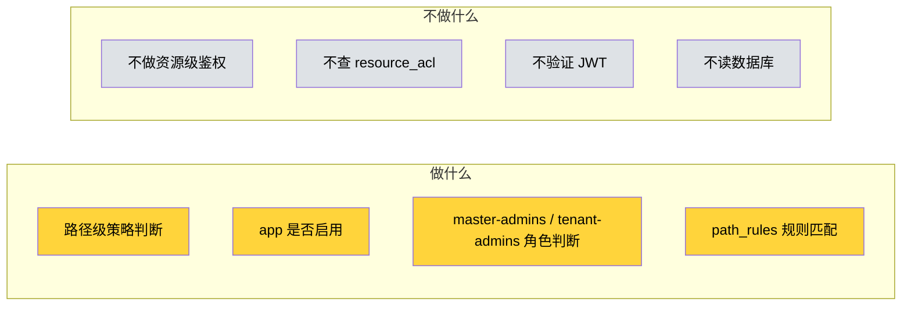
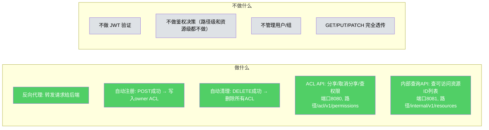
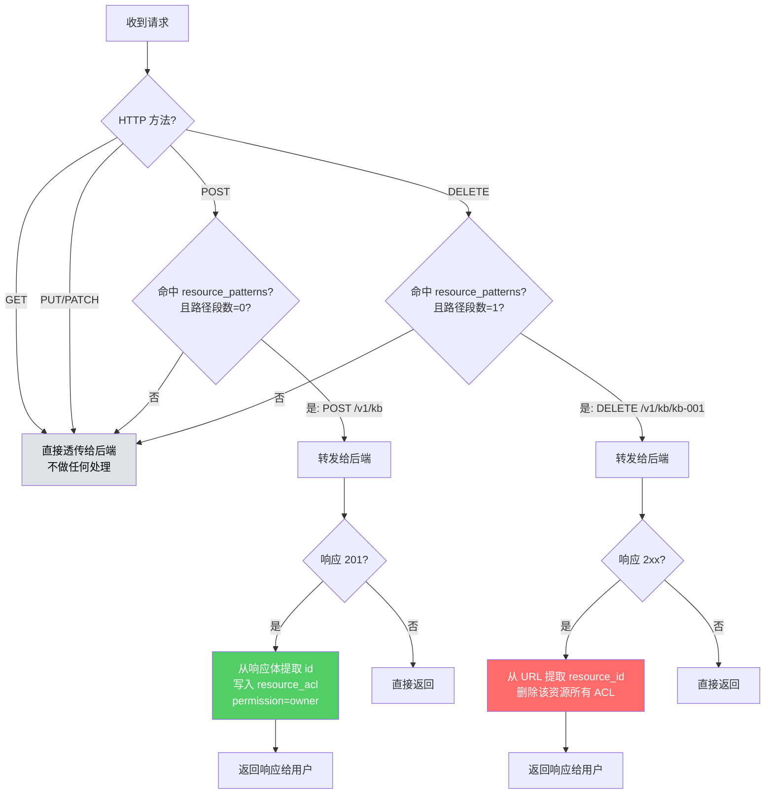
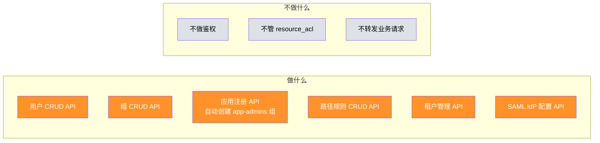

# 组件职责视角 — 谁负责什么、不负责什么

> 版本：v1.0 | 日期：2026-04-02

---

## 1 组件全景



---

## 2 每个组件的职责边界

### 2.1 Gateway（蓝色）



| 做 | 不做 |
|---|------|
| 接收 HTTPS 请求，解密 | 不验证 JWT |
| 按路径匹配路由到后端 | 不做任何业务逻辑 |
| 调 pep-proxy 做鉴权 | 不直接读写数据库 |
| URL Rewrite（`/knowledgebase/v1/kb` → `/v1/kb`） | 不做资源级权限判断 |
| 采集 trace 数据（TrafficPolicy） | 不管证书续期（cert-manager 管） |

---

### 2.2 pep-proxy（红色）



| 做 | 不做 |
|---|------|
| 验证 JWT 签名是否合法 | 不签发 JWT（Keycloak 做） |
| 从 JWT 提取用户信息 | 不管理用户/组（keycloak-proxy 做） |
| 调 OPA 判断路径权限 | **不写入 resource_acl**（resource-sync 做） |
| 查 resource_acl 判断资源实例权限（有资源 ID 时） | 不转发业务请求（Gateway → resource-sync 做） |
| 检查权限-操作映射（viewer 不能 PUT 等） | **不提供资源 ID 列表查询**（resource-sync 内部接口做） |
| 注入 `X-Auth-User-Id`, `X-Auth-Tenant`, `X-Auth-Groups` | 不注入 `X-Auth-Permission`（后端不需要，鉴权已全部完成） |

**读写分离原则：pep-proxy 只读 resource_acl（做单资源鉴权决策），resource-sync 写 resource_acl + 提供内部查询 API。**

**鉴权分两步：**



**三层创建权限：**

| 创建类型 | 路径示例 | 谁控制 | 怎么控制 |
|---------|---------|--------|---------|
| 管理员资源 | POST /v1/admin/templates | OPA + path_rules | 路径需要 `{app}-admins` 组 |
| 顶级资源 | POST /v1/kb | OPA | 未命中 path_rules + all-users → 放行 |
| 子资源 | POST /v1/kb/kb-001/docs | pep-proxy + resource_acl | 检查父资源权限，需 contributor 以上 |

---

### 2.3 OPA（黄色）



| 做 | 不做 |
|---|------|
| 纯内存策略计算（微秒级） | **不做资源实例级鉴权**（数据量太大） |
| 判断 app 是否启用（apps.enabled） | 不查 resource_acl 表 |
| 判断系统角色（master-admins, tenant-admins） | 不验证 JWT（pep-proxy 做） |
| 匹配 path_rules 保护规则 | 不直接读数据库（bundle-server 推送） |

---

### 2.4 resource-sync（绿色）— 新增核心组件



| 做 | 不做 |
|---|------|
| 作为后端的反向代理，转发请求 | 不验证 JWT（pep-proxy 做） |
| POST 成功 → 自动写入 owner ACL | 不做路径级鉴权（OPA 做） |
| DELETE 成功 → 自动删除资源所有 ACL | 不做资源级鉴权决策（pep-proxy 做） |
| 提供 ACL 管理 API（/acl/v1/permissions，端口 8080） | 不管理用户/组（keycloak-proxy 做） |
| 提供内部查询 API（/internal/v1/resources，端口 8081） | GET/PUT/PATCH 完全透传，不解析响应体 |

**两个端口两个职责：**
- 8080：对外（走 Gateway）— 反向代理 + ACL 管理 API
- 8081：对内（集群内直连）— 内部查询 API，后端 list/search 时调用

**核心原则：resource-sync 管"ACL 数据的写入和查询"，pep-proxy 管"鉴权决策"。**

**resource-sync 的处理逻辑：**



**注意：子资源（POST /v1/kb/kb-001/docs）的创建不触发 resource-sync 的 ACL 写入。** 子资源的权限继承父资源——能访问 kb-001 就能访问它下面的文档，不需要每个子资源单独一条 ACL。

**为什么 GET 不需要 resource-sync 处理：**

```
GET /v1/kb/kb-001（单个资源）：
  pep-proxy 查 resource_acl 做鉴权 → 通过或 403
  resource-sync 纯透传
  → 不需要 resource-sync 参与

GET /v1/kb（集合列表）：
  pep-proxy 只做路径鉴权，直接放行
  resource-sync 纯透传
  后端主动调 resource-sync 内部接口获取可访问 ID 列表
  后端按 ID 列表过滤返回

所有 GET 的鉴权在 pep-proxy 完成，
列表过滤由后端调内部接口完成，
resource-sync 在转发链路上只做透传。
```

---

### 2.5 keycloak-proxy（橙色）



| 做 | 不做 |
|---|------|
| 用户/组增删改查（调 Keycloak Admin API） | 不做任何鉴权判断 |
| 应用注册（写 apps 表 + 自动创建 {app}-admins 组） | **不管 resource_acl**（resource-sync 管） |
| 路径保护规则增删改查（写 path_rules 表） | 不转发业务请求 |
| 租户创建（创建 Keycloak Realm） | |
| SAML IdP 配置（导入元数据、创建映射） | |

---

### 2.6 Keycloak（粉色）

| 做 | 不做 |
|---|------|
| 用户/组存储 | 不对外暴露 API（keycloak-proxy 封装） |
| JWT 签发 | 不做鉴权判断 |
| OIDC/SAML 联邦登录 | 不管业务权限 |
| Session 管理 | |

### 2.7 bundle-server（青色）

| 做 | 不做 |
|---|------|
| 从 PostgreSQL 读 apps + path_rules | 不读 resource_acl（数据量太大，不适合推 OPA） |
| 转换为 OPA bundle 格式 | 不做鉴权 |
| 推送到 OPA | |

### 2.8 后端应用（灰色）

| 做 | 不做 |
|---|------|
| 纯业务逻辑（CRUD 数据） | **不做任何鉴权判断**（pep-proxy 已全部完成） |
| 读 `X-Auth-User-Id` 做数据归属 | 不验证 JWT |
| list/search 时调 resource-sync 内部接口获取可访问 ID 列表 | 不检查 permission（pep-proxy 已按方法拦截） |
| | 不维护权限表 |

---

## 3 关键分工对比

```mermaid
flowchart LR
    subgraph 鉴权决策<br/>pep-proxy
        P1[路径能不能访问?]
        P2[资源有没有权限?]
    end

    subgraph 资源同步<br/>resource-sync
        R1[创建 → 注册 owner]
        R2[删除 → 清理 ACL]
        R3[分享 → ACL API]
    end

    subgraph 策略计算<br/>OPA
        O1[app 是否启用?]
        O2[path_rules 匹配]
    end

    subgraph 身份管理<br/>keycloak-proxy
        K1[用户/组 CRUD]
        K2[应用注册]
    end

    style P1 fill:#ff6b6b,color:#fff
    style P2 fill:#ff6b6b,color:#fff
    style R1 fill:#51cf66,color:#fff
    style R2 fill:#51cf66,color:#fff
    style R3 fill:#51cf66,color:#fff
    style O1 fill:#ffd43b,color:#000
    style O2 fill:#ffd43b,color:#000
    style K1 fill:#ff922b,color:#fff
    style K2 fill:#ff922b,color:#fff
```

| 维度 | pep-proxy | resource-sync | OPA | keycloak-proxy | 后端应用 |
|------|-----------|---------------|-----|----------------|---------|
| **核心职责** | 鉴权决策 | ACL 数据管理 | 策略计算 | 身份管理 | 纯业务 |
| **读 resource_acl** | ✅ 单资源鉴权 | ✅ ACL API + 内部查询 API | ❌ | ❌ | ❌（通过内部接口间接读） |
| **写 resource_acl** | ❌ | ✅ 自动同步 + ACL API | ❌ | ❌ | ❌ |
| **读 OPA** | ✅ 调用查询 | ❌ | — | ❌ | ❌ |
| **在请求链路上** | ✅ ext-authz | ✅ 反向代理 | ✅ 被调用 | ❌ 独立 API | ✅ 最终处理 |
| **暴露端口** | — | 8080 对外 + 8081 对内 | — | — | — |

**职责分离总结：**

```
resource_acl 表：
  写入 → resource-sync（自动同步 + ACL API）
  鉴权读 → pep-proxy（单资源实例鉴权）
  列表读 → resource-sync 内部 API → 后端应用调用
```
