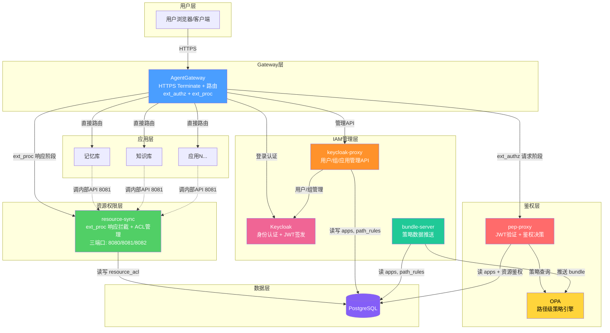
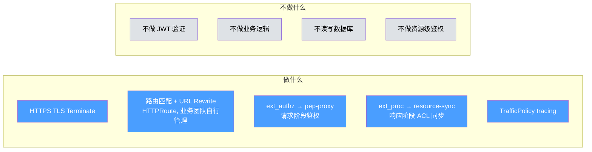
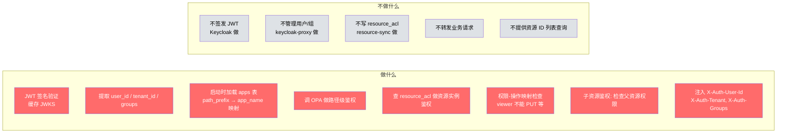
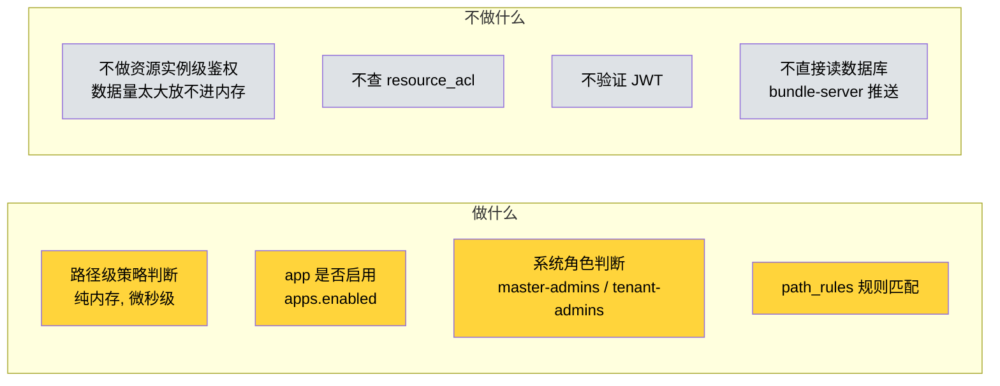
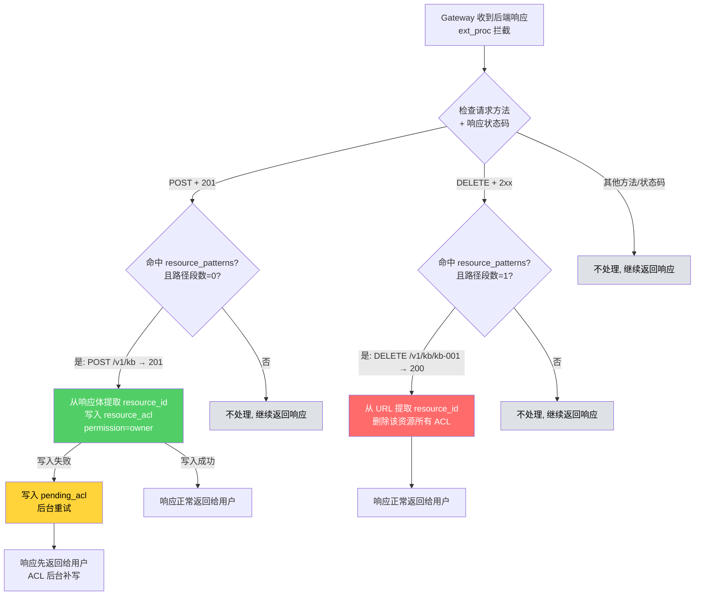
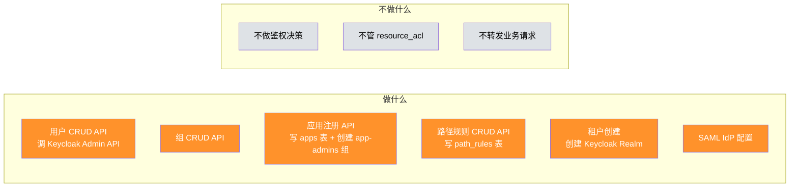
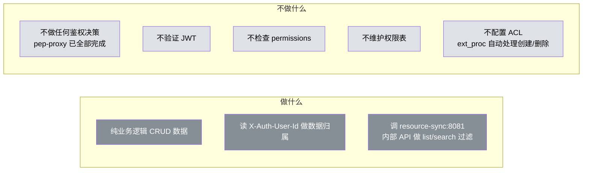

# 组件职责视角 — 谁负责什么、不负责什么

> 版本：v2.0 | 日期：2026-04-07
>
> **重大变更：resource-sync 不再是反向代理。Gateway 直接路由到后端，resource-sync 通过 ext_proc 拦截响应阶段。**

---

## 1 组件全景



---

## 2 每个组件的职责边界

### 2.1 Gateway（蓝色）



| 做 | 不做 |
|---|------|
| 接收 HTTPS 请求，TLS 解密 | 不验证 JWT |
| 按路径匹配路由到后端（HTTPRoute，业务团队自行管理） | 不做任何业务逻辑 |
| ext_authz → pep-proxy（请求阶段鉴权） | 不直接读写数据库 |
| ext_proc → resource-sync（响应阶段 ACL 同步） | 不做资源级权限判断 |
| URL Rewrite（`/knowledgebase/v1/kb` → `/v1/kb`） | 不管证书续期（cert-manager 管） |
| 采集 trace 数据（TrafficPolicy） | |

---

### 2.2 pep-proxy（红色）



| 做 | 不做 |
|---|------|
| 验证 JWT 签名（缓存 JWKS） | 不签发 JWT（Keycloak 做） |
| 从 JWT 提取 user_id / tenant_id / groups | 不管理用户/组（keycloak-proxy 做） |
| 启动时加载 apps 表（path_prefix → app_name 映射） | **不写入 resource_acl**（resource-sync 做） |
| 调 OPA 判断路径权限 | 不转发业务请求 |
| 查 resource_acl 判断资源实例权限（有资源 ID 时） | **不提供资源 ID 列表查询**（resource-sync 内部接口做） |
| 检查权限-操作映射（viewer 不能 PUT 等） | |
| 子资源鉴权（检查父资源权限） | |
| 注入 `X-Auth-User-Id`, `X-Auth-Tenant`, `X-Auth-Groups` | |

**读写分离原则：pep-proxy 只读 apps（path_prefix → app_name 映射）和 resource_acl（做单资源鉴权决策），resource-sync 写 resource_acl + 提供内部查询 API。**

**鉴权分两步：**


**三层创建权限：**

| 创建类型 | 路径示例 | 谁控制 | 怎么控制 |
|---------|---------|--------|---------|
| 管理员资源 | POST /v1/admin/templates | OPA + path_rules | 路径需要 `{app}-admins` 组 |
| 顶级资源 | POST /v1/kb | OPA | 未命中 path_rules + all-users → 放行 |
| 子资源 | POST /v1/kb/kb-001/docs | pep-proxy + resource_acl | 检查父资源权限，需 contributor 以上 |

---

### 2.3 OPA（黄色）



| 做 | 不做 |
|---|------|
| 纯内存策略计算（微秒级） | **不做资源实例级鉴权**（数据量太大） |
| 判断 app 是否启用（apps.enabled） | 不查 resource_acl 表 |
| 判断系统角色（master-admins, tenant-admins） | 不验证 JWT（pep-proxy 做） |
| 匹配 path_rules 保护规则 | 不直接读数据库（bundle-server 推送） |

---

### 2.4 resource-sync（绿色）— 架构重大变更

> **v2.0 变更：resource-sync 不再是反向代理。Gateway 直接路由到后端应用，resource-sync 作为 ext_proc gRPC 服务拦截响应阶段。**

```mermaid
flowchart LR
    subgraph 做什么
        A1[ext_proc gRPC 服务 端口8082<br/>拦截 POST+201 / DELETE+2xx 响应]
        A2[同步写入/清理 resource_acl<br/>创建→owner / 删除→清理全部]
        A3[ACL 管理 API 端口8080<br/>路径 /acl/v1/resources/{resource_id}/permissions<br/>分享/取消分享/查权限]
        A4[内部查询 API 端口8081<br/>返回可访问资源 ID 列表<br/>供后端 list/search 过滤]
        A5[pending_acl 后台重试]
        A6[定期对账: 孤儿 ACL 清理]
    end

    subgraph 不做什么
        B1[不是反向代理<br/>Gateway 直接路由到后端]
        B2[不转发业务请求]
        B3[不做 JWT 验证]
        B4[不做鉴权决策<br/>pep-proxy 做路径+资源鉴权]
        B5[不管理用户/组]
    end

    style A1 fill:#51cf66,color:#fff
    style A2 fill:#51cf66,color:#fff
    style A3 fill:#51cf66,color:#fff
    style A4 fill:#51cf66,color:#fff
    style A5 fill:#51cf66,color:#fff
    style A6 fill:#51cf66,color:#fff
    style B1 fill:#dee2e6,color:#000
    style B2 fill:#dee2e6,color:#000
    style B3 fill:#dee2e6,color:#000
    style B4 fill:#dee2e6,color:#000
    style B5 fill:#dee2e6,color:#000
```

| 做 | 不做 |
|---|------|
| ext_proc gRPC 服务（端口 8082），拦截 POST+201 / DELETE+2xx 响应 | **不是反向代理**（Gateway 直接路由到后端） |
| 同步写入/清理 resource_acl（创建→owner / 删除→清理全部） | **不转发业务请求** |
| ACL 管理 API（端口 8080，路径 /acl/v1/resources/{resource_id}/permissions） | 不做 JWT 验证（pep-proxy 做） |
| 内部查询 API（端口 8081，返回可访问资源 ID 列表） | 不做鉴权决策（pep-proxy 做路径+资源鉴权） |
| pending_acl 后台重试 | 不管理用户/组（keycloak-proxy 做） |
| 定期对账（孤儿 ACL 清理） | |

**三个端口三个职责：**

| 端口 | 类型 | 访问方式 | 职责 |
|------|------|---------|------|
| 8080 | 对外 API | 走 Gateway + ext_authz | ACL 管理（分享/取消分享/查权限） |
| 8081 | 对内 API | 集群内直连，不走 Gateway | 资源 ID 查询 + ext_proc 写入的 ACL 注册 |
| 8082 | ext_proc gRPC | Gateway 响应阶段调用 | 拦截创建/删除响应，自动同步 ACL |

**ACL 管理 API 端点（端口 8080）：**

> 路径中包含 `{resource_id}`，使得 pep-proxy 可直接从 URL 提取 resource_id 验证 owner 权限，无需读取请求体。

```
POST   /acl/v1/resources/{resource_id}/permissions       分享资源
GET    /acl/v1/resources/{resource_id}/permissions       查看权限列表  
PUT    /acl/v1/resources/{resource_id}/permissions/{id}  修改权限
DELETE /acl/v1/resources/{resource_id}/permissions/{id}  取消分享
```

**核心原则：resource-sync 管"ACL 数据的写入和查询"，pep-proxy 管"鉴权决策"。**

**resource-sync ext_proc 处理逻辑：**



**关键区别（v1.0 vs v2.0）：**

```
v1.0（反向代理模式）：
  用户 → Gateway → resource-sync（反向代理）→ 后端
  resource-sync 在转发链路上，拦截 POST/DELETE 响应

v2.0（ext_proc 模式）：
  用户 → Gateway → 后端（直接路由）
                ↘ ext_proc → resource-sync（响应阶段拦截）
  resource-sync 不在请求链路上，通过 ext_proc gRPC 协议拦截响应
```

**注意：子资源（POST /v1/kb/kb-001/docs）的创建不触发 ACL 写入。** 子资源的权限继承父资源——能访问 kb-001 就能访问它下面的文档，不需要每个子资源单独一条 ACL。

---

### 2.5 keycloak-proxy（橙色）



| 做 | 不做 |
|---|------|
| 用户/组增删改查（调 Keycloak Admin API） | 不做任何鉴权判断 |
| 应用注册（写 apps 表 + 自动创建 {app}-admins 组） | **不管 resource_acl**（resource-sync 管） |
| 路径保护规则增删改查（写 path_rules 表） | 不转发业务请求 |
| 租户创建（创建 Keycloak Realm） | |
| SAML IdP 配置（导入元数据、创建映射） | |

---

### 2.6 Keycloak（粉色）

| 做 | 不做 |
|---|------|
| 用户/组存储 | 不对外暴露 API（keycloak-proxy 封装） |
| JWT 签发 | 不做鉴权判断 |
| OIDC/SAML 联邦登录 | 不管业务权限 |
| Session 管理 | |

### 2.7 bundle-server（青色）

| 做 | 不做 |
|---|------|
| 从 PostgreSQL 读 apps + path_rules | 不读 resource_acl（数据量太大，不适合推 OPA） |
| 转换为 OPA bundle 格式 | 不做鉴权 |
| 推送到 OPA | |

### 2.8 后端应用（灰色）



| 做 | 不做 |
|---|------|
| 纯业务逻辑（CRUD 数据） | **不做任何鉴权判断**（pep-proxy 已全部完成） |
| 读 `X-Auth-User-Id` 做数据归属 | 不验证 JWT |
| list/search 时调 resource-sync:8081 内部接口获取可访问 ID 列表 | 不检查 permission（pep-proxy 已按方法拦截） |
| | 不维护权限表 |
| | 不配置 ACL（ext_proc 自动处理创建/删除） |

---

## 3 关键分工对比

```mermaid
flowchart LR
    subgraph 鉴权决策<br/>pep-proxy
        P1[路径能不能访问?]
        P2[资源有没有权限?]
    end

    subgraph ACL数据管理<br/>resource-sync
        R1[ext_proc 拦截 → 自动注册/清理]
        R2[ACL API → 分享/取消分享]
        R3[内部 API → 资源 ID 列表]
    end

    subgraph 策略计算<br/>OPA
        O1[app 是否启用?]
        O2[path_rules 匹配]
    end

    subgraph 身份管理<br/>keycloak-proxy
        K1[用户/组 CRUD]
        K2[应用注册]
    end

    style P1 fill:#ff6b6b,color:#fff
    style P2 fill:#ff6b6b,color:#fff
    style R1 fill:#51cf66,color:#fff
    style R2 fill:#51cf66,color:#fff
    style R3 fill:#51cf66,color:#fff
    style O1 fill:#ffd43b,color:#000
    style O2 fill:#ffd43b,color:#000
    style K1 fill:#ff922b,color:#fff
    style K2 fill:#ff922b,color:#fff
```

| 维度 | pep-proxy | resource-sync | OPA | keycloak-proxy | 后端应用 |
|------|-----------|---------------|-----|----------------|---------|
| **核心职责** | 鉴权决策 | ACL 数据管理 | 策略计算 | 身份管理 | 纯业务 |
| **读 apps** | ✅ 启动时加载 path_prefix→app_name | ❌ | ❌（bundle-server 推送） | ✅ 读写 | ❌ |
| **读 resource_acl** | ✅ 单资源鉴权 | ✅ ACL API + 内部查询 API | ❌ | ❌ | ❌（通过内部接口间接读） |
| **写 resource_acl** | ❌ | ✅ ext_proc 自动同步 + ACL API | ❌ | ❌ | ❌ |
| **读 OPA** | ✅ 调用查询 | ❌ | — | ❌ | ❌ |
| **在请求链路上** | ✅ ext_authz（请求阶段） | ✅ ext_proc（响应阶段） | ✅ 被调用 | ❌ 独立 API | ✅ 最终处理 |
| **暴露端口** | — | 8080 对外 + 8081 对内 + 8082 ext_proc | — | — | — |

**resource_acl 读写关系：**

```
apps 表：
  读 → pep-proxy（启动时加载 path_prefix → app_name 映射，用于匹配 resource_patterns）
  读 → bundle-server（推送 OPA bundle）
  读写 → keycloak-proxy（应用注册管理）

resource_acl 表：
  写入 → resource-sync（ext_proc 自动同步 + ACL API）
  鉴权读 → pep-proxy（单资源实例鉴权）
  列表读 → resource-sync 内部 API（端口 8081）→ 后端应用调用
```

**v2.0 架构核心变化总结：**

```
v1.0: Gateway → resource-sync（反向代理）→ 后端
      resource-sync 在请求链路上，同时承担转发 + ACL 同步

v2.0: Gateway → 后端（直接路由，HTTPRoute 业务团队自管）
      Gateway ← ext_authz → pep-proxy（请求阶段）
      Gateway ← ext_proc → resource-sync（响应阶段）
      resource-sync 不在请求链路上，三端口各司其职
```
