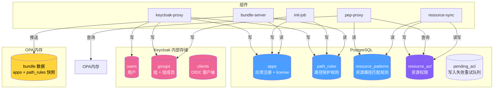
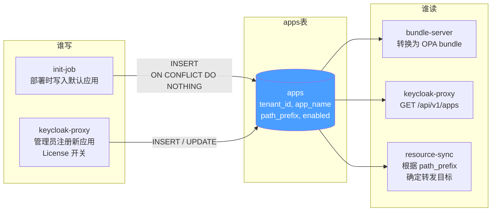
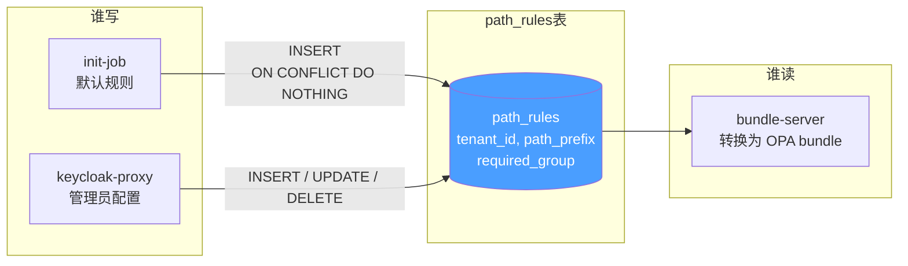
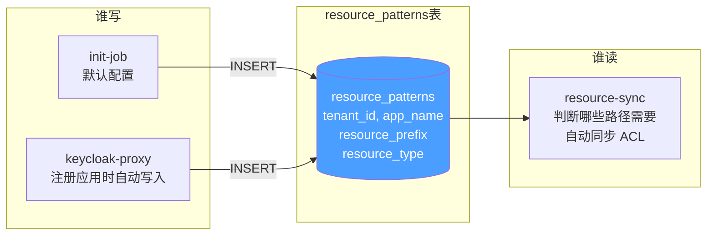
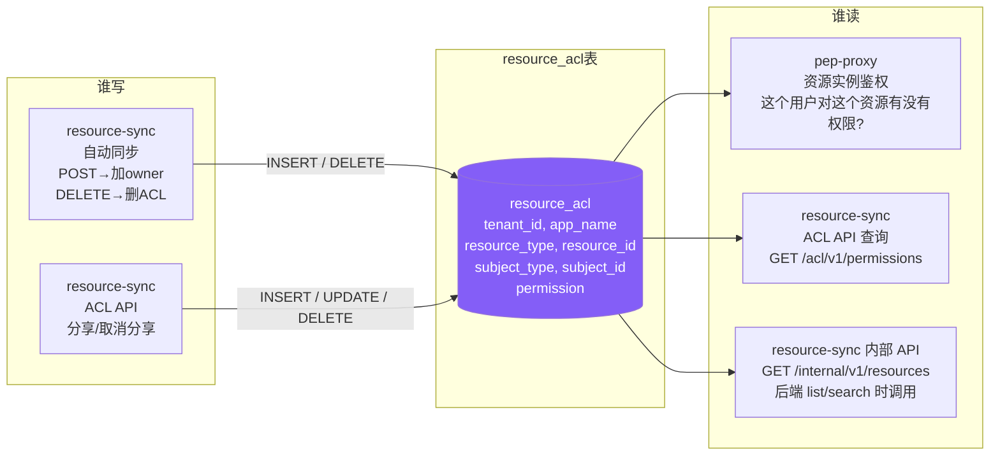
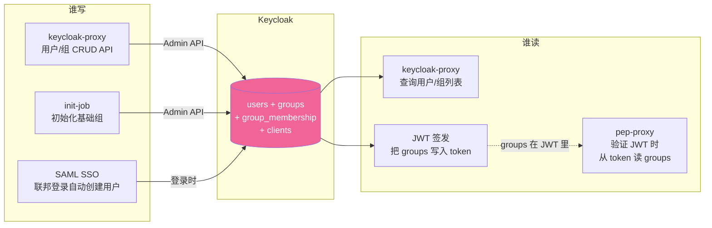
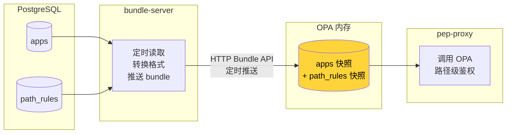
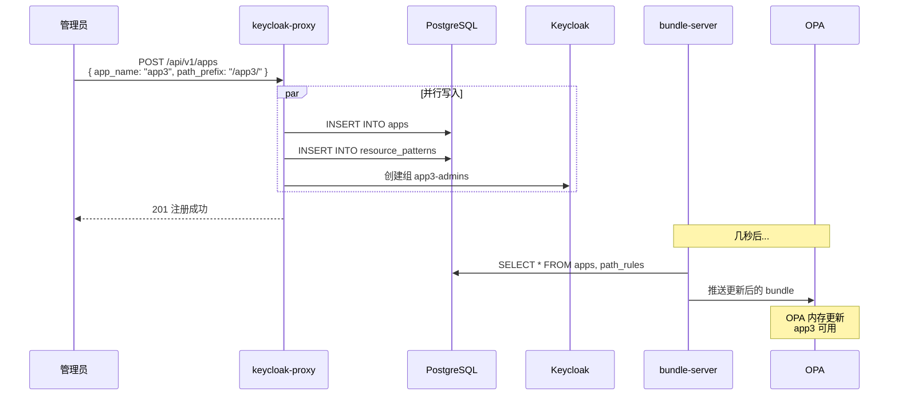
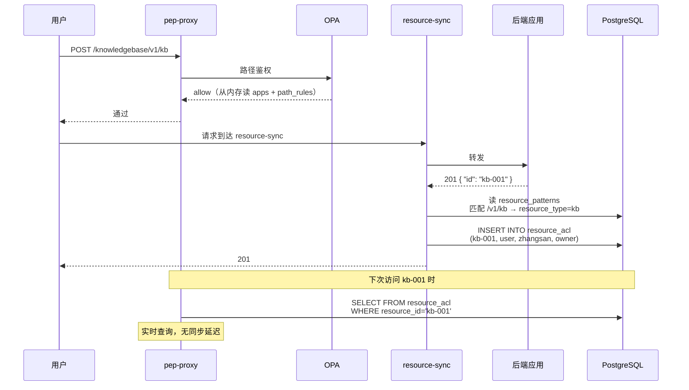
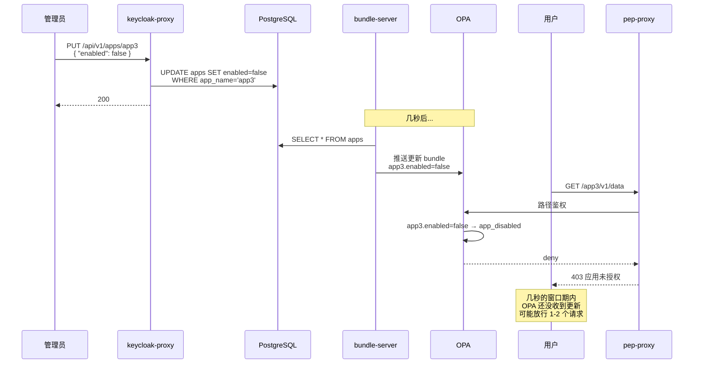

# 数据存储视角 — 数据在哪、谁读谁写、怎么同步

> 版本：v1.0 | 日期：2026-04-02

---

## 1 数据存储全景



---

## 2 每张表的读写关系

### 2.1 apps — 应用注册表



| 字段 | 写入者 | 读取者 | 用途 |
|------|--------|--------|------|
| `tenant_id` | init-job, keycloak-proxy | bundle-server | 租户隔离 |
| `app_name` | init-job, keycloak-proxy | 所有读取者 | 应用标识 |
| `path_prefix` | init-job, keycloak-proxy | bundle-server, resource-sync | 路由匹配 |
| `enabled` | keycloak-proxy | bundle-server → OPA | License 控制 |

---

### 2.2 path_rules — 路径保护规则表



| 字段 | 写入者 | 读取者 | 用途 |
|------|--------|--------|------|
| `path_prefix` | init-job, keycloak-proxy | bundle-server → OPA | 哪些路径需要保护 |
| `required_group` | init-job, keycloak-proxy | bundle-server → OPA | 需要哪个组才能访问 |

---

### 2.3 resource_patterns — 资源路径匹配规则



| 字段 | 写入者 | 读取者 | 用途 |
|------|--------|--------|------|
| `app_name` | init-job, keycloak-proxy | resource-sync | 关联到哪个应用 |
| `resource_prefix` | init-job, keycloak-proxy | resource-sync | 匹配路径前缀（如 `/v1/kb`） |
| `resource_type` | init-job, keycloak-proxy | resource-sync | 写入 ACL 时标识资源类型 |

**示例数据：**

```
| tenant_id | app_name       | resource_prefix | resource_type |
|-----------|----------------|-----------------|---------------|
| aidp      | knowledgebase  | /v1/kb          | kb            |
| aidp      | memory         | /v1/memories    | memory        |
```

---

### 2.4 resource_acl — 资源权限表（核心新增）



| 字段 | 写入者 | 读取者 | 用途 |
|------|--------|--------|------|
| `resource_type` | resource-sync | pep-proxy | 资源类型（kb, memory） |
| `resource_id` | resource-sync | pep-proxy | 资源实例 ID |
| `subject_type` | resource-sync | pep-proxy | user 或 group |
| `subject_id` | resource-sync | pep-proxy | 用户 ID 或 组名 |
| `permission` | resource-sync | pep-proxy | owner / contributor / viewer |

**resource_acl 的数据量预估：**

```
200 租户 × 5 应用 × 平均每应用 1000 资源 × 平均每资源 3 条 ACL
= 200 × 5 × 1000 × 3
= 300 万条

pep-proxy 每次请求查 1 条（按 resource_id + subject_id 精确查询）
有联合索引，查询 < 1ms
```

---

### 2.5 Keycloak 内部存储 — 用户/组



**关键点：** pep-proxy 不直接读 Keycloak，而是从 JWT 中提取 groups。Keycloak 的数据通过 JWT 间接传递。

---

### 2.6 OPA 内存 — bundle 数据



| 数据 | 来源 | 同步方式 | 延迟 |
|------|------|---------|------|
| apps (enabled 状态) | PostgreSQL → bundle-server → OPA | 定时推送（秒级） | 规则变更后几秒生效 |
| path_rules | PostgreSQL → bundle-server → OPA | 定时推送（秒级） | 同上 |
| **resource_acl** | **不推送到 OPA** | **pep-proxy 直接查数据库** | **实时** |

**为什么 resource_acl 不推 OPA：**

```
apps + path_rules：几百条数据，适合全量加载到内存
resource_acl：几百万条数据，推到 OPA 内存会爆

所以：
  路径级鉴权 → OPA 内存（快，微秒级）
  资源级鉴权 → 直接查 PostgreSQL（有索引，毫秒级）
```

---

## 3 数据同步流程

### 3.1 管理员注册新应用时的数据流



### 3.2 用户创建资源时的数据流



### 3.3 License 变更时的数据流



---

## 4 数据一览表

| 数据 | 存储位置 | 写入者 | 读取者 | 数据量 | 同步方式 |
|------|---------|--------|--------|--------|---------|
| 用户/组 | Keycloak | keycloak-proxy, init-job, SAML | JWT → pep-proxy | 1w 用户 | JWT 携带 |
| apps | PostgreSQL | keycloak-proxy, init-job | bundle-server → OPA | 几十条 | 定时推送（秒级延迟） |
| path_rules | PostgreSQL | keycloak-proxy, init-job | bundle-server → OPA | 几十条 | 定时推送（秒级延迟） |
| resource_patterns | PostgreSQL | keycloak-proxy, init-job | resource-sync | 几十条 | resource-sync 启动时加载 |
| **resource_acl** | **PostgreSQL** | **resource-sync** | **pep-proxy（鉴权）, resource-sync（ACL API + 内部查询 API → 后端调用）** | **几百万条** | **直接查数据库（实时）** |
| pending_acl | PostgreSQL | resource-sync（写入失败时） | resource-sync（后台重试） | 通常为 0，故障时几十条 | 后台定时重试 |
| OPA bundle | OPA 内存 | bundle-server | pep-proxy | 几 KB | 定时推送 |
