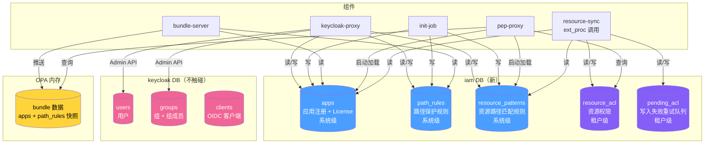
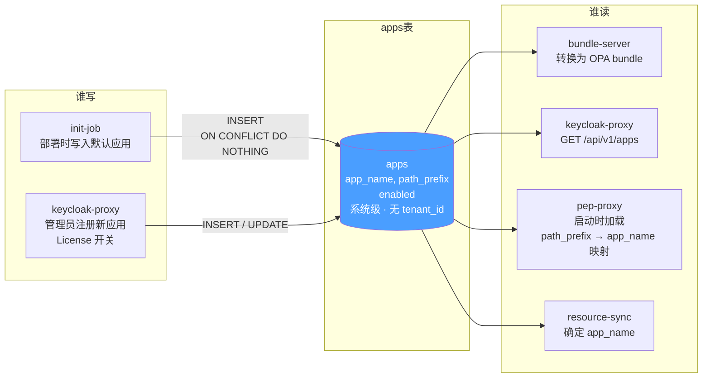
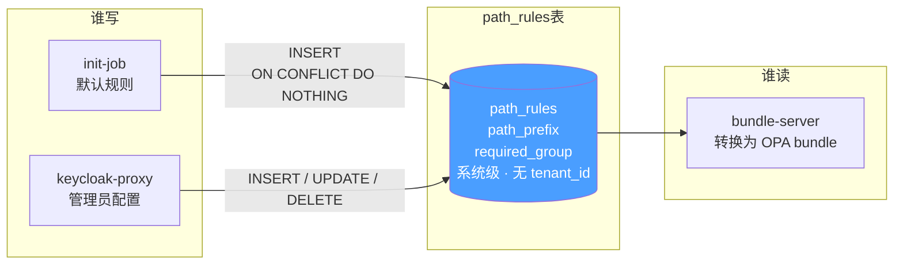
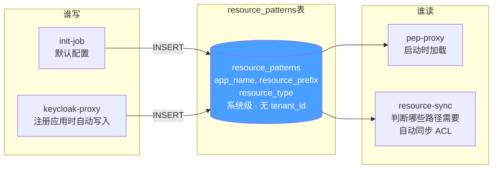
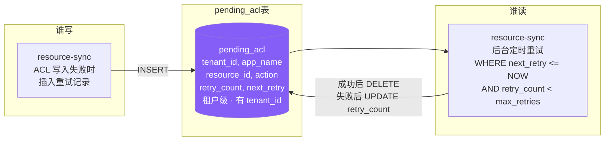
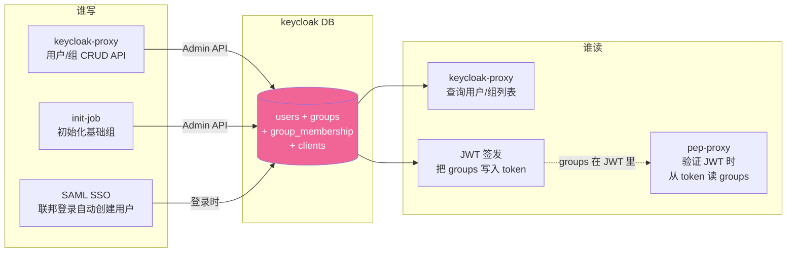
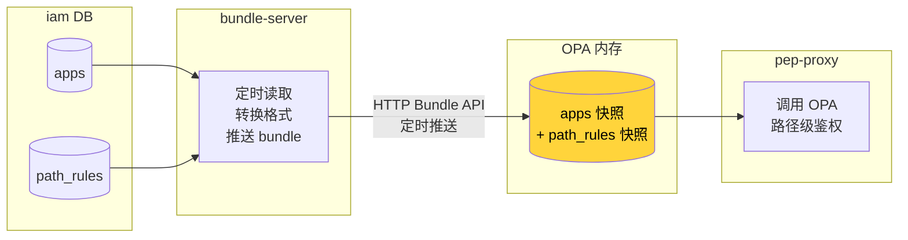
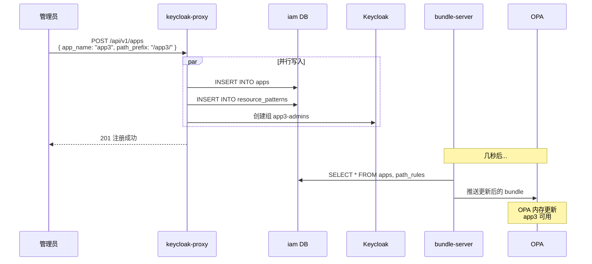
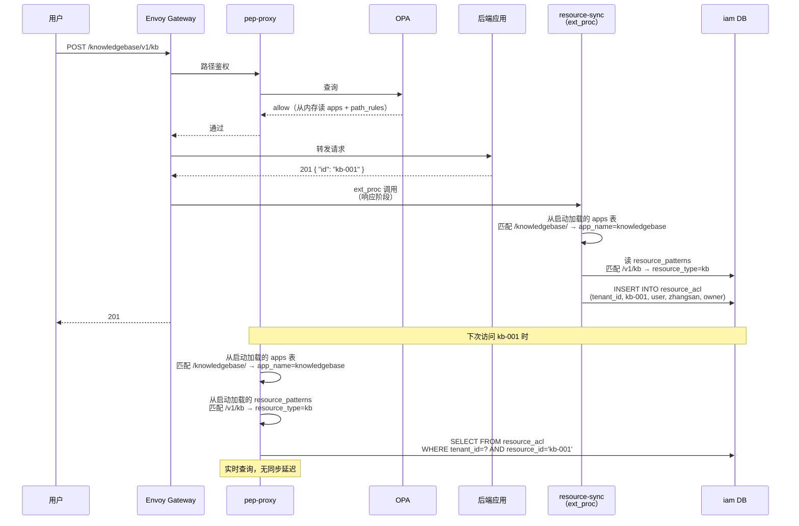
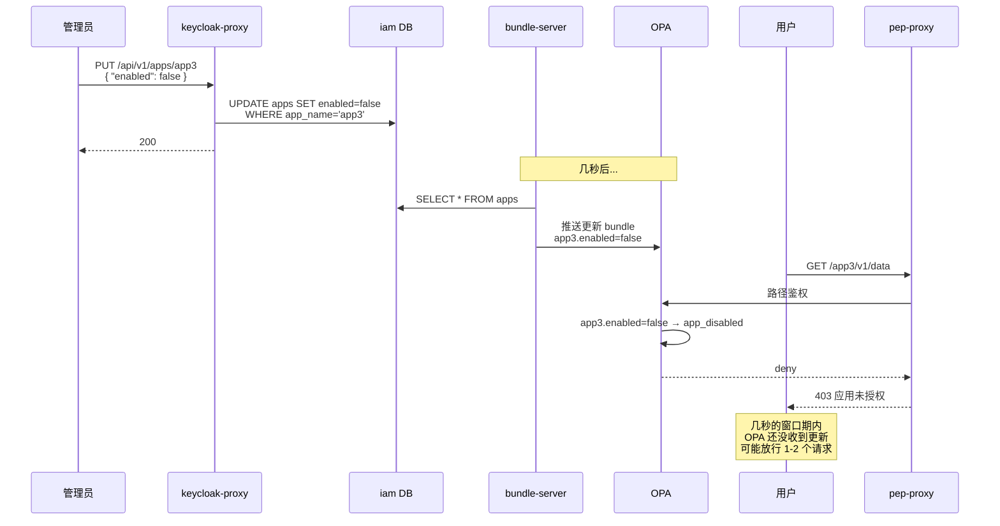

# 数据存储视角 — 数据在哪、谁读谁写、怎么同步

> 版本：v2.0 | 日期：2026-04-07

---

## 1 数据库拓扑

```
PostgreSQL 实例
├── keycloak DB — Keycloak 内部存储（不触碰）
├── opal DB    — OPAL Server pub/sub（保留给 OPAL，旧 policies/role_policy_bindings 表已废弃）
└── iam DB（新）— 所有 IAM 业务表
    ├── apps               （系统级，无 tenant_id）
    ├── resource_patterns   （系统级，无 tenant_id）
    ├── path_rules          （系统级，无 tenant_id）
    ├── resource_acl        （租户级，有 tenant_id）
    └── pending_acl         （租户级，有 tenant_id）
```

**关键设计决策：** 系统面向单一客户销售，租户代表部门。因此应用注册、路径规则、资源模式都是系统级配置（无 tenant_id），只有资源 ACL 和待处理队列是租户级数据（有 tenant_id）。

---

## 2 数据存储全景



---

## 3 表结构定义

### 3.1 系统级表（无 tenant_id）

#### apps — 应用注册表

```sql
CREATE TABLE apps (
    app_name     VARCHAR(128) PRIMARY KEY,
    path_prefix  VARCHAR(256) NOT NULL UNIQUE,
    display_name VARCHAR(256),
    description  VARCHAR(512),
    enabled      BOOLEAN      NOT NULL DEFAULT true,
    created_at   TIMESTAMP    NOT NULL DEFAULT NOW(),
    updated_at   TIMESTAMP    NOT NULL DEFAULT NOW()
);
```

#### resource_patterns — 资源路径匹配规则

```sql
CREATE TABLE resource_patterns (
    app_name        VARCHAR(128) NOT NULL REFERENCES apps(app_name),
    resource_prefix VARCHAR(256) NOT NULL,
    resource_type   VARCHAR(128) NOT NULL,
    PRIMARY KEY (app_name, resource_prefix)
);
```

#### path_rules — 路径保护规则

```sql
CREATE TABLE path_rules (
    id              SERIAL PRIMARY KEY,
    path_prefix     VARCHAR(256) NOT NULL UNIQUE,
    required_group  VARCHAR(128) NOT NULL,
    description     VARCHAR(512),
    created_at      TIMESTAMP    NOT NULL DEFAULT NOW()
);
```

### 3.2 租户级表（有 tenant_id）

#### resource_acl — 资源权限表

```sql
CREATE TABLE resource_acl (
    id              SERIAL PRIMARY KEY,
    tenant_id       VARCHAR(128) NOT NULL,
    app_name        VARCHAR(128) NOT NULL,
    resource_type   VARCHAR(128) NOT NULL,
    resource_id     VARCHAR(256) NOT NULL,
    subject_type    VARCHAR(32)  NOT NULL CHECK (subject_type IN ('user', 'group')),
    subject_id      VARCHAR(128) NOT NULL,
    permission      VARCHAR(32)  NOT NULL CHECK (permission IN ('owner', 'contributor', 'viewer')),
    created_at      TIMESTAMP    NOT NULL DEFAULT NOW(),
    UNIQUE (tenant_id, app_name, resource_type, resource_id, subject_type, subject_id)
);
CREATE INDEX idx_acl_resource ON resource_acl (tenant_id, app_name, resource_type, resource_id);
CREATE INDEX idx_acl_subject ON resource_acl (tenant_id, app_name, resource_type, subject_type, subject_id);
CREATE INDEX idx_acl_cleanup ON resource_acl (app_name, resource_id);
```

#### pending_acl — 写入失败重试队列

```sql
CREATE TABLE pending_acl (
    id              SERIAL PRIMARY KEY,
    tenant_id       VARCHAR(128) NOT NULL,
    app_name        VARCHAR(128) NOT NULL,
    resource_type   VARCHAR(128) NOT NULL,
    resource_id     VARCHAR(256) NOT NULL,
    subject_type    VARCHAR(32)  NOT NULL,
    subject_id      VARCHAR(128) NOT NULL,
    permission      VARCHAR(32)  NOT NULL,
    action          VARCHAR(16)  NOT NULL CHECK (action IN ('create', 'delete')),
    retry_count     INTEGER      NOT NULL DEFAULT 0,
    max_retries     INTEGER      NOT NULL DEFAULT 10,
    last_error      TEXT,
    created_at      TIMESTAMP    NOT NULL DEFAULT NOW(),
    next_retry      TIMESTAMP    NOT NULL DEFAULT NOW()
);
CREATE INDEX idx_pending_retry ON pending_acl (next_retry) WHERE retry_count < max_retries;
```

---

## 4 每张表的读写关系

### 4.1 apps — 应用注册表（系统级）



| 字段 | 写入者 | 读取者 | 用途 |
|------|--------|--------|------|
| `app_name` | init-job, keycloak-proxy | 所有读取者 | 应用标识（主键） |
| `path_prefix` | init-job, keycloak-proxy | bundle-server, pep-proxy, resource-sync | 路由匹配（pep-proxy 和 resource-sync 启动时加载，用于将请求路径映射到 app_name） |
| `enabled` | keycloak-proxy | bundle-server → OPA | License 控制 |

---

### 4.2 path_rules — 路径保护规则表（系统级）



| 字段 | 写入者 | 读取者 | 用途 |
|------|--------|--------|------|
| `path_prefix` | init-job, keycloak-proxy | bundle-server → OPA | 哪些路径需要保护 |
| `required_group` | init-job, keycloak-proxy | bundle-server → OPA | 需要哪个组才能访问 |

---

### 4.3 resource_patterns — 资源路径匹配规则（系统级）



| 字段 | 写入者 | 读取者 | 用途 |
|------|--------|--------|------|
| `app_name` | init-job, keycloak-proxy | pep-proxy, resource-sync | 关联到哪个应用 |
| `resource_prefix` | init-job, keycloak-proxy | pep-proxy, resource-sync | 匹配路径前缀（如 `/v1/kb`） |
| `resource_type` | init-job, keycloak-proxy | pep-proxy, resource-sync | 写入 ACL 时标识资源类型 |

**示例数据：**

```
| app_name       | resource_prefix | resource_type |
|----------------|-----------------|---------------|
| knowledgebase  | /v1/kb          | kb            |
| memory         | /v1/memories    | memory        |
```

---

### 4.4 resource_acl — 资源权限表（租户级）

```mermaid
flowchart LR
    subgraph 谁写
        RS_AUTO[resource-sync<br/>ext_proc 自动同步<br/>201→加owner<br/>DELETE→删ACL]
        RS_API[resource-sync<br/>ACL API<br/>分享/取消分享]
    end

    subgraph resource_acl表
        ACL[(resource_acl<br/>tenant_id, app_name<br/>resource_type, resource_id<br/>subject_type, subject_id<br/>permission<br/>租户级 · 有 tenant_id)]
    end

    subgraph 谁读
        PEP[pep-proxy<br/>资源实例鉴权<br/>这个用户对这个资源有没有权限?]
        RS_QUERY[resource-sync<br/>ACL API 查询<br/>GET /acl/v1/resources/{resource_id}/permissions]
        RS_INTERNAL[resource-sync 内部 API<br/>GET /internal/v1/resources<br/>后端 list/search 时调用]
    end

    RS_AUTO -->|INSERT / DELETE| ACL
    RS_API -->|INSERT / UPDATE / DELETE| ACL
    ACL --> PEP
    ACL --> RS_QUERY
    ACL --> RS_INTERNAL

    style ACL fill:#845ef7,color:#fff
```

| 字段 | 写入者 | 读取者 | 用途 |
|------|--------|--------|------|
| `tenant_id` | resource-sync | pep-proxy, resource-sync | 租户隔离 |
| `resource_type` | resource-sync | pep-proxy | 资源类型（kb, memory） |
| `resource_id` | resource-sync | pep-proxy | 资源实例 ID |
| `subject_type` | resource-sync | pep-proxy | user 或 group |
| `subject_id` | resource-sync | pep-proxy | 用户 ID 或 组名 |
| `permission` | resource-sync | pep-proxy | owner / contributor / viewer |

**resource_acl 的数据量预估：**

```
200 租户 × 5 应用 × 平均每应用 1000 资源 × 平均每资源 3 条 ACL
= 200 × 5 × 1000 × 3
= 300 万条

pep-proxy 每次请求查 1 条（按 tenant_id + resource_id + subject_id 精确查询）
有联合索引，查询 < 1ms
```

**索引策略：**

| 索引 | 用途 |
|------|------|
| `idx_acl_resource` (tenant_id, app_name, resource_type, resource_id) | pep-proxy 按资源查权限 |
| `idx_acl_subject` (tenant_id, app_name, resource_type, subject_type, subject_id) | resource-sync 内部 API 按用户查资源列表 |
| `idx_acl_cleanup` (app_name, resource_id) | 资源删除时跨租户清理 ACL |

---

### 4.5 pending_acl — 写入失败重试队列（租户级）



---

### 4.6 Keycloak 内部存储 — 用户/组



**关键点：** pep-proxy 不直接读 Keycloak，而是从 JWT 中提取 groups。Keycloak 的数据通过 JWT 间接传递。

---

### 4.7 OPA 内存 — bundle 数据



**OPA bundle 数据结构（系统级，无租户嵌套）：**

```json
{
  "apps": {
    "knowledgebase": { "path_prefix": "/knowledgebase/", "enabled": true },
    "memory": { "path_prefix": "/memory/", "enabled": false }
  },
  "path_rules": [
    { "path_prefix": "/memory/v1/admin/", "required_group": "memory-admins" }
  ]
}
```

| 数据 | 来源 | 同步方式 | 延迟 |
|------|------|---------|------|
| apps (enabled 状态) | iam DB → bundle-server → OPA | 定时推送（秒级） | 规则变更后几秒生效 |
| path_rules | iam DB → bundle-server → OPA | 定时推送（秒级） | 同上 |
| **resource_acl** | **不推送到 OPA** | **pep-proxy 直接查 iam DB** | **实时** |

**为什么 resource_acl 不推 OPA：**

```
apps + path_rules：几百条数据，适合全量加载到内存
resource_acl：几百万条数据，推到 OPA 内存会爆

所以：
  路径级鉴权 → OPA 内存（快，微秒级）
  资源级鉴权 → 直接查 PostgreSQL（有索引，毫秒级）
```

---

## 5 组件读写总览

| 组件 | 数据库 | 读/写 | 操作的表 |
|------|--------|-------|---------|
| keycloak-proxy | iam | 读/写 | apps, path_rules, resource_patterns |
| bundle-server | iam | 只读 | apps, path_rules |
| pep-proxy | iam | 只读 | apps（启动加载）, resource_patterns（启动加载）, resource_acl（查询） |
| resource-sync | iam | 读/写 | apps（读）, resource_patterns（读）, resource_acl（读/写）, pending_acl（读/写） |
| init-job | iam | 写 | apps, path_rules, resource_patterns |
| Keycloak | keycloak | 读/写 | 内部表 |
| OPAL Server | opal | 读/写 | pub/sub 内部 |

---

## 6 数据同步流程

### 6.1 管理员注册新应用时的数据流



### 6.2 用户创建资源时的数据流（ext_proc 模式）



**关键区别：** resource-sync 不是反向代理，而是通过 Envoy ext_proc 协议被 Gateway 调用。Gateway 在收到后端 201 响应后，通过 ext_proc 通知 resource-sync 进行 ACL 同步。

### 6.3 License 变更时的数据流



---

## 7 数据一览表

| 数据 | 存储位置 | 级别 | 写入者 | 读取者 | 数据量 | 同步方式 |
|------|---------|------|--------|--------|--------|---------|
| 用户/组 | keycloak DB | - | keycloak-proxy, init-job, SAML | JWT → pep-proxy | 1w 用户 | JWT 携带 |
| apps | iam DB | 系统级 | keycloak-proxy, init-job | bundle-server → OPA, pep-proxy, resource-sync | 几十条 | 定时推送（秒级延迟）；pep-proxy、resource-sync 启动时加载 |
| path_rules | iam DB | 系统级 | keycloak-proxy, init-job | bundle-server → OPA | 几十条 | 定时推送（秒级延迟） |
| resource_patterns | iam DB | 系统级 | keycloak-proxy, init-job | pep-proxy, resource-sync | 每应用 1-3 条 | pep-proxy、resource-sync 启动时加载 |
| **resource_acl** | **iam DB** | **租户级** | **resource-sync** | **pep-proxy（鉴权）, resource-sync（ACL API + 内部查询 API）** | **约 300 万条** | **直接查数据库（实时）** |
| pending_acl | iam DB | 租户级 | resource-sync（写入失败时） | resource-sync（后台重试） | 通常为 0，故障时几条 | 后台定时重试 |
| OPA bundle | OPA 内存 | 系统级 | bundle-server | pep-proxy | 几 KB | 定时推送 |

---

## 8 数据量预估

| 表 | 预估数据量 | 说明 |
|----|-----------|------|
| apps | 几十条 | 系统级，应用数量有限 |
| path_rules | 几十条 | 系统级，保护规则有限 |
| resource_patterns | 每应用 1-3 条 | 系统级，每应用少量匹配规则 |
| resource_acl | 约 300 万条 | 200 租户 x 5 应用 x 1000 资源 x 3 ACL |
| pending_acl | 通常为 0 | 仅在写入失败时产生，成功重试后删除 |
