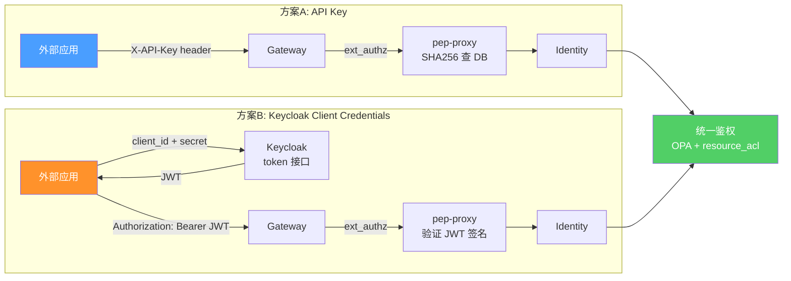
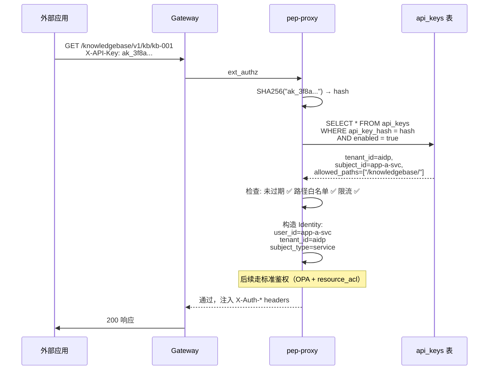
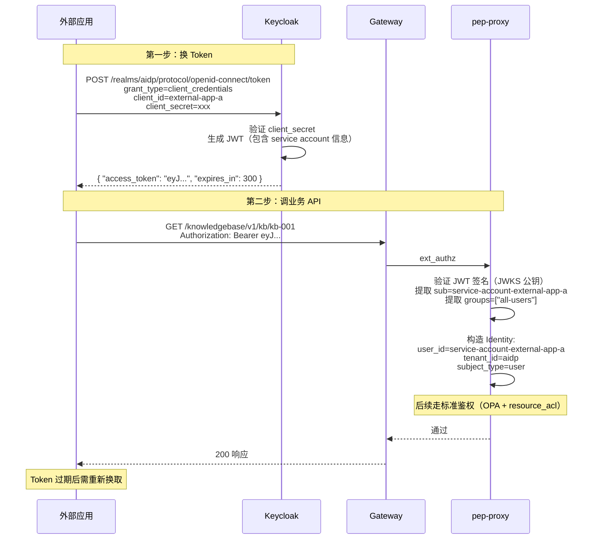

# 外部应用认证方案 — API Key vs Keycloak Client Credentials

> 版本：v1.0 | 日期：2026-04-09

---

## 1 背景

AIDP 平台的知识库、记忆库等服务需要以 URL/API 形式提供给外部应用调用。外部应用是程序（非浏览器用户），没有登录页面，需要一种 M2M（Machine-to-Machine）认证方式。

本文对比两种方案，并说明选型依据。

---

## 2 两种方案概览



**核心区别：API Key 不经过 Keycloak，Client Credentials 经过 Keycloak。鉴权层完全一样。**

---

## 3 方案 A：API Key（推荐）

### 3.1 原理

API Key 是一个预共享密钥。keycloak-proxy 生成随机字符串，SHA256 哈希后存入 PostgreSQL。外部应用请求时带上 Key，pep-proxy 哈希后查表验证身份。

```
签发：keycloak-proxy 生成 → 哈希存 DB → 明文返回一次
验证：pep-proxy 收到 Key → SHA256 → 查 api_keys 表 → 取出 Identity
```

### 3.2 认证流程



### 3.3 Key 的生成与存储

```python
import secrets, hashlib

# 生成：密码学安全随机数，256 bit 熵
raw_key = "ak_" + secrets.token_hex(32)
# 结果：ak_3f8a9b2c4d5e6f7a8b9c0d1e2f3a4b5c6d7e8f9a0b1c2d3e4f5a6b7c8d9e0f

# 哈希：SHA256 单向哈希，不可逆
key_hash = hashlib.sha256(raw_key.encode()).hexdigest()

# 存储：只存哈希，不存明文
db.execute("INSERT INTO api_keys (api_key_hash, ...) VALUES (%s, ...)", key_hash)

# 返回：明文只给用户这一次
return {"api_key": raw_key}
```

**为什么用 SHA256 而不是 bcrypt？**

| | bcrypt | SHA256 |
|---|---|---|
| 速度 | 故意慢（~100ms） | 快（微秒级） |
| 用途 | 保护低熵密码（用户可能设 123456） | 保护高熵密钥 |
| API Key 场景 | 256 bit 随机，暴力破解不可能 | 足够安全，且不增加鉴权延迟 |

### 3.4 验证过程

```python
def authenticate_api_key(api_key, request_path):
    # 1. 哈希
    key_hash = hashlib.sha256(api_key.encode()).hexdigest()

    # 2. 查表
    record = db.query(
        "SELECT * FROM api_keys WHERE api_key_hash = %s AND enabled = true",
        key_hash
    )
    if not record:
        raise Unauthorized("Invalid API Key")  # 401

    # 3. 检查过期
    if record.expires_at and record.expires_at < now():
        raise Unauthorized("API Key expired")  # 401

    # 4. 检查路径白名单
    if record.allowed_paths:
        if not any(request_path.startswith(p) for p in record.allowed_paths):
            raise Forbidden("Path not allowed")  # 403

    # 5. 检查限流
    check_rate_limit(record.id, record.rate_limit)  # 超限 → 429

    # 6. 返回 Identity（和 JWT 解出来的结构一样）
    return Identity(
        user_id=record.subject_id,       # "external-app-a-svc"
        tenant_id=record.tenant_id,      # "aidp"
        subject_type="service",
        groups=[]
    )
```

### 3.5 数据模型

```sql
CREATE TABLE api_keys (
    id              VARCHAR(64)  PRIMARY KEY,
    api_key_hash    VARCHAR(256) NOT NULL UNIQUE,  -- SHA256 哈希，不存明文
    key_prefix      VARCHAR(16)  NOT NULL,          -- "ak_3f8a..." 用于日志显示
    tenant_id       VARCHAR(128) NOT NULL,          -- 绑定租户（鉴权需要）
    app_name        VARCHAR(128) NOT NULL,          -- 调用方标识
    description     VARCHAR(512),
    subject_id      VARCHAR(128) NOT NULL,          -- 服务账号 ID（等效于 user_id）
    subject_type    VARCHAR(32)  NOT NULL DEFAULT 'service',
    allowed_paths   TEXT[],                         -- 路径白名单
    rate_limit      INTEGER      DEFAULT 100,       -- 每分钟上限
    expires_at      TIMESTAMP,                      -- 过期时间
    enabled         BOOLEAN      NOT NULL DEFAULT true,
    created_by      VARCHAR(128) NOT NULL,
    created_at      TIMESTAMP    NOT NULL DEFAULT NOW(),
    updated_at      TIMESTAMP    NOT NULL DEFAULT NOW(),
    last_used_at    TIMESTAMP                       -- 审计用
);
```

### 3.6 管理接口

```
POST   /api/v1/{tenant}/api-keys              创建（返回明文，仅一次）
GET    /api/v1/{tenant}/api-keys              列出（只显示前缀）
GET    /api/v1/{tenant}/api-keys/{id}         查看详情
PUT    /api/v1/{tenant}/api-keys/{id}         更新（启停、改配置）
DELETE /api/v1/{tenant}/api-keys/{id}         删除/吊销（立即生效）
POST   /api/v1/{tenant}/api-keys/{id}/rotate  轮换（新 Key，旧 Key 失效，subject_id 不变）
```

### 3.7 轮换原理

```
轮换前：
  api_keys 表：id=key-001, hash=旧哈希, subject_id=app-a-svc
  resource_acl：kb-001, service, app-a-svc, contributor

轮换操作：
  生成新 Key → 新哈希 → UPDATE api_keys SET api_key_hash=新哈希 WHERE id=key-001
  （subject_id 不变）

轮换后：
  api_keys 表：id=key-001, hash=新哈希, subject_id=app-a-svc  ← hash 变了
  resource_acl：kb-001, service, app-a-svc, contributor         ← 没变

旧 Key → 401（查不到）
新 Key → 认证通过（subject_id=app-a-svc → 鉴权通过）
```

**api_keys 和 resource_acl 通过 subject_id 关联，换 Key 不换 subject_id，授权不受影响。**

### 3.8 安全措施

| 措施 | 说明 |
|------|------|
| 不存明文 | 数据库只存 SHA256 哈希，被拖库也无法还原 Key |
| 只返回一次 | 创建和轮换时返回明文，之后无法查看 |
| HTTPS 传输 | Key 在 Header 中明文传输，依赖 HTTPS 加密 |
| 过期时间 | expires_at 到期自动失效 |
| 禁用开关 | enabled 字段，紧急情况一键禁用 |
| 路径白名单 | allowed_paths 限制可访问路径范围 |
| 限流 | rate_limit 防止滥用 |
| 审计 | last_used_at 追踪使用，created_by 追溯创建者 |

---

## 4 方案 B：Keycloak Client Credentials

### 4.1 原理

利用 Keycloak 的 OAuth2 Client Credentials Grant。在 Keycloak 中创建一个 confidential client 并开启 Service Account，外部应用用 client_id + client_secret 向 Keycloak 换取 JWT，再用 JWT 调用业务 API。

```
签发：外部应用 → Keycloak token 接口 → JWT
验证：pep-proxy 验证 JWT 签名（和普通用户 JWT 一样）
```

### 4.2 配置步骤

**Keycloak 侧：**

1. 创建 Client：
   - Client ID: `external-app-a`
   - Client Type: `confidential`（有 client_secret）
   - 开启 `Service Accounts Enabled`
   - 配置 Scope（限制 JWT 中包含的信息）

2. Keycloak 自动创建一个 Service Account 用户：`service-account-external-app-a`

3. 将该 Service Account 加入对应的组（如 `all-users`）

**外部应用侧：**

```bash
# 第一步：用 client_id + client_secret 换 JWT
TOKEN=$(curl -s -X POST \
  https://gateway.aidp.com/realms/aidp/protocol/openid-connect/token \
  -d "grant_type=client_credentials" \
  -d "client_id=external-app-a" \
  -d "client_secret=your-client-secret-here" \
  | jq -r '.access_token')

# 第二步：用 JWT 调业务 API
curl https://gateway.aidp.com/knowledgebase/v1/kb/kb-001 \
  -H "Authorization: Bearer $TOKEN"
```

### 4.3 认证流程



### 4.4 JWT 中的信息

```json
{
  "sub": "service-account-external-app-a",
  "iss": "https://gateway.aidp.com/realms/aidp",
  "groups": ["all-users"],
  "azp": "external-app-a",
  "exp": 1712700000,
  "iat": 1712699700
}
```

### 4.5 pep-proxy 无需改动

Client Credentials 签发的 JWT 和用户登录的 JWT 格式一样，pep-proxy 现有的 JWT 验证逻辑完全兼容，不需要加新的认证分支。

### 4.6 资源授权

Service Account 在 Keycloak 中是一个真实用户，resource_acl 中直接用它的 user_id：

```sql
-- 给 Service Account 授权资源
INSERT INTO resource_acl (tenant_id, app_name, resource_type, resource_id, 
                          subject_type, subject_id, permission)
VALUES ('aidp', 'knowledgebase', 'kb', 'kb-001', 
        'user', 'service-account-external-app-a', 'contributor');
```

### 4.7 安全措施

| 措施 | 说明 |
|------|------|
| JWT 签名验证 | RS256，pep-proxy 用 JWKS 公钥验证，无法伪造 |
| Token 短期过期 | 默认 5 分钟，过期需重新换取 |
| client_secret 管理 | 在 Keycloak 中管理，支持轮换 |
| Scope 限制 | 可限制 JWT 中包含的信息范围 |
| Keycloak 审计 | 所有 token 签发有审计日志 |

---

## 5 两种方案对比

| 维度 | 方案 A：API Key | 方案 B：Client Credentials |
|------|----------------|--------------------------|
| **认证方式** | 一个 Header（X-API-Key） | 先换 Token，再带 Token |
| **外部应用接入成本** | 加个 Header | 实现 OAuth2 客户端（token 获取 + 过期刷新） |
| **依赖 Keycloak** | 不依赖 | 依赖（换 Token 时） |
| **Keycloak 宕机影响** | 无影响 | 新 Token 拿不到，已有 Token 未过期的不受影响 |
| **pep-proxy 改动** | 新增 API Key 认证分支 | 无需改动（JWT 验证已有） |
| **新增数据表** | api_keys 表 | 无（Keycloak 内部管理） |
| **安全性** | 依赖 HTTPS + 哈希存储 | JWT 签名 + 短期过期 |
| **路径白名单** | 有（allowed_paths） | 无（需额外实现） |
| **限流** | 有（rate_limit） | 无（需额外实现） |
| **审计** | last_used_at | Keycloak 审计日志 |
| **轮换** | rotate 接口，不影响授权 | Keycloak regenerate secret |
| **标准化** | 自定义方案 | OAuth2 标准 |
| **适合场景** | 简单 M2M、内网环境 | 需要 OAuth2 合规的场景 |

---

## 6 Identity 统一模型

两种方案最终都产出同一个 Identity 结构，后续鉴权完全复用：

```
                    ┌─ Authorization: Bearer JWT ─┐
                    │   → 验签                     │
                    │   → user_id = "zhangsan"     │
                    │   → groups = ["all-users"]    │
                    │   → subject_type = "user"     │
                    │                               │
请求 → Gateway → pep-proxy                    Identity ──► OPA 路径鉴权
                    │                               │         ──► resource_acl 资源鉴权
                    ├─ X-API-Key: ak_3f8a... ──────┤
                    │   → SHA256 查 DB              │
                    │   → user_id = "app-a-svc"     │
                    │   → groups = []               │
                    │   → subject_type = "service"  │
                    │                               │
                    └─ Client Credentials JWT ──────┘
                        → 验签（和普通 JWT 一样）
                        → user_id = "service-account-external-app-a"
                        → groups = ["all-users"]
                        → subject_type = "user"
```

### Identity 结构

```python
class Identity:
    user_id: str        # 真人 ID / 服务账号 ID / Service Account ID
    tenant_id: str      # 租户 ID（用于 resource_acl 隔离）
    groups: list[str]   # JWT 有组信息，API Key 为空
    subject_type: str   # "user" 或 "service"
```

### 为什么需要 tenant_id

resource_acl 查询必须带 tenant_id 做租户隔离：

```sql
SELECT permission FROM resource_acl
WHERE tenant_id = 'aidp'                    -- 哪个租户
  AND resource_id = 'kb-001'                -- 哪个资源
  AND subject_id = 'external-app-a-svc'     -- 谁在访问
```

| 认证方式 | tenant_id 来源 |
|---------|---------------|
| JWT（用户） | JWT payload 中的 tenant / realm 字段 |
| API Key | api_keys 表的 tenant_id 字段（创建时绑定） |
| Client Credentials JWT | JWT payload 中的 tenant / realm 字段 |

### 为什么 API Key 的 subject_id 不叫 user_id

概念区分：

```
api_keys 表中叫 subject_id：
  → 强调这是一个"服务账号"，不是真人
  → 和 resource_acl 的 subject_id 字段对应

注入给后端的 Header 叫 X-Auth-User-Id：
  → 统一接口，后端不区分是人还是服务
  → 后端只需要读这一个 Header 做数据归属
```

```
api_keys.subject_id = "app-a-svc"
    ↓ pep-proxy 注入
X-Auth-User-Id: app-a-svc
    ↓ 后端读取
created_by = request.headers["X-Auth-User-Id"]  // "app-a-svc"
```

---

## 7 OPA 鉴权对服务账号的处理

### API Key 方案（groups 为空）

服务账号的 groups 是 `[]`，OPA 现有规则都不匹配：

```
master-admins 放行？  → groups 里没有 → 不匹配
tenant-admins 放行？  → groups 里没有 → 不匹配
path_rules 匹配？     → groups 为空  → 不匹配
all-users 放行？       → groups 里没有 → 不匹配
→ 结果：403
```

**解决：pep-proxy 对 subject_type=service 跳过 OPA 路径鉴权。** API Key 自身的 allowed_paths 已经起到了路径控制的作用。

```python
def authorize(identity, request):
    if identity.subject_type == "service":
        # 服务账号：跳过 OPA，allowed_paths 已在认证阶段检查
        pass
    else:
        # 普通用户：走 OPA
        opa_result = opa.query(path=request.path, groups=identity.groups)
        if not opa_result.allow:
            raise Forbidden()

    # 资源级鉴权：两者都走（统一）
    resource_id = extract_resource_id(request.path)
    if resource_id:
        check_resource_permission(identity, resource_id, request.method)
```

### Client Credentials 方案（有 groups）

Service Account 在 Keycloak 中是真实用户，可以加入 all-users 组，OPA 正常匹配，不需要特殊处理。

---

## 8 选型建议

### 推荐方案 A：API Key

适用于 AIDP 当前阶段：

- 私有化部署、内网环境
- 外部应用接入成本最低（加个 Header）
- 不依赖 Keycloak 在线
- 自带路径白名单和限流

### 未来可扩展方案 B：Client Credentials

如果客户有以下需求，可以加上 Client Credentials 支持：

- 需要 OAuth2 标准合规
- 需要 JWT 短期过期的安全模型
- 外部应用已有 OAuth2 客户端能力

**两种方案不冲突。** pep-proxy 认证层支持三种方式并存：

```
请求进来 →
  有 Authorization: Bearer      → JWT 认证（用户登录 或 Client Credentials）
  有 X-API-Key                  → API Key 认证
  都没有                         → 401
```
