# 故障场景视角 — 什么会出错、怎么兜底

> 版本：v1.0 | 日期：2026-04-02

---

## 1 故障影响全景

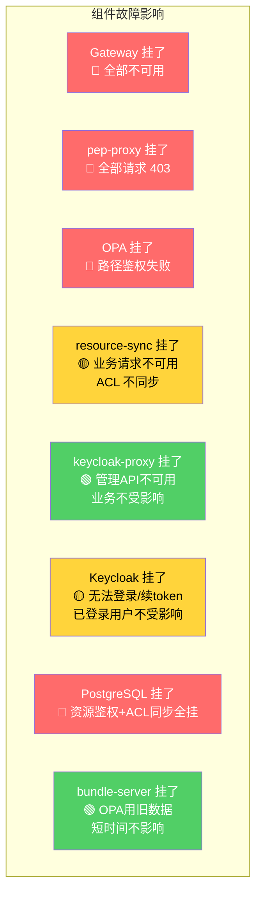

| 影响等级 | 含义 |
|---------|------|
| 🔴 严重 | 业务完全不可用 |
| 🟡 中等 | 部分功能受影响，有降级方案 |
| 🟢 轻微 | 业务不受影响，只影响管理操作 |

---

## 2 逐个场景分析

### 2.1 🔴 resource-sync 写 ACL 失败（最可能发生）

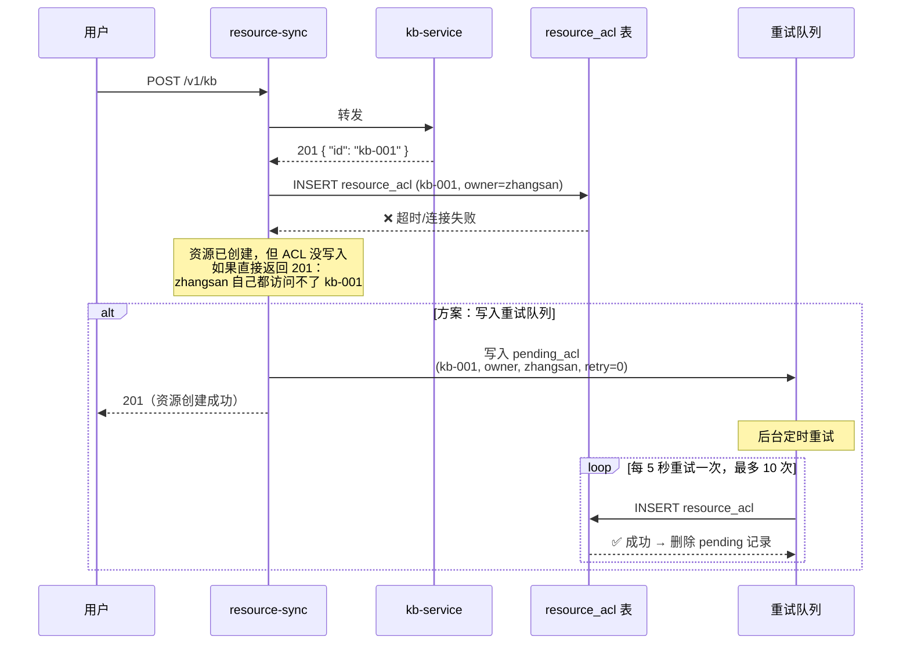

**重试队列表：**

```sql
CREATE TABLE pending_acl (
    id           SERIAL PRIMARY KEY,
    tenant_id    VARCHAR(128) NOT NULL,
    app_name     VARCHAR(128) NOT NULL,
    resource_type VARCHAR(128) NOT NULL,
    resource_id  VARCHAR(256) NOT NULL,
    subject_type VARCHAR(32) NOT NULL,
    subject_id   VARCHAR(128) NOT NULL,
    permission   VARCHAR(32) NOT NULL,
    action       VARCHAR(16) NOT NULL,     -- 'create' | 'delete'
    retry_count  INTEGER NOT NULL DEFAULT 0,
    created_at   TIMESTAMP NOT NULL DEFAULT NOW(),
    next_retry   TIMESTAMP NOT NULL DEFAULT NOW()
);
```

**兜底策略：** 如果重试队列也写不进去（极端情况），pep-proxy 鉴权时发现 resource_acl 里没记录，回退检查：

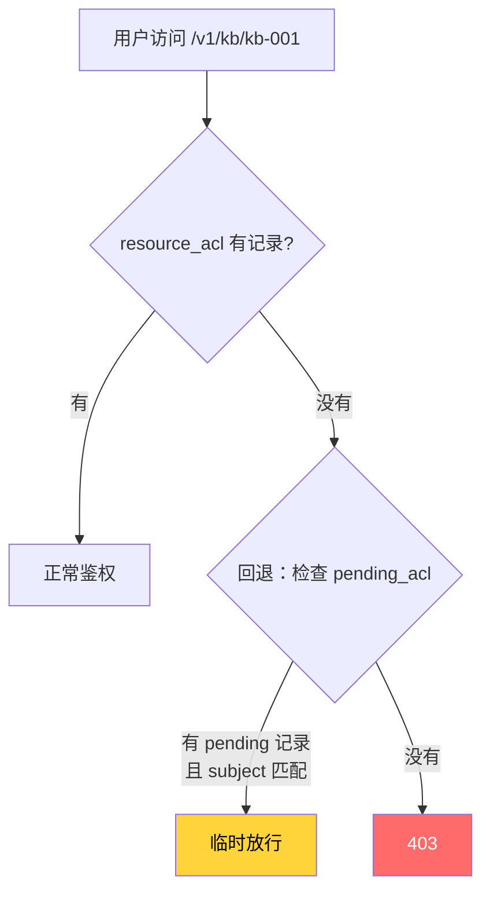

---

### 2.2 🔴 resource-sync 整个挂了

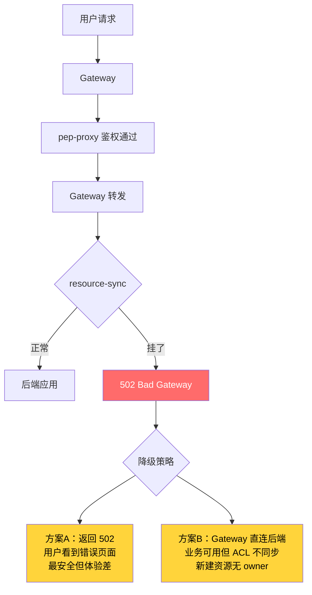

**建议：**

```yaml
# resource-sync 部署配置
apiVersion: apps/v1
kind: Deployment
metadata:
  name: resource-sync
spec:
  replicas: 2                        # 至少 2 副本
  template:
    spec:
      containers:
        - name: resource-sync
          livenessProbe:              # 挂了自动重启
            httpGet:
              path: /health
              port: 8080
            periodSeconds: 10
          readinessProbe:             # 没准备好不给流量
            httpGet:
              path: /health/ready
              port: 8080
            periodSeconds: 5
```

---

### 2.3 🔴 PostgreSQL 挂了

影响范围最广——pep-proxy 查不了 resource_acl，resource-sync 写不了 ACL。

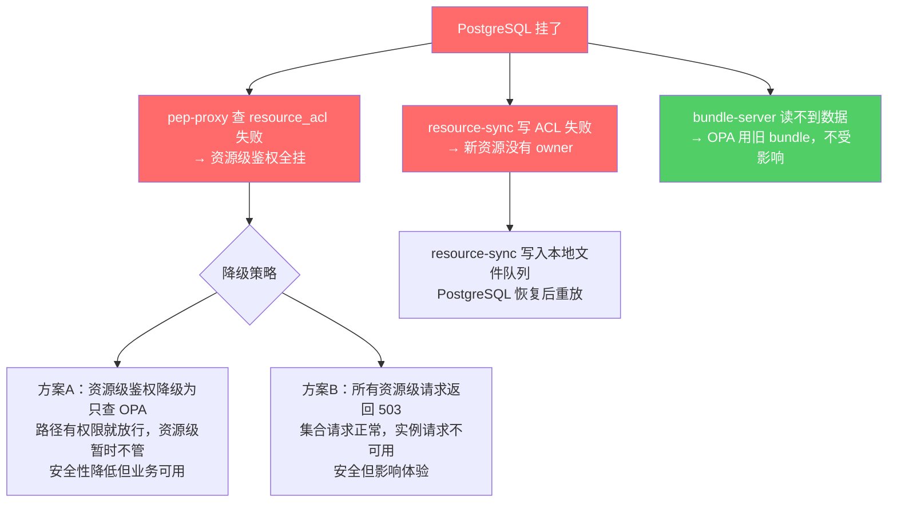

**pep-proxy 降级逻辑：**

```python
async def check_resource_permission(user_id, groups, resource_id):
    try:
        acl = await db.query(
            "SELECT permission FROM resource_acl WHERE resource_id=%s AND ...",
            resource_id, user_id
        )
        return acl.permission if acl else None
    except DatabaseConnectionError:
        # 数据库不可用 → 降级
        logger.warning(f"resource_acl 查询失败，降级放行: {resource_id}")
        return "degraded"  # 标记为降级模式
        # 降级模式下放行，后端正常处理
```

---

### 2.4 🟡 Keycloak 挂了

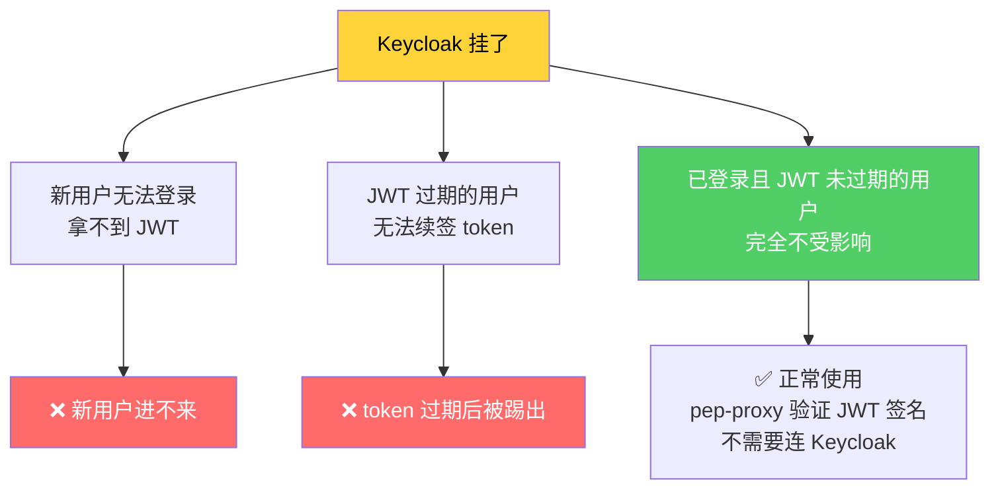

**缓解措施：**
- Keycloak `replicas: 2`（你们已经配了）
- JWT 过期时间设长一些（如 30 分钟），给 Keycloak 恢复的时间窗口
- pep-proxy 缓存 JWKS 公钥，Keycloak 挂了也能验证 JWT 签名

---

### 2.5 🟡 后端应用返回成功但实际失败

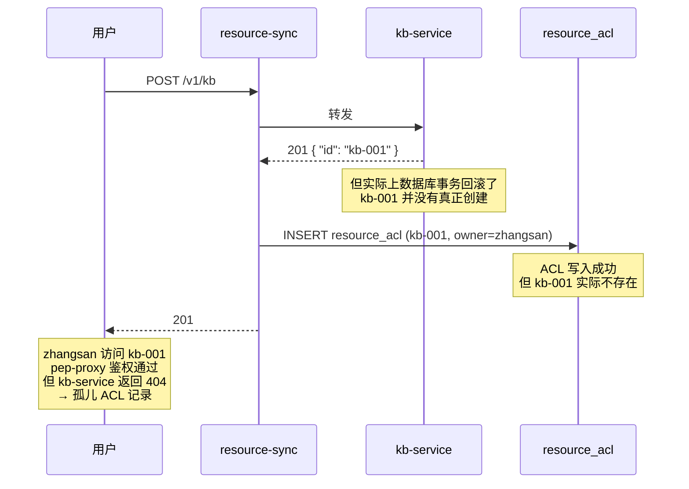

**解决：定期对账**

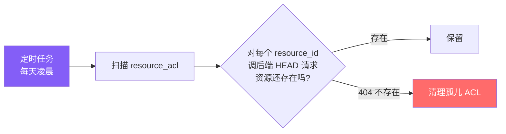

```python
# 对账脚本
async def reconcile():
    acl_resources = db.query(
        "SELECT DISTINCT app_name, resource_type, resource_id FROM resource_acl"
    )
    for r in acl_resources:
        resp = await http.head(f"http://{r.app_name}-service/v1/{r.resource_type}/{r.resource_id}")
        if resp.status_code == 404:
            db.execute(
                "DELETE FROM resource_acl WHERE app_name=%s AND resource_id=%s",
                r.app_name, r.resource_id
            )
            logger.info(f"清理孤儿 ACL: {r.app_name}/{r.resource_id}")
```

---

### 2.6 🟡 并发创建和删除同一资源

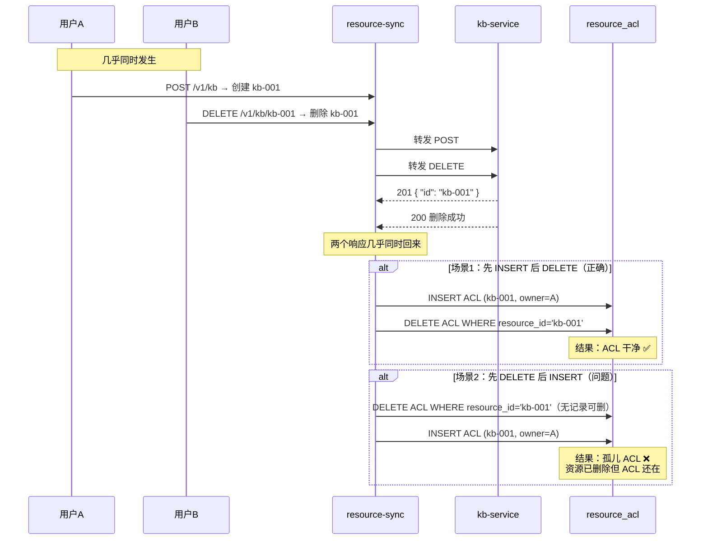

**解决：** 同一个 resource_id 的操作加锁，或者靠定期对账清理。实际发生概率极低。

---

### 2.7 🟢 bundle-server 挂了

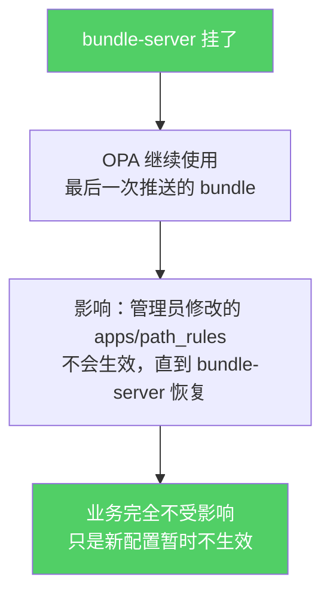

**不需要特殊处理。** bundle-server 恢复后自动推送最新数据。

---

### 2.8 🟢 OPA 挂了

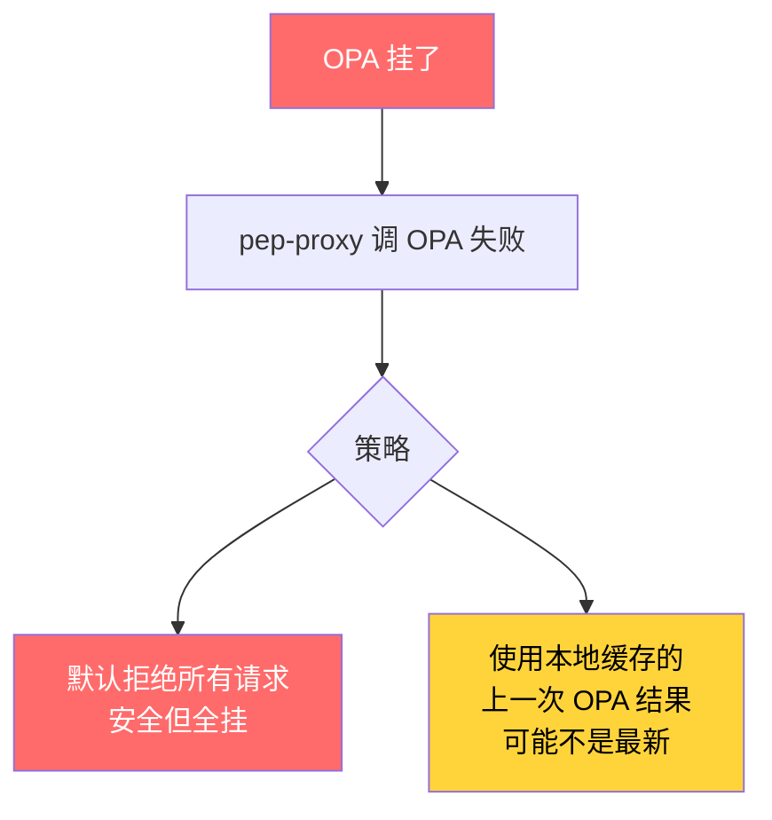

**建议：** OPA `replicas: 2`，加 readinessProbe。OPA 是纯内存服务，启动快，恢复快。

---

### 2.9 🟡 resource-sync 内部接口不可用

后端调 `http://resource-sync:8081/internal/v1/resources` 失败时，list/search 接口受影响。

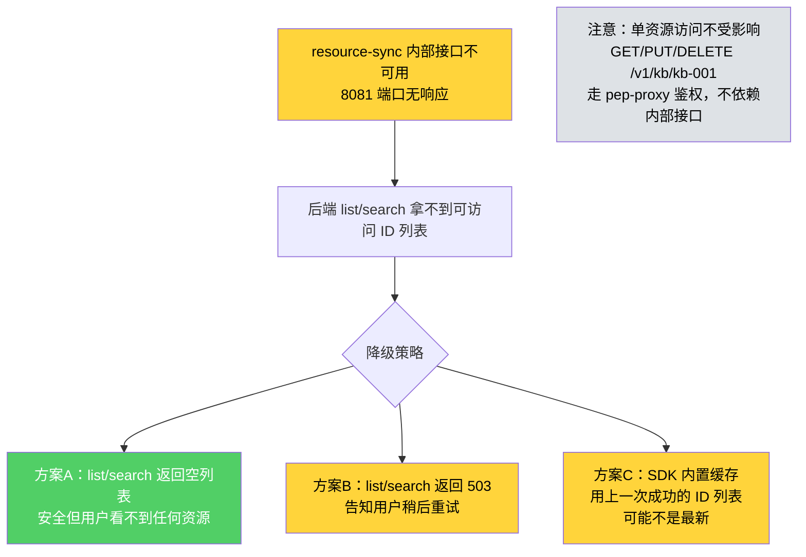

**SDK 降级逻辑：**

```python
# aidp_acl/client.py
import httpx
from functools import lru_cache

@lru_cache(maxsize=1000)
def _cached_resources(tenant_id, app_name, resource_type, user_id, groups):
    """缓存上一次成功的结果，TTL 由外部控制"""
    return None

def get_allowed_resources(request, app_name, resource_type):
    try:
        resp = httpx.get(f"{RESOURCE_SYNC_URL}/internal/v1/resources", params={...}, timeout=3)
        result = resp.json()["resource_ids"]
        # 缓存成功结果
        _cached_resources.cache_clear()
        return result
    except (httpx.ConnectError, httpx.TimeoutException):
        # 降级：返回空列表（安全优先）
        logger.warning("resource-sync 内部接口不可用，降级返回空列表")
        return []
```

---

## 3 故障总览

| 故障 | 影响 | 降级方案 | 预防措施 |
|------|------|---------|---------|
| resource-sync 写 ACL 失败 | 新资源无人能访问 | pending_acl 重试队列 + pep-proxy 回退查 pending | 数据库连接池 + 超时配置 |
| resource-sync 挂了 | 业务请求 502 | 多副本 + 健康检查自动重启 | `replicas: 2` |
| resource-sync 内部接口不可用 | list/search 拿不到 ID 列表 | SDK 降级返回空列表，单资源访问不受影响 | `replicas: 2` + SDK 超时 3s |
| PostgreSQL 挂了 | 资源鉴权全挂 | pep-proxy 降级为只查 OPA，resource-sync 写本地队列 | 数据库主备 |
| Keycloak 挂了 | 新用户无法登录 | 已登录用户不受影响（JWT 未过期） | `replicas: 2` + 缓存 JWKS |
| 后端返回成功但实际失败 | 孤儿 ACL 记录 | 定期对账清理 | 对账脚本（每天凌晨） |
| 并发竞争 | 孤儿 ACL 记录 | 定期对账清理 | 极小概率，对账兜底即可 |
| bundle-server 挂了 | 新配置不生效 | OPA 用旧数据，业务不受影响 | 恢复后自动推送 |
| OPA 挂了 | 路径鉴权全挂 | 默认拒绝 或 pep-proxy 缓存 | `replicas: 2` |

---

## 4 推荐的副本数配置

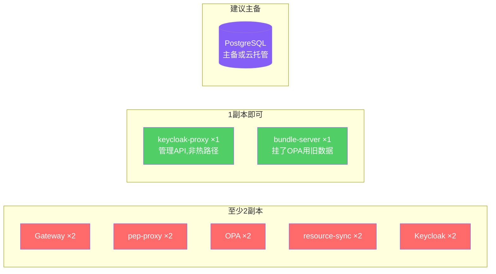
