# 故障场景视角 — 什么会出错、怎么兜底

> 版本：v2.0 | 日期：2026-04-07

**架构要点：resource-sync 不是反向代理，而是通过 ext_proc 被调用。Gateway 直接路由到后端服务。ext_proc 配置 `failureMode: failOpen`，resource-sync 宕机不影响业务请求。**

**安全要点：Gateway 必须在 ext_authz/ext_proc 处理之前，剥离客户端请求中的 `X-Auth-*` 和 `X-Allowed-Ids` 头，防止客户端伪造内部头信息。**

---

## 1 故障影响全景

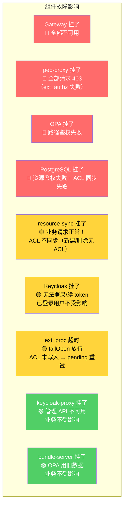

| 影响等级 | 含义 |
|---------|------|
| 🔴 严重 | 业务完全不可用 |
| 🟡 中等 | 部分功能受影响，有降级/兜底方案 |
| 🟢 轻微 | 业务不受影响，只影响管理操作 |

### 新旧架构对比（关键改进）

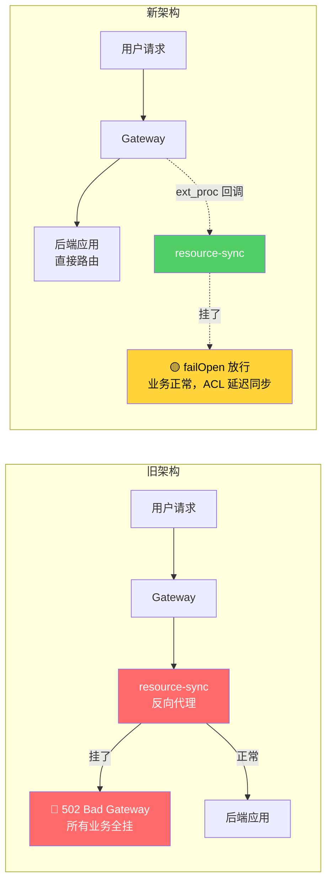

> **核心改进：** 旧架构中 resource-sync 宕机 = 全部业务 502。新架构中 resource-sync 宕机 = 业务正常运行，仅 ACL 同步延迟。

---

## 2 逐个场景分析

### 2.1 🟡 ext_proc (resource-sync) 写 ACL 失败（最可能发生）

用户创建资源，后端返回 201，ext_proc 调用 resource-sync 写 ACL 时数据库写入失败。

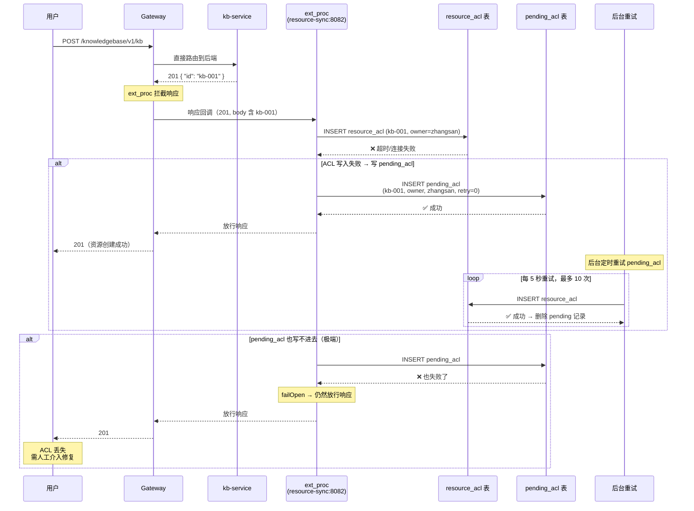

**影响：** 用户创建了资源但暂时无法访问，直到 pending 重试成功。极端情况下 pending_acl 也写不进去，需人工介入。

**pending_acl 表：**

```sql
CREATE TABLE pending_acl (
    id              SERIAL PRIMARY KEY,
    tenant_id       VARCHAR(128) NOT NULL,
    app_name        VARCHAR(128) NOT NULL,
    resource_type   VARCHAR(128) NOT NULL,
    resource_id     VARCHAR(256) NOT NULL,
    subject_type    VARCHAR(32) NOT NULL,
    subject_id      VARCHAR(128) NOT NULL,
    permission      VARCHAR(32) NOT NULL,
    action          VARCHAR(16) NOT NULL CHECK (action IN ('create', 'delete')),
    retry_count     INTEGER NOT NULL DEFAULT 0,
    max_retries     INTEGER NOT NULL DEFAULT 10,
    last_error      TEXT,
    created_at      TIMESTAMP NOT NULL DEFAULT NOW(),
    next_retry      TIMESTAMP NOT NULL DEFAULT NOW()
);
CREATE INDEX idx_pending_retry ON pending_acl (next_retry) WHERE retry_count < max_retries;
```

---

### 2.2 🟡 resource-sync 整个挂了

**新架构下这不再是严重故障。** Gateway 直接路由到后端，resource-sync 通过 ext_proc 调用，配置了 `failureMode: failOpen`。

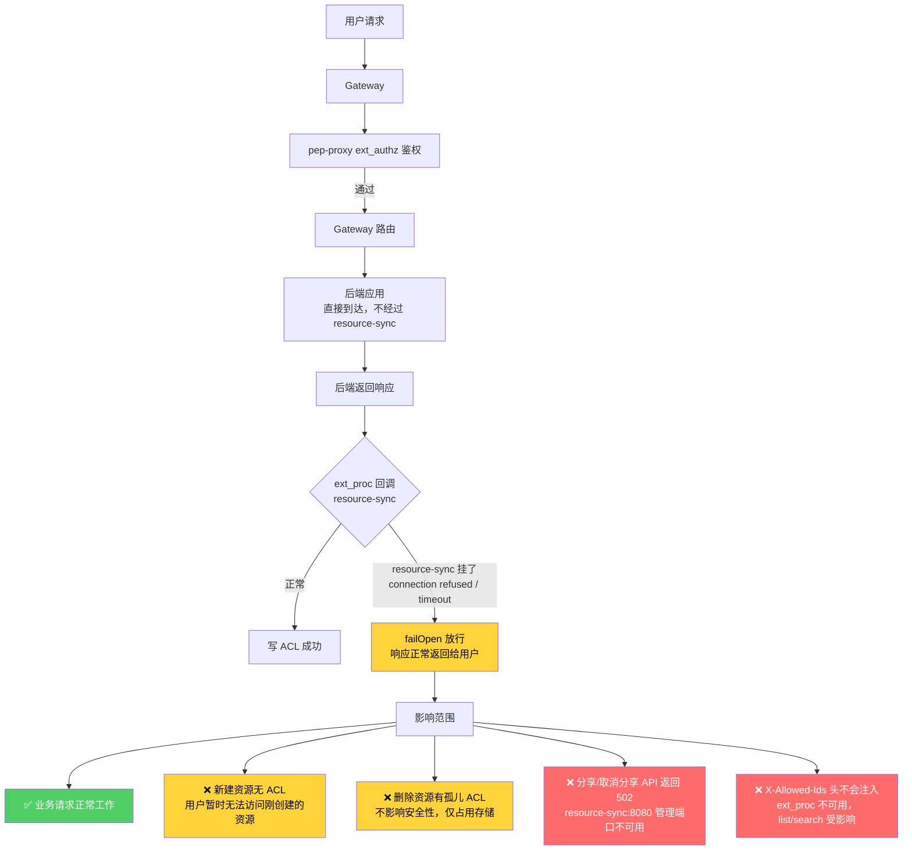

**关键区别：**

| 对比项 | 旧架构 | 新架构 |
|-------|--------|--------|
| resource-sync 宕机时 | 🔴 所有业务 502 | 🟡 业务正常，ACL 延迟 |
| 请求链路 | 请求必须经过 resource-sync | Gateway 直连后端 |
| 故障模式 | 串联故障，一挂全挂 | failOpen，优雅降级 |

**恢复后：** resource-sync 恢复后，pending_acl 后台重试自动修复。

**部署建议：**

```yaml
# resource-sync 部署配置
apiVersion: apps/v1
kind: Deployment
metadata:
  name: resource-sync
spec:
  replicas: 2                        # 至少 2 副本
  template:
    spec:
      containers:
        - name: resource-sync
          ports:
            - containerPort: 8080     # 管理 API（分享/取消分享）
              name: management
            - containerPort: 8082     # ext_proc gRPC（响应回调 + 请求阶段注入 X-Allowed-Ids）
              name: extproc
          livenessProbe:
            httpGet:
              path: /health
              port: 8080
            periodSeconds: 10
          readinessProbe:
            httpGet:
              path: /health/ready
              port: 8080
            periodSeconds: 5
```

---

### 2.3 🔴 PostgreSQL 挂了

影响范围最广 -- pep-proxy 查不了 resource_acl，resource-sync 写不了 ACL，pending_acl 也写不了。

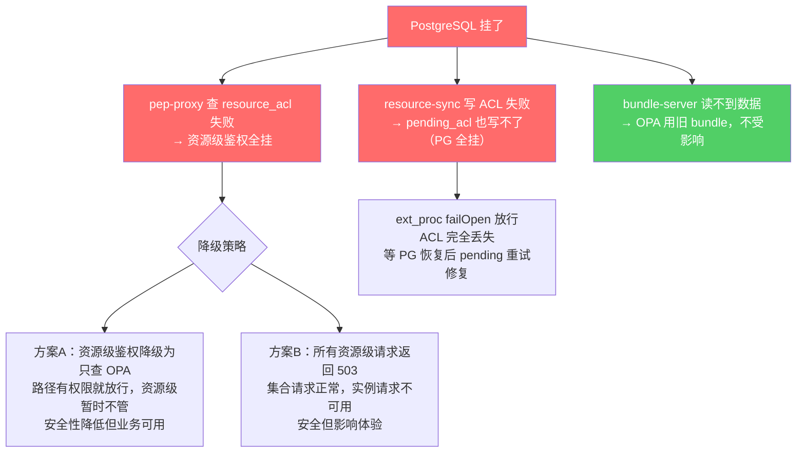

**pep-proxy 降级逻辑：**

```python
async def check_resource_permission(user_id, groups, resource_id):
    try:
        acl = await db.query(
            "SELECT permission FROM resource_acl WHERE resource_id=%s AND ...",
            resource_id, user_id
        )
        return acl.permission if acl else None
    except DatabaseConnectionError:
        # 数据库不可用 → 降级
        logger.warning(f"resource_acl 查询失败，降级放行: {resource_id}")
        return "degraded"  # 标记为降级模式
        # 降级模式下放行，后端正常处理
```

**缓解措施：** PostgreSQL 主备部署或使用云托管数据库，确保高可用。

---

### 2.4 🟡 Keycloak 挂了

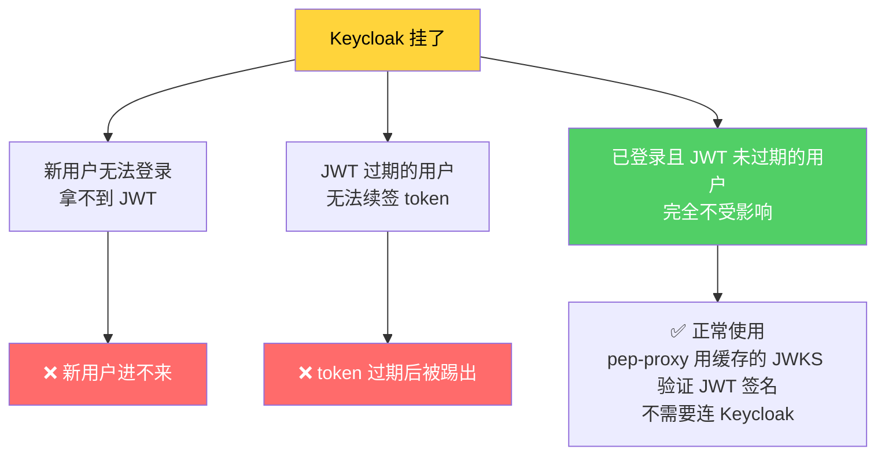

**缓解措施：**
- Keycloak `replicas: 2`
- JWT 过期时间设长一些（如 30 分钟），给 Keycloak 恢复的时间窗口
- pep-proxy 缓存 JWKS 公钥，Keycloak 挂了也能验证 JWT 签名

---

### 2.5 🟡 后端返回 201 但实际失败（幽灵资源）

后端返回 201 但数据库事务实际回滚了，资源并不存在。ext_proc 拿到 201 后照常写 ACL，产生孤儿 ACL 记录。

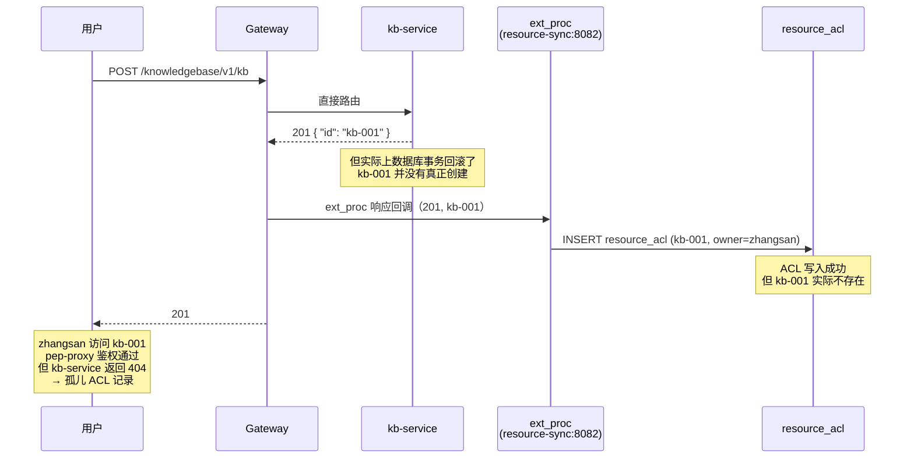

**说明：** 这是一个已知的极端边界情况，实际发生概率极低（后端返回 201 但事务回滚属于后端 bug）。孤儿 ACL 记录不影响安全性，仅占用少量存储空间。用户访问时后端会返回 404，不会造成数据泄露。

---

### 2.6 🟡 并发创建和删除同一资源

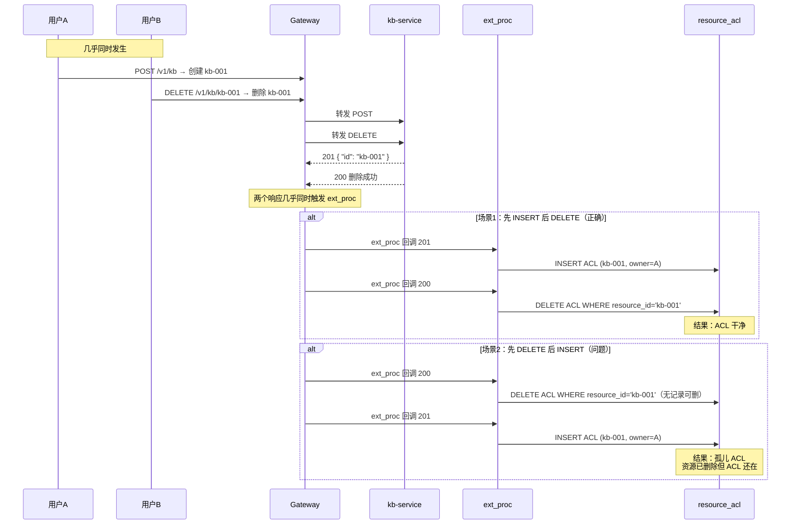

**解决：** 同一个 resource_id 的操作加锁。实际发生概率极低，孤儿 ACL 不影响安全性。

---

### 2.7 🟢 bundle-server 挂了

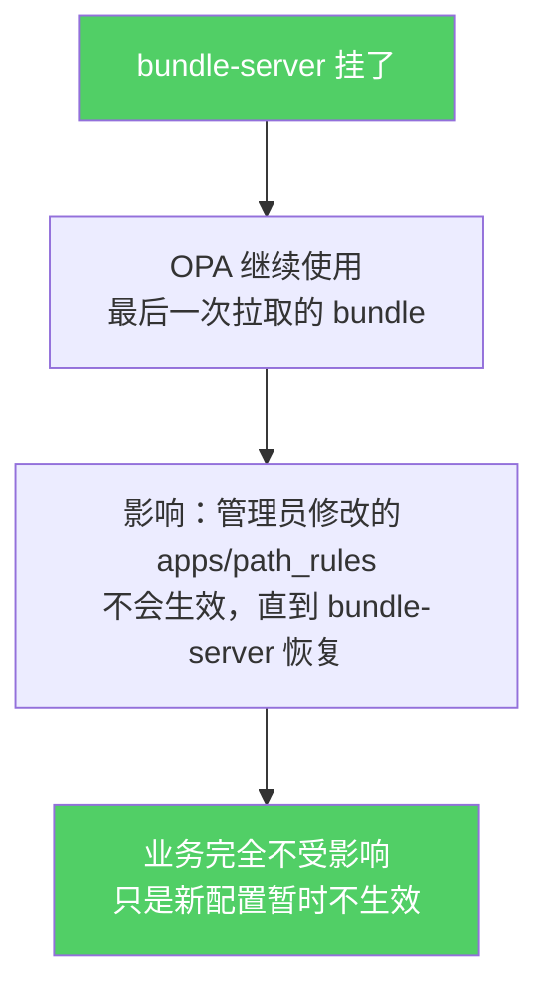

**不需要特殊处理。** bundle-server 恢复后自动推送最新数据。

---

### 2.8 🔴 OPA 挂了

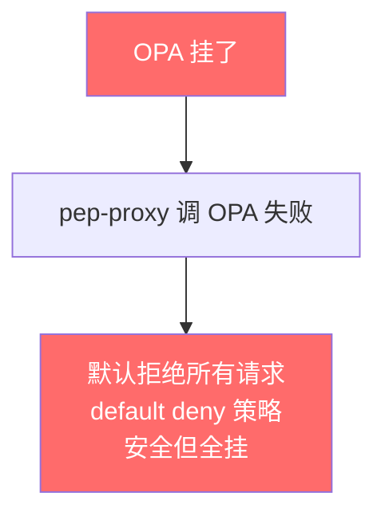

**建议：** OPA `replicas: 2`，加 readinessProbe。OPA 是纯内存服务，启动快，恢复快。

---

### 2.9 🟡 ext_proc 超时

ext_proc 有默认 200ms 超时（可配置）。超时后 failOpen 放行，ACL 未写入。

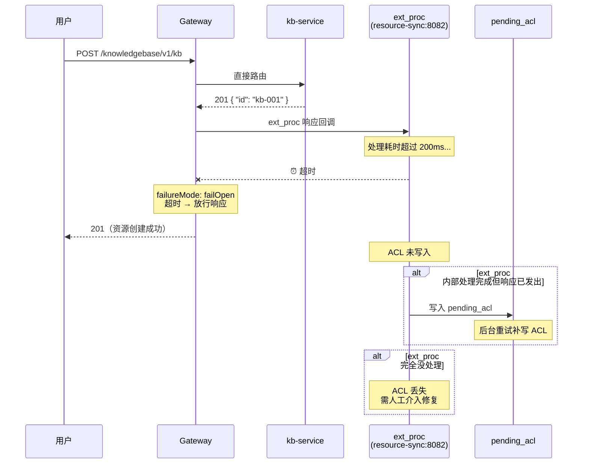

**影响：** 用户创建了资源但暂时无法访问，等待 pending 重试修复。

**缓解措施：**
- 调大 ext_proc 超时时间（如 500ms）以覆盖大多数正常场景
- resource-sync 优化写入性能，确保 P99 < 100ms

---

### 2.10 🟡 ext_proc 请求阶段不可用

ext_proc 在请求阶段负责为 list/search 请求注入 `X-Allowed-Ids` 头。当 ext_proc 不可用时，该头不会被注入，影响集合查询结果。

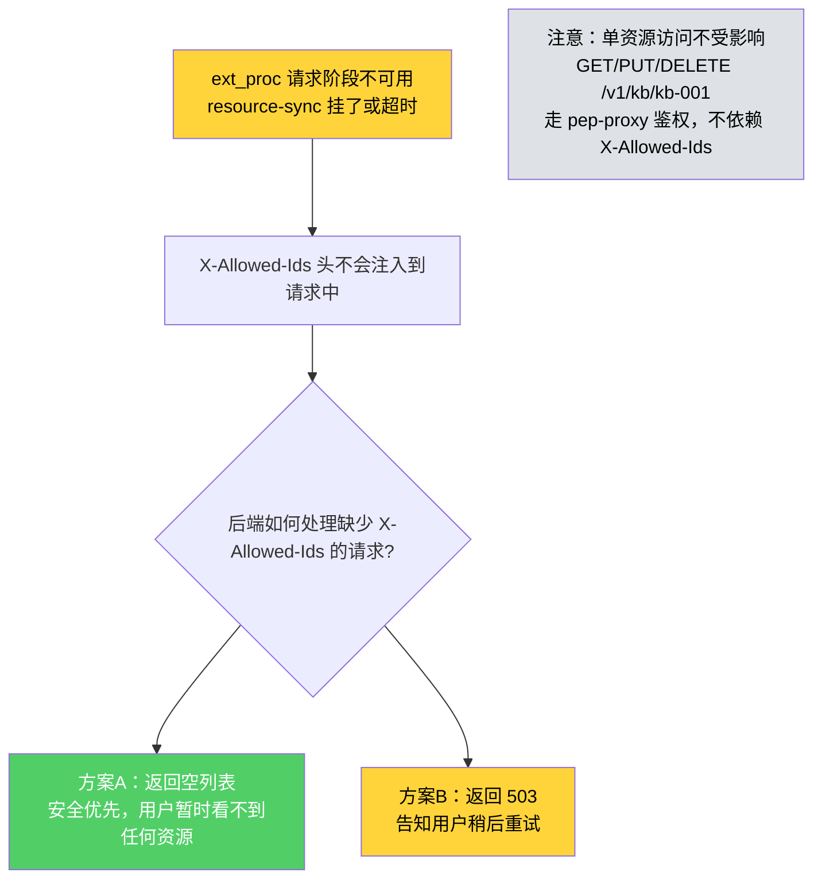

**后端处理逻辑：**

```python
# 后端 list/search handler
def list_resources(request):
    allowed_ids_header = request.headers.get("X-Allowed-Ids")
    if allowed_ids_header is None:
        # ext_proc 未注入 → failOpen 场景
        # 安全优先：返回空列表
        logger.warning("X-Allowed-Ids header missing, returning empty list")
        return []
    elif allowed_ids_header == "*":
        # 用户有 admin 权限，返回全部
        return db.query("SELECT * FROM resources WHERE ...")
    else:
        # 正常过滤
        ids = allowed_ids_header.split(",")
        return db.query("SELECT * FROM resources WHERE id IN %s", ids)
```

---

## 3 故障总览

| 故障 | 影响等级 | 影响描述 | 降级/兜底方案 | 预防措施 |
|------|---------|---------|-------------|---------|
| Gateway 挂了 | 🔴 | 全部不可用 | 无 | `replicas: 2` |
| pep-proxy 挂了 | 🔴 | 全部请求 403 | 无 | `replicas: 2` |
| OPA 挂了 | 🔴 | 路径鉴权全挂，default deny | 无 | `replicas: 2` |
| PostgreSQL 挂了 | 🔴 | 资源鉴权全挂 + ACL 同步全挂 | 降级为只查 OPA 放行，或资源级返回 503 | 主备部署 |
| resource-sync 挂了 | 🟡 | **业务正常！** ACL 不同步 | failOpen 放行，pending 重试 | `replicas: 2` |
| ext_proc 超时 | 🟡 | 响应正常返回，ACL 未写入 | pending 重试 | 调大超时，优化写入性能 |
| Keycloak 挂了 | 🟡 | 新用户无法登录 | 已登录用户不受影响（缓存 JWKS） | `replicas: 2` + 缓存 JWKS |
| ext_proc 请求阶段不可用 | 🟡 | X-Allowed-Ids 不注入，list/search 受影响 | 后端返回空列表或 503，单资源不受影响 | `replicas: 2` |
| 并发竞争 | 🟡 | 孤儿 ACL 记录 | 操作加锁，极小概率 | 同 resource_id 加锁 |
| keycloak-proxy 挂了 | 🟢 | 管理 API 不可用 | 业务不受影响 | 非热路径，1 副本即可 |
| bundle-server 挂了 | 🟢 | 新配置不生效 | OPA 用旧 bundle，业务不受影响 | 恢复后自动推送 |

---

## 4 ACL 一致性保障两道防线

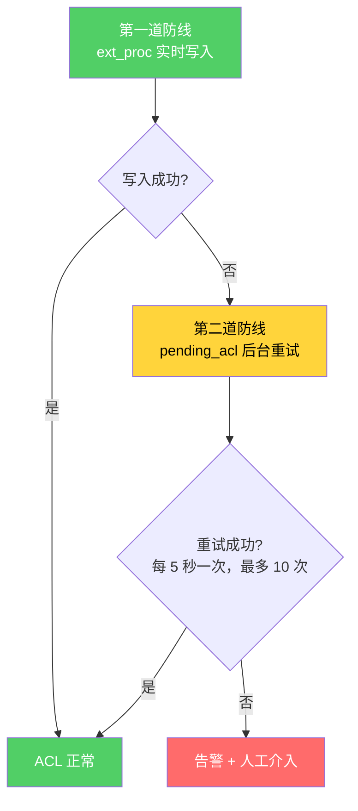

| 防线 | 触发条件 | 延迟 | 覆盖场景 |
|------|---------|------|---------|
| ext_proc 实时写入 | 每次创建/删除响应 | 毫秒级 | 99%+ 正常场景 |
| pending_acl 后台重试 | ACL 写入失败时 | 5~50 秒 | DB 短暂不可用、ext_proc 部分失败 |

---

## 5 推荐的副本数配置

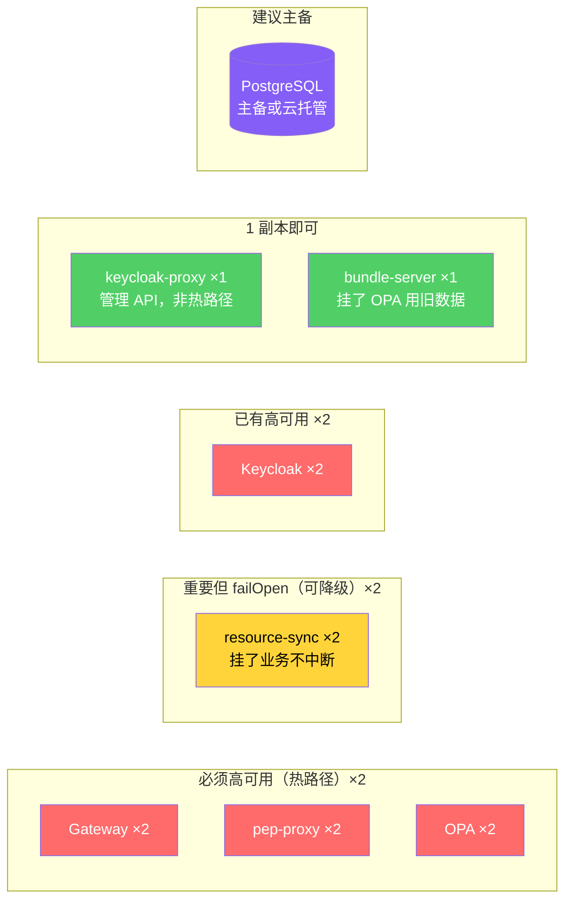

| 组件 | 副本数 | 原因 |
|------|-------|------|
| Gateway | ×2 | 热路径，挂了全部不可用 |
| pep-proxy | ×2 | 热路径，挂了全部 403 |
| OPA | ×2 | 热路径，挂了路径鉴权全挂 |
| resource-sync | ×2 | 重要但 failOpen，挂了业务不中断 |
| Keycloak | ×2 | 已配置，挂了新用户无法登录 |
| keycloak-proxy | ×1 | 管理 API，非热路径 |
| bundle-server | ×1 | 挂了 OPA 用旧数据，不影响业务 |
| PostgreSQL | 主备 | 影响范围最广，建议高可用部署 |
