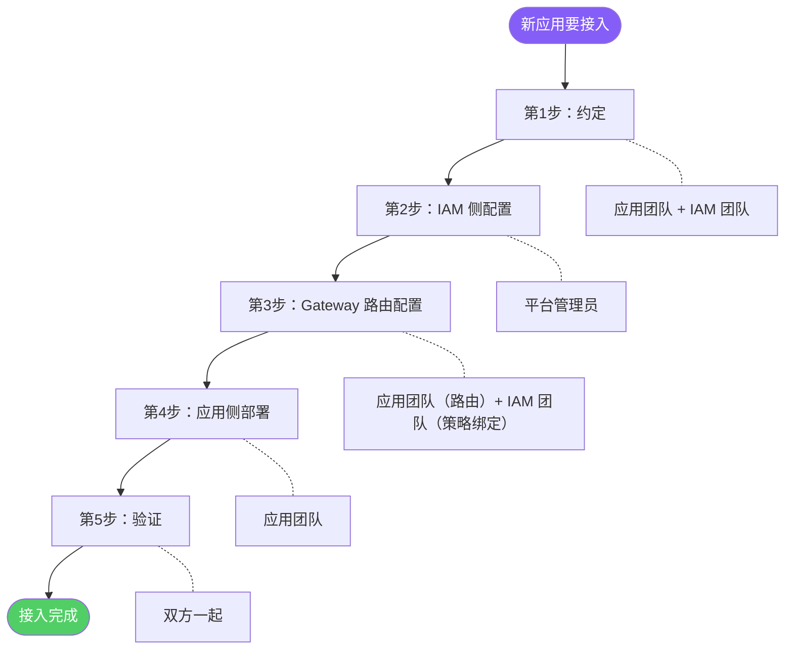
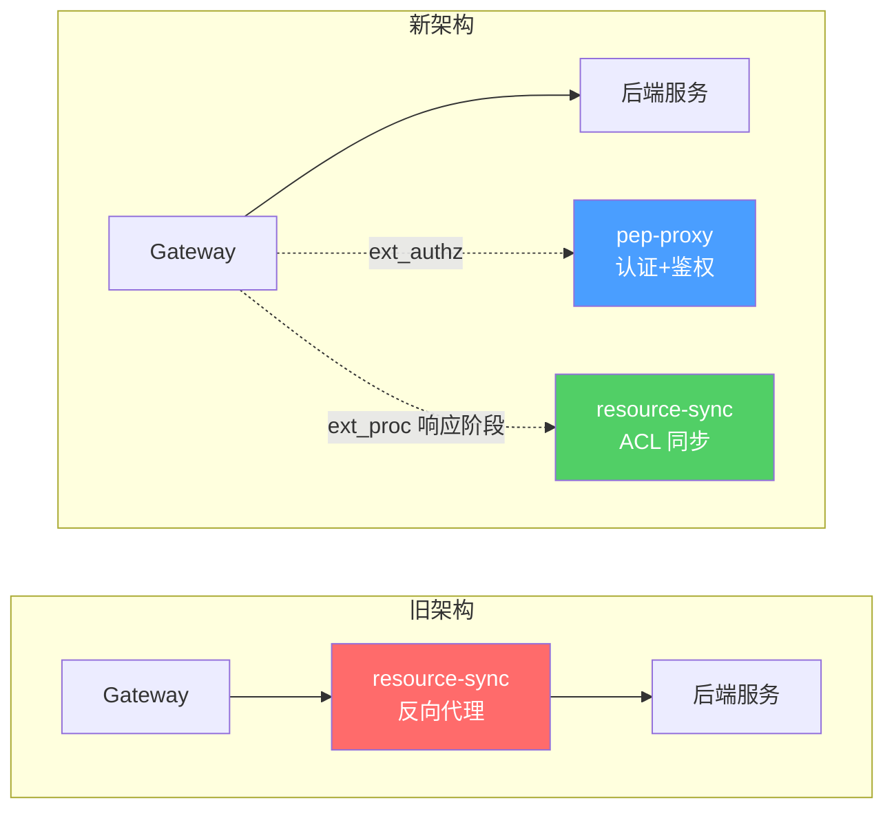
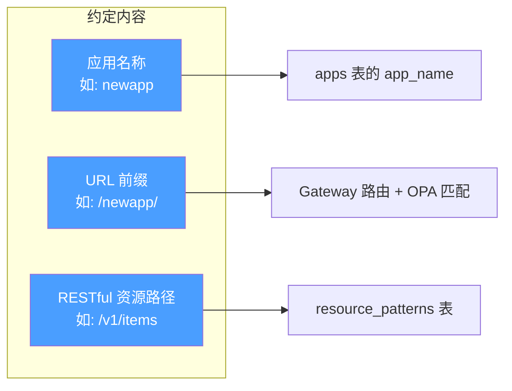
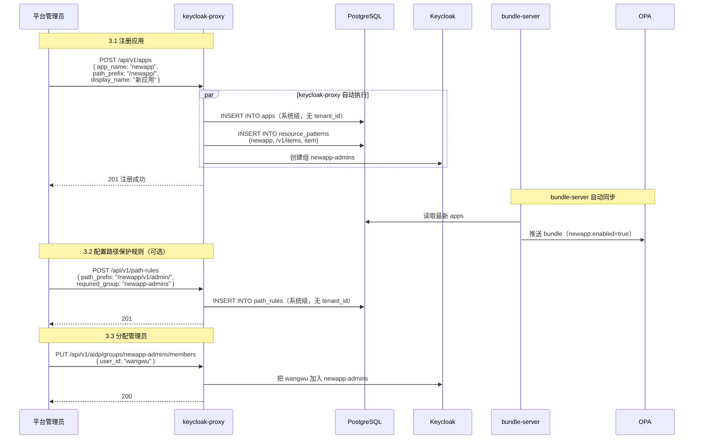
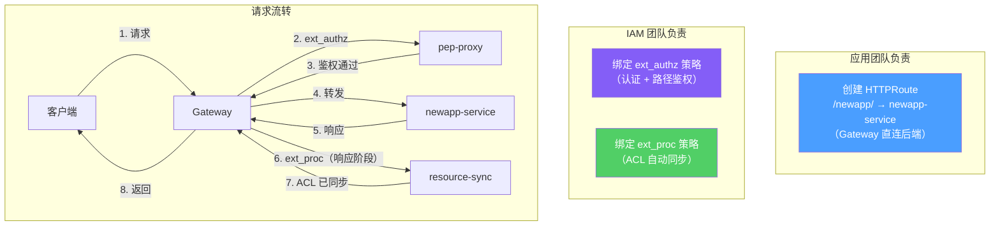
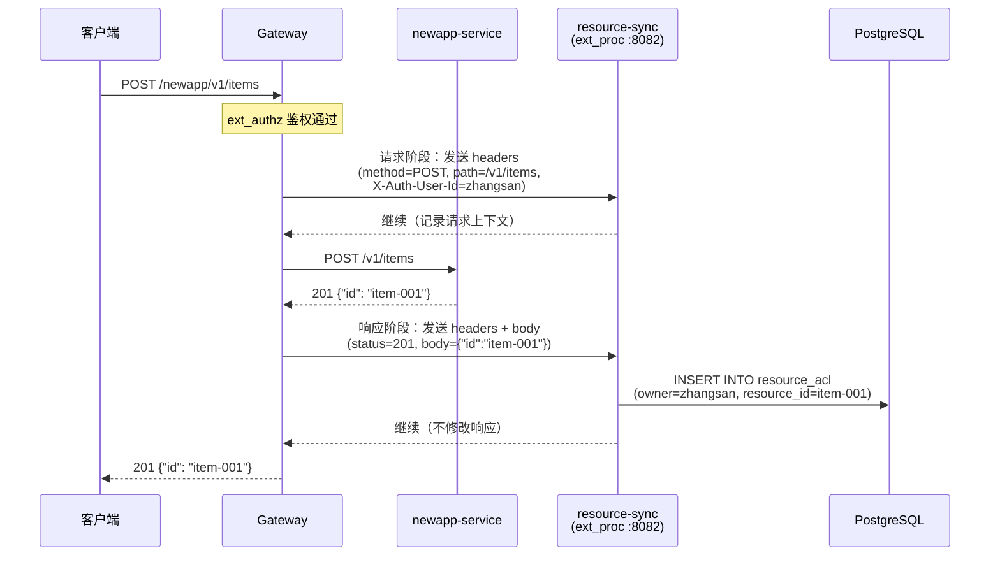
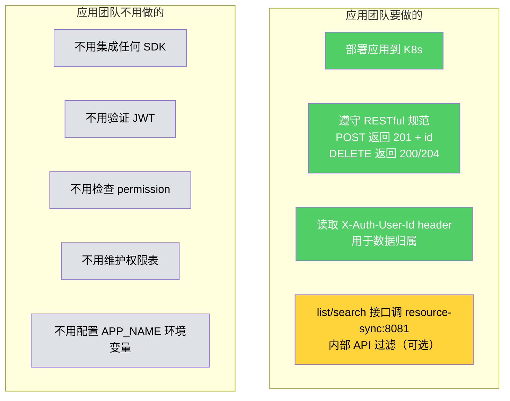
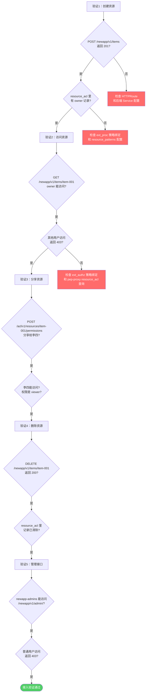
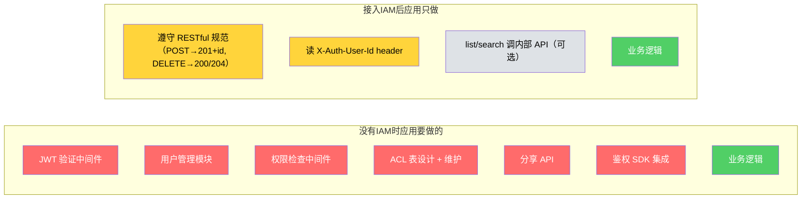

# 接入流程视角 — 新应用怎么接入、各方做什么

> 版本：v2.0 | 日期：2026-04-07
>
> **架构变更要点**：Gateway 直连后端服务，resource-sync 通过 ext_proc 在响应阶段自动完成 ACL 同步，应用团队零 SDK 集成。

---

## 1 接入全流程概览



**与旧架构的关键区别：**



---

## 2 第 1 步：约定（应用团队 + IAM 团队）

双方坐下来对齐三件事，不需要写代码：



**约定清单：**

| 约定项 | 示例 | 用在哪 |
|--------|------|--------|
| 应用名称 | `newapp` | apps 表、{app}-admins 组名 |
| URL 前缀 | `/newapp/` | Gateway 路由、OPA 路径匹配 |
| 资源路径 | `/v1/items` | resource_patterns 表 |
| 资源类型名 | `item` | resource_acl 表的 resource_type |
| 管理接口路径（可选） | `/v1/admin/` | path_rules 表（如果用 IAM 保护管理路径） |
| 响应体格式 | `{"id": "xxx"}` | ext_proc 从 POST 响应中提取资源 ID |

> **注意**：apps、path_rules、resource_patterns 均为系统级表，没有 tenant_id 字段。

**RESTful 规范要求（必须遵守）：**

```
POST   /v1/items          → 创建，返回 201 + {"id": "item-001"}
GET    /v1/items           → 列表
GET    /v1/items/item-001  → 查看
PUT    /v1/items/item-001  → 更新
DELETE /v1/items/item-001  → 删除，返回 200 或 204
```

---

## 3 第 2 步：IAM 侧配置（平台管理员操作）



**IAM 侧完成后数据库状态：**

```
apps 表新增（系统级）：
| app_name | path_prefix | enabled |
|----------|-------------|---------|
| newapp   | /newapp/    | true    |

resource_patterns 表新增（系统级）：
| app_name | resource_prefix | resource_type |
|----------|-----------------|---------------|
| newapp   | /v1/items       | item          |

path_rules 表新增（可选，系统级）：
| path_prefix        | required_group |
|--------------------|----------------|
| /newapp/v1/admin/  | newapp-admins  |

Keycloak 新增：
  组: newapp-admins → [wangwu]
```

---

## 4 第 3 步：Gateway 路由配置 — 关键变更

新架构下，路由配置由两个团队分工完成：



### 4.1 应用团队创建 HTTPRoute

应用团队在自己的命名空间或项目 Helm chart 中添加路由：

```yaml
apiVersion: gateway.networking.k8s.io/v1
kind: HTTPRoute
metadata:
  name: newapp-route
spec:
  parentRefs:
    - name: agentgateway
  rules:
    - matches:
        - path:
            type: PathPrefix
            value: /newapp/
      filters:
        - type: URLRewrite
          urlRewrite:
            path:
              type: ReplacePrefixMatch
              replacePrefixMatch: /
      backendRefs:
        - name: newapp-service    # 直连后端服务，不经过 resource-sync
          port: 80
```

> **关键变更**：`backendRefs` 直接指向 `newapp-service`，不再经过 `resource-sync` 代理。

### 4.2 IAM 团队绑定 ext_authz + ext_proc 策略

IAM 团队将认证鉴权和 ACL 同步策略绑定到该路由：

```yaml
# ext_authz：认证 + 路径鉴权（可能已在 Gateway 级别配置）
apiVersion: agentgateway.dev/v1alpha1
kind: AgentgatewayPolicy
metadata:
  name: iam-ext-authz
spec:
  traffic:
    extAuth:
      backendRef:
        name: pep-proxy
        namespace: iam
        port: 9000
      grpc: {}
  targetRefs:
    - group: gateway.networking.k8s.io
      kind: HTTPRoute
      name: newapp-route
```

```yaml
# ext_proc：ACL 自动同步（响应阶段）
apiVersion: agentgateway.dev/v1alpha1
kind: AgentgatewayPolicy
metadata:
  name: iam-ext-proc
spec:
  traffic:
    extProc:
      backendRef:
        name: resource-sync
        namespace: iam
        port: 8082
      failureMode: failOpen
      processingMode:
        request:
          headers: SEND      # 需要 method + path + X-Auth-* headers
          body: SKIP
        response:
          headers: SEND      # 需要 status code
          body: BUFFERED     # 需要 POST 的响应体（提取 id）
  targetRefs:
    - group: gateway.networking.k8s.io
      kind: HTTPRoute
      name: newapp-route
```

**ext_proc 工作原理：**



---

## 5 第 4 步：应用侧部署（应用团队）— 大幅简化



> D4 标黄表示这是可选步骤，只有需要 list/search 接口过滤时才需要。

应用的 Deployment 示例：

```yaml
apiVersion: apps/v1
kind: Deployment
metadata:
  name: newapp-service
spec:
  replicas: 2
  template:
    spec:
      containers:
        - name: newapp
          image: newapp:latest
          ports:
            - containerPort: 80
---
apiVersion: v1
kind: Service
metadata:
  name: newapp-service
spec:
  selector:
    app: newapp
  ports:
    - port: 80
```

> **注意**：不再需要 `APP_NAME` 和 `RESOURCE_SYNC_URL` 环境变量。ext_proc 自动从请求路径匹配应用和资源模式。

**应用代码示例（极简）：**

```python
@app.post("/v1/items")
def create_item(request):
    # 鉴权已在 pep-proxy 完成（ext_authz）
    # ACL 同步由 ext_proc 自动完成（无需任何代码）
    user_id = request.headers.get("X-Auth-User-Id")  # Gateway 注入的用户信息
    item = db.create_item(data=request.body, created_by=user_id)
    return JSONResponse({"id": item.id}, status_code=201)  # 必须返回 201 + id

@app.get("/v1/items/{item_id}")
def get_item(item_id, request):
    # 能走到这里，说明 pep-proxy 已确认用户有权限访问此资源
    item = db.get_item(item_id)
    return item

@app.delete("/v1/items/{item_id}")
def delete_item(item_id, request):
    # ext_proc 会在看到 200/204 响应后自动清除 ACL 记录
    db.delete_item(item_id)
    return JSONResponse(status_code=200)

@app.get("/v1/items")
def list_items(request):
    # 这是唯一需要调 resource-sync 内部 API 的场景（可选）
    import requests
    user_id = request.headers.get("X-Auth-User-Id")
    resp = requests.get(
        "http://resource-sync:8081/internal/v1/accessible-resources",
        params={"app_name": "newapp", "resource_type": "item", "user_id": user_id}
    )
    allowed_ids = resp.json()["resource_ids"]
    items = db.get_items_by_ids(allowed_ids)
    return items
```

---

## 6 第 5 步：验证



**验证命令：**

```bash
# 获取 JWT
TOKEN=$(curl -s -X POST "https://gateway.aidp.com/realms/aidp/protocol/openid-connect/token" \
  -d "grant_type=password&client_id=data-agent&username=zhangsan&password=xxx" \
  | jq -r '.access_token')

# 验证1：创建资源
curl -X POST https://gateway.aidp.com/newapp/v1/items \
  -H "Authorization: Bearer $TOKEN" \
  -H "Content-Type: application/json" \
  -d '{"name": "测试数据"}' -v
# 预期：201 + {"id": "item-001"}
# ext_proc 自动写入 resource_acl（owner=zhangsan）

# 检查 ACL 是否自动写入
curl https://gateway.aidp.com/acl/v1/resources/item-001/permissions \
  -H "Authorization: Bearer $TOKEN"
# 预期：[{"subject_id": "zhangsan", "permission": "owner"}]

# 验证2：其他用户访问（用李四的 token）
curl https://gateway.aidp.com/newapp/v1/items/item-001 \
  -H "Authorization: Bearer $LISI_TOKEN" -v
# 预期：403

# 验证3：分享给李四
curl -X POST https://gateway.aidp.com/acl/v1/resources/item-001/permissions \
  -H "Authorization: Bearer $TOKEN" \
  -H "Content-Type: application/json" \
  -d '{"app_name":"newapp","resource_type":"item","subject_type":"user","subject_id":"lisi","permission":"viewer"}'
# 预期：201

# 验证4：李四现在能访问
curl https://gateway.aidp.com/newapp/v1/items/item-001 \
  -H "Authorization: Bearer $LISI_TOKEN" -v
# 预期：200

# 验证5：删除资源
curl -X DELETE https://gateway.aidp.com/newapp/v1/items/item-001 \
  -H "Authorization: Bearer $TOKEN" -v
# 预期：200 + resource_acl 记录全部清除（ext_proc 自动处理）
```

---

## 7 接入清单（Checklist）

```mermaid
flowchart TD
    subgraph 约定阶段
        C1["[ ] 确定应用名称 app_name"]
        C2["[ ] 确定 URL 前缀 path_prefix"]
        C3["[ ] 确定资源路径 resource_prefix"]
        C4["[ ] 确定资源类型 resource_type"]
        C5["[ ] 确认遵守 RESTful 规范"]
        C6["[ ] 确定是否需要管理接口保护"]
    end

    subgraph IAM侧配置
        I1["[ ] POST /api/v1/apps 注册应用"]
        I2["[ ] 确认 newapp-admins 组已创建"]
        I3["[ ] 配置 path_rules（可选）"]
        I4["[ ] 分配管理员到 newapp-admins"]
        I5["[ ] 确认 resource_patterns 已写入"]
    end

    subgraph 应用团队创建路由
        R1["[ ] 创建 HTTPRoute（指向自己的 Service）"]
    end

    subgraph IAM侧策略绑定
        P1["[ ] 绑定 ext_authz 策略到路由"]
        P2["[ ] 绑定 ext_proc 策略到路由"]
    end

    subgraph 应用侧部署
        A1["[ ] 部署应用到 K8s"]
        A2["[ ] POST 返回 201 + id 字段"]
        A3["[ ] DELETE 返回 200 或 204"]
        A4["[ ] 读取 X-Auth-User-Id header"]
        A5["[ ] list/search 调 resource-sync:8081（可选）"]
    end

    subgraph 验证
        V1["[ ] 创建资源 → ACL 自动写入"]
        V2["[ ] 访问资源 → owner 可访问"]
        V3["[ ] 无权用户 → 403"]
        V4["[ ] 分享 → 被分享者可访问"]
        V5["[ ] 删除资源 → ACL 自动清除"]
        V6["[ ] 管理接口 → 只有 admins 可访问"]
    end

    C1 --> C2 --> C3 --> C4 --> C5 --> C6
    C6 --> I1 --> I2 --> I3 --> I4 --> I5
    I5 --> R1
    R1 --> P1 --> P2
    P2 --> A1 --> A2 --> A3 --> A4 --> A5
    A5 --> V1 --> V2 --> V3 --> V4 --> V5 --> V6
```



---

## 8 对比：接入前 vs 接入后应用的工作量

| 维度 | 没有 IAM（应用自己做） | 接入 IAM 后 |
|------|----------------------|------------|
| JWT 验证 | 自己实现中间件 | 不用做（ext_authz → pep-proxy） |
| 用户/组管理 | 自己建表和 API | 不用做（Keycloak 管理） |
| 路径权限 | 自己写中间件 | 不用做（OPA 管理） |
| 资源权限表 | 自己建 shares 表 | 不用做（resource_acl 由 ext_proc 自动维护） |
| 分享功能 | 自己写分享 API | 不用做（IAM ACL API） |
| 鉴权逻辑 | 每个接口都要写 | 不用做（ext_authz + ext_proc 全自动） |
| SDK 集成 | 引入鉴权 SDK | **不需要任何 SDK** |
| 环境变量 | 配置各种密钥 | **不需要特殊环境变量** |
| Gateway 路由 | IAM 团队统一管理 | **应用团队自己管理路由，IAM 只绑定策略** |
| **应用只需要做** | 全部自己做 | **遵守 RESTful 规范 + 读 X-Auth-User-Id + list/search 调一次内部接口（可选）** |

### 工作量直观对比



红色 = 不需要做了 | 黄色 = 轻量约定 | 灰色 = 可选 | 绿色 = 业务逻辑
