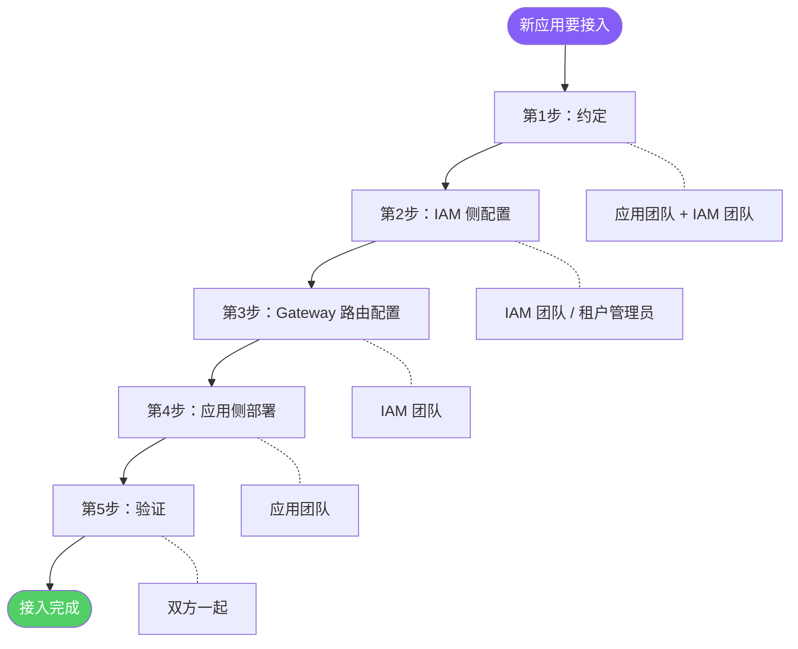
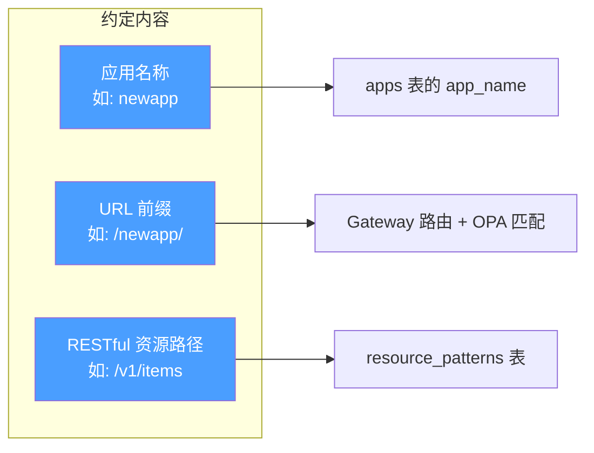
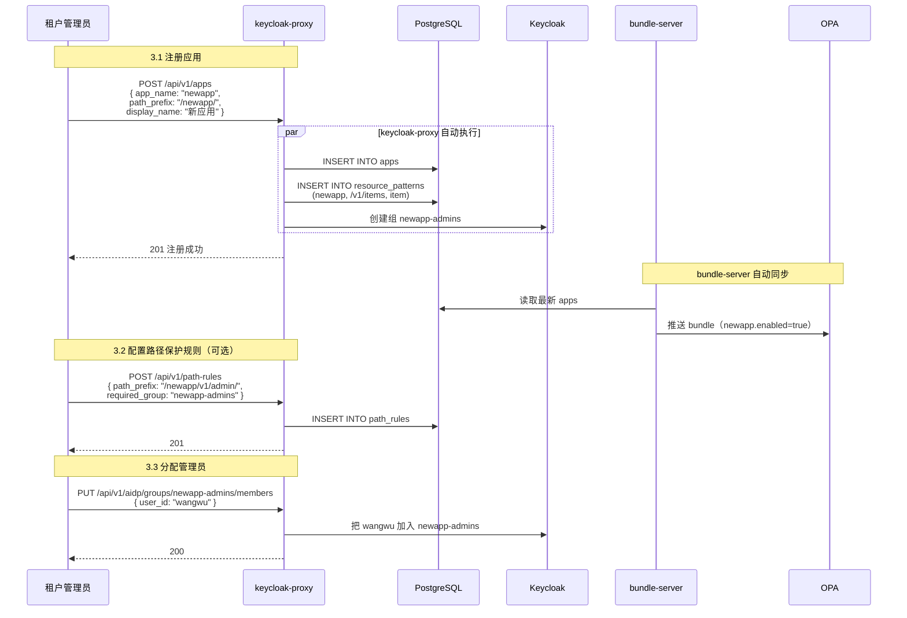
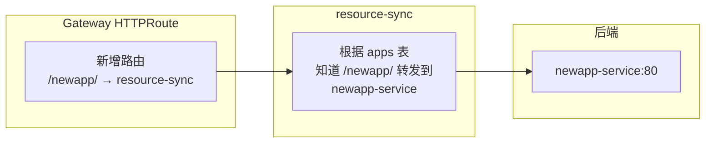
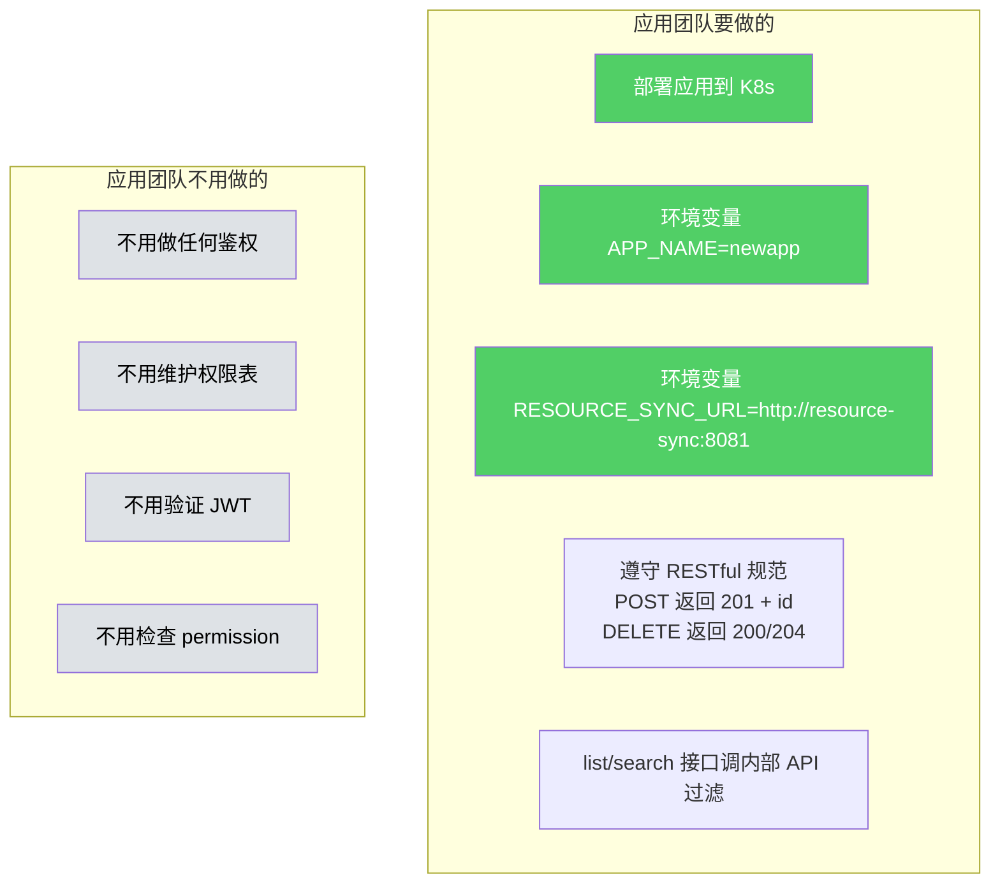
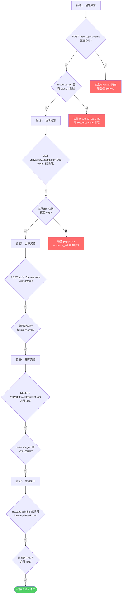
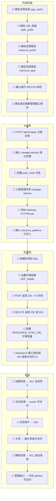

# 接入流程视角 — 新应用怎么接入、各方做什么

> 版本：v1.0 | 日期：2026-04-02

---

## 1 接入全流程概览



---

## 2 第 1 步：约定（应用团队 + IAM 团队）

双方坐下来对齐三件事，不需要写代码：



**约定清单：**

| 约定项 | 示例 | 用在哪 |
|--------|------|--------|
| 应用名称 | `newapp` | apps 表、{app}-admins 组名、环境变量 |
| URL 前缀 | `/newapp/` | Gateway 路由、OPA 路径匹配 |
| 资源路径 | `/v1/items` | resource_patterns 表 |
| 资源类型名 | `item` | resource_acl 表的 resource_type |
| 管理接口路径（可选） | `/v1/admin/` | path_rules 表（如果用 IAM 保护管理路径） |
| 响应体格式 | `{"id": "xxx"}` | resource-sync 提取资源 ID |

**RESTful 规范要求（必须遵守）：**

```
POST   /v1/items          → 创建，返回 201 + {"id": "item-001"}
GET    /v1/items           → 列表
GET    /v1/items/item-001  → 查看
PUT    /v1/items/item-001  → 更新
DELETE /v1/items/item-001  → 删除，返回 200 或 204
```

---

## 3 第 2 步：IAM 侧配置（管理员操作）



**IAM 侧完成后数据库状态：**

```
apps 表新增：
| tenant_id | app_name | path_prefix | enabled |
|-----------|----------|-------------|---------|
| aidp      | newapp   | /newapp/    | true    |

resource_patterns 表新增：
| tenant_id | app_name | resource_prefix | resource_type |
|-----------|----------|-----------------|---------------|
| aidp      | newapp   | /v1/items       | item          |

path_rules 表新增（可选）：
| tenant_id | path_prefix        | required_group |
|-----------|--------------------|----------------|
| aidp      | /newapp/v1/admin/  | newapp-admins  |

Keycloak 新增：
  组: newapp-admins → [wangwu]
```

---

## 4 第 3 步：Gateway 路由配置（IAM 团队）



在 Helm chart 中添加 HTTPRoute：

```yaml
apiVersion: gateway.networking.k8s.io/v1
kind: HTTPRoute
metadata:
  name: newapp-route
  namespace: agentgateway-system
spec:
  parentRefs:
    - name: https
      namespace: agentgateway-system
  rules:
    - matches:
        - path:
            type: PathPrefix
            value: /newapp/
      filters:
        - type: URLRewrite
          urlRewrite:
            path:
              type: ReplacePrefixMatch
              replacePrefixMatch: /
      backendRefs:
        - name: resource-sync       # 先到 resource-sync
          port: 8080
```

resource-sync 根据 apps 表的 `path_prefix` 知道 `/newapp/` 的请求应该转发到 `newapp-service`。

---

## 5 第 4 步：应用侧部署（应用团队）



应用的 Deployment 示例：

```yaml
apiVersion: apps/v1
kind: Deployment
metadata:
  name: newapp-service
spec:
  replicas: 2
  template:
    spec:
      containers:
        - name: newapp
          image: newapp:latest
          env:
            - name: APP_NAME
              value: "newapp"
            - name: RESOURCE_SYNC_URL
              value: "http://resource-sync:8081"
          ports:
            - containerPort: 80
---
apiVersion: v1
kind: Service
metadata:
  name: newapp-service
spec:
  selector:
    app: newapp
  ports:
    - port: 80
```

**应用代码只需要读 Header（可选）：**

```python
@app.get("/v1/items/{item_id}")
def get_item(item_id, request):
    # 鉴权已经在 pep-proxy 做完了
    # 如果能走到这里，说明用户一定有权限
    item = db.get_item(item_id)
    return item

@app.put("/v1/items/{item_id}")
def update_item(item_id, request):
    # pep-proxy 已经检查了 PUT 需要 contributor 以上权限
    # 如果能走到这里，说明权限已经够了
    db.update_item(item_id, request.body)
    return {"status": "ok"}

@app.get("/v1/items")
def list_items(request):
    from aidp_acl import get_allowed_resources

    # 调 resource-sync 内部接口，获取可访问 ID 列表
    allowed_ids = get_allowed_resources(request, "newapp", "item")
    items = db.get_items_by_ids(allowed_ids)
    return items
```

---

## 6 第 5 步：验证



**验证命令：**

```bash
# 获取 JWT
TOKEN=$(curl -s -X POST "https://gateway.aidp.com/realms/aidp/protocol/openid-connect/token" \
  -d "grant_type=password&client_id=data-agent&username=zhangsan&password=xxx" \
  | jq -r '.access_token')

# 验证1：创建资源
curl -X POST https://gateway.aidp.com/newapp/v1/items \
  -H "Authorization: Bearer $TOKEN" \
  -H "Content-Type: application/json" \
  -d '{"name": "测试数据"}' -v
# 预期：201 + {"id": "item-001"}

# 检查 ACL 是否自动写入
curl https://gateway.aidp.com/acl/v1/permissions?app_name=newapp\&resource_id=item-001 \
  -H "Authorization: Bearer $TOKEN"
# 预期：[{"subject_id": "zhangsan", "permission": "owner"}]

# 验证2：其他用户访问（用李四的 token）
curl https://gateway.aidp.com/newapp/v1/items/item-001 \
  -H "Authorization: Bearer $LISI_TOKEN" -v
# 预期：403

# 验证3：分享给李四
curl -X POST https://gateway.aidp.com/acl/v1/permissions \
  -H "Authorization: Bearer $TOKEN" \
  -H "Content-Type: application/json" \
  -d '{"app_name":"newapp","resource_type":"item","resource_id":"item-001","subject_type":"user","subject_id":"lisi","permission":"viewer"}'
# 预期：201

# 验证4：李四现在能访问
curl https://gateway.aidp.com/newapp/v1/items/item-001 \
  -H "Authorization: Bearer $LISI_TOKEN" -v
# 预期：200（有权限就能访问）

# 验证5：删除资源
curl -X DELETE https://gateway.aidp.com/newapp/v1/items/item-001 \
  -H "Authorization: Bearer $TOKEN" -v
# 预期：200 + resource_acl 记录全部清除
```

---

## 7 接入清单（Checklist）



---

## 8 对比：接入前 vs 接入后应用的工作量

| 维度 | 没有 IAM（应用自己做） | 接入 IAM 后 |
|------|----------------------|------------|
| JWT 验证 | 自己实现 | 不用做（pep-proxy 做） |
| 用户/组管理 | 自己建表 | 不用做（Keycloak 管） |
| 路径权限 | 自己写中间件 | 不用做（OPA 管） |
| 资源权限表 | 自己建 shares 表 | 不用做（resource_acl 管） |
| 分享功能 | 自己写 API | 不用做（resource-sync ACL API） |
| 鉴权逻辑 | 每个接口都要写 | 不用做（pep-proxy + resource-sync 管） |
| **应用只需要做** | 全部自己做 | **遵守 RESTful 规范 + list/search 调一次内部接口** |
