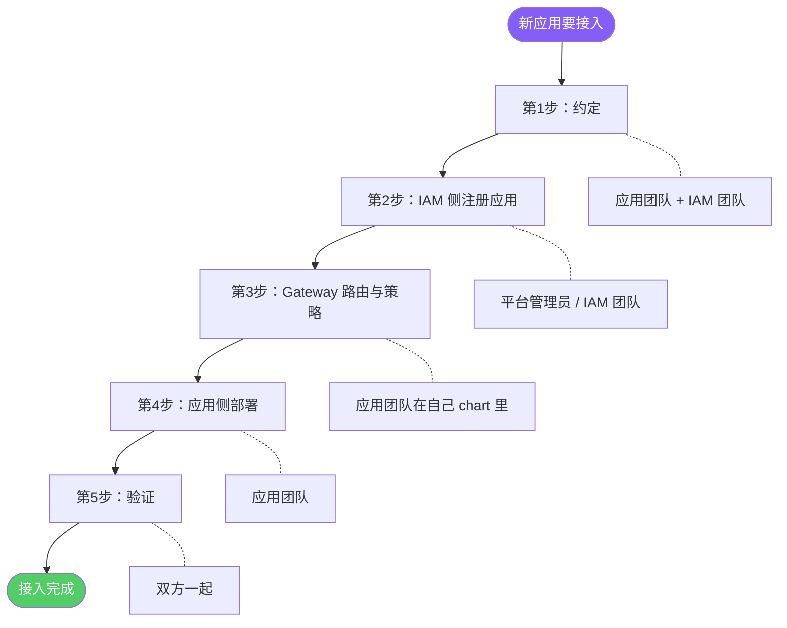
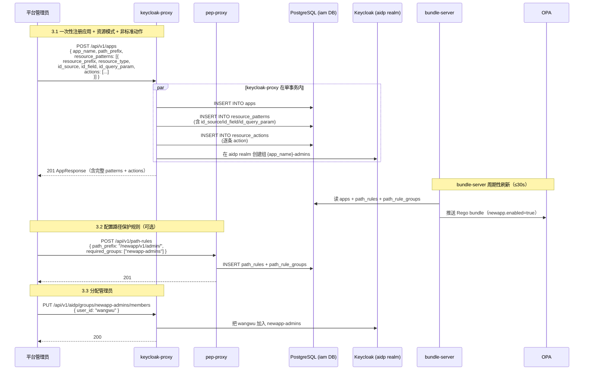
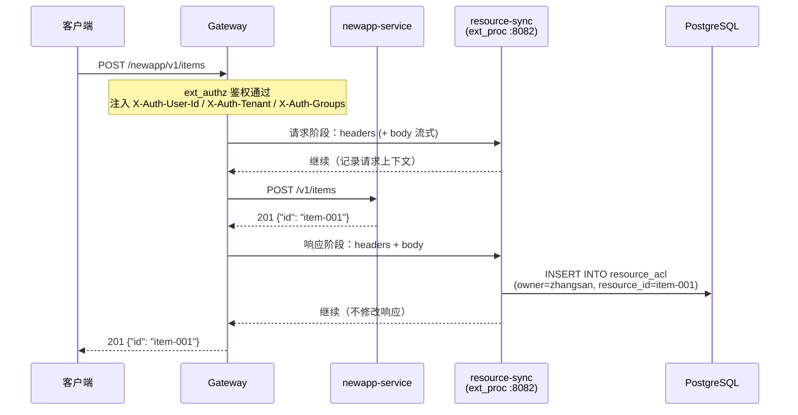
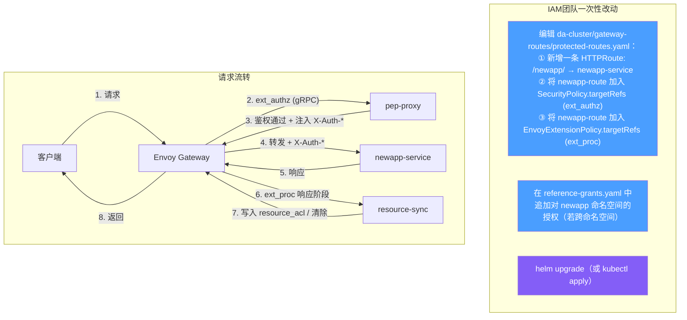
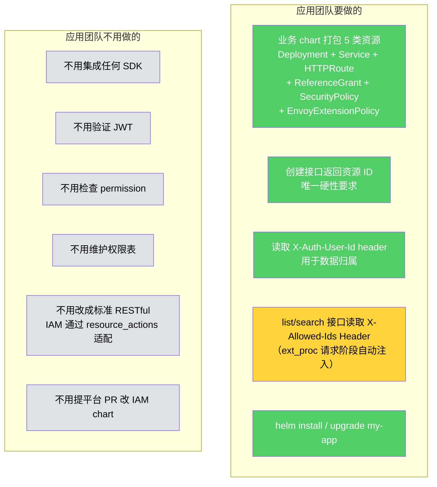
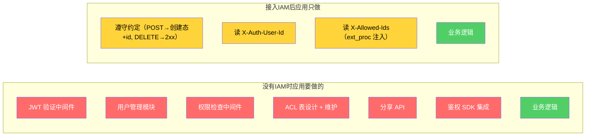

# 接入流程视角 — 新应用怎么接入、各方做什么

> 版本：v2.2 | 日期：2026-04-25
>
> **架构要点**：单 realm（`aidp`） + Gateway 直连后端服务。resource-sync 通过 ext_proc 在响应阶段自动完成 ACL 同步，应用团队零 SDK 集成。
>
> **本版核心变更**（v2.1 → v2.2）：路由所有权从「IAM 团队集中维护 `da-cluster/gateway-routes/*.yaml`」**反转**为「**业务团队在自己的 Helm chart 里同时管理 Deployment / Service / HTTPRoute / SecurityPolicy / EnvoyExtensionPolicy**」。理由：路由跟后端 Service 强耦合 —— 同生命周期、同所有者、同 PR 节奏。`package/` 和 `package-gateway/` 下的所有 chart 已按这个范式重组。

---

## 1 接入全流程概览



**与历史版本的关键差异：**

| 维度 | v2.0 原设计 | v2.1 | v2.2（当前） |
|------|------------|------|-------------|
| 租户模型 | 多 tenant realm | 单 `aidp` realm，组：`admins` / `all-users` / `{app}-admins` | 同 v2.1 |
| **路由归属** | 应用团队自建 HTTPRoute，IAM 团队挂策略 | IAM 团队统一维护 `da-cluster/gateway-routes/*.yaml` 集中列举 | **业务团队在自己 chart 里管 HTTPRoute + ReferenceGrant + SecurityPolicy + EnvoyExtensionPolicy** |
| 资源模式注册 | 仅 `resource_prefix` + `resource_type` | + `id_source` / `id_field` / `id_query_param` + 嵌套 `actions` | 同 v2.1 |
| 路径规则 | `required_group` 单组 | `required_groups: string[]`（OR 语义） | 同 v2.1 |
| 部署形态 | umbrella chart 一把梭 | 同 v2.0 | **拆成 `aidp-gateway` + `aidp-iam` + `aidp-iam-mocks` + 业务自带 chart**，分层独立 |

---

## 2 第 1 步：约定（应用团队 + IAM 团队）

对齐清单（不写代码）：

| 约定项 | 示例 | 用在哪 |
|--------|------|--------|
| 应用名称 | `newapp` | `apps.app_name`、自动派生 `{app}-admins` 组 |
| URL 前缀 | `/newapp/` | Gateway HTTPRoute + path_rules 命中 |
| 资源路径 | `/v1/items` | `resource_patterns.resource_prefix` |
| 资源类型名 | `item` | `resource_patterns.resource_type`、`resource_acl.resource_type` |
| 资源 ID 位置 | `path` / `query` / `body` | `resource_patterns.id_source` |
| ID 字段名（或嵌套路径） | `id` / `data.kb_id` | `resource_patterns.id_field` |
| query 参数名（若 id_source=query） | `item_id` | `resource_patterns.id_query_param` |
| 非标准操作规则 | 创建/删除/读/写/列表的方法 + 路径后缀 + 状态码 + 最低权限 | `resource_actions`（嵌套在 `resource_patterns.actions` 下一次性提交） |
| 管理接口路径（可选） | `/newapp/v1/admin/` | `path_rules` |
| 管理员组名 | `newapp-admins`（自动） | `admin_group`、`path_rules.required_groups` |

> 详细的应用调研和收集流程见 [应用接入调研指南](app-integration-guide.md)。

**标准 RESTful 应用（零额外配置）：**

```
POST   /v1/items          → 201 + {"id": "item-001"}
GET    /v1/items           → 列表
GET    /v1/items/item-001  → 查看
PUT    /v1/items/item-001  → 更新
DELETE /v1/items/item-001  → 200 / 204
```

标准 RESTful 应用只需填 `resource_patterns` 的基础字段（`resource_prefix` + `resource_type`），`actions` 留空 → resource-sync 与 pep-proxy 回退到代码层 `DEFAULT_ACTIONS`。

**非标准 API 应用（通过 `actions` 适配）：**

```
POST /v1/items/create  → 200 + {"item_id": "001"}
POST /v1/items/detail  body:{"item_id":"001"} → 查看
POST /v1/items/update  body:{"item_id":"001",...} → 修改
POST /v1/items/delete  body:{"item_id":"001"} → 删除
POST /v1/items/list    body:{"page":1} → 列表
```

非标准应用在 `resource_patterns[i].actions` 数组里逐条写入方法 + 路径后缀 + 最低权限。

**唯一硬性要求：创建接口必须返回资源 ID**（否则 ext_proc 无法写 owner ACL）。

---

## 3 第 2 步：IAM 侧注册应用（平台管理员 / IAM 团队）



**IAM 侧完成后数据库状态：**

```
apps:
| app_name | path_prefix | admin_group    | enabled |
| newapp   | /newapp/    | newapp-admins  | true    |

resource_patterns:
| app_name | resource_prefix | resource_type | id_source | id_field | id_query_param |
| newapp   | /v1/items       | item          | path      | id       | NULL           |

resource_actions（仅非标准 API 才会有行；标准 RESTful 下为空）：
  （空）

path_rules + path_rule_groups（可选）：
| rule_id | path_prefix        | method | required_groups  |
| 12      | /newapp/v1/admin/  | NULL   | [newapp-admins]  |

Keycloak（aidp realm）：
  组: newapp-admins → [wangwu]
```

> `apps`、`resource_patterns`、`resource_actions`、`path_rules`、`path_rule_groups` 均为系统级表，没有 `tenant_id`。
>
> 路径规则的 `required_groups` 是 OR 语义：用户只要命中其中任意一个组即放行。

**一次性注册的 curl 示例（含 flex 字段和嵌套 actions）：**

```bash
curl -X POST "$BASE/api/v1/apps" -H "Content-Type: application/json" -d '{
  "app_name": "newapp",
  "path_prefix": "/newapp/",
  "display_name": "新应用",
  "resource_patterns": [
    {
      "resource_prefix": "/v1/items",
      "resource_type": "item",
      "id_source": "body",
      "id_field": "data.item_id",
      "actions": [
        {"action": "create", "method": "POST", "path_suffix": "/create", "success_status": 200, "min_permission": "none"},
        {"action": "delete", "method": "POST", "path_suffix": "/delete", "min_permission": "owner"},
        {"action": "read",   "method": "POST", "path_suffix": "/detail", "min_permission": "viewer"},
        {"action": "update", "method": "POST", "path_suffix": "/update", "min_permission": "contributor"},
        {"action": "list",   "method": "POST", "path_suffix": "/list",   "min_permission": "none"}
      ]
    }
  ]
}'
```

---

## 4 第 3 步：Gateway 路由与策略（应用团队在自己 chart 里）

**v2.2 关键变化**：路由不再是平台团队代管的「中央配置」，而是**业务团队自己 chart 的一部分**。每个应用的 Helm chart 同时打包：

1. `Deployment` + `Service`（业务后端本体，原来就有）
2. `HTTPRoute`（把外部 URL 前缀 → 业务 Service）
3. `ReferenceGrant`（如果业务 Service 跟 Gateway 不在同 ns，授权 Gateway 跨 ns 引用）
4. `SecurityPolicy`（把这条路由绑到 pep-proxy 走鉴权）
5. `EnvoyExtensionPolicy`（把这条路由绑到 resource-sync 走 ACL 自动同步）

**为什么这么改**（v2.1 → v2.2）：

| 老模型问题 | v2.2 收益 |
|----------|----------|
| 业务每加一个接口就要等 IAM 团队改 `gateway-routes/protected-routes.yaml` 的 PR | 业务在自己 chart 里改一行就上线，不阻塞 |
| 中央 SecurityPolicy.targetRefs 列表越长越脆，一条改错全员故障 | 每业务一份 SecurityPolicy，互不干扰 |
| 业务 chart 卸载时，遗留中央 YAML 里它的路由项，需要平台手动清 | `helm uninstall` 一条命令路由 / 鉴权策略一起清 |
| GitOps 流程跨仓库（业务 repo + 平台 repo 双 PR） | 业务 repo 单 PR 完成 |

### 4.1 业务 chart 标准结构

```
my-app-chart/
├── Chart.yaml
├── values.yaml                            # path_prefix / namespace / image 等可调
└── templates/
    ├── deployment.yaml                    # 后端 Pod
    ├── service.yaml                       # 后端 Service
    ├── httproute.yaml                     # 把 /myapp/ 前缀路由到 Service
    ├── reference-grant.yaml               # 跨 ns 引用授权（同 ns 可省）
    ├── security-policy.yaml               # 绑 ext_authz → pep-proxy
    └── extension-policy.yaml              # 绑 ext_proc → resource-sync（仅业务路由）
```

`package/examples/` 已经把这五个资源拆成 5 类模板，业务团队照着改 placeholder 即可：

| 模板 | 适用场景 |
|------|---------|
| `01-standard-rest.yaml` | 标准 RESTful（POST 201 + DELETE/PUT/GET 走 path id） |
| `02-nonstandard-verb.yaml` | `POST /xxx/remove` 这种用 path_suffix 区分动作 |
| `03-id-in-body.yaml` | 资源 ID 在 body 里 |
| `04-public-path.yaml` | 公开路径，不接鉴权（`SecurityPolicy` 省略） |
| `05-path-only-no-resource.yaml` | 只路径级鉴权，不挂资源 ACL（`EnvoyExtensionPolicy` 省略） |

### 4.2 流程图

```mermaid
flowchart TD
    subgraph 应用团队一次性 PR（自己 chart 仓库）
        T1["templates/httproute.yaml: /newapp/ → newapp-service"]
        T2["templates/reference-grant.yaml: 授权 envoy-gateway-system 引用"]
        T3["templates/security-policy.yaml: 绑 newapp-extauthz → pep-proxy"]
        T4["templates/extension-policy.yaml: 绑 newapp-extproc → resource-sync（业务路由才需要）"]
        UPG["helm install / upgrade my-app"]
    end

    subgraph 请求流转
        direction LR
        CLIENT[客户端] -->|1. 请求| GW[Envoy Gateway]
        GW -->|"2. ext_authz (gRPC)"| PEP[pep-proxy]
        PEP -->|3. 鉴权通过 + 注入 X-Auth-*| GW
        GW -->|4. 转发 + X-Auth-*| APP[newapp-service]
        APP -->|5. 响应| GW
        GW -->|"6. ext_proc 响应阶段"| RS[resource-sync]
        RS -->|7. 写入 / 清除 resource_acl| GW
        GW -->|8. 返回| CLIENT
    end

    style T1 fill:#4a9eff,color:#fff
    style T2 fill:#4a9eff,color:#fff
    style T3 fill:#4a9eff,color:#fff
    style T4 fill:#4a9eff,color:#fff
    style UPG fill:#845ef7,color:#fff
```

**安全要求**：Envoy Gateway 在进入 ext_authz / ext_proc 之前自动清除客户端传入的 `X-Auth-*` 和 `X-Allowed-*` Header（防伪造），业务 chart 不需要额外配置。

### 4.3 业务 chart 的 4 个路由文件示例

业务团队从 `package/examples/01-standard-rest.yaml` 拷一份当起点，改 placeholder：

```yaml
# templates/httproute.yaml —— 把 /newapp/ 路由到自己的 Service
apiVersion: gateway.networking.k8s.io/v1
kind: HTTPRoute
metadata:
  name: {{ .Release.Name }}-route
  namespace: envoy-gateway-system     # ← 风格 A：跟 Gateway 同 ns
spec:
  parentRefs:
  - name: eg
  rules:
  - matches:
    - path:
        type: PathPrefix
        value: {{ .Values.pathPrefix }}    # 例如 /newapp/
    backendRefs:
    - name: {{ .Release.Name }}-service
      namespace: {{ .Release.Namespace }}
      port: 80
```

```yaml
# templates/reference-grant.yaml —— 业务 ns 内的 Service 让 Gateway ns 跨 ns 引用
apiVersion: gateway.networking.k8s.io/v1beta1
kind: ReferenceGrant
metadata:
  name: allow-gateway-to-{{ .Release.Name }}
  namespace: {{ .Release.Namespace }}
spec:
  from:
  - { group: gateway.networking.k8s.io, kind: HTTPRoute, namespace: envoy-gateway-system }
  to:
  - { group: "", kind: Service }
```

```yaml
# templates/security-policy.yaml —— 这条路由走 ext_authz
apiVersion: gateway.envoyproxy.io/v1alpha1
kind: SecurityPolicy
metadata:
  name: {{ .Release.Name }}-extauthz
  namespace: envoy-gateway-system
spec:
  targetRefs:
  - { group: gateway.networking.k8s.io, kind: HTTPRoute, name: {{ .Release.Name }}-route }
  extAuth:
    grpc:
      backendRefs:
      - { name: pep-proxy, namespace: opa, port: 9000 }
    failOpen: false
    bodyToExtAuth:
      maxRequestBytes: 8192        # 8 KiB body 转给 pep-proxy（id_source=body 时必须）
```

```yaml
# templates/extension-policy.yaml —— 这条路由走 ext_proc 自动同步 ACL
apiVersion: gateway.envoyproxy.io/v1alpha1
kind: EnvoyExtensionPolicy
metadata:
  name: {{ .Release.Name }}-extproc
  namespace: envoy-gateway-system
spec:
  targetRefs:
  - { group: gateway.networking.k8s.io, kind: HTTPRoute, name: {{ .Release.Name }}-route }
  extProc:
  - backendRefs:
    - { name: resource-sync, namespace: resource-sync, port: 8082 }
    processingMode:
      request: { body: Streamed }
      response: { body: Streamed }
    failOpen: true
```

### 4.4 多个业务 chart 不会冲突

每个业务 chart 创建**自己命名**的 SecurityPolicy 和 EnvoyExtensionPolicy（`{{ .Release.Name }}-extauthz` / `-extproc`）。Envoy Gateway 把它们 **OR 合并**：

- 一条 HTTPRoute 命中多条 SecurityPolicy？只取最具体的一条（targetRef 直接命中 > 作用 Gateway 整体）
- 实际我们各 chart 的 SecurityPolicy 都精确 targetRef 自己的 HTTPRoute → **互相不重叠、不冲突**

`aidp-iam` chart 也用了同样的范式 —— 它自己装的 `pep-proxy-extauthz` 只覆盖自家 2 条路由（`keycloak-proxy-route` / `acl-api-route`），不管业务路由。`aidp-iam-mocks` 也是同理。

**ext_proc 响应阶段工作原理**（创建场景，跟老版本一致）：





**安全要求：** Gateway 在进入 ext_authz / ext_proc 之前必须清除客户端传入的 `X-Auth-*` 和 `X-Allowed-*` Header，防止伪造。

### 4.1 `protected-routes.yaml` 追加路由

```yaml
# da-cluster/gateway-routes/protected-routes.yaml（片段）
apiVersion: gateway.networking.k8s.io/v1
kind: HTTPRoute
metadata:
  name: newapp-route
  namespace: envoy-gateway-system
spec:
  parentRefs:
  - name: eg
  rules:
  - matches:
    - path:
        type: PathPrefix
        value: /newapp/
    filters:
    - type: URLRewrite
      urlRewrite:
        path:
          type: ReplacePrefixMatch
          replacePrefixMatch: /
    backendRefs:
    - name: newapp-service      # 直连后端服务，不经过 resource-sync
      namespace: newapp
      port: 80
```

### 4.2 同一文件末尾扩展策略 targetRefs

```yaml
# SecurityPolicy: ext_authz → pep-proxy（所有需鉴权的路由都要在此列出）
apiVersion: gateway.envoyproxy.io/v1alpha1
kind: SecurityPolicy
metadata:
  name: pep-proxy-extauthz
  namespace: envoy-gateway-system
spec:
  targetRefs:
  - group: gateway.networking.k8s.io
    kind: HTTPRoute
    name: keycloak-proxy-route
  - group: gateway.networking.k8s.io
    kind: HTTPRoute
    name: acl-api-route
  - group: gateway.networking.k8s.io
    kind: HTTPRoute
    name: mock-kb-route
  - group: gateway.networking.k8s.io    # ← 新增
    kind: HTTPRoute
    name: newapp-route
  extAuth:
    grpc:
      backendRefs:
      - name: pep-proxy
        namespace: opa
        port: 9000
    failOpen: false
    bodyToExtAuth:
      maxRequestBytes: 8192
---
# EnvoyExtensionPolicy: ext_proc → resource-sync（仅业务路由需要 ACL 自动同步）
apiVersion: gateway.envoyproxy.io/v1alpha1
kind: EnvoyExtensionPolicy
metadata:
  name: resource-sync-extproc
  namespace: envoy-gateway-system
spec:
  targetRefs:
  - group: gateway.networking.k8s.io
    kind: HTTPRoute
    name: mock-kb-route
  - group: gateway.networking.k8s.io    # ← 新增
    kind: HTTPRoute
    name: newapp-route
  extProc:
  - backendRefs:
    - name: resource-sync
      namespace: resource-sync
      port: 8082
    processingMode:
      request:
        body: Streamed
      response:
        body: Streamed
    failOpen: true
```

### 4.3 跨命名空间授权

若 `newapp-service` 位于独立命名空间，在 `reference-grants.yaml` 中为 `newapp` 命名空间追加 `ReferenceGrant`，允许 Gateway 命名空间访问其 Service。

**ext_proc 响应阶段工作原理（创建场景）：**


---

## 5 第 4 步：应用侧部署（应用团队）



> D4 标黄表示轻量约定：后端只需读取 ext_proc 自动注入的 `X-Allowed-Ids` Header。

业务 chart 内 Deployment + Service 示例（其他 4 类资源见上面 4.3 节）：

```yaml
# templates/deployment.yaml
apiVersion: apps/v1
kind: Deployment
metadata:
  name: {{ .Release.Name }}-service
  namespace: {{ .Release.Namespace }}
spec:
  replicas: 2
  selector:
    matchLabels:
      app: {{ .Release.Name }}
  template:
    metadata:
      labels:
        app: {{ .Release.Name }}
    spec:
      containers:
        - name: {{ .Release.Name }}
          image: {{ .Values.image.repository }}:{{ .Values.image.tag }}
          ports:
            - containerPort: 80
---
# templates/service.yaml
apiVersion: v1
kind: Service
metadata:
  name: {{ .Release.Name }}-service
  namespace: {{ .Release.Namespace }}
spec:
  selector:
    app: {{ .Release.Name }}
  ports:
    - port: 80
```

> **无需特殊环境变量 / 无需 SDK**：ext_authz / ext_proc 自动基于请求路径匹配 apps 与 resource_patterns。
>
> 一条 `helm install my-app ./my-app-chart -n my-app --create-namespace` 把后端 + 路由 + 鉴权策略 + ACL 自动同步策略全部上线。`helm uninstall` 反向一并清理。

**应用代码示例（极简）：**

```python
@app.post("/v1/items")
def create_item(request):
    # 鉴权已在 pep-proxy 完成（ext_authz）
    # ACL 同步由 ext_proc 自动完成（无需任何代码）
    user_id = request.headers.get("X-Auth-User-Id")
    item = db.create_item(data=request.body, created_by=user_id)
    return JSONResponse({"id": item.id}, status_code=201)  # 必须返回创建态 + id

@app.get("/v1/items/{item_id}")
def get_item(item_id, request):
    # 能走到这里，说明 pep-proxy 已确认用户有权限访问此资源
    item = db.get_item(item_id)
    return item

@app.delete("/v1/items/{item_id}")
def delete_item(item_id, request):
    # ext_proc 看到 2xx 后自动清除 resource_acl
    db.delete_item(item_id)
    return JSONResponse(status_code=200)

@app.get("/v1/items")
def list_items(request):
    # ext_proc 在请求阶段自动注入 X-Allowed-Ids
    allowed_ids = request.headers.get("X-Allowed-Ids", "")
    if not allowed_ids:
        return []
    items = db.get_items_by_ids(allowed_ids.split(","))
    return items
```

---

## 6 第 5 步：验证


**验证命令：**

```bash
# 获取 JWT（单 realm：aidp）
TOKEN=$(curl -s -X POST "https://gateway.aidp.com/realms/aidp/protocol/openid-connect/token" \
  -d "grant_type=password&client_id=data-agent&username=zhangsan&password=xxx" \
  | jq -r '.access_token')

# 验证1：创建资源
curl -X POST https://gateway.aidp.com/newapp/v1/items \
  -H "Authorization: Bearer $TOKEN" \
  -H "Content-Type: application/json" \
  -d '{"name": "测试数据"}' -v
# 预期：201 + {"id": "item-001"}，ext_proc 自动写入 resource_acl(owner=zhangsan)

# 检查 ACL 是否自动写入
curl https://gateway.aidp.com/acl/v1/resources/item-001/permissions?app_name=newapp&resource_type=item \
  -H "Authorization: Bearer $TOKEN"
# 预期：[{"subject_id": "zhangsan", "permission": "owner"}]

# 验证2：其他用户访问
curl https://gateway.aidp.com/newapp/v1/items/item-001 \
  -H "Authorization: Bearer $LISI_TOKEN" -v
# 预期：403

# 验证3：分享给李四
curl -X POST https://gateway.aidp.com/acl/v1/resources/item-001/permissions \
  -H "Authorization: Bearer $TOKEN" \
  -H "Content-Type: application/json" \
  -d '{"app_name":"newapp","resource_type":"item","subject_type":"user","subject_id":"lisi","permission":"viewer"}'
# 预期：201

# 验证4：李四现在能访问
curl https://gateway.aidp.com/newapp/v1/items/item-001 \
  -H "Authorization: Bearer $LISI_TOKEN" -v
# 预期：200

# 验证5：删除资源
curl -X DELETE https://gateway.aidp.com/newapp/v1/items/item-001 \
  -H "Authorization: Bearer $TOKEN" -v
# 预期：200 / 204，resource_acl 记录全部清除（ext_proc 自动处理）
```

---

## 7 接入清单（Checklist）

```mermaid
flowchart TD
    subgraph 约定阶段
        C1["[ ] 应用名称 app_name"]
        C2["[ ] URL 前缀 path_prefix"]
        C3["[ ] 资源路径 resource_prefix + resource_type"]
        C4["[ ] 资源 ID 位置 id_source (path/query/body) + id_field / id_query_param"]
        C5["[ ] 非标准动作列表（actions[]：method/path_suffix/success_status/min_permission）"]
        C6["[ ] 管理接口保护路径（可选）"]
    end

    subgraph IAM侧注册
        I1["[ ] POST /api/v1/apps（含 resource_patterns + 嵌套 actions）"]
        I2["[ ] 自动创建 {app}-admins 组（aidp realm）"]
        I3["[ ] 配置 path_rules + required_groups（可选）"]
        I4["[ ] 分配管理员到 {app}-admins"]
        I5["[ ] DB 校验 patterns + actions 已写入"]
    end

    subgraph 业务chart路由（应用团队，写在自己 chart 里）
        R1["[ ] templates/httproute.yaml：PathPrefix → 自家 Service"]
        R2["[ ] templates/reference-grant.yaml：跨 ns 引用授权（同 ns 可省）"]
        R3["[ ] templates/security-policy.yaml：绑 ext_authz → pep-proxy"]
        R4["[ ] templates/extension-policy.yaml：绑 ext_proc → resource-sync（业务路由才要）"]
        R5["[ ] helm install / upgrade my-app"]
    end

    subgraph 应用侧部署
        A1["[ ] templates/deployment.yaml + service.yaml"]
        A2["[ ] 创建接口返回资源 ID（唯一硬性要求）"]
        A3["[ ] 读取 X-Auth-User-Id header"]
        A4["[ ] list/search 读取 X-Allowed-Ids Header"]
    end

    subgraph 验证
        V1["[ ] 创建资源 → ACL 自动写入"]
        V2["[ ] 访问资源 → owner 可访问"]
        V3["[ ] 无权用户 → 403"]
        V4["[ ] 分享 → 被分享者可访问"]
        V5["[ ] 删除资源 → ACL 自动清除"]
        V6["[ ] 管理接口 → 只有 admins 可访问"]
    end

    C1 --> C2 --> C3 --> C4 --> C5 --> C6
    C6 --> I1 --> I2 --> I3 --> I4 --> I5
    I5 --> R1 --> R2 --> R3 --> R4 --> R5
    R5 --> A1 --> A2 --> A3 --> A4
    A4 --> V1 --> V2 --> V3 --> V4 --> V5 --> V6
```

---

## 8 对比：接入前 vs 接入后应用的工作量

| 维度 | 没有 IAM（应用自己做） | 接入 IAM 后 |
|------|----------------------|------------|
| JWT 验证 | 自己实现中间件 | 不用做（ext_authz → pep-proxy） |
| 用户/组管理 | 自己建表和 API | 不用做（Keycloak aidp realm 管理） |
| 路径权限 | 自己写中间件 | 不用做（OPA + path_rules） |
| 资源权限表 | 自己建 shares 表 | 不用做（resource_acl 由 ext_proc 自动维护） |
| 分享功能 | 自己写分享 API | 不用做（`/acl/v1/resources/*` API） |
| 鉴权逻辑 | 每个接口都要写 | 不用做（ext_authz + ext_proc 全自动） |
| SDK 集成 | 引入鉴权 SDK | **不需要任何 SDK** |
| 环境变量 | 配置各种密钥 | **不需要特殊环境变量** |
| Gateway 路由 | 自建或走平台 | **应用团队在自己 chart 里管 HTTPRoute + 鉴权策略**（v2.2 改动） |
| **应用只需要做** | 全部自己做 | **创建接口返回资源 ID + 读 X-Auth-User-Id + list/search 读 X-Allowed-Ids + 写一份 chart** |

### 工作量直观对比



红色 = 不需要做了 | 黄色 = 轻量约定 | 绿色 = 业务逻辑

---

## 9 内置应用与新应用的区别

| 项 | 内置应用 mock（`mock-kb`） | 后续接入的真实应用 |
|----|----------------------------------|----------------|
| 注册方式 | 由 `da-cluster/images/keycloak-init/init-keycloak.py` 在首次部署时幂等写入 `apps` / `resource_patterns` / `resource_actions` / `path_rules` + `path_rule_groups` | `POST /api/v1/apps`（单次调用即可把 patterns + actions 写全） |
| Gateway 路由 | 在 `mocks/package-mock-kb` chart 的 templates 里预置 | 业务团队**在自己 chart 里**写一份相同结构（参考 `mocks/package-mock-kb/`） |
| 命名空间 | `mock-kb`（chart 自带） | 业务自己决定 |
| 幂等性 | init-job 使用 `ON CONFLICT DO UPDATE / DO NOTHING`，不覆盖人工修改的字段 | REST API 按资源语义处理 409 冲突 |

`mocks/package-mock-kb` chart 的资源结构 = 真实业务 chart 的标准范本。新应用接入时直接 copy 它的 `route.yaml` / `policies.yaml` / `reference-grant.yaml` 改一改最快。
