# 请求链路视角 — 典型场景

> 版本：v2.1 | 日期：2026-04-09

**架构要点：Gateway 通过 HTTPRoute 直接路由到后端服务，resource-sync 不是反向代理。业务团队自行管理各自的 HTTPRoute。**

> **Header 清洗：** Gateway 在处理请求前，会自动剥离客户端请求中携带的 `X-Auth-*` 和 `X-Allowed-Ids` Header，防止客户端伪造身份或权限信息。这些 Header 仅由 pep-proxy 和 ext_proc 在鉴权通过后注入。

> **v2.1 新增场景：**
> - **0.6 API Key 认证** — 外部应用通过 `X-API-Key` 头调用 API，不走 OIDC
> - **0.7 Body 模式资源访问** — 非 RESTful API，resource_id 在请求体中，依赖 Gateway ext_authz bodyToExtAuth
> - **0.8 标准 RESTful 应用** — resource_actions 表为空时使用代码 DEFAULT_ACTIONS，零迁移

---

## 0 普通业务请求（最常见，不涉及权限变动）

日常使用中 90% 以上的请求都是这种：查看数据、编辑已有资源、调用业务接口。不创建、不删除、不分享，权限数据不变。

### 0.1 查看单个资源（GET 实例）

张三查看自己的知识库详情。ext_proc 对 GET 请求直接放行，零开销。

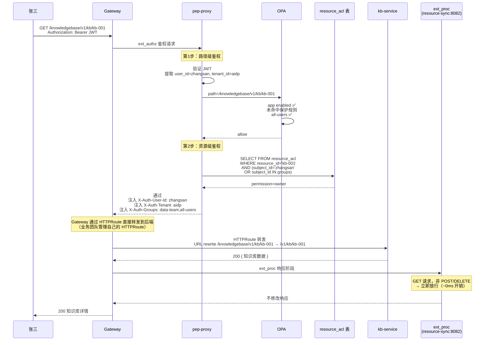
```mermaid
sequenceDiagram
    participant U as 张三
    participant GW as Gateway
    participant PEP as pep-proxy
    participant OPA as OPA
    participant DB as resource_acl 表
    participant KB as kb-service
    participant EP as ext_proc<br/>(resource-sync:8082)

    U->>GW: GET /knowledgebase/v1/kb/kb-001<br/>Authorization: Bearer JWT
    GW->>PEP: ext_authz 鉴权请求

    Note over PEP: 第1步：路径级鉴权
    PEP->>PEP: 验证 JWT<br/>提取 user_id=zhangsan, tenant_id=aidp
    PEP->>OPA: path=/knowledgebase/v1/kb/kb-001
    OPA->>OPA: app enabled ✅<br/>未命中保护规则<br/>all-users ✅
    OPA-->>PEP: allow

    Note over PEP: 第2步：资源级鉴权
    PEP->>DB: SELECT FROM resource_acl<br/>WHERE resource_id='kb-001'<br/>AND (subject_id='zhangsan'<br/>OR subject_id IN groups)
    DB-->>PEP: permission=owner

    PEP-->>GW: 通过<br/>注入 X-Auth-User-Id: zhangsan<br/>注入 X-Auth-Tenant: aidp<br/>注入 X-Auth-Groups: data-team,all-users

    Note over GW: Gateway 通过 HTTPRoute 直接转发到后端<br/>（业务团队管理自己的 HTTPRoute）
    GW->>KB: HTTPRoute 转发<br/>URL rewrite /knowledgebase/v1/kb/kb-001 → /v1/kb/kb-001
    KB-->>GW: 200 { 知识库数据 }

    GW->>EP: ext_proc 响应阶段
    Note over EP: GET 请求，非 POST/DELETE<br/>→ 立即放行（~0ms 开销）
    EP-->>GW: 不修改响应

    GW-->>U: 200 知识库详情
```

> **ext_proc 状态管理：** ext_proc 使用双向 gRPC 流（bidirectional streaming）与 Gateway 通信。请求阶段收到的上下文信息（method、path、user_id 等）在同一个 gRPC stream 中自然保持，响应阶段可直接使用，无需外部状态存储。

### 0.2 编辑已有资源（PUT 实例）

张三编辑自己的知识库。pep-proxy 检查 contributor 权限。ext_proc 对 PUT 请求立即放行。

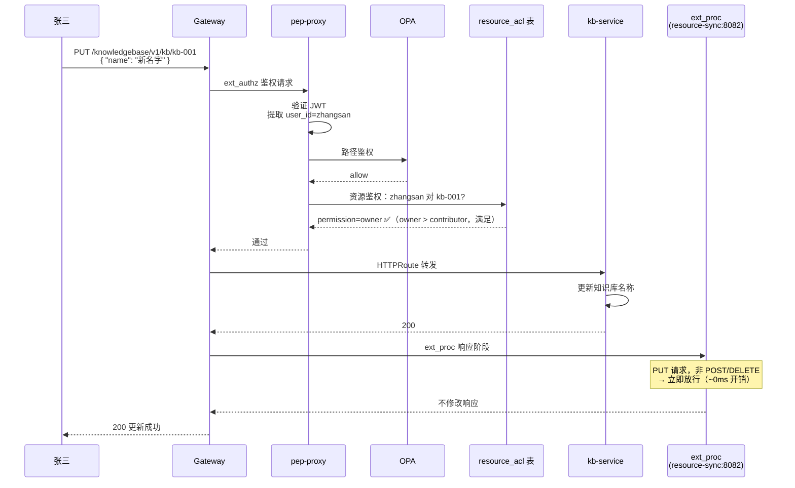
```mermaid
sequenceDiagram
    participant U as 张三
    participant GW as Gateway
    participant PEP as pep-proxy
    participant OPA as OPA
    participant DB as resource_acl 表
    participant KB as kb-service
    participant EP as ext_proc<br/>(resource-sync:8082)

    U->>GW: PUT /knowledgebase/v1/kb/kb-001<br/>{ "name": "新名字" }
    GW->>PEP: ext_authz 鉴权请求

    PEP->>PEP: 验证 JWT<br/>提取 user_id=zhangsan
    PEP->>OPA: 路径鉴权
    OPA-->>PEP: allow
    PEP->>DB: 资源鉴权：zhangsan 对 kb-001?
    DB-->>PEP: permission=owner ✅（owner > contributor，满足）

    PEP-->>GW: 通过
    GW->>KB: HTTPRoute 转发
    KB->>KB: 更新知识库名称
    KB-->>GW: 200

    GW->>EP: ext_proc 响应阶段
    Note over EP: PUT 请求，非 POST/DELETE<br/>→ 立即放行（~0ms 开销）
    EP-->>GW: 不修改响应

    GW-->>U: 200 更新成功
```

### 0.3 viewer 尝试编辑（pep-proxy 直接拒绝）

李四是 viewer，尝试编辑张三的知识库。pep-proxy 发现 viewer 权限不足以执行 PUT 操作，直接拒绝，请求不会到达后端。

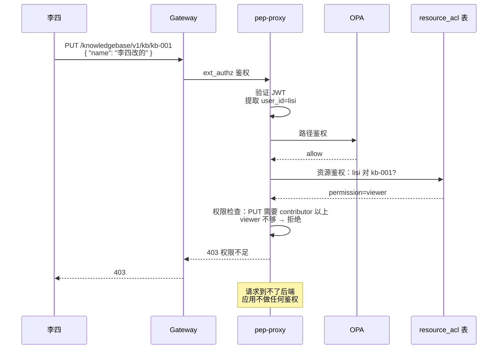
```mermaid
sequenceDiagram
    participant U as 李四
    participant GW as Gateway
    participant PEP as pep-proxy
    participant OPA as OPA
    participant DB as resource_acl 表

    U->>GW: PUT /knowledgebase/v1/kb/kb-001<br/>{ "name": "李四改的" }
    GW->>PEP: ext_authz 鉴权

    PEP->>PEP: 验证 JWT<br/>提取 user_id=lisi
    PEP->>OPA: 路径鉴权
    OPA-->>PEP: allow
    PEP->>DB: 资源鉴权：lisi 对 kb-001?
    DB-->>PEP: permission=viewer

    PEP->>PEP: 权限检查：PUT 需要 contributor 以上<br/>viewer 不够 → 拒绝
    PEP-->>GW: 403 权限不足
    GW-->>U: 403

    Note over PEP: 请求到不了后端<br/>应用不做任何鉴权
```

**pep-proxy 的权限-操作映射：**

```
权限等级：owner > contributor > viewer

路径段数判断（匹配 resource_patterns 后）：
  0段 POST（POST /v1/kb）            → 创建顶级资源 → 不查 resource_acl（放行，OPA path_rules 控制谁能创建）
  0段 GET（GET /v1/kb）              → 集合查询 → 不查 resource_acl（放行，后端自行过滤）
  1段 GET（/v1/kb/kb-001）           → 查看资源 → 需要 viewer
  1段 PUT/PATCH（/v1/kb/kb-001）     → 编辑资源 → 需要 contributor
  1段 DELETE（/v1/kb/kb-001）        → 删除资源 → 需要 owner
  2段+ POST（/v1/kb/kb-001/docs）    → 创建子资源 → 需要对父资源 contributor
  2段+ PUT/PATCH                     → 编辑子资源 → 需要对父资源 contributor
  2段+ DELETE                        → 删除子资源 → 需要对父资源 contributor
  2段+ GET（/v1/kb/kb-001/docs/d1）  → 查看子资源 → 需要对父资源 viewer
  不匹配 resource_patterns           → 放行（仅 OPA 路径鉴权）
```

### 0.3.1 管理员创建资源（OPA path_rules 拦截）

只有 memory-admins 能创建记忆库模板。普通用户被 OPA 直接拦住，不到 resource_acl 这一步。


```mermaid
sequenceDiagram
    participant U as 李四
    participant GW as Gateway
    participant PEP as pep-proxy
    participant OPA as OPA

    U->>GW: POST /memory/v1/admin/templates<br/>{ "name": "新模板" }
    GW->>PEP: ext_authz 鉴权

    PEP->>PEP: 验证 JWT<br/>提取 user_id=lisi
    PEP->>OPA: 路径鉴权<br/>path=/memory/v1/admin/templates
    OPA->>OPA: 命中 path_rules<br/>/memory/v1/admin/ → 需要 memory-admins<br/>李四不在 memory-admins 组
    OPA-->>PEP: deny

    PEP-->>GW: 403
    GW-->>U: 403 需要 memory-admins 权限

    Note over OPA: 管理员资源的创建权限由 OPA path_rules 控制<br/>不需要查 resource_acl
```

### 0.3.2 子资源创建（检查父资源权限）

李四是 kb-001 的 viewer，尝试在 kb-001 下创建文档。pep-proxy 检查父资源权限，viewer 不够创建子资源。

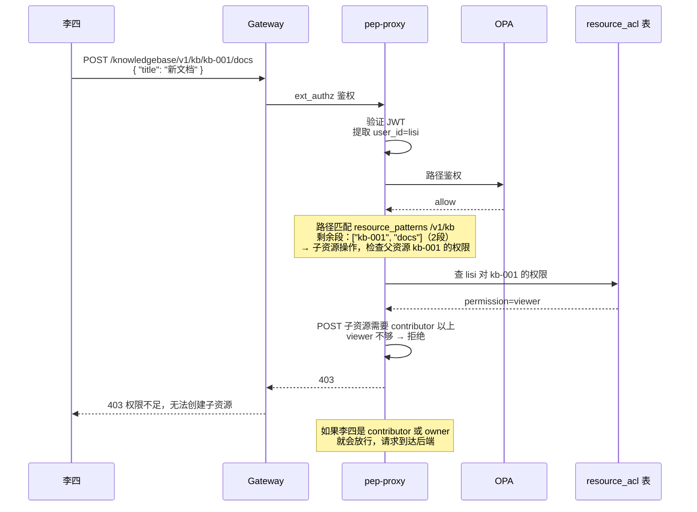
```mermaid
sequenceDiagram
    participant U as 李四
    participant GW as Gateway
    participant PEP as pep-proxy
    participant OPA as OPA
    participant DB as resource_acl 表

    U->>GW: POST /knowledgebase/v1/kb/kb-001/docs<br/>{ "title": "新文档" }
    GW->>PEP: ext_authz 鉴权

    PEP->>PEP: 验证 JWT<br/>提取 user_id=lisi
    PEP->>OPA: 路径鉴权
    OPA-->>PEP: allow

    Note over PEP: 路径匹配 resource_patterns /v1/kb<br/>剩余段：["kb-001", "docs"]（2段）<br/>→ 子资源操作，检查父资源 kb-001 的权限

    PEP->>DB: 查 lisi 对 kb-001 的权限
    DB-->>PEP: permission=viewer

    PEP->>PEP: POST 子资源需要 contributor 以上<br/>viewer 不够 → 拒绝
    PEP-->>GW: 403
    GW-->>U: 403 权限不足，无法创建子资源

    Note over PEP: 如果李四是 contributor 或 owner<br/>就会放行，请求到达后端
```

### 0.4 列表/搜索接口（ext_proc 请求阶段注入可访问 ID）

列表、搜索等接口不包含资源 ID，pep-proxy 不做资源级鉴权。ext_proc 在**请求阶段**查询 resource_acl，将可访问资源 ID 注入请求头 `X-Allowed-Ids`，后端直接读取 Header 过滤，**无需调用任何内部 API**。

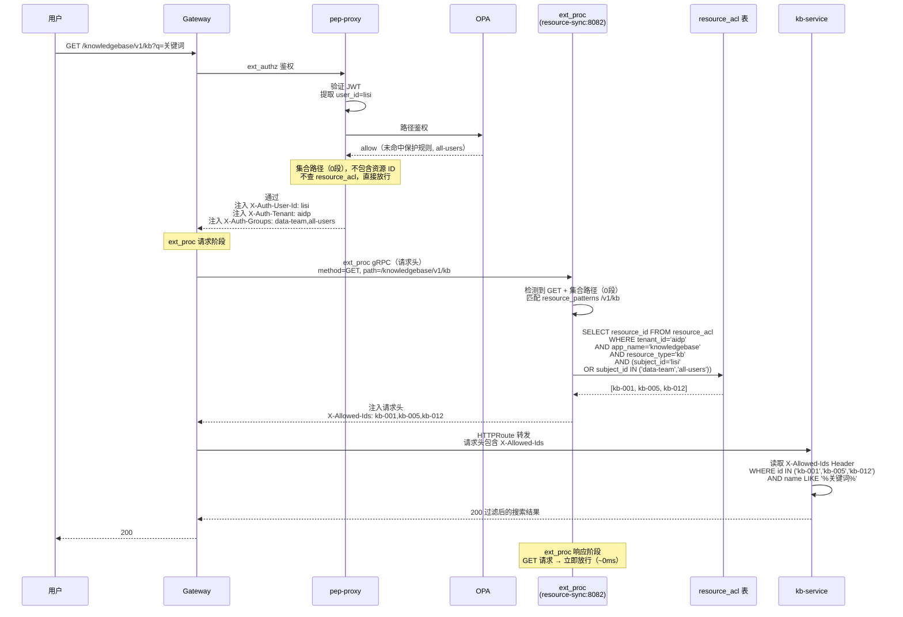
```mermaid
sequenceDiagram
    participant U as 用户
    participant GW as Gateway
    participant PEP as pep-proxy
    participant OPA as OPA
    participant EP as ext_proc<br/>(resource-sync:8082)
    participant DB as resource_acl 表
    participant KB as kb-service

    U->>GW: GET /knowledgebase/v1/kb?q=关键词
    GW->>PEP: ext_authz 鉴权

    PEP->>PEP: 验证 JWT<br/>提取 user_id=lisi
    PEP->>OPA: 路径鉴权
    OPA-->>PEP: allow（未命中保护规则, all-users）

    Note over PEP: 集合路径（0段），不包含资源 ID<br/>不查 resource_acl，直接放行

    PEP-->>GW: 通过<br/>注入 X-Auth-User-Id: lisi<br/>注入 X-Auth-Tenant: aidp<br/>注入 X-Auth-Groups: data-team,all-users

    Note over GW: ext_proc 请求阶段
    GW->>EP: ext_proc gRPC（请求头）<br/>method=GET, path=/knowledgebase/v1/kb
    EP->>EP: 检测到 GET + 集合路径（0段）<br/>匹配 resource_patterns /v1/kb
    EP->>DB: SELECT resource_id FROM resource_acl<br/>WHERE tenant_id='aidp'<br/>AND app_name='knowledgebase'<br/>AND resource_type='kb'<br/>AND (subject_id='lisi'<br/>OR subject_id IN ('data-team','all-users'))
    DB-->>EP: [kb-001, kb-005, kb-012]

    EP-->>GW: 注入请求头<br/>X-Allowed-Ids: kb-001,kb-005,kb-012

    GW->>KB: HTTPRoute 转发<br/>请求头包含 X-Allowed-Ids

    KB->>KB: 读取 X-Allowed-Ids Header<br/>WHERE id IN ('kb-001','kb-005','kb-012')<br/>AND name LIKE '%关键词%'
    KB-->>GW: 200 过滤后的搜索结果
    GW-->>U: 200

    Note over EP: ext_proc 响应阶段<br/>GET 请求 → 立即放行（~0ms）
```

**后端代码示例（极简）：**

```python
@app.get("/v1/kb")
def list_kb(request):
    allowed_ids = request.headers.get("X-Allowed-Ids", "")
    
    if not allowed_ids:
        return []
    
    ids = allowed_ids.split(",")
    
    items = db.query("SELECT * FROM kb WHERE id = ANY($1)", ids)
    return items
```

> resource_id 是全局唯一的 UUID，不存在数量过大需要降级的场景。ext_proc 始终将完整的可访问 ID 列表注入 `X-Allowed-Ids` Header。

> **备选方案：ext_proc 响应阶段过滤**
>
> 如果希望后端**完全零改动**（连读 Header 都不需要），可以改为在 ext_proc 响应阶段过滤：
> 后端正常返回全部数据 → ext_proc 查 resource_acl 拿到可访问 ID → 过滤响应 Body 只保留有权限的资源 → 返回。
> 优点：后端绝对零改动，无 Header 大小限制。
> 缺点：后端查了所有资源（含无权限的），有 DB 浪费；分页不精确（后端返回 20 条，过滤后可能只剩几条）。
> 适合不需要精确分页的场景（如搜索建议、推荐列表等）。

### 0.5 普通请求的性能路径总结

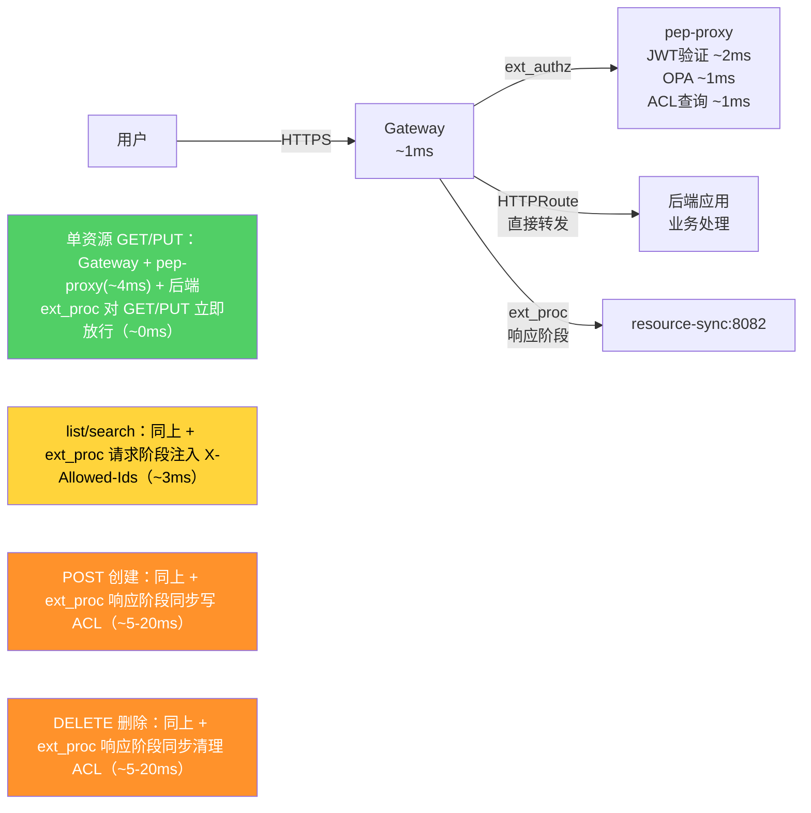
```mermaid
flowchart LR
    U[用户] -->|HTTPS| GW[Gateway<br/>~1ms]
    GW -->|ext_authz| PEP[pep-proxy<br/>JWT验证 ~2ms<br/>OPA ~1ms<br/>ACL查询 ~1ms]
    GW -->|HTTPRoute<br/>直接转发| APP[后端应用<br/>业务处理]
    GW -->|ext_proc<br/>响应阶段| EP[resource-sync:8082]

    TOTAL1["单资源 GET/PUT：Gateway + pep-proxy(~4ms) + 后端<br/>ext_proc 对 GET/PUT 立即放行（~0ms）"]
    TOTAL2["list/search：同上 + ext_proc 请求阶段注入 X-Allowed-Ids（~3ms）"]
    TOTAL3["POST 创建：同上 + ext_proc 响应阶段同步写 ACL（~5-20ms）"]
    TOTAL4["DELETE 删除：同上 + ext_proc 响应阶段同步清理 ACL（~5-20ms）"]

    style TOTAL1 fill:#51cf66,color:#fff
    style TOTAL2 fill:#ffd43b,color:#000
    style TOTAL3 fill:#ff922b,color:#fff
    style TOTAL4 fill:#ff922b,color:#fff
```

**关键点：**
- 单资源请求（GET/PUT/PATCH 实例）：ext_proc 立即放行，额外开销仅 pep-proxy 约 4ms
- list/search 请求：ext_proc 请求阶段注入 X-Allowed-Ids Header，额外约 3ms
- POST 创建 / DELETE 删除：ext_proc 响应阶段同步写/清理 ACL，额外 5-20ms
- failureMode: failOpen — ext_proc 失败时响应仍然返回给用户，ACL 写入 pending_acl 后台重试

---

## 0.6 API Key 认证请求（v2.1 新增）

外部应用通过 `X-API-Key: ak_xxx` 头调用 API，不需要走 OIDC 登录流程。pep-proxy 做 SHA256 哈希查询 `api_keys` 表，构造 service 身份，后续鉴权流程与 JWT 路径完全一致。

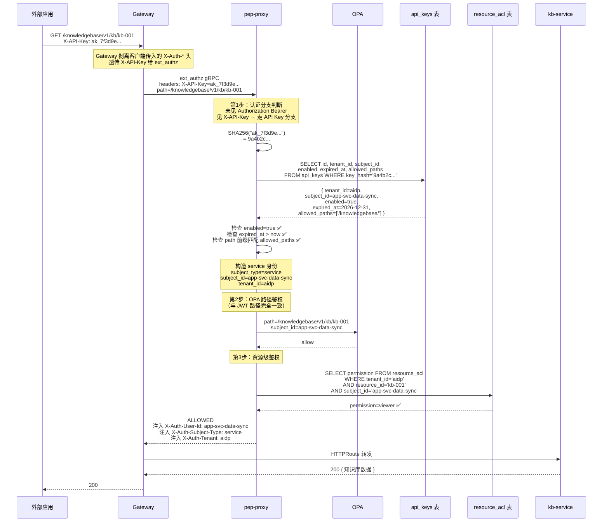
```mermaid
sequenceDiagram
    participant APP as 外部应用
    participant GW as Gateway
    participant PEP as pep-proxy
    participant OPA as OPA
    participant AK as api_keys 表
    participant DB as resource_acl 表
    participant KB as kb-service

    APP->>GW: GET /knowledgebase/v1/kb/kb-001<br/>X-API-Key: ak_7f3d9e...

    Note over GW: Gateway 剥离客户端传入的 X-Auth-* 头<br/>透传 X-API-Key 给 ext_authz
    GW->>PEP: ext_authz gRPC<br/>headers: X-API-Key=ak_7f3d9e...<br/>path=/knowledgebase/v1/kb/kb-001

    Note over PEP: 第1步：认证分支判断<br/>未见 Authorization Bearer<br/>见 X-API-Key → 走 API Key 分支

    PEP->>PEP: SHA256("ak_7f3d9e...")<br/>= 9a4b2c...
    PEP->>AK: SELECT id, tenant_id, subject_id,<br/>enabled, expired_at, allowed_paths<br/>FROM api_keys WHERE key_hash='9a4b2c...'
    AK-->>PEP: { tenant_id=aidp,<br/>subject_id=app-svc-data-sync,<br/>enabled=true,<br/>expired_at=2026-12-31,<br/>allowed_paths=['/knowledgebase/'] }

    PEP->>PEP: 检查 enabled=true ✅<br/>检查 expired_at > now ✅<br/>检查 path 前缀匹配 allowed_paths ✅

    Note over PEP: 构造 service 身份<br/>subject_type=service<br/>subject_id=app-svc-data-sync<br/>tenant_id=aidp

    Note over PEP: 第2步：OPA 路径鉴权<br/>（与 JWT 路径完全一致）
    PEP->>OPA: path=/knowledgebase/v1/kb/kb-001<br/>subject_id=app-svc-data-sync
    OPA-->>PEP: allow

    Note over PEP: 第3步：资源级鉴权
    PEP->>DB: SELECT permission FROM resource_acl<br/>WHERE tenant_id='aidp'<br/>AND resource_id='kb-001'<br/>AND subject_id='app-svc-data-sync'
    DB-->>PEP: permission=viewer ✅

    PEP-->>GW: ALLOWED<br/>注入 X-Auth-User-Id: app-svc-data-sync<br/>注入 X-Auth-Subject-Type: service<br/>注入 X-Auth-Tenant: aidp

    GW->>KB: HTTPRoute 转发
    KB-->>GW: 200 { 知识库数据 }
    GW-->>APP: 200
```

**关键点：**
- **Gateway 对 API Key 请求零感知** — 只负责透传 `X-API-Key` 头，不做解析
- **pep-proxy 的认证分支**：优先检查 Authorization Bearer（JWT），否则看 X-API-Key
- **数据库中永远不存明文密钥**，只存 SHA256 哈希 → 即使数据库泄露也无法还原密钥
- **API Key 身份与用户身份完全兼容 resource_acl** — 只需在 ACL 表中插入 `subject_type=service, subject_id=app-svc-xxx` 的记录即可授权
- **allowed_paths 是额外的"边界保护"** — 即使该 Key 在 resource_acl 上有权限，但如果请求路径不在 allowed_paths 前缀列表中也会被拒（401 `error="path_not_allowed"`）

**API Key 认证失败的响应：**

| 情况 | 响应 |
|------|------|
| api_keys 无匹配哈希 | 401 `error="invalid_key"` |
| enabled=false | 401 `error="key_disabled"` |
| expired_at < now | 401 `error="key_expired"` |
| 路径不在 allowed_paths | 403 `error="path_not_allowed"` |

---

## 0.7 Body 模式资源访问（v2.1 新增）

遗留应用使用非 RESTful 风格的 API — 资源 ID 放在请求体而不是 URL 路径里。通过在 `resource_patterns` 表上配置 `id_source=body, id_field=item_id`，pep-proxy 可以解析请求体 JSON 提取 resource_id。

**前置条件：** Gateway 的 SecurityPolicy 必须启用 `spec.extAuth.bodyToExtAuth.maxRequestBytes=8192`，否则 pep-proxy 收到的 CheckRequest.body 为空。

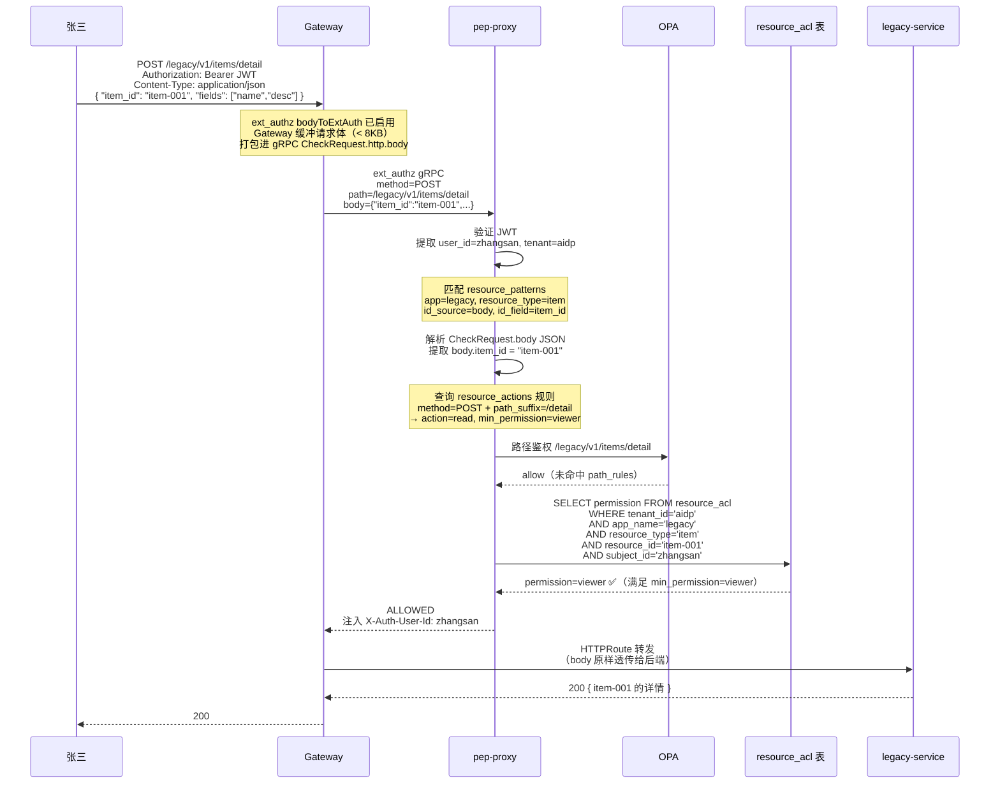
```mermaid
sequenceDiagram
    participant U as 张三
    participant GW as Gateway
    participant PEP as pep-proxy
    participant OPA as OPA
    participant DB as resource_acl 表
    participant APP as legacy-service

    U->>GW: POST /legacy/v1/items/detail<br/>Authorization: Bearer JWT<br/>Content-Type: application/json<br/>{ "item_id": "item-001", "fields": ["name","desc"] }

    Note over GW: ext_authz bodyToExtAuth 已启用<br/>Gateway 缓冲请求体（< 8KB）<br/>打包进 gRPC CheckRequest.http.body
    GW->>PEP: ext_authz gRPC<br/>method=POST<br/>path=/legacy/v1/items/detail<br/>body={"item_id":"item-001",...}

    PEP->>PEP: 验证 JWT<br/>提取 user_id=zhangsan, tenant=aidp

    Note over PEP: 匹配 resource_patterns<br/>app=legacy, resource_type=item<br/>id_source=body, id_field=item_id
    PEP->>PEP: 解析 CheckRequest.body JSON<br/>提取 body.item_id = "item-001"

    Note over PEP: 查询 resource_actions 规则<br/>method=POST + path_suffix=/detail<br/>→ action=read, min_permission=viewer

    PEP->>OPA: 路径鉴权 /legacy/v1/items/detail
    OPA-->>PEP: allow（未命中 path_rules）

    PEP->>DB: SELECT permission FROM resource_acl<br/>WHERE tenant_id='aidp'<br/>AND app_name='legacy'<br/>AND resource_type='item'<br/>AND resource_id='item-001'<br/>AND subject_id='zhangsan'
    DB-->>PEP: permission=viewer ✅（满足 min_permission=viewer）

    PEP-->>GW: ALLOWED<br/>注入 X-Auth-User-Id: zhangsan
    GW->>APP: HTTPRoute 转发<br/>（body 原样透传给后端）
    APP-->>GW: 200 { item-001 的详情 }
    GW-->>U: 200
```

**resource_patterns 配置示例：**

```sql
INSERT INTO resource_patterns
(app_name, resource_type, path_prefix, id_source, id_field, id_query_param)
VALUES
('legacy', 'item', '/legacy/v1/items', 'body', 'item_id', NULL);
```

**resource_actions 配置示例（把 POST /detail 识别为读操作）：**

```sql
INSERT INTO resource_actions
(app_name, resource_type, action, method, path_suffix, success_status, min_permission)
VALUES
('legacy', 'item', 'read',   'POST', '/detail', 200, 'viewer'),
('legacy', 'item', 'update', 'POST', '/update', 200, 'contributor'),
('legacy', 'item', 'delete', 'POST', '/remove', 200, 'owner'),
('legacy', 'item', 'create', 'POST', '/create', 200, 'none');
```

**三种 id_source 的对比：**

| id_source | 典型请求 | pep-proxy 提取方式 | 前置条件 |
|-----------|---------|-------------------|---------|
| `path` | `GET /v1/kb/kb-001` | 从 URL 路径段按 path_prefix 剥离后取第 0 段 | 无（默认行为） |
| `query` | `GET /v1/items?kb_id=kb-001` | 从 URL 查询参数取 `id_query_param` | 无 |
| `body` | `POST /v1/items/detail {"item_id":"kb-001"}` | 解析 CheckRequest.body JSON，按 `id_field`（支持 `data.kb_id` 嵌套） | **必须**启用 Gateway `bodyToExtAuth.maxRequestBytes` |

---

## 0.8 标准 RESTful 应用（resource_actions 表为空）

绝大多数遵循 REST 约定的应用不需要写入 `resource_actions` 表。pep-proxy 在启动时加载 resource_actions，发现某个 (app, resource_type) 在表中没有任何记录时，回退到代码内置的 **`DEFAULT_ACTIONS`**，行为与 v2.0 完全一致。

```mermaid
flowchart TD
    REQ[请求: GET /knowledgebase/v1/kb/kb-001] --> LOAD[pep-proxy 已在启动时加载 resource_actions]
    LOAD --> LOOKUP{查 resource_actions<br/>app=knowledgebase<br/>resource_type=kb}
    LOOKUP -->|有记录| CUSTOM[使用自定义规则]
    LOOKUP -->|无记录| DEFAULT[使用代码 DEFAULT_ACTIONS]

    DEFAULT --> RULES["DEFAULT_ACTIONS 规则表:<br/>create: POST + null + 201 + none<br/>list:   GET  + null + 200 + none<br/>read:   GET  + /{id} + 200 + viewer<br/>update: PUT/PATCH + /{id} + 200 + contributor<br/>delete: DELETE + /{id} + 200 + owner"]

    RULES --> MATCH[method=GET + path_suffix=/{id}<br/>→ action=read, min_permission=viewer]
    CUSTOM --> MATCH
    MATCH --> CHECK[继续做 resource_acl 权限判断]

    style DEFAULT fill:#51cf66,color:#fff
    style RULES fill:#dee2e6,color:#000
    style CHECK fill:#51cf66,color:#fff
```

**关键保证：零迁移**

- **v2.0 → v2.1 升级后**：现有所有应用（knowledgebase、memory 等遵循 REST 的）`resource_actions` 表为空 → 自动使用 DEFAULT_ACTIONS → 行为与 v2.0 一模一样
- **只有非标准 API** 才需要在 `resource_actions` 表中显式写入规则
- **新增规则是"叠加"**：当某个 (app, resource_type) 在表中出现任何一条记录后，pep-proxy 切换到使用该组合的自定义规则集合，不再混合 DEFAULT_ACTIONS

---

## 1 创建顶级资源

用户创建一个知识库（顶级资源）。Gateway 直接转发到后端，后端返回 201 后，Gateway 调 ext_proc（resource-sync:8082）同步注册 owner ACL。

**这是架构的核心变化：resource-sync 不再是反向代理，而是通过 ext_proc 机制在响应阶段介入。**

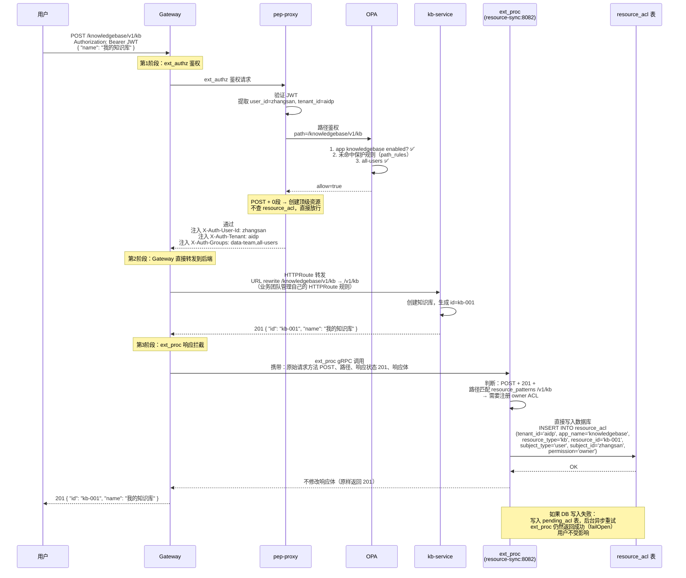
```mermaid
sequenceDiagram
    participant U as 用户
    participant GW as Gateway
    participant PEP as pep-proxy
    participant OPA as OPA
    participant KB as kb-service
    participant EP as ext_proc<br/>(resource-sync:8082)
    participant DB as resource_acl 表

    U->>GW: POST /knowledgebase/v1/kb<br/>Authorization: Bearer JWT<br/>{ "name": "我的知识库" }

    Note over GW: 第1阶段：ext_authz 鉴权
    GW->>PEP: ext_authz 鉴权请求
    PEP->>PEP: 验证 JWT<br/>提取 user_id=zhangsan, tenant_id=aidp
    PEP->>OPA: 路径鉴权<br/>path=/knowledgebase/v1/kb
    OPA->>OPA: 1. app knowledgebase enabled? ✅<br/>2. 未命中保护规则（path_rules）<br/>3. all-users ✅
    OPA-->>PEP: allow=true

    Note over PEP: POST + 0段 → 创建顶级资源<br/>不查 resource_acl，直接放行
    PEP-->>GW: 通过<br/>注入 X-Auth-User-Id: zhangsan<br/>注入 X-Auth-Tenant: aidp<br/>注入 X-Auth-Groups: data-team,all-users

    Note over GW: 第2阶段：Gateway 直接转发到后端
    GW->>KB: HTTPRoute 转发<br/>URL rewrite /knowledgebase/v1/kb → /v1/kb<br/>（业务团队管理自己的 HTTPRoute 规则）
    KB->>KB: 创建知识库，生成 id=kb-001
    KB-->>GW: 201 { "id": "kb-001", "name": "我的知识库" }

    Note over GW: 第3阶段：ext_proc 响应拦截
    GW->>EP: ext_proc gRPC 调用<br/>携带：原始请求方法 POST、路径、响应状态 201、响应体
    EP->>EP: 判断：POST + 201 +<br/>路径匹配 resource_patterns /v1/kb<br/>→ 需要注册 owner ACL

    EP->>DB: 直接写入数据库<br/>INSERT INTO resource_acl<br/>(tenant_id='aidp', app_name='knowledgebase',<br/>resource_type='kb', resource_id='kb-001',<br/>subject_type='user', subject_id='zhangsan',<br/>permission='owner')
    DB-->>EP: OK

    EP-->>GW: 不修改响应体（原样返回 201）

    GW-->>U: 201 { "id": "kb-001", "name": "我的知识库" }

    Note over EP,DB: 如果 DB 写入失败：<br/>写入 pending_acl 表，后台异步重试<br/>ext_proc 仍然返回成功（failOpen）<br/>用户不受影响
```

---

## 2 访问资源

李四访问张三的知识库，pep-proxy 查 resource_acl 判断权限。

**有权限的情况（李四是 viewer）：**

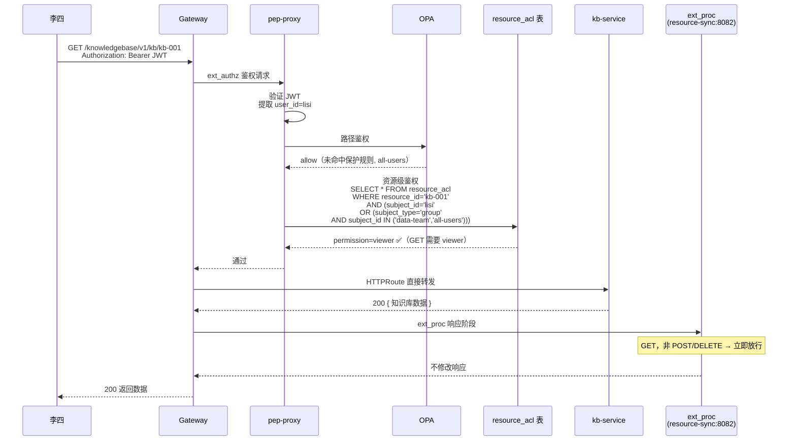
```mermaid
sequenceDiagram
    participant U as 李四
    participant GW as Gateway
    participant PEP as pep-proxy
    participant OPA as OPA
    participant DB as resource_acl 表
    participant KB as kb-service
    participant EP as ext_proc<br/>(resource-sync:8082)

    U->>GW: GET /knowledgebase/v1/kb/kb-001<br/>Authorization: Bearer JWT
    GW->>PEP: ext_authz 鉴权请求
    PEP->>PEP: 验证 JWT<br/>提取 user_id=lisi
    PEP->>OPA: 路径鉴权
    OPA-->>PEP: allow（未命中保护规则, all-users）
    PEP->>DB: 资源级鉴权<br/>SELECT * FROM resource_acl<br/>WHERE resource_id='kb-001'<br/>AND (subject_id='lisi'<br/>OR (subject_type='group'<br/>AND subject_id IN ('data-team','all-users')))
    DB-->>PEP: permission=viewer ✅（GET 需要 viewer）
    PEP-->>GW: 通过
    GW->>KB: HTTPRoute 直接转发
    KB-->>GW: 200 { 知识库数据 }
    GW->>EP: ext_proc 响应阶段
    Note over EP: GET，非 POST/DELETE → 立即放行
    EP-->>GW: 不修改响应
    GW-->>U: 200 返回数据
```

**李四没有权限的情况：**

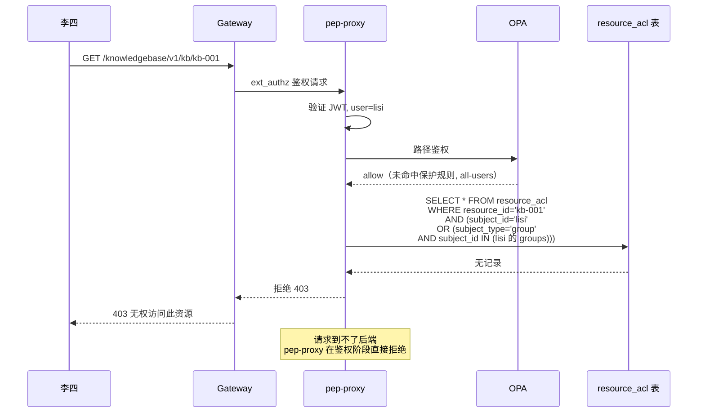
```mermaid
sequenceDiagram
    participant U as 李四
    participant GW as Gateway
    participant PEP as pep-proxy
    participant OPA as OPA
    participant DB as resource_acl 表

    U->>GW: GET /knowledgebase/v1/kb/kb-001
    GW->>PEP: ext_authz 鉴权请求
    PEP->>PEP: 验证 JWT, user=lisi

    PEP->>OPA: 路径鉴权
    OPA-->>PEP: allow（未命中保护规则, all-users）

    PEP->>DB: SELECT * FROM resource_acl<br/>WHERE resource_id='kb-001'<br/>AND (subject_id='lisi'<br/>OR (subject_type='group'<br/>AND subject_id IN (lisi 的 groups)))
    DB-->>PEP: 无记录
    PEP-->>GW: 拒绝 403
    GW-->>U: 403 无权访问此资源

    Note over PEP: 请求到不了后端<br/>pep-proxy 在鉴权阶段直接拒绝
```

---

## 3 删除资源

张三删除自己的知识库。pep-proxy 验证 owner 权限后放行，Gateway 转发到后端，后端返回成功后 ext_proc 同步清理所有 ACL 记录。

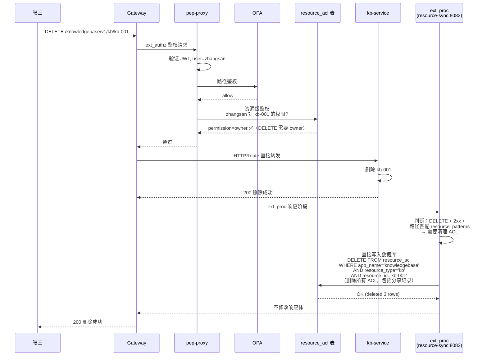
```mermaid
sequenceDiagram
    participant U as 张三
    participant GW as Gateway
    participant PEP as pep-proxy
    participant OPA as OPA
    participant DB as resource_acl 表
    participant KB as kb-service
    participant EP as ext_proc<br/>(resource-sync:8082)

    U->>GW: DELETE /knowledgebase/v1/kb/kb-001
    GW->>PEP: ext_authz 鉴权请求
    PEP->>PEP: 验证 JWT, user=zhangsan
    PEP->>OPA: 路径鉴权
    OPA-->>PEP: allow
    PEP->>DB: 资源级鉴权<br/>zhangsan 对 kb-001 的权限?
    DB-->>PEP: permission=owner ✅（DELETE 需要 owner）
    PEP-->>GW: 通过

    GW->>KB: HTTPRoute 直接转发
    KB->>KB: 删除 kb-001
    KB-->>GW: 200 删除成功

    GW->>EP: ext_proc 响应阶段
    EP->>EP: 判断：DELETE + 2xx +<br/>路径匹配 resource_patterns<br/>→ 需要清理 ACL

    EP->>DB: 直接写入数据库<br/>DELETE FROM resource_acl<br/>WHERE app_name='knowledgebase'<br/>AND resource_type='kb'<br/>AND resource_id='kb-001'<br/>（删除所有 ACL，包括分享记录）
    DB-->>EP: OK (deleted 3 rows)

    EP-->>GW: 不修改响应体
    GW-->>U: 200 删除成功
```

---

## 4 分享资源

张三把 kb-001 分享给李四。直接走 IAM 的 ACL API（resource-sync:8080），不经过后端应用。

> **注意：** `/acl/` 路由没有绑定 ext_proc，因此 resource-sync:8080 返回的 201 响应不会触发 ext_proc 的 ACL 同步逻辑。ACL 写入由 resource-sync:8080 自身直接完成。

> **资源鉴权不依赖 app_name：** pep-proxy 对 ACL API 做资源级鉴权时，通过 `(tenant_id, resource_id, subject_id)` 查询 resource_acl 表来验证 owner 权限。因为 resource_id 是全局唯一的 UUID，所以查询时不需要 app_name，一个 UUID 不会跨应用重复。

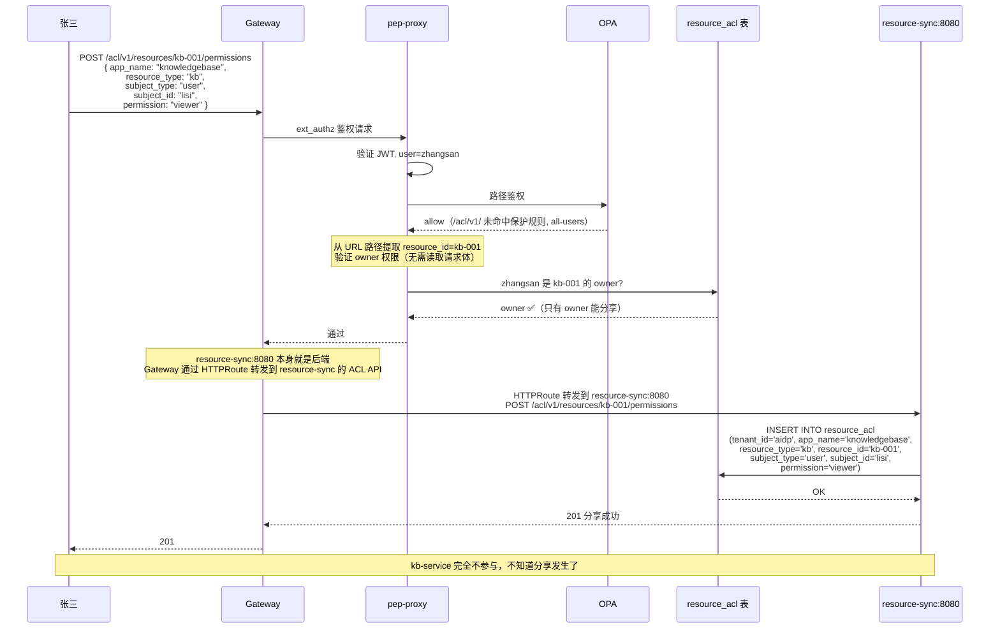
```mermaid
sequenceDiagram
    participant U as 张三
    participant GW as Gateway
    participant PEP as pep-proxy
    participant OPA as OPA
    participant DB as resource_acl 表
    participant RS as resource-sync:8080

    U->>GW: POST /acl/v1/resources/kb-001/permissions<br/>{ app_name: "knowledgebase",<br/>  resource_type: "kb",<br/>  subject_type: "user",<br/>  subject_id: "lisi",<br/>  permission: "viewer" }
    GW->>PEP: ext_authz 鉴权请求
    PEP->>PEP: 验证 JWT, user=zhangsan
    PEP->>OPA: 路径鉴权
    OPA-->>PEP: allow（/acl/v1/ 未命中保护规则, all-users）
    Note over PEP: 从 URL 路径提取 resource_id=kb-001<br/>验证 owner 权限（无需读取请求体）
    PEP->>DB: zhangsan 是 kb-001 的 owner?
    DB-->>PEP: owner ✅（只有 owner 能分享）
    PEP-->>GW: 通过

    Note over GW: resource-sync:8080 本身就是后端<br/>Gateway 通过 HTTPRoute 转发到 resource-sync 的 ACL API
    GW->>RS: HTTPRoute 转发到 resource-sync:8080<br/>POST /acl/v1/resources/kb-001/permissions
    RS->>DB: INSERT INTO resource_acl<br/>(tenant_id='aidp', app_name='knowledgebase',<br/>resource_type='kb', resource_id='kb-001',<br/>subject_type='user', subject_id='lisi',<br/>permission='viewer')
    DB-->>RS: OK
    RS-->>GW: 201 分享成功
    GW-->>U: 201

    Note over U,RS: kb-service 完全不参与，不知道分享发生了
```

**分享给组：**

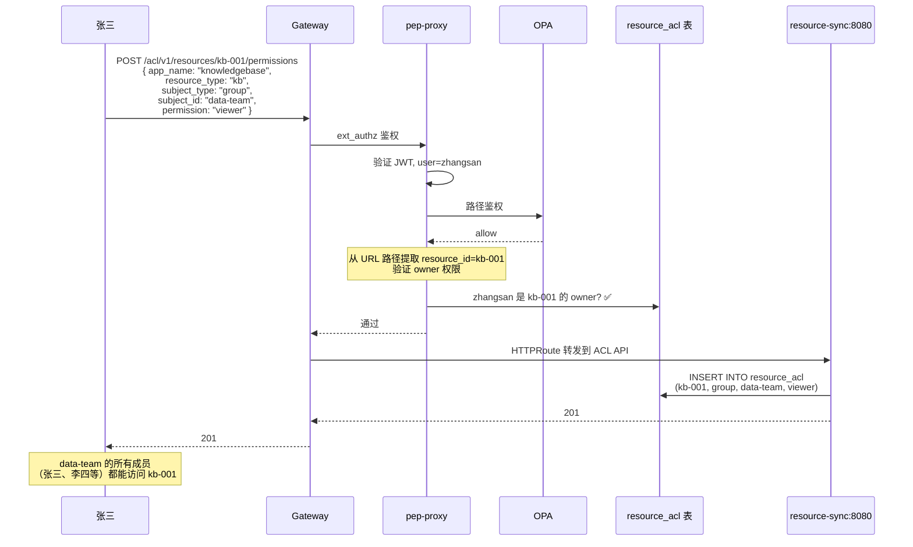
```mermaid
sequenceDiagram
    participant U as 张三
    participant GW as Gateway
    participant PEP as pep-proxy
    participant OPA as OPA
    participant DB as resource_acl 表
    participant RS as resource-sync:8080

    U->>GW: POST /acl/v1/resources/kb-001/permissions<br/>{ app_name: "knowledgebase",<br/>  resource_type: "kb",<br/>  subject_type: "group",<br/>  subject_id: "data-team",<br/>  permission: "viewer" }
    GW->>PEP: ext_authz 鉴权
    PEP->>PEP: 验证 JWT, user=zhangsan
    PEP->>OPA: 路径鉴权
    OPA-->>PEP: allow
    Note over PEP: 从 URL 路径提取 resource_id=kb-001<br/>验证 owner 权限
    PEP->>DB: zhangsan 是 kb-001 的 owner? ✅
    PEP-->>GW: 通过
    GW->>RS: HTTPRoute 转发到 ACL API
    RS->>DB: INSERT INTO resource_acl<br/>(kb-001, group, data-team, viewer)
    RS-->>GW: 201
    GW-->>U: 201

    Note over U: data-team 的所有成员<br/>（张三、李四等）都能访问 kb-001
```

---

## 5 列出我的资源

用户查看自己能访问的知识库列表。与场景 0.4 相同，ext_proc 在请求阶段查询可访问 ID 并注入 `X-Allowed-Ids` Header，后端直接读取过滤。

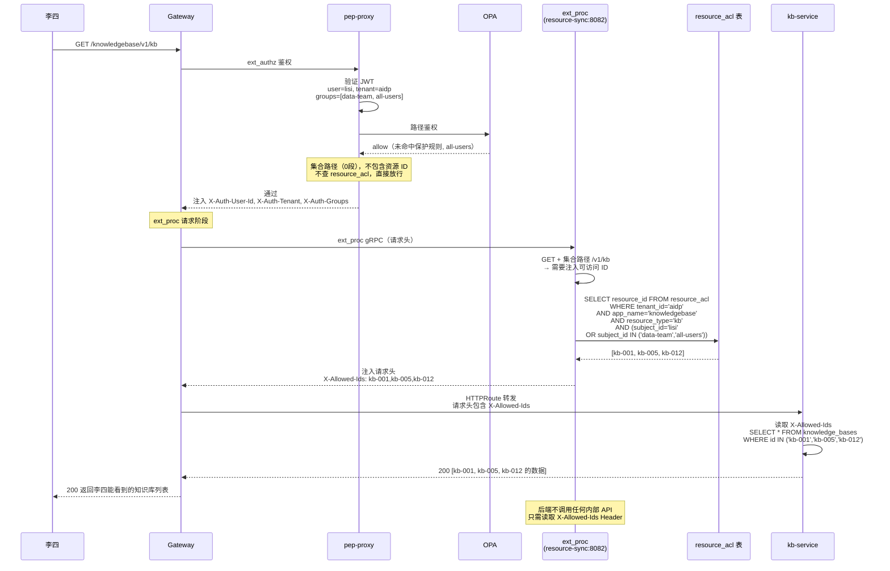
```mermaid
sequenceDiagram
    participant U as 李四
    participant GW as Gateway
    participant PEP as pep-proxy
    participant OPA as OPA
    participant EP as ext_proc<br/>(resource-sync:8082)
    participant DB as resource_acl 表
    participant KB as kb-service

    U->>GW: GET /knowledgebase/v1/kb
    GW->>PEP: ext_authz 鉴权

    PEP->>PEP: 验证 JWT<br/>user=lisi, tenant=aidp<br/>groups=[data-team, all-users]
    PEP->>OPA: 路径鉴权
    OPA-->>PEP: allow（未命中保护规则, all-users）

    Note over PEP: 集合路径（0段），不包含资源 ID<br/>不查 resource_acl，直接放行

    PEP-->>GW: 通过<br/>注入 X-Auth-User-Id, X-Auth-Tenant, X-Auth-Groups

    Note over GW: ext_proc 请求阶段
    GW->>EP: ext_proc gRPC（请求头）
    EP->>EP: GET + 集合路径 /v1/kb<br/>→ 需要注入可访问 ID
    EP->>DB: SELECT resource_id FROM resource_acl<br/>WHERE tenant_id='aidp'<br/>AND app_name='knowledgebase'<br/>AND resource_type='kb'<br/>AND (subject_id='lisi'<br/>OR subject_id IN ('data-team','all-users'))
    DB-->>EP: [kb-001, kb-005, kb-012]
    EP-->>GW: 注入请求头<br/>X-Allowed-Ids: kb-001,kb-005,kb-012

    GW->>KB: HTTPRoute 转发<br/>请求头包含 X-Allowed-Ids
    KB->>KB: 读取 X-Allowed-Ids<br/>SELECT * FROM knowledge_bases<br/>WHERE id IN ('kb-001','kb-005','kb-012')
    KB-->>GW: 200 [kb-001, kb-005, kb-012 的数据]
    GW-->>U: 200 返回李四能看到的知识库列表

    Note over EP: 后端不调用任何内部 API<br/>只需读取 X-Allowed-Ids Header
```

---

## 6 链路总览

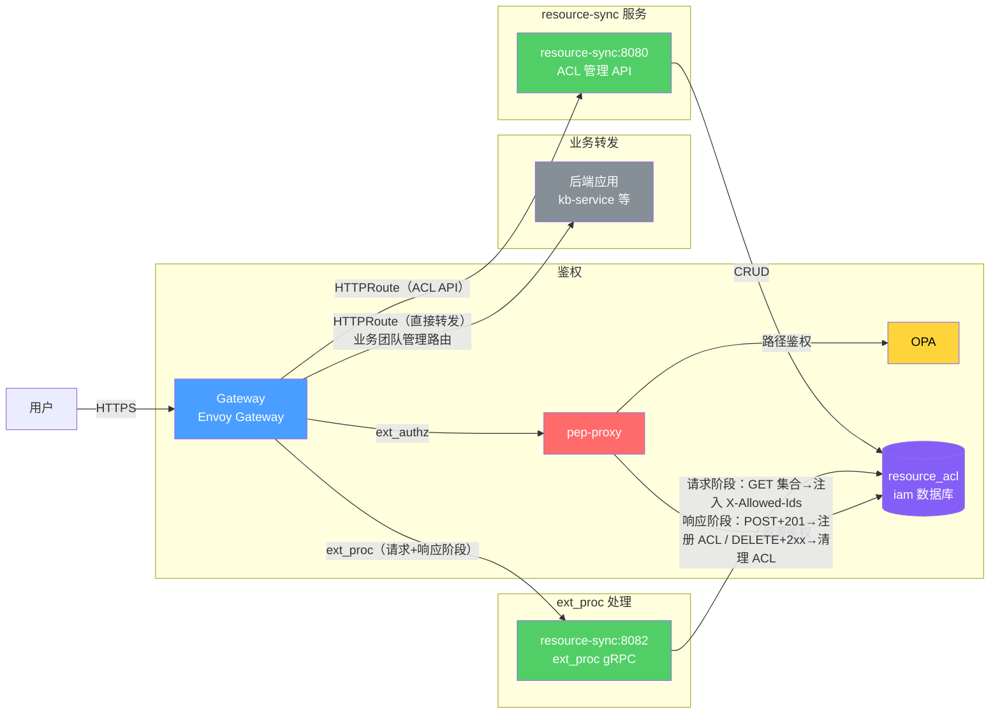
```mermaid
flowchart LR
    U[用户] -->|HTTPS| GW[Gateway<br/>Envoy Gateway]

    subgraph 鉴权
        GW -->|ext_authz| PEP[pep-proxy]
        PEP -->|路径鉴权| OPA[OPA]
        PEP -->|资源鉴权| DB[(resource_acl<br/>iam 数据库)]
    end

    subgraph 业务转发
        GW -->|"HTTPRoute（直接转发）<br/>业务团队管理路由"| APP[后端应用<br/>kb-service 等]
    end

    subgraph ext_proc 处理
        GW -->|"ext_proc（请求+响应阶段）"| EP[resource-sync:8082<br/>ext_proc gRPC]
        EP -->|"请求阶段：GET 集合→注入 X-Allowed-Ids<br/>响应阶段：POST+201→注册 ACL / DELETE+2xx→清理 ACL"| DB
    end

    subgraph resource-sync 服务
        RS8080[resource-sync:8080<br/>ACL 管理 API]
        EP
    end

    GW -->|"HTTPRoute（ACL API）"| RS8080
    RS8080 -->|CRUD| DB

    style GW fill:#4a9eff,color:#fff
    style PEP fill:#ff6b6b,color:#fff
    style EP fill:#51cf66,color:#fff
    style RS8080 fill:#51cf66,color:#fff
    style OPA fill:#ffd43b,color:#000
    style DB fill:#845ef7,color:#fff
    style APP fill:#868e96,color:#fff
```

> **Header 清洗：** Gateway 在处理请求前，自动剥离客户端请求中的 `X-Auth-*` 和 `X-Allowed-Ids` Header，防止伪造。

> **ext_proc 状态管理：** ext_proc 与 Gateway 之间使用双向 gRPC 流，请求阶段的上下文（method、path、user_id）在同一 stream 中保持到响应阶段，无需外部状态存储。

**每个组件在链路中的角色：**

| 组件 | 端口/协议 | 链路中做什么 |
|------|-----------|-------------|
| **Gateway (Envoy Gateway)** | 443 HTTPS | TLS 终止、HTTPRoute 路由转发、ext_authz 鉴权、ext_proc 响应拦截、剥离客户端伪造的 X-Auth-*/X-Allowed-Ids Header |
| **pep-proxy** | ext_authz gRPC | JWT 验证、OPA 路径鉴权、resource_acl 资源实例鉴权、注入 X-Auth-* Header |
| **OPA** | 内存计算 | 路径级策略判断（apps enabled、path_rules、all-users） |
| **resource-sync:8082** | ext_proc gRPC | 请求阶段：GET 集合路径→查 ACL 注入 X-Allowed-Ids Header；响应阶段：POST+201→注册 owner ACL，DELETE+2xx→清理 ACL；其他立即放行。直接读写数据库，同进程内完成 |
| **resource-sync:8080** | HTTP（经 Gateway） | ACL 管理 API（/acl/v1/resources/{resource_id}/permissions CRUD），分享/取消分享/查看权限 |
| **resource_acl 表** | PostgreSQL（iam 库） | 资源权限数据存储，tenant 级别隔离 |
| **后端应用** | HTTP | 纯业务逻辑，list/search 读 X-Allowed-Ids Header 过滤，不做鉴权 |

**数据库表分级：**

| 表 | 级别 | 说明 |
|---|------|------|
| apps | 系统级（无 tenant_id） | 应用注册 |
| resource_patterns | 系统级（无 tenant_id） | 资源路径模式 |
| path_rules | 系统级（无 tenant_id） | 路径保护规则 |
| resource_acl | 租户级（有 tenant_id） | 资源权限记录 |
| pending_acl | 租户级（有 tenant_id） | ACL 写入失败时的重试队列 |

**关键架构决策：**

1. **Gateway 直接转发** — resource-sync 不是反向代理，业务团队管理自己的 HTTPRoute
2. **ext_proc 双阶段处理** — 请求阶段：GET 集合路径注入 X-Allowed-Ids；响应阶段：POST+201 注册 ACL / DELETE+2xx 清理 ACL
3. **failOpen** — ext_proc 失败时响应仍返回用户，ACL 写入 pending_acl 后台重试
4. **同步写入** — ext_proc 阻塞响应 5-20ms（仅创建/删除时），确保 ACL 一致性
5. **双端口分离** — 8082 ext_proc gRPC / 8080 外部 ACL API，职责清晰
