# 请求链路视角 — 六种典型场景

> 版本：v1.1 | 日期：2026-04-02

---

## 0 普通业务请求（最常见，不涉及权限变动）

日常使用中 90% 以上的请求都是这种：查看数据、编辑已有资源、调用业务接口。不创建、不删除、不分享，权限数据不变。

### 0.1 查看单个资源（GET 实例）

张三查看自己的知识库详情。

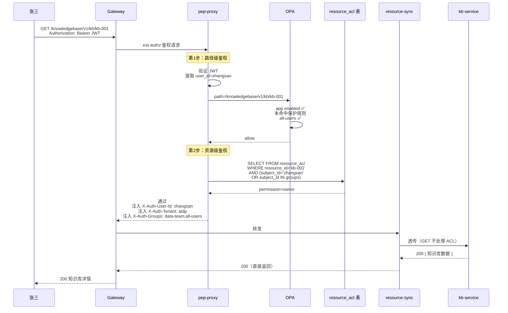

### 0.2 编辑已有资源（PUT 实例）

张三编辑自己的知识库。resource-sync 不做任何 ACL 操作（PUT 不影响权限）。

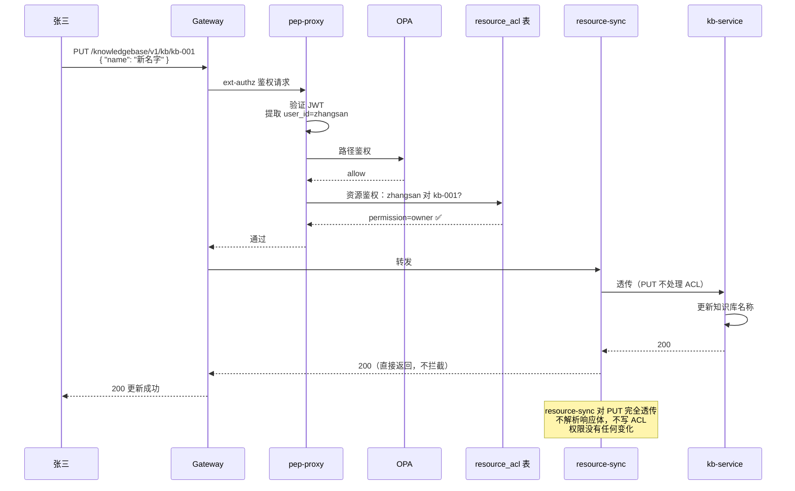

### 0.3 viewer 尝试编辑（pep-proxy 直接拒绝）

李四是 viewer，尝试编辑张三的知识库。pep-proxy 发现 viewer 权限不足以执行 PUT 操作，直接拒绝，请求不会到达后端。

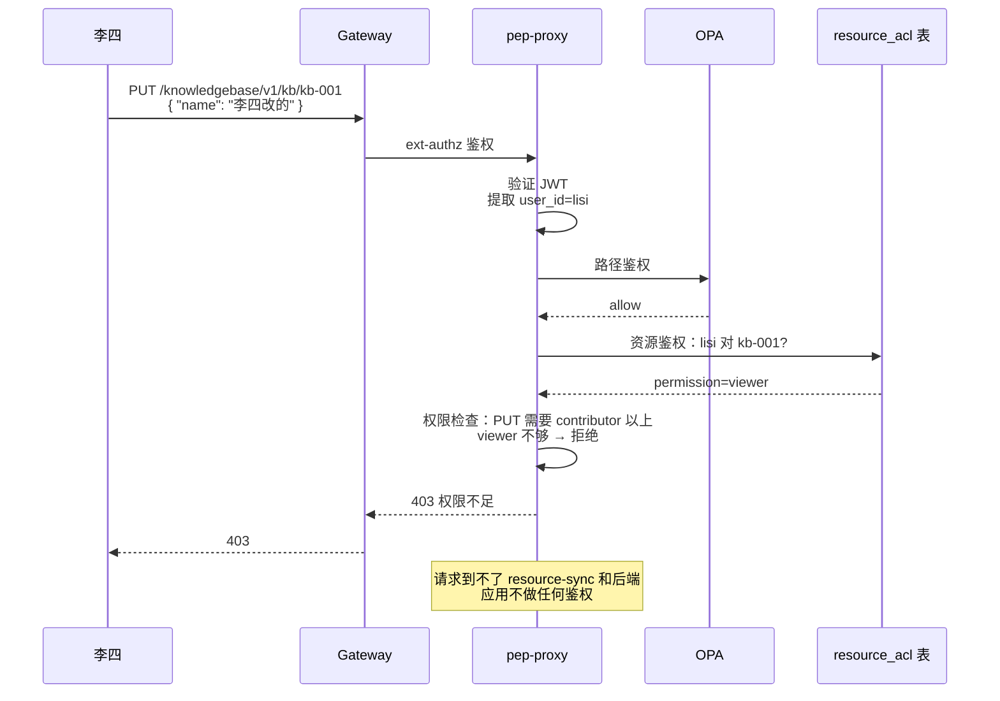

**pep-proxy 的权限-操作映射：**

```
权限等级：owner > contributor > viewer

路径段数判断（匹配 resource_patterns 后）：
  POST + 0段（/v1/kb）          → 创建顶级资源 → 不查 resource_acl（OPA path_rules 控制）
  GET  + 1段（/v1/kb/kb-001）   → 查看资源 → 需要 viewer
  PUT  + 1段（/v1/kb/kb-001）   → 编辑资源 → 需要 contributor
  DELETE + 1段（/v1/kb/kb-001） → 删除资源 → 需要 owner
  POST + 2段（/v1/kb/kb-001/docs）       → 创建子资源 → 需要对父资源 contributor
  GET  + 2段以上（/v1/kb/kb-001/docs/d1） → 查看子资源 → 需要对父资源 viewer
  PUT  + 2段以上                          → 编辑子资源 → 需要对父资源 contributor
  DELETE + 2段以上                        → 删除子资源 → 需要对父资源 contributor
```

### 0.3.1 管理员创建资源（OPA path_rules 拦截）

只有 memory-admins 能创建记忆库模板。普通用户被 OPA 直接拦住，不到 resource_acl 这一步。

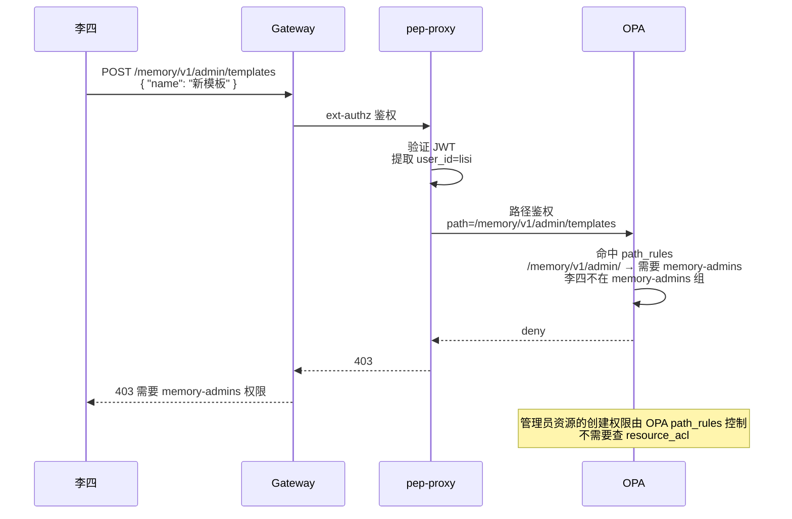

### 0.3.2 子资源创建（检查父资源权限）

李四是 kb-001 的 viewer，尝试在 kb-001 下创建文档。pep-proxy 检查父资源权限，viewer 不够创建子资源。

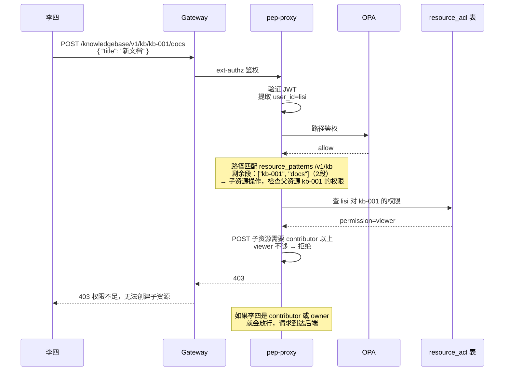

### 0.4 搜索接口（后端调内部接口过滤）

搜索、list 等接口不包含资源 ID，pep-proxy 不做资源级鉴权。但搜索结果需要只包含用户有权限的资源，后端调 resource-sync 内部接口获取可访问 ID 列表。

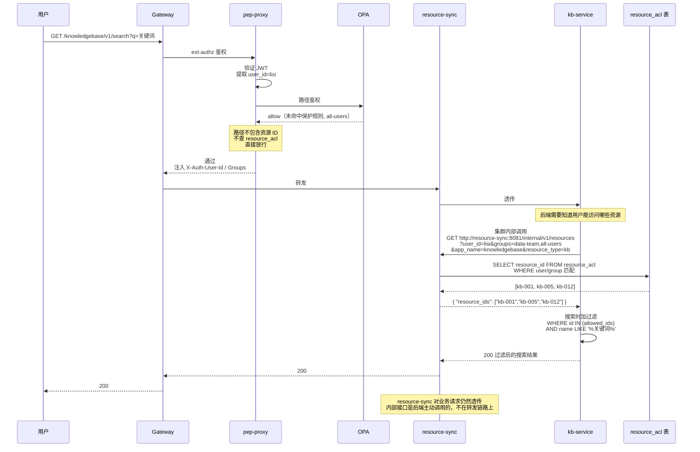

### 0.4.1 不需要资源过滤的接口

系统健康检查、全局配置等接口，不涉及资源，不需要调内部接口。

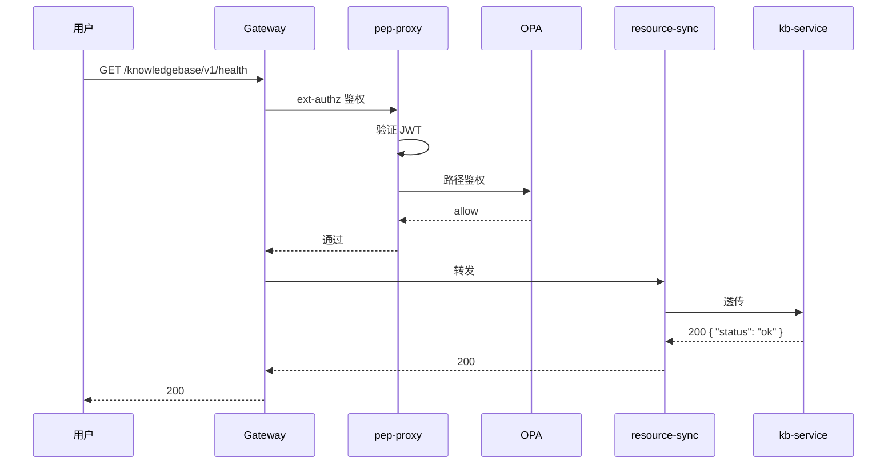

### 0.5 普通请求的性能路径总结

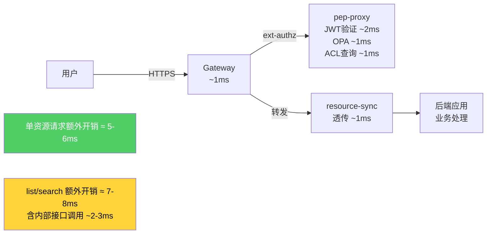

**关键点：**
- 单资源请求（GET/PUT/DELETE /v1/kb/kb-001）：resource-sync 透传，额外开销约 5-6ms
- list/search 请求：后端多一次 resource-sync 内部接口调用，额外开销约 7-8ms

---

## 1 创建顶级资源

用户创建一个知识库（顶级资源），resource-sync 自动注册 owner。OPA 通过 path_rules 控制谁能创建（未命中保护规则的路径 all-users 可创建）。

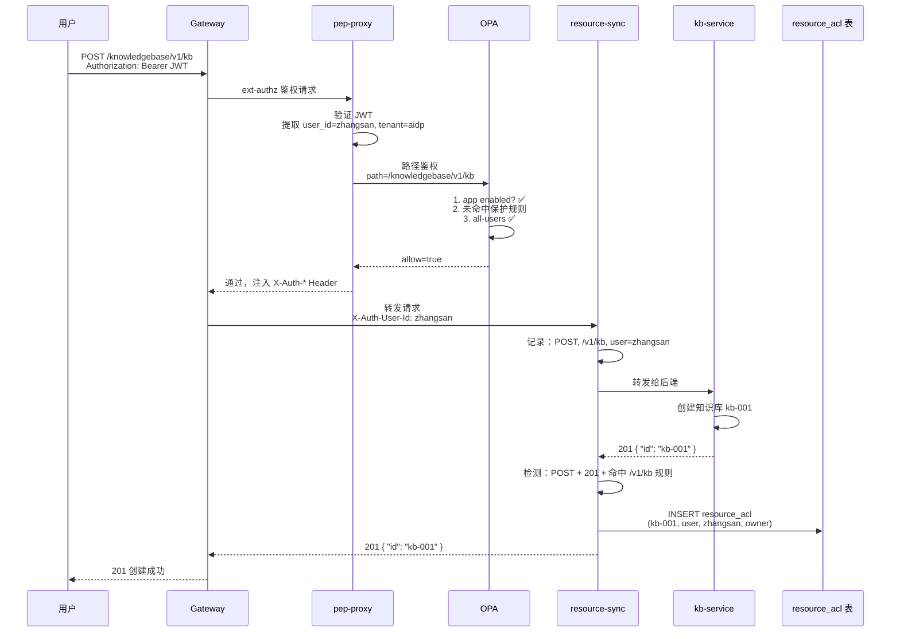

---

## 2 访问资源

李四访问张三的知识库，pep-proxy 查 resource_acl 判断权限。

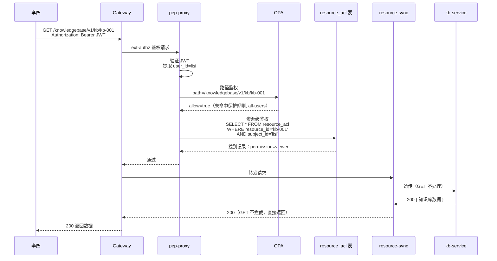

**李四没有权限的情况：**

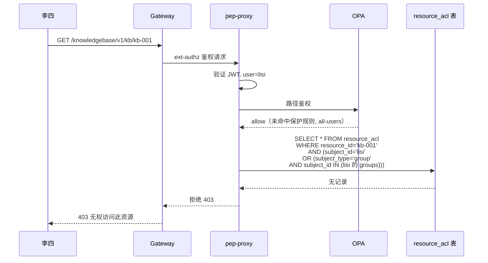

---

## 3 删除资源

张三删除自己的知识库，resource-sync 自动清理所有 ACL。

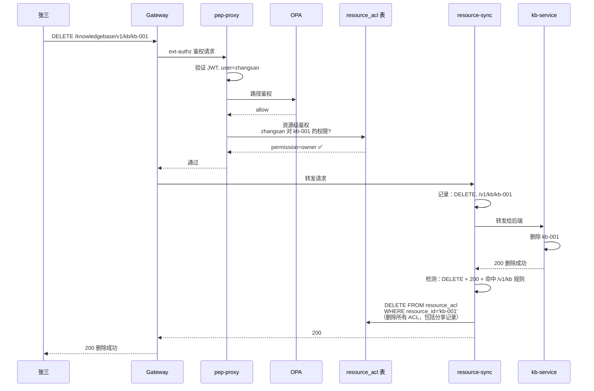

---

## 4 分享资源

张三把 kb-001 分享给李四。直接走 IAM 的 ACL API，不经过后端应用。

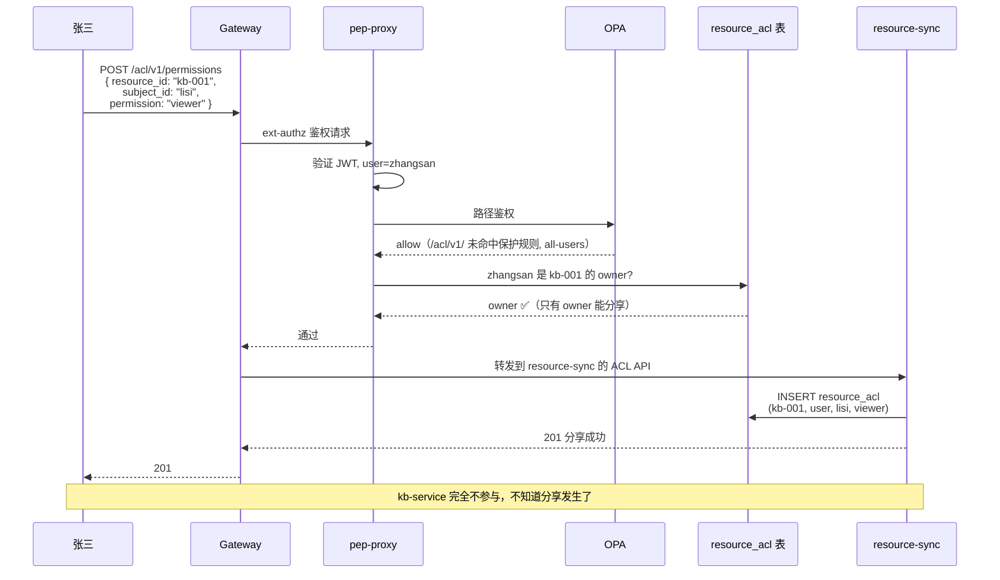

**分享给组：**

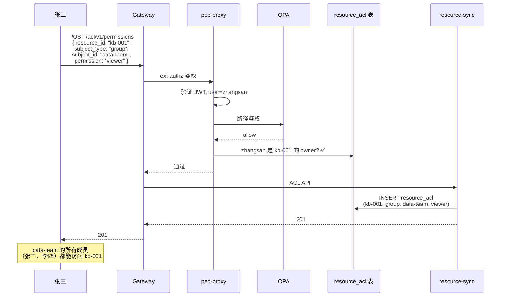

---

## 5 列出我的资源

用户查看自己能访问的知识库列表。pep-proxy 只做路径鉴权，后端主动调 resource-sync 内部接口获取可访问 ID 列表。

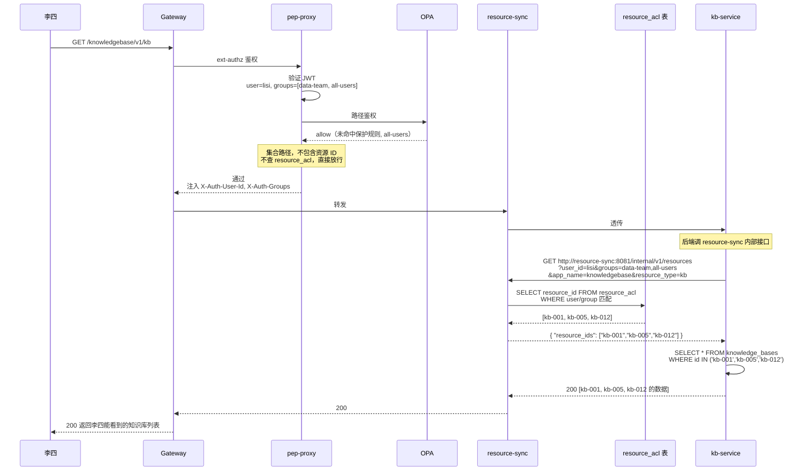

---

## 6 链路总览

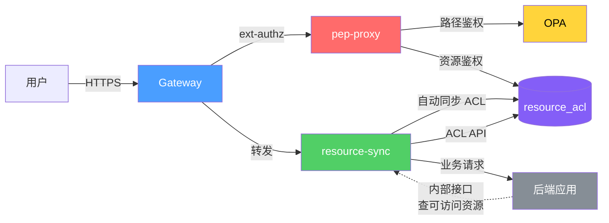

**每个组件在链路中的角色：**

| 颜色 | 组件 | 链路中做什么 |
|------|------|-------------|
| 蓝色 | Gateway | HTTPS 解密、路由转发 |
| 红色 | pep-proxy | JWT 验证、路径鉴权(OPA)、资源实例鉴权(ACL 表) |
| 绿色 | resource-sync | 反向代理、自动注册/删除 ACL、ACL 管理 API、内部查询 API |
| 黄色 | OPA | 路径级策略判断（内存计算） |
| 紫色 | resource_acl | 资源权限数据存储 |
| 灰色 | 后端应用 | 纯业务逻辑，list/search 时调内部接口 |

