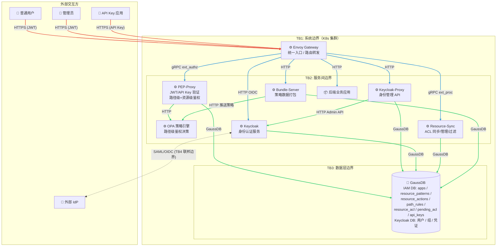

# AIDP IAM 安全分析

## 7.1 威胁分析及设计

采用 STRIDE Low Level 威胁分析方法，对 AIDP IAM 系统各特性开展安全/隐私威胁分析，评估风险并选择合适的措施进行风险消减。

### 7.1.1 2层数据流图

数据流图元素说明：

| 元素 | 类型 | 说明 |
|------|------|------|
| 普通用户 | 外部交互方 | 通过浏览器或 CLI 访问系统，涉及用户凭证 |
| 管理员 | 外部交互方 | 管理用户/组/应用/路径规则/API Key |
| API Key 应用 | 外部交互方 | 外部服务通过 API Key 访问业务资源 |
| 外部 IdP | 外部交互方 | 企业 SAML/OIDC 身份源 |
| Envoy Gateway | 处理过程 | 统一入口，HTTPS 终止，路由转发、策略绑定 |
| PEP-Proxy | 处理过程 | 鉴权服务，JWT/API Key 验证，路径级+资源级鉴权 |
| OPA | 处理过程 | 策略引擎，路径级鉴权决策 |
| Keycloak-Proxy | 处理过程 | 身份管理 API 代理 |
| Keycloak | 处理过程 | 身份认证服务，签发 JWT |
| Resource-Sync | 处理过程 | ACL 自动同步、ACL 管理 API、列表过滤 |
| Bundle-Server | 处理过程 | 策略数据打包，推送到 OPA |
| 后端业务应用 | 处理过程 | 知识库/记忆库等业务后端，部署在集群内部 |
| GaussDB | 数据存储 | 包含 IAM DB（应用、资源模式、资源动作、路径规则、资源权限、待处理 ACL、API Key）和 Keycloak DB（用户、组、凭证） |

### 7.1.2 业务场景及信任边界说明

**业务场景**：

AIDP IAM 为 AI 数据平台提供统一身份认证与访问控制。所有外部请求通过 HTTPS 经 Envoy Gateway 进入系统，由 PEP-Proxy 完成两级鉴权（路径级+资源级），Resource-Sync 在响应阶段自动维护资源 ACL。管理员通过 Keycloak-Proxy 管理用户/组/应用，通过 PEP-Proxy 管理路径规则和 API Key。后端业务应用部署在同一 K8s 集群内，由 Gateway 路由转发。

**信任边界说明**：

| 信任边界 | 位置 | 说明 |
|----------|------|------|
| TB1 系统边界 | 外部网络 ↔ Envoy Gateway | 最外层边界，所有外部流量的唯一入口，HTTPS 加密。外部用户、API Key 应用、外部 IdP 的请求均穿越此边界 |
| TB2 服务间边界 | Gateway ↔ 内部微服务 | Gateway 到各后端服务之间的通信边界，集群内部 HTTP/gRPC |
| TB3 数据层边界 | 微服务 ↔ 数据库 | 各服务访问 GaussDB 的连接边界 |
| TB4 联邦边界 | Keycloak ↔ 外部 IdP | SAML/OIDC 联邦认证的信任边界，涉及跨组织的身份断言传递 |

### 7.1.3 外部交互方分析

#### 7.1.3.1 普通用户

| 项目 | 内容 |
|------|------|
| 元素名称 | 普通用户 |
| 元素概述 | 通过浏览器或 CLI 访问系统的终端用户。涉及用户名/密码凭证、JWT 令牌 |
| 高影响个人数据 | 用户密码 |
| 中影响个人数据 | 用户名、邮箱、用户组信息 |
| 低影响个人数据 | 登录时间、访问路径 |

**仿冒（S）**

| 项目 | 内容 |
|------|------|
| 风险级别 | 中 |
| 影响 | 影响等级：高。攻击者仿冒合法用户访问业务资源，可能导致数据泄露或越权操作 |
| 已有消减措施 | 1. 用户登录需通过身份认证服务验证凭证 2. JWT 使用 RS256 签名，令牌不可伪造 3. JWT 设置有效期，过期后需重新认证 4. API Key 与 JWT 两种认证方式互斥，不允许同时携带 |
| 可能性 | 攻击者通过弱密码猜测或凭证泄露获取用户身份。当前系统已有密码策略，风险可控 |
| 建议消减措施 | 1. 强制首次登录修改密码 2. 配置登录失败锁定策略 | 当前版本落地 |

**抵赖（R）**

| 项目 | 内容 |
|------|------|
| 风险级别 | 低 |
| 影响 | 影响等级：低。用户否认其操作行为 |
| 已有消减措施 | 1. JWT 令牌包含用户身份信息（sub claim）2. PEP-Proxy 记录每次鉴权的用户、路径、操作 3. Resource-Sync 记录 ACL 变更操作 |
| 可能性 | 当前设计无缺陷，风险低 |
| 建议消减措施 | N/A | N/A |

**隐私（P）**

| 项目 | 内容 |
|------|------|
| 风险级别 | 中 |
| 影响 | 影响等级：中。用户个人数据被不当收集或泄露 |
| 已有消减措施 | 1. JWT 中仅包含必要的身份信息（sub、groups） 2. 密码使用安全哈希算法存储，不可逆 |
| 可能性 | 当前设计无缺陷，风险低 |
| 建议消减措施 | N/A | N/A |

#### 7.1.3.2 管理员

| 项目 | 内容 |
|------|------|
| 元素名称 | 管理员 |
| 元素概述 | 拥有 admins 组权限的管理用户，可管理应用/用户/组/路径规则/API Key |
| 高影响个人数据 | 管理员密码 |
| 中影响个人数据 | 管理员用户名 |
| 低影响个人数据 | 管理操作记录 |

**仿冒（S）**

| 项目 | 内容 |
|------|------|
| 风险级别 | 高 |
| 影响 | 影响等级：高。攻击者仿冒管理员可修改路径规则、创建/删除用户、停用应用，影响全系统 |
| 已有消减措施 | 1. 管理员需通过身份认证获取包含 admins 组的 JWT 2. 管理接口仅对 admins 组开放 3. 路径级鉴权对 /api/v1/* 和 /acl/v1/* 进行保护 |
| 可能性 | 当前设计无默认密码，系统首次拉起时管理员必须设置密码后才能使用，风险低 |
| 建议消减措施 | N/A | N/A |

**抵赖（R）**

| 项目 | 内容 |
|------|------|
| 风险级别 | 中 |
| 影响 | 影响等级：中。管理员否认执行了高危操作（如删除用户、停用应用） |
| 已有消减措施 | 1. 所有管理操作通过 Gateway 日志记录 2. PEP-Proxy 鉴权日志记录用户和操作 |
| 可能性 | 当前日志未区分管理操作和普通操作的审计级别 |
| 建议消减措施 | 1. 对管理操作增加独立审计日志 | 后续版本落地 |

#### 7.1.3.3 API Key 应用

| 项目 | 内容 |
|------|------|
| 元素名称 | API Key 应用 |
| 元素概述 | 通过 X-API-Key Header 访问业务资源的外部服务或脚本 |

**仿冒（S）**

| 项目 | 内容 |
|------|------|
| 风险级别 | 中 |
| 影响 | 影响等级：中。攻击者获取 API Key 后可仿冒外部服务访问资源 |
| 已有消减措施 | 1. API Key 明文仅在创建/轮换时一次性展示 2. 数据库中存储 SHA-256 哈希值 3. 支持路径白名单限制 4. 支持有效期和停用功能 |
| 可能性 | API Key 在传输过程中可能被截获（当前服务间通信无 TLS） |
| 建议消减措施 | 1. 启用 HTTPS 全链路加密 2. API Key 哈希算法升级为 SHA-512 | 当前版本落地 |

**抵赖（R）**

| 项目 | 内容 |
|------|------|
| 风险级别 | 低 |
| 影响 | 影响等级：低 |
| 已有消减措施 | 1. API Key 使用记录更新 last_used_at 字段 2. PEP-Proxy 日志记录 API Key 身份的访问行为 |
| 可能性 | 当前设计无缺陷，风险低 |
| 建议消减措施 | N/A | N/A |

#### 7.1.3.4 外部 IdP

| 项目 | 内容 |
|------|------|
| 元素名称 | 外部 IdP |
| 元素概述 | 企业 SAML/OIDC 身份提供方，通过联邦认证接入 |

**仿冒（S）**

| 项目 | 内容 |
|------|------|
| 风险级别 | 中 |
| 影响 | 影响等级：高。攻击者仿冒外部 IdP 可签发伪造的 SAML 断言，创建非法用户 |
| 已有消减措施 | 1. SAML Metadata 中包含 IdP 签名证书 2. 身份认证服务验证 SAML 断言签名 |
| 可能性 | 若 IdP 证书过期或被篡改，SAML 断言验证可能失效 |
| 建议消减措施 | 1. 定期检查 IdP 证书有效期 2. 配置证书到期告警 | 后续版本落地 |

**抵赖（R）**

| 项目 | 内容 |
|------|------|
| 风险级别 | 低 |
| 影响 | 影响等级：低 |
| 已有消减措施 | 1. SAML 断言包含签名，不可伪造 |
| 可能性 | 当前设计无缺陷，风险低 |
| 建议消减措施 | N/A | N/A |

### 7.1.4 数据流分析

#### 7.1.4.1 用户请求 → Envoy Gateway（HTTP）

| 项目 | 内容 |
|------|------|
| 元素名称 | 用户请求至 Gateway |
| 元素概述 | 用户/API Key 应用的 HTTP 请求进入系统边界，携带 JWT 或 API Key |
| 高影响个人数据 | JWT 令牌、API Key 明文 |

**篡改（T）**

| 项目 | 内容 |
|------|------|
| 风险级别 | 中 |
| 影响 | 影响等级：高。请求被篡改可能导致越权访问 |
| 已有消减措施 | 1. JWT 使用 RS256 签名，篡改后签名校验失败 2. 路径级和资源级鉴权双重检查 |
| 可能性 | 当前 Gateway 未启用 HTTPS，请求在传输过程中可被中间人篡改 |
| 建议消减措施 | 1. Gateway 启用 HTTPS 监听 2. 配置 HSTS 策略 | 当前版本落地 |

**信息泄露（I）**

| 项目 | 内容 |
|------|------|
| 风险级别 | 高 |
| 影响 | 影响等级：高。JWT 令牌和 API Key 在传输中被截获，攻击者可仿冒用户 |
| 已有消减措施 | 1. JWT 有效期短（默认 5 分钟）2. API Key 支持路径白名单和有效期 |
| 可能性 | 当前 Gateway 为 HTTP 明文，网络层可嗅探令牌和 API Key |
| 建议消减措施 | 1. Gateway 启用 HTTPS 全链路加密 2. 内部 Header 传输采用密文 | 当前版本落地 |

**拒绝服务（D）**

| 项目 | 内容 |
|------|------|
| 风险级别 | 中 |
| 影响 | 影响等级：高。大量恶意请求导致 Gateway 和后端服务不可用 |
| 已有消减措施 | 1. Gateway 支持 BackendTrafficPolicy 配置限流和熔断 |
| 可能性 | 若未配置限流策略，攻击者可发起大量请求耗尽资源 |
| 建议消减措施 | 1. 配置全局限流策略 2. 配置单 IP 连接数限制 3. 配置后端熔断保护 | 当前版本落地 |

#### 7.1.4.2 Gateway → PEP-Proxy（gRPC ext_authz）

| 项目 | 内容 |
|------|------|
| 元素名称 | Gateway 至 PEP-Proxy 鉴权通信 |
| 元素概述 | Gateway 将请求转发给 PEP-Proxy 进行鉴权决策，携带完整 HTTP 头和请求体 |
| 高影响个人数据 | JWT 令牌、API Key、请求体 |

**篡改（T）**

| 项目 | 内容 |
|------|------|
| 风险级别 | 低 |
| 影响 | 影响等级：高。鉴权请求被篡改可能导致误放行 |
| 已有消减措施 | 1. 通信在 K8s 集群内部网络 2. gRPC 使用固定端口和协议 |
| 可能性 | 需要攻破集群网络才能篡改，当前设计风险低 |
| 建议消减措施 | 1. 生产环境启用服务间 mTLS | 后续版本落地 |

**信息泄露（I）**

| 项目 | 内容 |
|------|------|
| 风险级别 | 中 |
| 影响 | 影响等级：中。集群内部通信被嗅探可泄露令牌 |
| 已有消减措施 | 1. K8s 网络策略限制 Pod 间通信 |
| 可能性 | 若攻击者获得集群内某个 Pod 的访问权限，可嗅探内部通信 |
| 建议消减措施 | 1. 生产环境启用服务间 mTLS 2. 配置 NetworkPolicy 限制 Pod 间通信 | 后续版本落地 |

**拒绝服务（D）**

| 项目 | 内容 |
|------|------|
| 风险级别 | 低 |
| 影响 | 影响等级：高。PEP-Proxy 不可用时所有请求被拒绝 |
| 已有消减措施 | 1. PEP-Proxy 支持多副本部署 2. gRPC 连接超时配置 |
| 可能性 | 当前设计无缺陷，风险低 |
| 建议消减措施 | N/A | N/A |

#### 7.1.4.3 PEP-Proxy → IAM DB（GaussDB）

| 项目 | 内容 |
|------|------|
| 元素名称 | PEP-Proxy 至 IAM 数据库通信 |
| 元素概述 | PEP-Proxy 查询 resource_acl、api_keys 表进行资源级鉴权和 API Key 验证 |
| 高影响个人数据 | API Key 哈希值 |
| 中影响个人数据 | 用户 ID、资源权限关系 |

**篡改（T）**

| 项目 | 内容 |
|------|------|
| 风险级别 | 中 |
| 影响 | 影响等级：高。数据库连接被篡改可导致鉴权结果被操纵 |
| 已有消减措施 | 1. 数据库在集群内部网络 2. 使用参数化查询防止 SQL 注入 |
| 可能性 | 当前数据库连接未启用 SSL |
| 建议消减措施 | 1. 数据库连接启用 SSL 加密 | 后续版本落地 |

**信息泄露（I）**

| 项目 | 内容 |
|------|------|
| 风险级别 | 中 |
| 影响 | 影响等级：中。数据库通信被截获可泄露权限数据和 API Key 哈希 |
| 已有消减措施 | 1. API Key 存储为哈希值，非明文 2. 集群内部网络 |
| 可能性 | 数据库连接为明文 GaussDB 协议 |
| 建议消减措施 | 1. 数据库连接启用 SSL 加密 2. 数据库凭证使用 K8s Secret 管理 | 后续版本落地 |

**拒绝服务（D）**

| 项目 | 内容 |
|------|------|
| 风险级别 | 低 |
| 影响 | 影响等级：中。数据库不可用时资源级鉴权失败 |
| 已有消减措施 | 1. 连接池管理 2. 超时配置 3. 资源级鉴权失败时 failOpen（路径级鉴权已通过） |
| 可能性 | 当前设计无缺陷，风险低 |
| 建议消减措施 | N/A | N/A |

### 7.1.5 处理过程分析

#### 7.1.5.1 PEP-Proxy

| 项目 | 内容 |
|------|------|
| 元素名称 | PEP-Proxy |
| 元素概述 | 鉴权服务，接收 Gateway ext_authz 请求，完成 JWT/API Key 验证、路径级鉴权（调用 OPA）、资源级鉴权（查询 IAM DB），注入身份 Header |

**仿冒（S）**

| 项目 | 内容 |
|------|------|
| 风险级别 | 低 |
| 影响 | 影响等级：高。PEP-Proxy 被仿冒可导致所有请求绕过鉴权 |
| 已有消减措施 | 1. Gateway 通过 K8s Service 固定访问 PEP-Proxy 2. gRPC 端口仅集群内可达 |
| 可能性 | 需要攻破集群网络才能仿冒，当前设计风险低 |
| 建议消减措施 | 1. 配置 NetworkPolicy 限制只有 Gateway 可访问 PEP-Proxy 的 gRPC 端口 | 后续版本落地 |

**篡改（T）**

| 项目 | 内容 |
|------|------|
| 风险级别 | 低 |
| 影响 | 影响等级：高。PEP-Proxy 返回的鉴权结果被篡改可导致误放行 |
| 已有消减措施 | 1. gRPC 通信在集群内部 2. Gateway 直接使用 gRPC 响应 |
| 可能性 | 当前设计无缺陷，风险低 |
| 建议消减措施 | N/A | N/A |

**抵赖（R）**

| 项目 | 内容 |
|------|------|
| 风险级别 | 低 |
| 影响 | 影响等级：低 |
| 已有消减措施 | 1. PEP-Proxy 记录每次鉴权的用户、路径、结果（ALLOW/DENY） |
| 可能性 | 当前设计无缺陷，风险低 |
| 建议消减措施 | N/A | N/A |

**信息泄露（I）**

| 项目 | 内容 |
|------|------|
| 风险级别 | 中 |
| 影响 | 影响等级：中。PEP-Proxy 日志可能泄露敏感信息 |
| 已有消减措施 | 1. 日志不打印 JWT 令牌明文 2. 日志不打印 API Key 明文 |
| 可能性 | 异常堆栈中可能包含令牌片段 |
| 建议消减措施 | 1. 日志中对敏感字段进行脱敏处理 | 当前版本落地 |

**拒绝服务（D）**

| 项目 | 内容 |
|------|------|
| 风险级别 | 中 |
| 影响 | 影响等级：高。PEP-Proxy 不可用时所有鉴权请求失败 |
| 已有消减措施 | 1. 支持多副本部署 2. K8s 健康检查和自动重启 |
| 可能性 | 大量并发鉴权请求可能耗尽连接池 |
| 建议消减措施 | 1. 配置合理的连接池大小和超时 2. 配置 HPA 自动扩缩容 | 后续版本落地 |

**权限提升（E）**

| 项目 | 内容 |
|------|------|
| 风险级别 | 中 |
| 影响 | 影响等级：高。攻击者利用鉴权逻辑漏洞获取更高权限 |
| 已有消减措施 | 1. 路径级鉴权由 OPA 策略引擎独立计算 2. 资源级鉴权使用参数化 SQL 查询 3. 管理路径单独保护，仅 admins 组可访问 |
| 可能性 | 缺陷：JWT 解码时使用 `_decode_unverified` 跳过签名验证（用于从 Bearer Header 提取 claims），签名验证依赖 OPA 或后续流程。若 OPA 不可用时可能存在绕过风险 |
| 建议消减措施 | 1. OPA 故障时默认拒绝（已实现）2. 定期安全审计鉴权逻辑 | 当前版本已落地 |

#### 7.1.5.2 Resource-Sync

| 项目 | 内容 |
|------|------|
| 元素名称 | Resource-Sync |
| 元素概述 | ACL 自动同步服务，通过 ext_proc 观察资源创建/删除响应，维护 resource_acl；提供 ACL 管理 API |

**仿冒（S）**

| 项目 | 内容 |
|------|------|
| 风险级别 | 低 |
| 影响 | 影响等级：中。Resource-Sync 被仿冒可导致伪造 ACL 记录 |
| 已有消减措施 | 1. gRPC 端口仅集群内可达 2. ACL API 路径受鉴权保护 |
| 可能性 | 当前设计无缺陷，风险低 |
| 建议消减措施 | N/A | N/A |

**篡改（T）**

| 项目 | 内容 |
|------|------|
| 风险级别 | 低 |
| 影响 | 影响等级：中 |
| 已有消减措施 | 1. ACL API 仅 owner 可操作 2. 参数化 SQL 查询 |
| 可能性 | 当前设计无缺陷，风险低 |
| 建议消减措施 | N/A | N/A |

**抵赖（R）**

| 项目 | 内容 |
|------|------|
| 风险级别 | 低 |
| 影响 | 影响等级：低 |
| 已有消减措施 | 1. ACL 变更日志记录 |
| 可能性 | 当前设计无缺陷，风险低 |
| 建议消减措施 | N/A | N/A |

**信息泄露（I）**

| 项目 | 内容 |
|------|------|
| 风险级别 | 低 |
| 影响 | 影响等级：低 |
| 已有消减措施 | 1. ACL API 返回值不包含其他租户的数据 |
| 可能性 | 当前设计无缺陷，风险低 |
| 建议消减措施 | N/A | N/A |

**拒绝服务（D）**

| 项目 | 内容 |
|------|------|
| 风险级别 | 低 |
| 影响 | 影响等级：低。Resource-Sync 不可用时 ACL 自动同步暂停，但业务请求不受影响（failOpen） |
| 已有消减措施 | 1. ext_proc failOpen 配置 2. 失败记录进入重试队列 3. 支持多副本部署 |
| 可能性 | 当前设计无缺陷，风险低 |
| 建议消减措施 | N/A | N/A |

**权限提升（E）**

| 项目 | 内容 |
|------|------|
| 风险级别 | 低 |
| 影响 | 影响等级：中 |
| 已有消减措施 | 1. ACL API 强制 owner 校验 2. 非 owner 无法分享/修改/撤销权限 |
| 可能性 | 当前设计无缺陷，风险低 |
| 建议消减措施 | N/A | N/A |

### 7.1.6 数据存储分析

#### 7.1.6.1 IAM 数据库

| 项目 | 内容 |
|------|------|
| 元素名称 | IAM 数据库 |
| 元素概述 | GaussDB 数据库，存储应用注册、资源模式、资源动作、路径规则、资源权限、待处理 ACL、API Key 等数据 |
| 高影响个人数据 | API Key 哈希值 |
| 中影响个人数据 | 用户 ID 与资源的权限关系 |
| 低影响个人数据 | 应用注册信息、资源模式、资源动作、路径规则 |

**篡改（T）**

| 项目 | 内容 |
|------|------|
| 风险级别 | 高 |
| 影响 | 影响等级：高。数据库被篡改可导致鉴权规则被修改、非法提升权限 |
| 已有消减措施 | 1. 数据库在集群内部网络 2. 使用数据库账号认证 3. 应用通过参数化查询防止 SQL 注入 |
| 可能性 | 缺陷：数据库凭证在多处以明文配置，若泄露可直接修改数据 |
| 建议消减措施 | 1. 数据库凭证使用 K8s Secret 统一管理 2. 数据库连接启用 SSL 3. 配置最小权限的数据库账号 | 当前版本落地 |

**抵赖（R）**

| 项目 | 内容 |
|------|------|
| 风险级别 | 低 |
| 影响 | 影响等级：低 |
| 已有消减措施 | 1. 数据库操作通过应用层进行，应用层有日志记录 |
| 可能性 | 当前设计无缺陷，风险低 |
| 建议消减措施 | N/A | N/A |

**信息泄露（I）**

| 项目 | 内容 |
|------|------|
| 风险级别 | 中 |
| 影响 | 影响等级：中。数据库内容泄露可暴露用户权限关系和 API Key 哈希 |
| 已有消减措施 | 1. API Key 存储为哈希值，即使泄露也无法恢复明文 2. 数据库在集群内部网络 |
| 可能性 | 数据库凭证明文配置存在泄露风险 |
| 建议消减措施 | 1. 数据库凭证统一使用 K8s Secret 2. 配置数据库访问审计 | 当前版本落地 |

**拒绝服务（D）**

| 项目 | 内容 |
|------|------|
| 风险级别 | 中 |
| 影响 | 影响等级：高。数据库不可用时鉴权和 ACL 功能受影响 |
| 已有消减措施 | 1. 路径级鉴权通过 OPA 缓存策略数据，不依赖实时数据库 2. Resource-Sync failOpen 3. 连接池管理 |
| 可能性 | 数据库单点故障可能导致不可用 |
| 建议消减措施 | 1. 数据库配置高可用 | 后续版本落地 |

**隐私（P）**

| 项目 | 内容 |
|------|------|
| 风险级别 | 低 |
| 影响 | 影响等级：低。IAM 数据库中个人数据有限，主要为用户 ID 和权限关系 |
| 已有消减措施 | 1. 不存储用户密码（由身份认证服务管理） 2. API Key 存储为哈希值 |
| 可能性 | 当前设计无缺陷，风险低 |
| 建议消减措施 | N/A | N/A |

#### 7.1.6.2 Keycloak 数据库

| 项目 | 内容 |
|------|------|
| 元素名称 | Keycloak 数据库 |
| 元素概述 | 存储用户、组、realm、client、凭证等身份认证数据 |
| 高影响个人数据 | 用户密码哈希 |
| 中影响个人数据 | 用户名、邮箱、用户组关系 |
| 低影响个人数据 | Realm 配置、Client 配置 |

**篡改（T）**

| 项目 | 内容 |
|------|------|
| 风险级别 | 高 |
| 影响 | 影响等级：高。身份数据被篡改可导致非法用户获取访问权限 |
| 已有消减措施 | 1. 数据库在集群内部网络 2. 通过身份认证服务 Admin API 间接访问，不直接暴露数据库 |
| 可能性 | 数据库凭证明文配置存在泄露风险 |
| 建议消减措施 | 1. 数据库凭证使用 K8s Secret 统一管理 2. 数据库连接启用 SSL | 当前版本落地 |

**信息泄露（I）**

| 项目 | 内容 |
|------|------|
| 风险级别 | 高 |
| 影响 | 影响等级：高。密码哈希和用户信息泄露可导致离线暴力破解 |
| 已有消减措施 | 1. 密码使用 PBKDF2-SHA256 哈希存储 2. 数据库在集群内部网络 |
| 可能性 | 数据库凭证明文配置存在泄露风险 |
| 建议消减措施 | 1. 数据库凭证使用 K8s Secret 统一管理 2. 数据库连接启用 SSL | 当前版本落地 |

**拒绝服务（D）**

| 项目 | 内容 |
|------|------|
| 风险级别 | 中 |
| 影响 | 影响等级：中。身份认证数据库不可用时新用户无法登录，已登录用户不受影响 |
| 已有消减措施 | 1. JWKS 缓存机制，已登录用户 JWT 验证不依赖数据库 |
| 可能性 | 数据库单点故障 |
| 建议消减措施 | 1. 数据库配置高可用 | 后续版本落地 |

**隐私（P）**

| 项目 | 内容 |
|------|------|
| 风险级别 | 中 |
| 影响 | 影响等级：中。包含用户个人身份信息 |
| 已有消减措施 | 1. 密码存储为不可逆哈希 2. 仅收集必要的用户信息 |
| 可能性 | 当前设计无缺陷，风险低 |
| 建议消减措施 | N/A | N/A |

### 7.1.7 消减措施需求

| 组件/数据流 | 威胁 | 整改模块 | 安全问题（缺陷） | 安全等级 | 建议消减措施 | 是否接纳 | 落地版本 |
|-------------|------|----------|-------------------|----------|-------------|----------|----------|
| 数据流-用户请求至 Gateway | I | Gateway | 用户请求通过 HTTP 明文传输，JWT 和 API Key 可被截获 | 高 | Gateway 启用 HTTPS 全链路加密 | 接纳 | 当前版本 |
| 数据流-用户请求至 Gateway | D | Gateway | 未配置 DDoS 防护，大量请求可耗尽资源 | 中 | 配置全局限流、单 IP 连接数限制、后端熔断 | 接纳 | 当前版本 |
| 外部交互方-管理员 | S | 身份认证服务 | 系统首次拉起时管理员需设置密码 | 低 | 已消减：无默认密码，首次进入必须设置 | 已落地 | 当前版本 |
| 外部交互方-API Key 应用 | S | PEP-Proxy | API Key 哈希算法为 SHA-256 | 中 | 升级为 SHA-512 | 接纳 | 当前版本 |
| 数据存储-IAM DB | T | IAM DB | 数据库凭证以明文配置 | 高 | 凭证统一使用 K8s Secret 管理 | 接纳 | 当前版本 |
| 数据存储-IAM DB | I | IAM DB | 数据库连接未启用 SSL | 中 | 启用数据库 SSL 连接 | 接纳 | 后续版本 |
| 数据存储-Keycloak DB | T | Keycloak DB | 数据库凭证以明文配置 | 高 | 凭证统一使用 K8s Secret 管理 | 接纳 | 当前版本 |
| 处理过程-PEP-Proxy | I | PEP-Proxy | 日志中异常堆栈可能包含令牌片段 | 中 | 日志敏感字段脱敏处理 | 接纳 | 当前版本 |
| 处理过程-PEP-Proxy | I | PEP-Proxy | 内部注入的身份 Header 为明文传输 | 中 | Header 采用密文传输 | 接纳 | 当前版本 |

---

## 7.2 敏感操作检查

### 7.2.1 机密数据识别

| 机密数据 | 产生 | 使用 | 传输 | 持久化 | 销毁 |
|----------|------|------|------|--------|------|
| 用户密码 | 用户注册/修改密码 | 登录认证时校验 | HTTPS 加密传输 | 身份认证服务使用 PBKDF2 哈希存储 | 用户删除时清除 |
| JWT 令牌 | 登录成功后签发 | 请求鉴权时验证 | HTTP Header 传输 | 不持久化，仅内存中 | 过期后自动失效 |
| API Key | 管理员创建 | 外部服务请求时携带 | HTTP Header 传输 | SHA-256/512 哈希存储 | 管理员删除时清除哈希 |
| API Key 明文 | 创建/轮换时生成 | 仅返回给管理员一次 | HTTPS 响应传输 | 不持久化 | 返回后即丢弃 |
| 数据库凭证 | 部署时配置 | 服务启动时连接数据库 | 集群内部网络 | K8s Secret / 环境变量 | 卸载时清除 |
| 身份认证服务 Client Secret | 初始化时生成 | 服务间认证 | 集群内部网络 | K8s Secret | 卸载时清除 |

### 7.2.2 高风险处理过程检查

| 数据字段 | 敏感操作 | 详细说明 | 消减措施 |
|----------|----------|----------|----------|
| JWT 令牌 | 传输-明文 | Gateway 当前通过 HTTP 传输 JWT | 启用 HTTPS |
| API Key 明文 | 产生-回显 | 创建/轮换时一次性返回明文 | 满足安全规范，仅一次性展示 |
| API Key 明文 | 使用-日志 | API Key ID 在鉴权失败日志中打印 | 仅打印 Key 前缀，不打印完整 ID |
| 数据库凭证 | 持久化-硬编码 | 数据库连接串中包含明文密码 | 统一使用 K8s Secret 管理 |
| 身份 Header | 传输-明文 | X-Auth-User-Id 等 Header 在内部通信中为明文 | Header 采用密文传输 |
| 管理员密码 | 产生-首次设置 | 系统首次拉起时管理员必须设置密码，无默认密码 | 已消减：无硬编码密码 |

---

## 7.3 隐私风险分析与设计

### 7.3.1 隐私风险预分析问卷

| 序号 | 问题 | 是否满足 | 说明 |
|------|------|----------|------|
| 1 | 该产品是否收集或处理个人数据 | 是 | 收集用户名、邮箱、用户组信息，见 7.3.3 个人数据列表 |
| 2 | 上一版本是否做过隐私风险分析 | 否 | 首个版本，需在威胁分析中对隐私元素进行分析 |

### 7.3.2 隐私风险预分析总结

当前版本需要做隐私风险分析。AIDP IAM 作为身份认证与访问控制系统，收集和处理用户身份信息用于认证和鉴权。系统角色为数据处理者，收集的数据类型和使用目的由平台整体隐私策略决定。

需要做隐私风险分析的特性：用户认证与应用注册、API Key 管理。

### 7.3.3 个人数据列表

| 场景 | 个人数据类型 | 数据分级 | 处理方法 | 收集目的 | 保护措施 | 存留期 |
|------|-------------|----------|----------|----------|----------|--------|
| 用户登录 | 用户名 | 中 | 身份认证服务存储 | 身份认证 | 仅内部使用 | 账号存续期间 |
| 用户登录 | 密码 | 高 | PBKDF2 哈希存储 | 身份认证 | 不可逆哈希，不存储明文 | 账号存续期间 |
| 用户登录 | 邮箱 | 中 | 身份认证服务存储 | 联系方式、密码重置 | 仅内部使用 | 账号存续期间 |
| JWT 签发 | 用户 ID (sub) | 中 | JWT claims | 标识用户身份 | RS256 签名保护 | JWT 有效期 |
| JWT 签发 | 用户组 (groups) | 低 | JWT claims | 鉴权决策 | RS256 签名保护 | JWT 有效期 |
| 鉴权日志 | 用户 ID | 中 | 日志记录 | 审计追溯 | 日志访问控制 | 日志保留期 |
| 鉴权日志 | 访问路径 | 低 | 日志记录 | 审计追溯 | 日志访问控制 | 日志保留期 |
| API Key | 服务账号 ID | 低 | IAM DB 存储 | 服务间认证 | 数据库访问控制 | Key 存续期间 |

---

## 7.4 安全隐私保护设计检视

安全设计检视依据产品安全规范，重点关注以下方面：

1. 认证机制：JWT RS256 签名验证、API Key 哈希验证
2. 授权机制：两级鉴权（路径级+资源级）、owner 权限校验
3. 数据保护：密码哈希存储、API Key 哈希存储、敏感数据不明文日志
4. 通信安全：HTTPS 加密（待落地）、服务间 mTLS（后续版本）
5. 输入验证：参数化 SQL 查询、请求参数校验

---

## 7.5 安全配置设计

### 7.5.1 识别安全配置项

| 特性 | 是否有安全配置项 | 安全配置项说明 |
|------|-----------------|---------------|
| 证书管理 | 是 | Gateway HTTPS 证书安装与管理 |
| 用户管理 | 是 | 密码永不过期开关、首次登录设置密码 |
| 账户策略-用户名 | 是 | 用户名最小长度限制 |
| 账户策略-密码复杂度 | 是 | 密码复杂度、最小/最大长度、字符重复次数 |
| 账户策略-密码有效期 | 是 | 密码有效期、提前提示阈值、修改间隔 |
| 账户策略-密码历史 | 是 | 历史密码保留个数 |
| 账户策略-弱口令 | 是 | 弱口令字典检查 |
| 登录策略-密码锁定 | 是 | 锁定开关、错误次数、锁定模式、自动解锁时间 |
| 登录策略-会话管理 | 是 | 会话超时时间、IP 校验 |
| 访问控制 | 是 | IP 白名单/访问控制开关 |
| API Key | 是 | 哈希算法、路径白名单、有效期、速率限制 |
| 路径级鉴权 | 是 | 策略引擎默认行为（default deny）、策略刷新周期 |
| 数据库 | 是 | 连接加密（SSL）、凭证管理 |

### 7.5.2 安全配置规则定义

| 分类 | 规则名称 | 规则描述 | 风险描述 | 取值范围 | 安全推荐值 | 缺省值 | 是否默认安全 | 修复影响 |
|------|----------|----------|----------|----------|-----------|--------|-------------|----------|
| 证书管理 | 确保安装 Gateway HTTPS 证书 | Gateway 应安装 TLS 证书启用 HTTPS 监听 | HTTP 明文传输有信息泄露风险 | 已安装/未安装 | 已安装 | 已安装 | 是 | 需要证书管理系统对接 |
| 用户管理 | 确保管理员首次登录设置密码 | 系统首次拉起时不预置默认密码，管理员首次进入界面必须设置密码 | 默认密码存在被利用的风险 | N/A | 首次强制设置 | 首次强制设置 | 是 | N/A |
| 用户管理 | 确保关闭密码永不过期开关 | 所有用户应关闭密码永不过期开关 | 密码长期不修改会降低暴力破解难度 | ON/OFF | OFF | OFF | 是 | 密码将在指定时间后过期 |
| 账户策略 | 确保设置用户名最小长度 | 设置用户名最小长度，避免过于简单的用户名 | 用户名太短会降低暴力破解难度 | 5~32 位 | 6~32 | 6 | 是 | 创建用户时需满足长度要求 |
| 账户策略 | 确保设置密码复杂度 | 密码必须包含特殊字符，并且至少包含大写字母、小写字母、数字中的任意两种 | 密码过于简单会降低暴力破解难度 | 见说明 | 包含特殊字符+至少两种字母/数字 | 包含特殊字符+至少两种字母/数字 | 是 | 新建或修改密码时需满足要求 |
| 账户策略 | 确保设置密码最小长度 | 密码的最小长度限制 | 密码过短会降低暴力破解难度 | 8~32 位 | 8~16 | 8 | 是 | 新建或修改密码时需满足要求 |
| 账户策略 | 确保设置密码最大长度 | 密码的最大长度限制 | 过长密码可能引起其他安全问题 | 16~128 位 | 16~128 | 128 | 是 | N/A |
| 账户策略 | 确保设置密码中字符重复次数 | 限制密码中相同连续字符的最大个数 | 密码过于简单会降低暴力破解难度 | 0~9 | 3 | 3 | 是 | 新建或修改密码时不能输入过多连续相同字符 |
| 账户策略 | 确保设置密码有效期 | 密码应设置有效期，到期后必须修改 | 密码长时间不修改会降低暴力破解难度 | 1~999 天 | 90 | 90 | 是 | 超过有效期的密码将失效 |
| 账户策略 | 确保设置密码提前提示阈值 | 密码到期前提前提示用户修改 | 提示阈值过大会长时间提示过期告警 | 1~99 天 | 7~99 | 7 | 是 | N/A |
| 账户策略 | 确保设置密码修改间隔 | 两次密码修改之间的最小间隔时间 | 间隔过小可能导致密码被频繁修改 | 1~9999 分钟 | 5 | 5 | 是 | 修改密码后需等待间隔时间才能再次修改 |
| 账户策略 | 确保设置历史密码保留个数 | 新密码不允许和历史密码相同 | 频繁使用相同密码存在安全风险 | 0~30 | 3~30 | 3 | 是 | 更多历史密码不能被复用 |
| 账户策略 | 确保设置弱口令字典 | 启用弱口令字典检查，禁止使用常见弱密码 | 弱密码会降低暴力破解难度 | 已设置/未设置 | 已设置 | 已设置 | 是 | 匹配弱口令字典的密码不允许设置 |
| 登录策略 | 确保启用密码锁定 | 连续输入错误密码达到阈值后锁定账户 | 不限制登录尝试会降低暴力破解难度 | ON/OFF | ON | ON | 是 | 密码错误超限后用户将被锁定 |
| 登录策略 | 确保设置密码锁定错误次数 | 连续输入错误密码的最大次数 | 次数过大会降低暴力破解难度 | 1~9 | 3 | 3 | 是 | 超过次数后账户被锁定 |
| 登录策略 | 确保设置密码锁定模式 | 锁定模式应为限时锁定 | 永久锁定可能影响正常使用 | 限时锁定/永久锁定 | 限时锁定 | 限时锁定 | 是 | 锁定后等待解锁时间自动恢复 |
| 登录策略 | 确保设置密码锁定自动解锁时间 | 限时锁定后的自动解锁等待时间 | 解锁时间过短会降低暴力破解难度 | 3~2000 分钟 | 5~2000 | 5 | 是 | 锁定期间用户无法登录 |
| 登录策略 | 确保设置会话超时时间 | 用户无操作超过指定时间后自动断开会话 | 会话时间过长会增大会话泄露风险 | 1~100 分钟 | 30 | 30 | 是 | 超时后需重新登录 |
| 登录策略 | 确保启用 IP 校验 | 登录 IP 和下发请求 IP 必须一致 | 关闭时可能有非法 IP 下发请求 | ON/OFF | ON | ON | 是 | 请求 IP 与登录 IP 不一致时请求被拒绝 |
| 访问控制 | 确保启用访问控制 | 配置 IP 白名单，仅允许指定 IP 访问 | 任意 IP 可访问存在安全风险 | ON/OFF | ON | OFF | 否 | 仅白名单内 IP 可访问系统 |
| API Key | 确保 API Key 使用安全的哈希算法 | API Key 存储使用 SHA-512 哈希算法 | 较弱的哈希算法存在碰撞风险 | SHA-256/SHA-512 | SHA-512 | SHA-512 | 是 | N/A |
| 路径级鉴权 | 确保策略引擎默认拒绝 | 策略引擎故障或无匹配规则时默认拒绝请求 | 默认放行会导致未授权访问 | allow/deny | deny | deny | 是 | 策略引擎不可用时所有请求被拒绝 |
| 数据库 | 确保数据库连接启用 SSL | 服务与数据库之间的通信应启用 SSL 加密 | 明文数据库通信可被截获泄露数据 | sslmode 配置 | verify-full | disable | 否 | 需要配置数据库 SSL 证书 |
| 通信安全 | 确保关闭不安全的通信协议 | 禁用 HTTP 明文协议，仅保留 HTTPS | HTTP 明文有信息泄露风险 | ON/OFF | OFF（关闭 HTTP） | OFF | 是 | 仅 HTTPS 协议可访问系统 |
