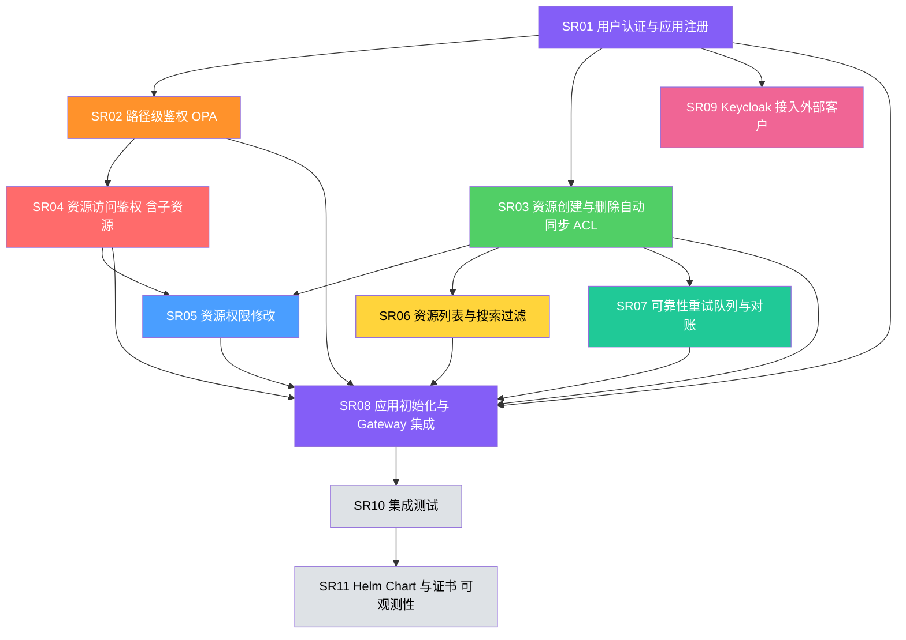

# 项目 SR 拆分 — 按功能点交付

> 版本：v3.0 | 日期：2026-04-07

---

## 架构背景

- 系统卖给**一个客户**，Tenant = 部门，Apps/License 为**系统级**（无 tenant_id）
- resource-sync **不是**反向代理，Gateway 直接路由到后端服务
- ext_proc 在**请求阶段**注入 `X-Allowed-Ids`，在**响应阶段**拦截 POST+201 / DELETE+2xx 同步 ACL
- 业务团队自行管理各自的 HTTPRoute
- ACL API 路径: `/acl/v1/resources/{resource_id}/permissions`
- pep-proxy 负责 path-rules CRUD API（不在 keycloak-proxy 中）

---

## 全局依赖关系



---

## 可并行的工作组

```
第 1 批（无依赖）：
  SR01 用户认证与应用注册

第 2 批（依赖 SR01，可并行）：
  SR02 路径级鉴权（pep-proxy + bundle-server + OPA）
  SR03 资源创建与删除自动同步 ACL（构建 resource-sync ext_proc）
  SR09 Keycloak 接入外部客户（keycloak-proxy IdP API）

第 3 批（依赖第 2 批，可并行）：
  SR04 资源访问鉴权（pep-proxy 新增资源级鉴权，依赖 SR02）
  SR06 资源列表与搜索过滤（ext_proc 请求阶段注入，依赖 SR03）
  SR07 可靠性重试队列与对账（后台任务，依赖 SR03）

第 4 批（依赖第 3 批）：
  SR05 资源权限修改（依赖 SR03 + SR04）

第 5 批（全部就绪后）：
  SR08 应用初始化与 Gateway 集成 → SR10 集成测试 → SR11 Helm Chart 与证书、可观测性
```

---

## SR01 用户认证与应用注册

**优先级：** P0（阻塞所有后续）
**依赖：** 无
**预估规模：** 中
**涉及组件：** Keycloak init-job、keycloak-proxy、PostgreSQL

### 功能描述

Keycloak 组模型（groups 替代 roles）+ 应用注册与 License 控制。用户登录获取带 groups 的 JWT，平台管理员可注册应用、控制 License。

### 前置条件

- PostgreSQL 和 Keycloak 已部署

### 成功保证

- 用户登录 JWT 包含 groups
- apps / resource_patterns 表可正常 CRUD
- `{app}-admins` 组自动创建

### 触发事件

- 用户登录
- 管理员注册应用
- 管理员切换 License

### 主成功场景

1. init-job 创建 `master-admins`（master realm）、`tenant-admins` + `all-users`（tenant realm）
2. JWT Protocol Mapper 配置为 group-mapper（groups + group_ids 写入 JWT）
3. `all-users` 设为默认组
4. 用户登录获取 JWT，包含 `groups` 字段
5. 管理员调 `POST /api/v1/apps` 注册应用 → 自动写入 apps + resource_patterns + 创建 `{app}-admins` 组
6. 管理员调 `PUT /api/v1/apps/{app}` 切换 `enabled`

### 数据库表结构

```sql
-- apps：应用注册表（系统级，无 tenant_id）
CREATE TABLE apps (
    app_name     VARCHAR(128) PRIMARY KEY,
    path_prefix  VARCHAR(256) NOT NULL UNIQUE,
    display_name VARCHAR(256),
    description  VARCHAR(512),
    enabled      BOOLEAN      NOT NULL DEFAULT true,
    created_at   TIMESTAMP    NOT NULL DEFAULT NOW(),
    updated_at   TIMESTAMP    NOT NULL DEFAULT NOW()
);

-- resource_patterns：资源路径匹配规则（系统级，无 tenant_id）
CREATE TABLE resource_patterns (
    app_name        VARCHAR(128) NOT NULL REFERENCES apps(app_name),
    resource_prefix VARCHAR(256) NOT NULL,
    resource_type   VARCHAR(128) NOT NULL,
    PRIMARY KEY (app_name, resource_prefix)
);
```

### 现有代码基础与改动

- `init-keycloak.py` 已有 80% 基础，核心改动：从 roles 模型切换到 groups 模型
- `da-idb-proxy` 已有完整框架（FastAPI + SQLAlchemy），新增 apps router

### 验收标准

- [ ] 用户登录 → JWT 包含 `groups` 字段
- [ ] 新用户自动加入 `all-users` 组
- [ ] master realm 有 `master-admins` 组
- [ ] tenant realm 有 `tenant-admins`、`all-users` 组
- [ ] `apps` + `resource_patterns` 表 CRUD 正常
- [ ] `{app}-admins` 组自动创建
- [ ] License 开关 `enabled` 生效

---

## SR02 路径级鉴权（OPA）

**优先级：** P0
**依赖：** SR01
**预估规模：** 大
**涉及组件：** pep-proxy（含 path-rules CRUD API）、bundle-server、OPA、Gateway

### 功能描述

请求经过 Gateway 时，pep-proxy 调 OPA 判断：应用是否启用、路径是否受保护、用户是否在允许的组中。**path-rules CRUD API 在 pep-proxy 中提供。**

### 前置条件

- SR01 完成（apps 表有数据，JWT 包含 groups）

### 成功保证

- 所有请求经过路径级鉴权
- app 禁用 → 403
- 受保护路径无组 → 403
- 未受保护路径 all-users 放行

### 触发事件

- 任意 HTTP 请求到达 Gateway
- 管理员配置 path_rules

### 主成功场景

1. 管理员通过 pep-proxy API 配置 path_rules（`POST/GET/PUT/DELETE /api/v1/path-rules`）
2. bundle-server 读取 apps + path_rules → 生成 OPA bundle（系统级，无 tenant 嵌套）→ 推送到 OPA
3. 用户发起请求 → Gateway 调 ext_authz → pep-proxy
4. pep-proxy 验证 JWT，提取 groups
5. pep-proxy 调 OPA：检查 app enabled → path_rules → groups
6. 通过 → 注入 `X-Auth-User-Id` / `X-Auth-Tenant` / `X-Auth-Groups` headers
7. 拒绝 → 返回 403

### 数据库表结构

```sql
-- path_rules：路径保护规则（系统级，无 tenant_id）
CREATE TABLE path_rules (
    id              SERIAL PRIMARY KEY,
    path_prefix     VARCHAR(256) NOT NULL UNIQUE,
    required_group  VARCHAR(128) NOT NULL,
    description     VARCHAR(512),
    created_at      TIMESTAMP    NOT NULL DEFAULT NOW()
);
```

### OPA Rego 策略

```rego
package authz
import future.keywords.in
default allow = false

# 应用未启用 → 拒绝
app_disabled {
    some app_name, app in data.apps
    startswith(input.path, app.path_prefix)
    app.enabled == false
}

# master-admins：全局放行管理接口
allow {
    not app_disabled
    "master-admins" in input.groups
    startswith(input.path, "/api/v1/")
}

# tenant-admins：放行管理接口
allow {
    not app_disabled
    "tenant-admins" in input.groups
    startswith(input.path, "/api/v1/")
}

# 命中保护规则 → 检查 group
allow {
    not app_disabled
    some rule in data.path_rules
    startswith(input.path, rule.path_prefix)
    rule.required_group in input.groups
}

# 未命中保护规则 → all-users 放行
allow {
    not app_disabled
    not path_is_protected
    "all-users" in input.groups
}

path_is_protected {
    some rule in data.path_rules
    startswith(input.path, rule.path_prefix)
}
```

### bundle 数据结构（系统级，无 tenant 嵌套）

```json
{
  "apps": {
    "knowledgebase": { "path_prefix": "/knowledgebase/", "enabled": true },
    "memory": { "path_prefix": "/memory/", "enabled": true }
  },
  "path_rules": [
    { "path_prefix": "/memory/v1/admin/", "required_group": "memory-admins" }
  ]
}
```

### pep-proxy 鉴权流程

```
请求进来 →
  1. JWT 验证（缓存 JWKS 公钥）→ 提取 user_id, tenant_id, groups
  2. 调用 OPA: app 启用? path_rules? groups?
  3. 注入 Header: X-Auth-User-Id, X-Auth-Tenant, X-Auth-Groups
```

### 现有代码基础与改动

- `bundle-server` 和 `pep-proxy` 已有代码骨架，核心改动：去掉 tenant 嵌套改为系统级平铺结构；在 pep-proxy 中新增 path-rules CRUD API

### 验收标准

- [ ] app disabled → 该应用所有请求 403
- [ ] 受保护路径无对应 group → 403
- [ ] 未受保护路径 + all-users → 放行
- [ ] master-admins 访问 `/api/v1/*` → 放行
- [ ] tenant-admins 访问 `/api/v1/*` → 放行
- [ ] bundle-server 定时推送到 OPA 正常
- [ ] path-rules CRUD API 正常

---

## SR03 资源创建与删除自动同步 ACL

**优先级：** P0
**依赖：** SR01
**预估规模：** 大
**涉及组件：** resource-sync（新建）、PostgreSQL、Gateway

### 功能描述

用户创建顶级资源时，ext_proc 拦截 POST+201 响应自动注册 owner ACL；删除资源时，ext_proc 拦截 DELETE+2xx 响应自动清理所有 ACL 记录。

### 前置条件

- SR01 完成（apps / resource_patterns 表有数据）

### 成功保证

- 创建资源后 resource_acl 有 owner 记录
- 删除资源后 resource_acl 中该资源所有记录被清除
- 写入失败时 pending_acl 有记录

### 触发事件

- 用户创建资源（POST 返回 201）
- 用户删除资源（DELETE 返回 2xx）

### 主成功场景（创建）

1. 用户 `POST /knowledgebase/v1/kb` → 后端返回 `201 { "id": "kb-001" }`
2. Gateway 调 ext_proc → resource-sync:8082
3. ext_proc 检测 POST + 201 + 路径匹配 resource_patterns
4. ext_proc 同步调用 resource-sync:8081 内部 API
5. resource-sync 写入 resource_acl (tenant_id, app_name, resource_type, resource_id, user, user_id, owner)
6. 响应返回给用户

### 主成功场景（删除）

1. 用户 `DELETE /knowledgebase/v1/kb/kb-001` → 后端返回 `200`
2. Gateway 调 ext_proc → resource-sync:8082
3. ext_proc 检测 DELETE + 2xx + 路径匹配 resource_patterns
4. ext_proc 同步调用 resource-sync:8081 内部 API
5. resource-sync 删除 resource_acl 中该 resource_id 的所有记录
6. 响应返回给用户

### 数据库表结构

```sql
-- resource_acl：资源权限表（tenant 级）
CREATE TABLE resource_acl (
    id              SERIAL PRIMARY KEY,
    tenant_id       VARCHAR(128) NOT NULL,
    app_name        VARCHAR(128) NOT NULL,
    resource_type   VARCHAR(128) NOT NULL,
    resource_id     VARCHAR(256) NOT NULL,
    subject_type    VARCHAR(32)  NOT NULL,  -- 'user' | 'group'
    subject_id      VARCHAR(128) NOT NULL,
    permission      VARCHAR(32)  NOT NULL,  -- 'owner' | 'contributor' | 'viewer'
    created_at      TIMESTAMP    NOT NULL DEFAULT NOW(),
    UNIQUE (tenant_id, app_name, resource_type, resource_id, subject_type, subject_id)
);
CREATE INDEX idx_acl_resource ON resource_acl (tenant_id, app_name, resource_type, resource_id);
CREATE INDEX idx_acl_subject ON resource_acl (tenant_id, subject_type, subject_id);

-- pending_acl：写入失败重试队列
CREATE TABLE pending_acl (
    id              SERIAL PRIMARY KEY,
    tenant_id       VARCHAR(128) NOT NULL,
    app_name        VARCHAR(128) NOT NULL,
    resource_type   VARCHAR(128) NOT NULL,
    resource_id     VARCHAR(256) NOT NULL,
    subject_type    VARCHAR(32)  NOT NULL,
    subject_id      VARCHAR(128) NOT NULL,
    permission      VARCHAR(32)  NOT NULL,
    action          VARCHAR(16)  NOT NULL,  -- 'create' | 'delete'
    retry_count     INTEGER      NOT NULL DEFAULT 0,
    max_retries     INTEGER      NOT NULL DEFAULT 10,
    last_error      TEXT,
    created_at      TIMESTAMP    NOT NULL DEFAULT NOW(),
    next_retry      TIMESTAMP    NOT NULL DEFAULT NOW()
);
CREATE INDEX idx_pending_retry ON pending_acl (next_retry, retry_count);
```

### ext_proc 处理逻辑

```
Gateway 请求 → 后端服务 → 响应经过 ext_proc →

  POST + 201:
    → 匹配 resource_patterns 提取 resource_type
    → 从 response body 提取 id
    → 同步调用 internal API 写入 owner ACL
    → DB 失败时写入 pending_acl，后台重试
    → 响应透传给用户

  DELETE + 2xx:
    → 匹配 resource_patterns 提取 resource_type + resource_id
    → 同步调用 internal API 删除该 resource_id 所有 ACL 记录
    → DB 失败时写入 pending_acl，后台重试
    → 响应透传给用户

  其他方法/状态码:
    → 立即放行（pass-through）
```

### Gateway ext_proc 配置（AgentGatewayPolicy）

```yaml
apiVersion: gateway.envoyproxy.io/v1alpha1
kind: EnvoyExtensionPolicy
metadata:
  name: acl-sync-extproc
spec:
  targetRef:
    group: gateway.networking.k8s.io
    kind: HTTPRoute
    name: business-routes
  extProc:
    - backendRefs:
        - name: resource-sync
          port: 8082
      processingMode:
        request: {}
        response:
          body: BUFFERED
      failOpen: true
```

### 现有代码基础与改动

- 全新开发 resource-sync 服务，包含三个端口：8080（ACL API）、8081（内部 API）、8082（ext_proc gRPC）

### 验收标准

- [ ] POST 创建资源 → `resource_acl` 自动写入 owner 记录
- [ ] DELETE 资源成功 → 所有 ACL 记录（包括分享）被清理
- [ ] DB 超时 → `pending_acl` 有记录
- [ ] ext_proc 仅拦截 POST+201 和 DELETE+2xx，其他请求不受影响
- [ ] Gateway ext_proc policy 绑定正常
- [ ] failOpen 工作正常

---

## SR04 资源访问鉴权（含子资源）

**优先级：** P0
**依赖：** SR02
**预估规模：** 中
**涉及组件：** pep-proxy

### 功能描述

用户访问单个资源时，pep-proxy 查 resource_acl 判断权限，并按 HTTP 方法检查权限是否足够；子资源操作检查父资源权限。

### 前置条件

- SR02 完成（OPA 路径鉴权正常）
- resource_acl 表已创建

### 成功保证

- 有权限 → 放行
- 无权限 → 403
- 权限不足（viewer 不能 PUT）→ 403
- 子资源操作检查父资源权限

### 触发事件

- 用户访问包含资源 ID 的路径

### 主成功场景

1. 用户 `GET /knowledgebase/v1/kb/kb-001`
2. pep-proxy OPA 路径鉴权通过
3. pep-proxy 用 `apps.path_prefix` 映射请求路径 → `app_name`
4. pep-proxy 匹配 `resource_patterns` → 提取 `resource_id=kb-001`, `resource_type=kb`
5. pep-proxy 查 resource_acl (tenant_id + resource_id + user_id/groups)
6. 检查权限-操作映射：GET 需要 viewer，用户是 owner >= viewer → 放行
7. 注入 `X-Auth-*` headers

### 权限-操作映射

```
权限等级：owner > contributor > viewer

1段（直接资源）：
  GET          → viewer
  PUT/PATCH    → contributor
  DELETE       → owner

2段以上（子资源）：
  GET          → 父资源 viewer
  POST/PUT/PATCH → 父资源 contributor
  DELETE       → 父资源 contributor
```

### 鉴权流程（在 OPA 路径鉴权通过之后）

```
请求进来 →

  1. 匹配 resource_patterns → 提取 resource_id

  2. 按路径段数判断：
     → 0段（POST /v1/kb）: 放行，创建顶级资源
     → 0段（GET /v1/kb）: 放行，集合请求
     → 1段（/v1/kb/kb-001）: 查 resource_acl，检查权限-操作映射
     → 2段以上（/v1/kb/kb-001/docs）: 查父资源 resource_acl
     → 不匹配: 放行
```

### 现有代码基础与改动

- pep-proxy 已有骨架，新增资源级鉴权逻辑

### 验收标准

- [ ] owner GET/PUT/DELETE → 放行
- [ ] viewer GET → 放行，PUT → 403
- [ ] contributor GET/PUT → 放行，DELETE → 403
- [ ] 无权限用户 → 403
- [ ] 子资源操作 → 检查父资源权限
- [ ] 不匹配 resource_patterns 的路径 → 放行

---

## SR05 资源权限修改

**优先级：** P1
**依赖：** SR03, SR04
**预估规模：** 中
**涉及组件：** resource-sync:8080、Gateway

### 功能描述

资源 owner 可以分享资源给用户或组（授予 viewer/contributor 权限），可以修改已有权限，可以撤销分享。

### 前置条件

- SR03 完成（resource_acl 表有数据）
- SR04 完成（pep-proxy 能验证 owner）

### 成功保证

- 分享后目标用户/组可以按对应权限访问资源
- 修改权限后立即生效
- 撤销后目标用户无法访问

### 触发事件

- owner 调用 ACL API 分享/修改/撤销

### 主成功场景（分享）

1. owner 调 `POST /acl/v1/resources/kb-001/permissions { subject_id: "lisi", permission: "viewer" }`
2. Gateway ext_authz → pep-proxy 从 URL 提取 `resource_id=kb-001`，验证请求者是 owner
3. Gateway HTTPRoute → resource-sync:8080
4. resource-sync `INSERT INTO resource_acl`
5. 李四现在可以 GET kb-001

### API 接口

```
POST   /acl/v1/resources/{resource_id}/permissions          分享资源
GET    /acl/v1/resources/{resource_id}/permissions          查看权限列表
PUT    /acl/v1/resources/{resource_id}/permissions/{id}     修改权限（如 viewer→contributor）
DELETE /acl/v1/resources/{resource_id}/permissions/{id}     撤销分享
```

`resource_id` 在 URL 路径中，pep-proxy 直接从 URL 提取并验证请求者是 owner，无需读 Body。

### 分享流程

```
POST /acl/v1/resources/kb-001/permissions {
  "app_name": "knowledgebase",
  "resource_type": "kb",
  "subject_type": "user",
  "subject_id": "lisi",
  "permission": "viewer"
}

  → pep-proxy 从 URL 提取 resource_id=kb-001，验证请求者是 owner
  → INSERT INTO resource_acl (kb-001, user, lisi, viewer)
```

### 现有代码基础与改动

- 复用 resource_acl 表 + pep-proxy owner 校验

### 验收标准

- [ ] owner 分享 viewer → 目标用户可 GET
- [ ] 非 owner 分享 → 403
- [ ] 修改权限（viewer → contributor）生效
- [ ] 撤销分享 → 目标用户 403
- [ ] 权限列表查询正常

---

## SR06 资源列表与搜索过滤

**优先级：** P1
**依赖：** SR03
**预估规模：** 中
**涉及组件：** resource-sync（ext_proc + internal API fallback）

### 功能描述

ext_proc 在请求阶段查询 resource_acl，将用户可访问的资源 ID 注入 `X-Allowed-Ids` 请求头，后端读取 Header 过滤返回结果。ID 超过 500 个时降级标记 `*`，后端调内部 API 分页查询。

### 前置条件

- SR03 完成（resource_acl 有数据，ext_proc 基础设施就绪）

### 成功保证

- 列表/搜索结果只包含用户有权限的资源
- 分页准确

### 触发事件

- 用户 GET 集合路径（如 `GET /knowledgebase/v1/kb`）

### 主成功场景

1. 用户 `GET /knowledgebase/v1/kb?q=关键词`
2. pep-proxy 路径鉴权通过（集合路径，不查 resource_acl）
3. ext_proc 请求阶段：检测 GET + 集合路径
4. ext_proc 查 resource_acl → 可访问 [kb-001, kb-003, kb-005]
5. ext_proc 注入请求头 `X-Allowed-Ids: kb-001,kb-003,kb-005`
6. Gateway 转发到 kb-service（带 `X-Allowed-Ids` header）
7. kb-service 读 Header，`WHERE id IN (...)` 过滤
8. 返回过滤后的结果

### >500 降级逻辑

```
ext_proc 请求阶段：

  1. 查 resource_acl COUNT(*)
  2. 若 <= 500:
     → 注入 X-Allowed-Ids: id1,id2,...
  3. 若 > 500:
     → 注入 X-Allowed-Ids: *
     → 后端收到 * 时，调 resource-sync internal API 分页查询：
       GET /internal/v1/resources?user_id=x&groups=a,b&app_name=x&resource_type=x&page=1&size=50
     → 返回 { "resource_ids": [...], "total": 1200 }
```

### 现有代码基础与改动

- 复用 SR03 ext_proc 基础设施，新增请求阶段处理逻辑

### 验收标准

- [ ] `X-Allowed-Ids` header 正确注入
- [ ] 列表/搜索结果只包含有权限的资源
- [ ] >500 降级到 `*` 标记，后端调 internal API 分页查询正常
- [ ] 组分享的资源也包含在内

---

## SR07 可靠性重试队列与对账

**优先级：** P1
**依赖：** SR03
**预估规模：** 小
**涉及组件：** resource-sync（后台任务）

### 功能描述

pending_acl 后台重试机制，确保 ACL 写入/删除失败时最终一致；定期对账任务清理孤儿 ACL 记录。

### 前置条件

- SR03 完成（pending_acl 表已创建，ext_proc 写入 pending 记录的逻辑就绪）

### 成功保证

- 所有 pending 记录最终被处理（成功写入或达到最大重试次数）
- 孤儿 ACL 被清理

### 触发事件

- 定时任务（重试每 5 秒 / 对账每天凌晨）

### 主成功场景（重试）

1. 定时任务每 5 秒执行
2. `SELECT FROM pending_acl WHERE next_retry <= NOW() AND retry_count < max_retries`
3. 逐条重试写入/删除 resource_acl
4. 成功 → 删除 pending 记录
5. 失败 → `retry_count++`，`last_error = 错误信息`，`next_retry = NOW() + 指数退避`

### 主成功场景（对账）

1. 每天凌晨定时任务执行
2. 扫描 resource_acl 中所有 `DISTINCT (app_name, resource_type, resource_id)`
3. 对每个资源调后端 `HEAD /v1/{type}/{id}`
4. 404 → 删除该 resource_id 的所有 ACL 记录（孤儿清理）

### 指数退避策略

```
retry_count | next_retry 延迟
------------|------------------
0           | 5 秒
1           | 10 秒
2           | 20 秒
3           | 40 秒
4           | 80 秒
5           | 160 秒
6           | 320 秒（~5 分钟）
7           | 640 秒（~10 分钟）
8           | 1280 秒（~21 分钟）
9           | 2560 秒（~42 分钟）
```

### 现有代码基础与改动

- pending_acl 表在 SR03 创建，这里实现后台任务逻辑

### 验收标准

- [ ] pending 重试成功后记录被删除
- [ ] 指数退避正确执行
- [ ] 达到 max_retries 后不再重试
- [ ] 孤儿 ACL 被对账清理
- [ ] 对账日志输出正常

---

## SR08 应用初始化与 Gateway 集成

**优先级：** P1
**依赖：** SR01-SR07
**预估规模：** 中
**涉及组件：** init-job、Gateway

### 功能描述

系统首次部署时自动初始化默认数据（应用、资源规则、路径保护、组），Gateway 路由正确配置。

### 前置条件

- SR01-SR06 完成

### 成功保证

- `helm install` 后所有默认数据到位
- 所有路由转发正确
- ext_authz + ext_proc 策略绑定正常

### 触发事件

- `helm install` / `helm upgrade`

### 主成功场景

1. init-job 等待 PostgreSQL + Keycloak 就绪
2. 写入默认 apps (knowledgebase, memory 等) `ON CONFLICT DO NOTHING`
3. 写入默认 resource_patterns `ON CONFLICT DO NOTHING`
4. 写入默认 path_rules `ON CONFLICT DO NOTHING`
5. 从 apps 表读取，创建 `{app}-admins` 组
6. Gateway HTTPRoute 配置所有路由
7. ext_authz + ext_proc AgentGatewayPolicy 绑定

### init-job 执行流程

```
等待 PostgreSQL + Keycloak 就绪

第 1 步：写入默认应用到 apps 表
  INSERT INTO apps (knowledgebase, /knowledgebase/, 知识库, enabled=true)
  INSERT INTO apps (memory, /memory/, 记忆库, enabled=true)
  ON CONFLICT DO NOTHING

第 2 步：写入默认 resource_patterns
  INSERT INTO resource_patterns (knowledgebase, /v1/kb, kb)
  INSERT INTO resource_patterns (memory, /v1/memories, memory)
  ON CONFLICT DO NOTHING

第 3 步：写入默认路径保护规则
  INSERT INTO path_rules (/memory/v1/admin/ → memory-admins)
  ON CONFLICT DO NOTHING

第 4 步：从 apps 表读取，自动创建 {app}-admins 组
  Keycloak 创建组 memory-admins, knowledgebase-admins
```

### Gateway 路由规则

| 路径 | 后端 | 鉴权 |
|------|------|------|
| `/realms/*`, `/admin/*`, `/resources/*` | keycloak:8080 | 无（登录接口） |
| `/api/v1/*` | keycloak-proxy:8090 + pep-proxy:8090 | ext_authz |
| `/acl/v1/*` | resource-sync:8080 | ext_authz |
| `/knowledgebase/*`, `/memory/*` | 各自后端 | ext_authz + ext_proc |

### 现有代码基础与改动

- 部分 Gateway 配置已有

### 验收标准

- [ ] `helm install` → 所有默认数据到位
- [ ] 幂等（重复部署不覆盖已修改数据）
- [ ] Gateway 所有路由转发正确
- [ ] ext_authz + ext_proc policy 绑定正常

---

## SR09 Keycloak 接入外部客户

**优先级：** P1
**依赖：** SR01
**预估规模：** 中
**涉及组件：** keycloak-proxy（IdP API）、Keycloak

### 功能描述

支持客户通过 SAML/OIDC 联邦登录接入外部身份源（如企业 AD/LDAP），外部用户登录后自动创建 Keycloak 用户并加入 all-users 组。

### 前置条件

- SR01 完成（Keycloak 租户 realm 已创建，组体系就绪）

### 成功保证

- 外部 IdP 用户可通过 SSO 登录
- 自动创建用户并加入 all-users
- JWT 包含正确的 groups

### 触发事件

- 管理员配置外部 IdP
- 外部用户首次登录

### 主成功场景（配置 IdP）

1. 管理员获取外部 IdP 的 SAML metadata XML
2. 管理员调 `POST /{realm}/idp/saml/import` 导入元数据
3. 管理员调 `POST /{realm}/idp/saml/instances` 创建 IdP 实例
4. 管理员配置属性映射 (mappers)

### 主成功场景（用户登录）

1. 用户访问登录页 → 选择外部 IdP 登录
2. 跳转到外部 IdP 认证 → 认证成功回调 Keycloak
3. Keycloak 自动创建用户（first broker login flow）
4. 用户自动加入 `all-users` 默认组
5. 签发 JWT（包含 `groups: ["all-users"]`）
6. 管理员可将用户加入其他组（如 `tenant-admins`, `{app}-admins`）

### 现有代码基础与改动

- `da-idb-proxy` 已有完整的 SAML IdP 管理 API（import, instances, mappers CRUD）

### 验收标准

- [ ] SAML metadata 导入正常
- [ ] IdP 实例 CRUD 正常
- [ ] 外部用户 SSO 登录成功
- [ ] 自动创建用户并加入 `all-users`
- [ ] JWT 包含 groups
- [ ] mapper 配置正常

---

## SR10 集成测试

**优先级：** P1
**依赖：** SR08
**预估规模：** 中
**涉及组件：** 测试脚本

### 功能描述

端到端自动化验证所有功能场景。

### 测试场景

| 编号 | 场景 | 预期 |
|------|------|------|
| T01 | 用户登录，获取 JWT | 200 + JWT 包含 groups |
| T02 | 注册应用，自动创建 admins 组 | apps 表 + Keycloak 组 |
| T03 | 创建资源，resource_acl 自动写入 owner | 201 + ACL 记录 |
| T04 | owner 访问资源 | 200 |
| T05 | 无权限用户访问资源 | 403 |
| T06 | 分享资源给用户 | 被分享者可访问 |
| T07 | 分享资源给组 | 组内成员可访问 |
| T08 | viewer 尝试 PUT | 403（权限不足） |
| T09 | contributor 执行 PUT | 200 |
| T10 | owner 删除资源 | 200 + ACL 全部清理 |
| T11 | contributor 尝试 DELETE 顶级资源 | 403 |
| T12 | GET 集合列表 | 只返回有权限的资源 |
| T13 | 搜索 | 搜索结果只包含有权限的资源 |
| T14 | 子资源创建（contributor） | 200 |
| T15 | 子资源创建（viewer） | 403 |
| T16 | 管理接口（{app}-admins） | 200 |
| T17 | 管理接口（普通用户） | 403 |
| T18 | License 关闭应用 | 该应用所有请求 403 |
| T19 | tenant-admins 访问管理 API | 200 |
| T20 | 非 owner 分享 | 403 |
| T21 | pending_acl 重试成功 | pending 记录被处理，ACL 写入成功 |
| T22 | 孤儿 ACL 对账清理 | 对应 resource 404 时 ACL 被删除 |
| T23 | 外部 IdP 用户 SSO 登录 | 自动创建用户 + 加入 all-users + JWT 包含 groups |
| T24 | 权限修改（viewer → contributor） | 修改后目标用户可 PUT |
| T25 | X-Allowed-Ids 注入正常 | 请求头包含正确的资源 ID 列表 |

### 验收标准

- [ ] 所有 25 个测试场景通过
- [ ] 测试脚本自动化（curl 或 pytest）

---

## SR11 Helm Chart 与证书、可观测性

**优先级：** P2
**依赖：** SR10
**预估规模：** 中
**涉及组件：** Helm Chart、cert-manager、Jaeger

### 功能描述

一键 Helm 部署所有组件，TLS 证书管理（cert-manager 或手动 Secret），链路追踪可观测性。

### 交付内容

| 交付 | 说明 |
|------|------|
| Helm Chart | 一键部署所有组件 |
| values.yaml | 可配置的参数（副本数、密码、域名等） |
| TLS 证书管理 | cert-manager 集成或手动 Secret |
| Jaeger 部署 | 链路追踪存储和 UI |
| TrafficPolicy | Gateway tracing 配置 |

### Chart 包含的组件

```
charts/
├── keycloak/          # Keycloak + keycloak-proxy + init-job
├── opa/               # OPA + bundle-server + pep-proxy
├── resource-sync/     # resource-sync
└── gateway/           # AgentGateway + HTTPRoute + TLS
```

### 证书管理

**方式一：cert-manager 自动签发（推荐）**

```yaml
apiVersion: cert-manager.io/v1
kind: Certificate
metadata:
  name: gateway-tls
spec:
  secretName: gateway-tls-secret
  issuerRef:
    name: letsencrypt-prod
    kind: ClusterIssuer
  dnsNames:
    - "*.example.com"
```

**方式二：手动 TLS Secret**

```yaml
apiVersion: v1
kind: Secret
metadata:
  name: gateway-tls-secret
type: kubernetes.io/tls
data:
  tls.crt: <base64-encoded-cert>
  tls.key: <base64-encoded-key>
```

**Gateway HTTPS Listener 引用**

```yaml
apiVersion: gateway.networking.k8s.io/v1
kind: Gateway
metadata:
  name: agent-gateway
spec:
  listeners:
    - name: https
      protocol: HTTPS
      port: 443
      tls:
        mode: Terminate
        certificateRefs:
          - name: gateway-tls-secret
```

**证书轮换**

- cert-manager 自动在到期前 30 天续期
- 手动方式需运维更新 Secret，Gateway 自动热加载

### 可观测性

- Jaeger all-in-one 部署（测试环境）或 Collector + Elasticsearch（生产环境）
- Gateway TrafficPolicy 配置 tracing（采样率可配置）
- pep-proxy、resource-sync 集成 OpenTelemetry SDK

### 验收标准

- [ ] `helm install` 一键部署成功
- [ ] `helm upgrade` 不破坏现有数据
- [ ] Gateway HTTPS 监听正常（TLS 证书生效）
- [ ] cert-manager 或手动 Secret 均可工作
- [ ] 证书轮换不中断服务
- [ ] Jaeger UI 可查看每个请求的链路
- [ ] 采样率可配置（测试 100%，生产 10%）

---

## SR 总览

| SR | 名称 | 优先级 | 依赖 | 规模 | 涉及组件 | 现有代码基础 |
|----|------|--------|------|------|---------|-------------|
| SR01 | 用户认证与应用注册 | P0 | 无 | 中 | Keycloak init-job、keycloak-proxy、PostgreSQL | init-keycloak.py 80% 基础（改 roles→groups）；da-idb-proxy 完整框架（新增 apps router） |
| SR02 | 路径级鉴权（OPA） | P0 | SR01 | 大 | pep-proxy（含 path-rules CRUD）、bundle-server、OPA、Gateway | bundle-server/pep-proxy 有骨架，改数据模型 |
| SR03 | 资源创建与删除自动同步 ACL | P0 | SR01 | 大 | resource-sync（新建）、PostgreSQL、Gateway | 全新开发 |
| SR04 | 资源访问鉴权（含子资源） | P0 | SR02 | 中 | pep-proxy | pep-proxy 已有骨架，新增资源级鉴权逻辑 |
| SR05 | 资源权限修改 | P1 | SR03, SR04 | 中 | resource-sync:8080、Gateway | 复用 resource_acl 表 |
| SR06 | 资源列表与搜索过滤 | P1 | SR03 | 中 | resource-sync（ext_proc + internal API） | 复用 SR03 ext_proc 基础设施 |
| SR07 | 可靠性重试队列与对账 | P1 | SR03 | 小 | resource-sync（后台任务） | pending_acl 表在 SR03 创建 |
| SR08 | 应用初始化与 Gateway 集成 | P1 | SR01-SR07 | 中 | init-job、Gateway | 部分 Gateway 配置已有 |
| SR09 | Keycloak 接入外部客户 | P1 | SR01 | 中 | keycloak-proxy（IdP API）、Keycloak | da-idb-proxy 已有完整 SAML IdP 管理 API |
| SR10 | 集成测试 | P1 | SR08 | 中 | 测试脚本 | 无 |
| SR11 | Helm Chart 与证书、可观测性 | P2 | SR10 | 中 | Helm Chart、cert-manager、Jaeger | 已有部分 Chart 结构 |

**关键路径：SR01 → SR02 → SR04 → SR05 → SR08 → SR10 → SR11**

**最大并行度：第 2 批 SR02 + SR03 + SR09 并行，第 3 批 SR04 + SR06 + SR07 并行，第 4 批 SR05**
