# AIDP IAM 管理台 UI 线框图

> 版本：v1.0
> 日期：2026-04-14
> 工具：PlantUML Salt
> 粘贴到 https://www.plantuml.com/plantuml/uml/ 或本地 PlantUML 渲染器可直接预览

---

## 目录

1. [登录与身份切换](#1-登录与身份切换)
2. [平台控制台 (master-admin)](#2-平台控制台-master-admin)
3. [租户控制台 (tenant-admin)](#3-租户控制台-tenant-admin)
4. [应用控制台 (app-admin)](#4-应用控制台-app-admin)
5. [个人中心](#5-个人中心)

---

## 1 登录与身份切换

### 1.1 登录页

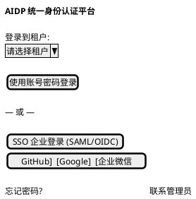

### 1.2 登录后角色判定（流程，非页面）

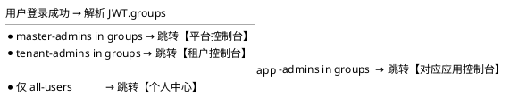

---

## 2 平台控制台 (master-admin)

### 2.1 平台概览仪表盘

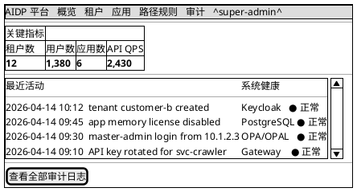

### 2.2 租户列表

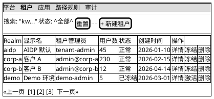

### 2.3 新建租户（3 步向导）

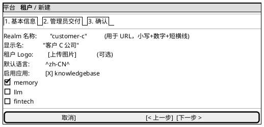

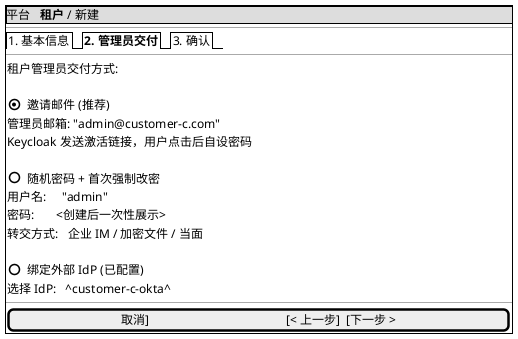

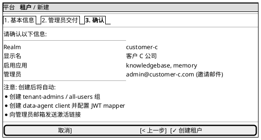

### 2.4 租户详情

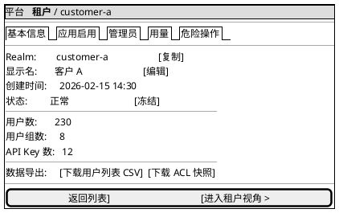

### 2.5 应用管理 - 列表

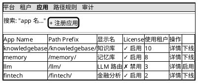

### 2.6 注册应用（4 个 Tab）

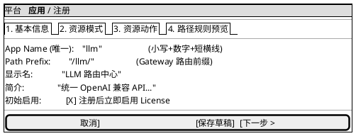

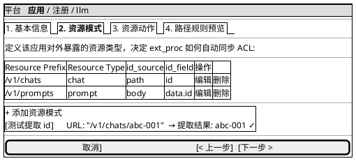

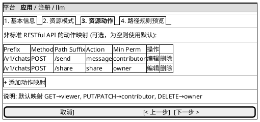

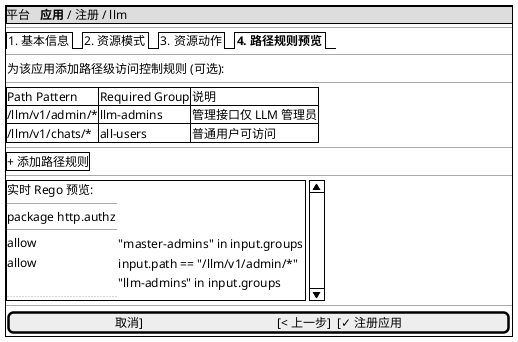

### 2.7 应用详情

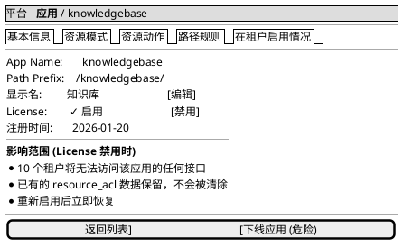

### 2.8 系统审计日志

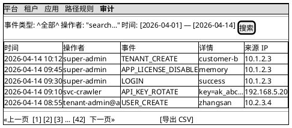

---

## 3 租户控制台 (tenant-admin)

### 3.1 租户概览

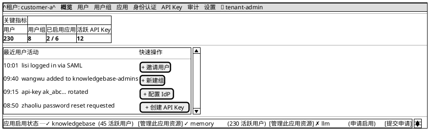

### 3.2 用户列表

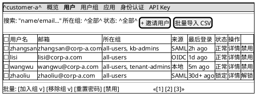

### 3.3 用户详情

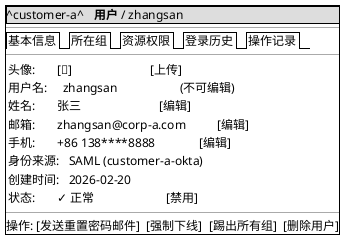

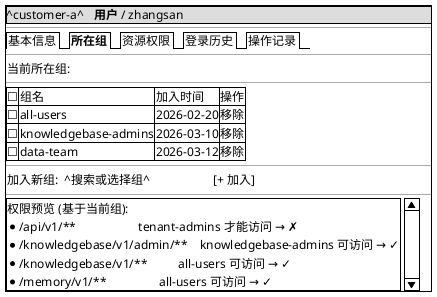

### 3.4 用户组列表

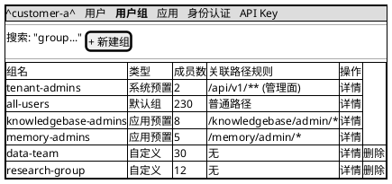

### 3.5 组详情

```plantuml
@startsalt
{+
  {* ^customer-a^ | <b>用户组</b> / knowledgebase-admins }
  --
  {
    组名:       knowledgebase-admins          (系统预置，不可改名)
    描述:       知识库应用管理员               [编辑]
    类型:       应用预置（knowledgebase）
    成员数:     8
    --
    <b>该组的权限说明</b>
     * 命中 path_rules: /knowledgebase/v1/admin/*  → 允许访问
     * 该组成员可管理 knowledgebase 应用的所有资源（owner）
  }
  --
  {/ <b>成员</b> | 关联路径规则 }
  --
  {
    搜索: "user..."                                                     | [+ 添加成员]
  }
  --
  {#
    | ☐ | 用户名    | 邮箱                    | 加入时间     | 操作
    | ☐ | wangwu    | wangwu@corp-a.com      | 2026-03-01   | 移除
    | ☐ | lisi      | lisi@corp-a.com        | 2026-03-05   | 移除
    | ☐ | zhangsan  | zhangsan@corp-a.com    | 2026-03-10   | 移除
  }
  --
  批量: [移除所选]                                                    << [1] [2] >>
}
@endsalt
```

### 3.6 身份认证 (IdP) 列表

```plantuml
@startsalt
{+
  {* ^customer-a^ | 用户 | 用户组 | 应用 | <b>身份认证</b> | API Key }
  --
  {/ <b>IdP 列表</b> | Client Mapper | IdP Mapper }
  --
  {
    已配置的外部身份源:                                              | [+ 新建 IdP]
  }
  --
  {#
    | Alias               | 协议    | 用户数 | 启用  | 测试连接 | 操作
    | customer-a-okta     | SAML    | 210   | ✓    | [测试]   | 详情 | 删除
    | customer-a-google   | OIDC    | 20    | ✓    | [测试]   | 详情 | 删除
    | legacy-ad           | SAML    | 0     | ✗    | [测试]   | 详情 | 删除
  }
}
@endsalt
```

### 3.7 新建 IdP（分步）

```plantuml
@startsalt
{+
  {* ^customer-a^ | <b>身份认证</b> / 新建 }
  --
  {/ <b>1. 协议</b> | 2. 连接配置 | 3. Mapper | 4. 测试 }
  --
  {
    选择认证协议:
    .
    (X) SAML 2.0
        企业级 SSO, AD/Okta/ADFS 等
    .
    ( ) OIDC (OpenID Connect)
        互联网 OIDC, Google/GitHub/微信 等
    .
    Alias (唯一, 用于 URL):  "customer-a-okta"
    显示名:                    "公司 Okta 登录"
  }
  --
  [取消]                                           [下一步 >]
}
@endsalt
```

```plantuml
@startsalt
{+
  {* ^customer-a^ | <b>身份认证</b> / 新建 }
  --
  {/ 1. 协议 | <b>2. 连接配置</b> | 3. Mapper | 4. 测试 }
  --
  {
    SAML 配置方式:
    .
    (X) 导入 IdP Metadata (推荐)
        URL:        "https://okta.customer-a.com/app/xxx/sso/saml/metadata"  [抓取]
        或上传文件: [选择 XML 文件]
    .
    ( ) 手动填写
        Single Sign-On URL:     "..."
        Entity ID:              "..."
        X.509 证书:             "..."
  }
  --
  {
    回调 URL (需在 IdP 侧配置):
    .
    https://gateway.aidp.com/realms/customer-a/broker/customer-a-okta/endpoint    [复制]
  }
  --
  [< 上一步]                                       [下一步 >]
}
@endsalt
```

### 3.8 IdP Mapper 配置

```plantuml
@startsalt
{+
  {* ^customer-a^ | <b>身份认证</b> / customer-a-okta }
  --
  {/ 基本信息 | <b>Mapper</b> | 映射用户 | 测试 }
  --
  {SI
    IdP Mapper 作用: 外部 IdP 属性 → Keycloak 用户属性 / 自动加组
    --
    [外部 IdP] ─ SAML 断言 ─→ [Mapper 规则] ─→ [Keycloak 影子用户]
  }
  --
  {#
    | Mapper 名      | 类型                 | 源属性            | 目标             | 操作
    | email-mapper   | Attribute Importer   | email            | user.email       | 编辑 | 删除
    | name-mapper    | Attribute Importer   | displayName      | user.firstName   | 编辑 | 删除
    | dept-to-group  | Advanced Group       | Department=研发  | dev-team 组      | 编辑 | 删除
    | admin-detect   | Advanced Group       | role=admin       | tenant-admins    | 编辑 | 删除
  }
  --
  {+ + 新建 Mapper
  }
}
@endsalt
```

### 3.9 Client Mapper 配置

```plantuml
@startsalt
{+
  {* ^customer-a^ | <b>身份认证</b> / 客户端 data-agent }
  --
  {/ 基本信息 | <b>Protocol Mapper</b> | 测试 Token }
  --
  {SI
    Client Protocol Mapper 作用: Keycloak 用户信息 → JWT claims
    --
    [Keycloak 用户] ─→ [Mapper] ─→ [JWT token 输出的 claim]
  }
  --
  {#
    | Mapper 名                 | 类型                       | 源              | JWT claim        | 操作
    | groups                    | Group Membership           | user.groups    | groups           | 编辑 | 删除
    | tenant-injector           | Script Mapper              | realm name     | tenant_id        | 编辑 | 删除
    | email-mapper              | User Property              | email          | email            | 编辑 | 删除
  }
  --
  {+ + 新建 Protocol Mapper
  }
  --
  {SI
    JWT 预览 (以 zhangsan 登录为例):
    {
      "sub": "uuid-xxx",
      "iss": "https://gateway.aidp.com/realms/customer-a",
      "groups": ["all-users", "knowledgebase-admins"],
      "tenant_id": "customer-a",
      "email": "zhangsan@corp-a.com"
    }
  }
}
@endsalt
```

### 3.10 API Key 列表

```plantuml
@startsalt
{+
  {* ^customer-a^ | 用户 | 用户组 | 应用 | 身份认证 | <b>API Key</b> }
  --
  {
    搜索: "name..."   | 状态: ^全部^   | 身份: ^全部^                 | [+ 创建 API Key]
  }
  --
  {#
    | Name           | Prefix             | 关联身份            | 作用域                | 最后使用       | 过期时间      | 状态    | 操作
    | 爬虫服务       | ak_live_abcd...    | svc-crawler         | /knowledgebase/*      | 5m ago        | 永久          | 正常    | 轮换 | 禁用 | 删除
    | 数据同步脚本   | ak_live_efgh...    | zhangsan            | /memory/*             | 2d ago        | 2026-07-14    | 正常    | 轮换 | 禁用 | 删除
    | 旧版客户端     | ak_live_ijkl...    | svc-legacy          | /**                   | 30d+ ago      | 2026-05-01    | 即将过期 | 轮换 | 禁用 | 删除
    | 测试 Key       | ak_live_mnop...    | test-user           | /llm/*                | never         | 2026-04-20    | 已禁用   | 启用 | 删除
  }
}
@endsalt
```

### 3.11 创建 API Key（含一次性展示）

```plantuml
@startsalt
{+
  {* ^customer-a^ | <b>API Key</b> / 创建 }
  --
  {
    Name (用途描述):   "爬虫服务 Key"
    --
    关联身份:
    (X) 关联用户:      ^zhangsan^
    ( ) 服务账号:      ^svc-xxx^
    --
    作用域 (路径白名单):
    [X] /knowledgebase/v1/**
    [ ] /memory/v1/**
    [ ] /llm/v1/**
    [ ] 全部 (/**)
    --
    有效期:
    (X) 90 天
    ( ) 30 天
    ( ) 自定义: [2026-__-__]
    ( ) 永不过期 (不推荐)
    --
    速率限制:        "100"  req/min
  }
  --
  [取消]                                           [✓ 创建]
}
@endsalt
```

```plantuml
@startsalt
{+
  {* ^customer-a^ | <b>API Key</b> / 创建成功 }
  --
  {SI
    <b>⚠ 请立即复制，此密钥只会显示一次</b>
    --
    密钥明文:
    ak_live_Zf8xKJp2QmTv9Rn4wXcLdH3eYs6BnPoUi
    .
    [📋 复制到剪贴板]   [💾 下载为 .env]
    --
    30 秒后页面将自动跳转，此密钥不可再次查看。
    如遗忘，需轮换或重新创建。
  }
  --
  Key 详情:
   * Name:        爬虫服务 Key
   * Prefix:      ak_live_Zf8xKJp2
   * 关联身份:    zhangsan
   * 作用域:      /knowledgebase/v1/**
   * 过期时间:    2026-07-13
  --
                                                   [我已复制，继续]
}
@endsalt
```

### 3.12 API Key 轮换

```plantuml
@startsalt
{+
  {* ^customer-a^ | <b>API Key</b> / 爬虫服务 Key / 轮换 }
  --
  {SI
    <b>轮换 API Key</b>
    --
    当前 Key:      ak_live_abcd...
    新 Key:        将在确认后生成，仅展示一次
    --
    <b>轮换后的变化:</b>
     * 关联身份 (svc-crawler) 不变
     * resource_acl 中该身份的权限数据保留
     * 新 Key 立即可用
     * 旧 Key 保留 <b>[宽限期: ^24 小时^]</b> 后自动失效
     * 通知:  [ ] 发送邮件给关联身份  [ ] 发送 Webhook
  }
  --
  [取消]                                           [✓ 生成新 Key]
}
@endsalt
```

### 3.13 应用接入

```plantuml
@startsalt
{+
  {* ^customer-a^ | 用户 | 用户组 | <b>应用</b> | 身份认证 | API Key }
  --
  {#
    | App Name        | 显示名     | 状态       | 已授权用户数  | 操作
    | knowledgebase   | 知识库     | ✓ 已启用   | 45           | 进入应用控制台
    | memory          | 记忆库     | ✓ 已启用   | 230          | 进入应用控制台
    | llm             | LLM 路由   | ✗ 未启用   | —            | [申请启用]
    | fintech         | 金融分析   | ✗ 未启用   | —            | [申请启用]
  }
  --
  {SI
    提示: 应用启用/禁用由平台管理员控制。租户只能申请启用，实际生效后会在此显示绿色 ✓。
  }
}
@endsalt
```

---

## 4 应用控制台 (app-admin)

### 4.1 应用概览（以 knowledgebase 为例）

```plantuml
@startsalt
{+
  {* ^customer-a^ | <b>knowledgebase</b> | 资源 | 路径规则 | 应用组 | 👤 wangwu }
  --
  {# 关键指标
     | KB 总数  | Document 总数  | 活跃用户   | 今日 QPS
     | <b>128</b> | <b>2,450</b>      | <b>35</b>     | <b>420</b>
  }
  --
  {SI
    最近操作                                           | 待处理
    ----                                               | ----
    10:20  lisi created KB "客户调研 2026-Q2"           | [3 个权限申请待审批]
    09:55  zhangsan shared KB "产品白皮书" → data-team  | [0 个异常同步记录]
    09:30  wangwu deleted KB "草稿-旧版"                | .
  }
  --
  [返回租户控制台]
}
@endsalt
```

### 4.2 资源列表

```plantuml
@startsalt
{+
  {* <b>knowledgebase</b> / <b>资源</b> }
  --
  {
    搜索: "kb name..."  | 权限: ^全部^  | Owner: "search..."         | [批量导出 CSV]
  }
  --
  {#
    | ☐ | Resource ID  | 名称                | 类型  | Owner      | 分享数 | 我的权限    | 创建时间    | 操作
    | ☐ | kb-001       | 产品白皮书          | kb    | zhangsan   | 5      | owner       | 2026-04-10  | 分享 | 删除
    | ☐ | kb-002       | 客户调研 2026-Q2    | kb    | lisi       | 2      | contributor | 2026-04-14  | 分享
    | ☐ | kb-003       | 内部规范            | kb    | wangwu     | 0      | owner       | 2026-04-12  | 分享 | 删除
  }
  --
  批量: [批量分享] [导出]                                            << [1] [2] [3] >>
}
@endsalt
```

### 4.3 资源权限详情

```plantuml
@startsalt
{+
  {* <b>knowledgebase</b> / 资源 / kb-001 }
  --
  {
    名称:        产品白皮书
    Resource ID: kb-001
    类型:        kb
    Owner:       zhangsan (唯一)                          [转让]
    创建时间:    2026-04-10
  }
  --
  {/ <b>权限成员</b> | 操作日志 }
  --
  {
    当前成员:                                                        | [+ 分享]
  }
  --
  {#
    | ☐ | 主体          | 类型   | 权限          | 授权时间     | 操作
    | ☐ | zhangsan      | 用户   | owner         | 2026-04-10   | (唯一，不可改)
    | ☐ | lisi          | 用户   | contributor   | 2026-04-11   | 改权限 | 移除
    | ☐ | wangwu        | 用户   | viewer        | 2026-04-12   | 改权限 | 移除
    | ☐ | data-team     | 组     | viewer        | 2026-04-13   | 改权限 | 移除
    | ☐ | ak_live_abcd..| API Key | viewer       | 2026-04-14   | 改权限 | 移除
  }
  --
  批量: [回收所选]
}
@endsalt
```

### 4.4 分享资源

```plantuml
@startsalt
{+
  {* <b>knowledgebase</b> / 资源 / kb-001 / 分享 }
  --
  {
    分享给:
    .
    (X) 用户 / 组 (搜索):   "search user or group..."
    ( ) API Key:            ^选择 key^
    ( ) 全组织 (all-users)
    .
    权限:
    ( ) viewer (只读)
    (X) contributor (可编辑)
    ( ) owner (完全控制，含再分享)
    .
    有效期:
    (X) 永久
    ( ) 截止时间: [2026-__-__]
    .
    备注:  "客户项目协作"
  }
  --
  预览: 将授予 <b>data-team 组</b> 对 <b>kb-001 "产品白皮书"</b> 的 <b>contributor</b> 权限
  --
  [取消]                                           [✓ 分享]
}
@endsalt
```

---

## 5 个人中心

### 5.1 我的信息

```plantuml
@startsalt
{+
  {* AIDP | <b>个人中心</b> | 🔔 | 👤 zhangsan }
  --
  {/ <b>基本信息</b> | 安全设置 | 我的 API Key | 登录历史 }
  --
  {
    | 头像:       [👤]                                      [上传]
    | 用户名:     zhangsan                                  (不可改)
    | 显示名:     张三                                      [编辑]
    | 邮箱:       zhangsan@corp-a.com  ✓ 已验证              [更换]
    | 手机:       +86 138****8888                           [编辑]
    | 租户:       customer-a (客户 A)
    | 所在组:     all-users, knowledgebase-admins
    | 身份来源:   SAML (customer-a-okta)
  }
}
@endsalt
```

### 5.2 安全设置

```plantuml
@startsalt
{+
  {* AIDP | <b>个人中心</b> }
  --
  {/ 基本信息 | <b>安全设置</b> | 我的 API Key | 登录历史 }
  --
  {
    密码
      上次修改: 2026-02-15 (60 天前)                     [修改密码]
    --
    双因素认证 (MFA)
      ( ) 未启用
      (X) TOTP 验证码 (Google Authenticator 等)          [重新绑定] [禁用]
      ( ) WebAuthn / 安全密钥
    --
    登录设备
      * MacBook - Chrome 125        10.1.2.3  now         (本次会话)
      * iPhone - Safari             192.168.5.20  2h ago  [强制下线]
    --
    危险操作
      [退出所有会话]  [申请删除账号]
  }
}
@endsalt
```

### 5.3 我的 API Key（个人视角）

```plantuml
@startsalt
{+
  {* AIDP | <b>个人中心</b> }
  --
  {/ 基本信息 | 安全设置 | <b>我的 API Key</b> | 登录历史 }
  --
  {
    你名下的 API Key:                                              | [+ 创建 API Key]
  }
  --
  {#
    | Name           | Prefix             | 作用域          | 最后使用     | 过期时间     | 操作
    | 数据同步脚本   | ak_live_efgh...    | /memory/*       | 2d ago      | 2026-07-14   | 轮换 | 删除
  }
  --
  {SI
    说明: 你只能看到自己创建的 Key。租户管理员可查看并回收全部 Key。
  }
}
@endsalt
```

---

## 6 通用组件样式约定

### 6.1 顶部导航栏

```plantuml
@startsalt
{+
  {* <b>AIDP</b> | [角色视角切换 v] | [页面菜单] | 🔔 3 | 👤 user@domain v }
}
@endsalt
```

### 6.2 面包屑

```plantuml
@startsalt
{
  平台 / 租户 / customer-a / 用户 / zhangsan
}
@endsalt
```

### 6.3 二次确认（危险操作）

```plantuml
@startsalt
{+
  <b>⚠ 危险操作确认</b>
  --
  你即将删除租户 <b>customer-a</b>。此操作将:
   * 删除该租户下所有 230 个用户
   * 删除所有用户组
   * 删除所有 resource_acl 数据
   * 撤销所有 API Key
  --
  <b>此操作不可恢复。</b>
  --
  请输入租户 Realm 名确认: "customer-a"
  --
  [取消]                                           [✗ 永久删除]
}
@endsalt
```

### 6.4 空态提示

```plantuml
@startsalt
{+
  <b>📭 暂无数据</b>
  --
  还没有配置任何外部 IdP
  --
  [+ 立即配置第一个 IdP]   [查看文档]
}
@endsalt
```

### 6.5 加载骨架屏

```plantuml
@startsalt
{+
  ▓▓▓▓▓▓▓▓▓▓▓▓▓▓▓▓
  ▓▓▓▓▓▓▓▓▓
  --
  ▓▓▓▓▓▓▓▓▓▓▓ | ▓▓▓▓▓▓▓▓ | ▓▓▓▓▓▓▓▓▓▓
  ▓▓▓▓▓▓▓ | ▓▓▓▓ | ▓▓▓▓▓▓▓
}
@endsalt
```

---

## 7 信息架构总览

```plantuml
@startsalt
{T
 + AIDP 管理台
 ++ 登录
 ++ 平台控制台 (master-admin)
 +++ 概览
 +++ 租户管理
 ++++ 列表 / 新建 / 详情
 +++ 应用管理
 ++++ 列表 / 注册 / 详情
 +++ 路径规则
 +++ 审计
 ++ 租户控制台 (tenant-admin)
 +++ 概览
 +++ 用户管理
 ++++ 列表 / 详情 / 邀请 / 批量导入
 +++ 用户组管理
 ++++ 列表 / 详情 / 成员管理
 +++ 应用接入
 +++ 身份认证
 ++++ IdP 列表 / 新建 IdP / Mapper 配置
 +++ API Key 管理
 ++++ 列表 / 创建 / 轮换 / 禁用
 +++ 审计
 +++ 租户设置
 ++ 应用控制台 ({app}-admin)
 +++ 概览
 +++ 资源管理
 ++++ 列表 / 详情 / 分享 / 回收
 +++ 路径规则 (只读)
 +++ 应用组管理
 ++ 个人中心
 +++ 基本信息
 +++ 安全设置 (密码/MFA)
 +++ 我的 API Key
 +++ 登录历史
}
@endsalt
```

---

## 8 下一步

- 评审本线框图，提修改意见
- 确认后进入高保真设计（Figma/Sketch）
- 开发阶段：建议按 Section 8.2 分层 MVP 实现
  1. 第 1 层（MVP）：登录 + 平台租户/应用管理 + 租户用户/组/APIKey
  2. 第 2 层：IdP + Mapper + 应用控制台
  3. 第 3 层：审计、MFA、品牌定制
