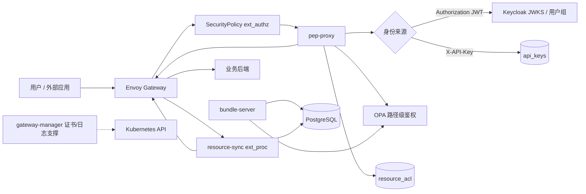

# 实践过程说明书

[TOC]

**说明**：本文档用于记录 AIDP IAM / Gateway 项目中使用 AI 辅助完成统一鉴权与权限管理能力设计、实现、测试和交付的实践过程。正式评审时，可将关键架构图、鉴权链路测试截图、Gateway 路由访问截图、API Key/ACL 测试结果上传到 3MS 图床后补充到对应章节。OMS 日志收集和证书管理属于本次实践中的配套运维能力，本文仅做简要说明。

## 1、项目说明

| 角色 | 姓名/工号 | 分工说明 |
| --- | --- | --- |
| 团队成员一 | 待补充 | IAM / Gateway 鉴权方案设计、接口联调 |
| 团队成员二 | 待补充 | Helm 部署、镜像构建、鉴权链路验证 |
| 团队成员三 | 待补充 | API Key、ACL、路径鉴权测试用例设计 |
| 使用工具&模型 | Codex + PowerShell/Bash/kubectl/helm/docker/kind/gh | Codex（GPT-5） |

### 1.1 背景

AIDP IAM 项目需要为多个业务应用提供统一认证、统一鉴权和统一入口治理能力。业务请求从 Envoy Gateway 进入后，必须先完成身份认证，再完成路径级权限判断，最后在资源实例级别判断调用方是否具备访问权限。项目涉及 Keycloak、Envoy Gateway、OPA、PostgreSQL、pep-proxy、resource-sync、bundle-server、IAM 管理 API 和业务侧 HTTPRoute / SecurityPolicy 配置。

实践前主要痛点集中在鉴权链路：

1. 多业务接入 Gateway 时，每个业务都要手写 HTTPRoute、SecurityPolicy、ReferenceGrant 和 ACL 同步配置，接入成本高。
2. 用户 JWT、API Key、路径权限、资源 ACL 分散在不同实现里，容易出现鉴权绕路或重复授权模型。
3. 资源创建、删除、分享和列表查询需要和业务接口解耦，不能要求所有业务都重写自己的权限系统。
4. OPA 策略、数据库 ACL、Keycloak 用户组、Gateway 路由之间存在多文件一致性问题，人工修改容易遗漏。
5. 端到端测试需要覆盖无 token、普通用户、管理员、API Key、路径规则、资源 ACL、跨租户拒绝、路由策略等组合场景。

本次 AI 实践以“统一鉴权效率提升”为核心，围绕“需求澄清、鉴权链路设计、代码落地、测试固化、接入工具沉淀”进行。评估方式参考 1+3 方案：

| 评估项 | 权重 | 本项目实践点 |
| --- | --- | --- |
| 效率提升 | 40% | AI 协助梳理 JWT、API Key、OPA、ACL、Gateway Policy 多组件链路，并生成测试和接入配置 |
| 关键创新 | 20% | 沉淀两级鉴权模型、API Key 统一身份模型、资源 ACL 自动同步和 Gateway 接入生成器 |
| 业务价值 | 20% | 业务只需按规范接入 Gateway，即可复用统一认证、路径鉴权、资源授权和流量策略 |
| 可推广性 | 20% | 鉴权 Story、Policy 模板、测试脚本和接入生成器可复制到其他业务线 |

### 1.2 业务背景

IAM 作为基础身份与权限组件，为业务提供用户登录、组管理、应用注册、路径授权、API Key 认证、资源 ACL 授权和 Manifest 注册能力。Gateway 作为统一入口，负责接入业务路由并在热路径上触发鉴权。

当前鉴权体系按三层展开：

1. **身份认证层**：用户侧使用 Keycloak 签发的 JWT；外部应用侧使用 API Key。pep-proxy 在 ext_authz 阶段识别 `Authorization` 或 `X-API-Key`，认证成功后生成统一调用方身份。
2. **路径级鉴权层**：bundle-server 将 `apps`、`path_rules`、`permission_groups` 等数据生成 OPA policy/data，pep-proxy 调用 OPA 判断请求路径和方法是否允许访问。
3. **资源级鉴权层**：pep-proxy 解析统一 URL 中的 tenant、namespace、resource id，查询 `resource_acl`，按 Owner、Contributor、Viewer 等角色矩阵判断资源实例是否可访问。

证书管理和 OMS 日志收集是配套能力：证书接口用于让 Gateway HTTPS 入口接入外部证书管理系统，OMS 日志回调用于交付后问题定位，不作为本文主线。

## 2、实践过程

### 2.1 需求澄清与方案收敛

实践初期通过多轮对话明确以下鉴权设计边界：

1. 终端用户登录、注册、改密、SAML/CAS 跳转仍由 Keycloak 登录流承载，页面定制通过 Keycloak theme 完成，不自研旁路登录系统。
2. 所有受保护业务请求必须从 Envoy Gateway 进入，通过 `SecurityPolicy.extAuth.grpc` 调用 pep-proxy，避免业务直接绕过 IAM 鉴权。
3. JWT 和 API Key 不拆成两套授权系统。API Key 认证成功后转换为服务主体身份，继续复用 OPA 路径规则和 `resource_acl`。
4. 路径级鉴权和资源级鉴权分层：OPA 判断“能否访问某类接口”，`resource_acl` 判断“能否访问某个资源实例”。
5. 资源 ACL 自动同步由 resource-sync 通过 Envoy `ext_proc` 完成，业务后端只需按统一 URL 和响应 ID 规范返回数据。
6. Gateway 接入生成器需要输出 HTTPRoute、ReferenceGrant、SecurityPolicy、EnvoyExtensionPolicy、ACL 同步和流量策略，减少业务接入手写 YAML。
7. Gateway namespace 固定为 `aidp-gateway`，避免 release namespace 改变后影响 SecurityPolicy、HTTPRoute 和 Gateway 资源归属。

### 2.2 代码与目录重构

为便于鉴权链路维护，项目按运行职责重构为以下结构：

```text
aidp-iam/
├── apps/
│   ├── iam-api/             IAM 管理 API、用户/组/应用/API Key/ACL 接口
│   ├── pep-proxy/           Envoy ext_authz 鉴权服务
│   ├── bundle-server/       OPA policy/data 生成与推送
│   ├── resource-sync/       Envoy ext_proc 资源 ACL 自动同步
│   ├── gateway-manager/     Gateway 证书与 OMS 日志回调支撑服务
│   ├── keycloak-spi/        Keycloak 结构化组 Mapper
│   └── keycloak-theme/      Keycloak 登录主题
├── build/
│   ├── docker/
│   │   ├── aidp-iam-app/
│   │   ├── keycloak-custom/
│   │   ├── keycloak-init/
│   │   └── gateway-manager/
│   └── openeuler/gateway/
├── deploy/
│   ├── helm/
│   │   ├── aidp-gateway/
│   │   ├── aidp-iam/
│   │   └── mocks/
│   ├── kind/
│   └── scripts/
├── tests/
│   ├── e2e/
│   ├── fixtures/
│   └── manual-cases/
├── docs/
├── tools/
├── artifacts/
└── legacy/
```

### 2.3 鉴权功能开发

本次实践中 AI 参与完成的主要鉴权相关开发内容包括：

1. **JWT 鉴权统一**：pep-proxy 使用 PyJWT + JWKS 完成 token 校验，解析用户、租户、groups、client 信息。
2. **API Key 认证与管理**：IAM API 提供 API Key 创建、查询、更新、轮换、删除能力；数据库只保存 hash 和前缀，明文只在创建/轮换时返回一次。
3. **API Key 接入热路径**：pep-proxy 识别 `X-API-Key`，校验 enabled、expires_at、allowed_paths 后合成服务主体身份，继续进入 OPA 和 ACL 鉴权。
4. **OPA 路径级鉴权**：bundle-server 从数据库读取 apps、path_rules、permission_groups、permission_group_paths、permission_group_bindings，生成 Rego policy 和 data 并推送到 OPA。
5. **资源级 ACL 鉴权**：pep-proxy 解析统一 URL，查询 `resource_patterns` 和 `resource_acl`，按最长前缀和角色矩阵判断资源访问权限。
6. **ACL 自动同步**：resource-sync 在资源创建成功后自动写入创建者 Owner ACL，在资源删除成功后级联清理资源 ACL，失败任务进入 pending retry。
7. **列表查询过滤**：resource-sync 在集合查询请求中注入 `X-Allowed-Ids` 和 `X-Allowed-Total`，业务后端按 header 返回调用方可见资源。
8. **业务接入生成器**：页面化生成业务所需的 HTTPRoute、ReferenceGrant、SecurityPolicy、EnvoyExtensionPolicy、ACL 同步和流量治理 YAML。

配套能力简要说明：

1. Gateway Manager 提供 `POST /GatewayManager/Tenants/System/Certificates/{alias}`，用于接收证书材料并写入 Kubernetes TLS Secret。
2. Gateway / IAM 提供 OMS 日志 Dispatch、Progress、Nodes 三个回调接口，用于交付后日志收集和问题定位。

### 2.4 部署与验证

当前本地验证流程统一通过 `deploy/scripts` 完成：

```bash
export CLUSTER_NAME=da-cluster
bash ./deploy/scripts/cleanup.sh
bash ./deploy/scripts/setup.sh
bash ./deploy/scripts/test.sh
bash ./deploy/scripts/cleanup.sh
bash ./deploy/scripts/setup.sh --skip-build
bash ./deploy/scripts/test.sh
```

部署脚本构建并加载以下鉴权相关镜像：

| 镜像 | 构建位置 | 用途 |
| --- | --- | --- |
| `aidp-iam-app:v1` | `build/docker/aidp-iam-app/Dockerfile` | IAM API、pep-proxy、bundle-server、resource-sync 合并服务 |
| `keycloak-custom:26.5.2` | `build/docker/keycloak-custom` | Keycloak + CAS + SPI + Theme |
| `keycloak-init:v2` | `build/docker/keycloak-init/Dockerfile` + `apps/keycloak-init` | 初始化 realm、client、groups、apps、path rules |
| `gateway-manager:v1` | `build/docker/gateway-manager/Dockerfile` | 证书和日志支撑服务 |

部署使用的主要外部镜像如下：

| 镜像 | 版本 | 鉴权链路作用 |
| --- | --- | --- |
| `docker.io/envoyproxy/gateway` | `v1.7.2` | Gateway Controller，管理 SecurityPolicy / HTTPRoute |
| `docker.io/envoyproxy/envoy` | `v1.36.5` | 数据面，触发 ext_authz / ext_proc |
| `postgres` | `17` | 存储用户映射、API Key、路径规则、ACL |
| `openpolicyagent/opa` | `0.42.2-static` | 路径级策略判定 |
| `docker.io/alpine/kubectl` | `1.34.1` | cleanup hook |

### 2.5 测试沉淀

自动化测试重点覆盖鉴权场景：

1. JWT 登录、token 获取、groups mapper、普通用户和管理员访问差异。
2. 无 token、错误 token、跨租户访问、应用停用、路径规则不命中等拒绝场景。
3. API Key 创建、轮换、禁用、删除、过期、allowed_paths 限制和业务路径访问。
4. OPA policy/data 推送结果、路径规则命中、权限组绑定。
5. `resource_acl` 创建、查询、分享、撤销、继承、角色矩阵和跨租户拒绝。
6. resource-sync 自动写 Owner ACL、级联删除 ACL、集合查询注入 `X-Allowed-Ids`。
7. Gateway SecurityPolicy、EnvoyExtensionPolicy、HTTPRoute、ReferenceGrant 生效验证。

配套测试覆盖：

1. Gateway 证书上传、Secret 写入和 HTTPS 入口可访问。
2. Gateway / IAM OMS 日志回调 Dispatch、Progress、Nodes 基础联调。
3. clean install、uninstall cleanup、reinstall 后再次完整测试。

测试资产沉淀位置：

```text
deploy/scripts/test.py
tests/e2e/
tests/manual-cases/
tools/gateway-onboarding-generator/
```

## 3、业务收益

### 3.1 效率提升点

1. 业务接入从“理解 IAM、OPA、Gateway API、ACL 多套配置”收敛为通过生成器填写应用名、路径、后端和鉴权策略。
2. API Key 不再单独建设旁路权限系统，创建后直接复用路径规则和资源 ACL，减少设计和测试成本。
3. 资源创建、删除、列表过滤由 resource-sync 自动同步，业务后端无需实现完整权限中心。
4. OPA 策略生成、Gateway Policy、ACL 数据和测试脚本形成闭环，减少人工排查“为什么被放行/拒绝”的时间。
5. AI 辅助把多轮联调问题转成常驻测试用例，后续变更可直接回归。

### 3.2 质量提升点

1. 鉴权默认拒绝：无 token、无路径权限、资源 ACL 不足、跨租户访问均不能到达后端。
2. JWT 与 API Key 统一进入 pep-proxy，不存在双链路语义不一致的问题。
3. 明文 API Key 不落库，只保存 hash 和前缀，降低泄露风险。
4. resource_acl 和 api_keys 使用幂等 DDL，升级后不破坏已有授权数据。
5. Gateway SecurityPolicy 绑定业务 HTTPRoute 后才启用鉴权，未接入业务不受影响。
6. 通过两轮安装、卸载、重装、测试验证 cleanup 和重新部署后鉴权状态可恢复。

## 4、关键创新

1. **两级鉴权模型**：OPA 负责路径级 allow/deny，resource_acl 负责资源实例权限，职责清晰且易定位。
2. **API Key 统一身份模型**：API Key 认证后合成服务主体身份，继续复用 OPA 和 ACL，不引入第二套授权体系。
3. **资源 ACL 自动同步**：通过 Envoy ext_proc 在请求/响应阶段处理资源生命周期，业务后端不需要主动调用 IAM 写 ACL。
4. **集合查询可见性注入**：resource-sync 注入 `X-Allowed-Ids`，让业务后端以低侵入方式完成列表过滤。
5. **Gateway 接入生成器**：将路由、鉴权、ACL 同步、限流、超时、重试、IP 黑白名单统一生成，降低业务接入门槛。
6. **测试即规约**：API Key、Path Rules、ACL、SecurityPolicy 等关键行为全部落入自动化测试，减少口头约定。

## 5、推广价值

1. 统一鉴权模型可推广到其他通过 Gateway API 接入的业务，只需按统一 URL 和 Manifest 规范描述资源。
2. API Key 管理模型可复用于机器到机器访问场景，避免每个业务自建密钥表和权限逻辑。
3. resource-sync 的 ACL 自动同步方式可推广到知识库、记忆、智能体、数据集等资源型业务。
4. Gateway 接入生成器可作为业务接入模板，减少平台团队和业务团队反复沟通成本。
5. Story 设计、测试脚本和 release 验证 Prompt 可作为后续基础服务组件开发模板。

## 6、加分项说明

### 6.1 Spec Driven Develop（规约驱动开发）实践

实践中先形成鉴权 Story 和接口规约，再由 AI 辅助落地代码，包括：

1. 路径级鉴权与资源访问鉴权 Story。
2. API Key 认证与管理 Story。
3. 资源 ACL 自动同步与权限管理 Story。
4. Gateway 业务接入配置规约。
5. 鉴权测试用例和黑盒验证脚本。

这种方式先约束身份、路径、资源、角色和异常行为，再实现代码，减少了“代码写完才发现权限语义不一致”的返工。

### 6.2 代码质量

1. 鉴权热路径集中在 pep-proxy，管理面集中在 iam-api，OPA 数据生成集中在 bundle-server，ACL 自动同步集中在 resource-sync。
2. Helm values、Service 名称、镜像 tag、namespace 与测试脚本保持一致。
3. API Key、OPA、ACL、SecurityPolicy 均补充回归测试。
4. 对外接口路径保持平台标准命名：
   - `/AccessManager/Tenants/{tenant}/ApiKeys`
   - `/AccessManager/Tenants/{tenant}/ACLs`
   - `/AccessManager/Tenants/System/AppManifests/{namespace}`
   - `/GatewayManager/Tenants/System/...`

### 6.3 可演进性

1. 新增业务只需新增 Manifest / path_rules / HTTPRoute / SecurityPolicy，不需要改鉴权核心链路。
2. 新增角色可以通过资源角色矩阵或业务回调扩展。
3. 后续可在 pep-proxy 增加短 TTL 缓存，但需要配套 API Key 禁用、ACL 变更后的失效机制。
4. Gateway 接入生成器可继续扩展灰度路由、header rewrite、mTLS 和熔断策略。

## 7、问题记录

| 问题 | 现象 | 解决思路 |
| --- | --- | --- |
| JWT 与 API Key 容易形成两套授权 | API Key 只做密钥校验会绕过 OPA/ACL | API Key 认证后转换为服务主体身份，继续走 OPA 和 resource_acl |
| 路径鉴权和资源鉴权职责不清 | OPA 里塞入资源实例 ACL 会导致策略膨胀 | OPA 只做路径级鉴权，资源实例权限由 pep-proxy 查询 DB |
| 资源创建后权限不同步 | 创建者创建资源后仍无法访问 | resource-sync 在响应阶段提取资源 ID 并写 Owner ACL |
| 资源删除后 ACL 残留 | 已删除资源仍有授权数据 | resource-sync 删除成功后按 object_path 前缀级联清理 |
| 列表接口无法按权限过滤 | 后端不知道调用方可见哪些资源 | ext_proc 注入 `X-Allowed-Ids` 和 `X-Allowed-Total` |
| payload too large | Manifest 或鉴权 body 走 Gateway 被限制 | 在生成器和 SecurityPolicy 中支持可选调大 `maxRequestBytes` |
| Gateway release namespace 影响路由资源 | `-n agentinfra` 安装后路由资源漂移 | Gateway 核心资源 namespace 固定为 `aidp-gateway` |
| Keycloak Admin Auth Failed | IAM app 内 client secret 与 Keycloak 实际 client secret 不一致 | 检查 `aidp-client`、Secret、keycloak-init Job 和 token endpoint |
| 日志与证书联调需求插入主链路 | 文档主线容易偏向运维能力 | 将日志、证书定位为支撑能力，鉴权设计作为主线 |

个人思考：

1. 鉴权类项目最重要的是先把身份、路径、资源、角色、异常默认行为定义清楚，代码实现反而是第二步。
2. AI 适合处理多组件一致性检查，但必须让它读取 Story、Helm、测试和源码，不能只凭口头描述改鉴权逻辑。
3. 权限能力要尽早转成黑盒测试，尤其是拒绝场景；只测成功访问很容易漏掉绕权问题。

## 2、AIDP IAM / Gateway 统一鉴权设计文档

### 1. 需求概述

本项目目标是在 Kubernetes 环境中提供一套可被多业务复用的统一鉴权能力：

1. 支持用户 JWT 和外部应用 API Key 两种身份来源。
2. 支持 OPA 路径级鉴权，按应用、路径、方法、用户组判断请求是否可访问。
3. 支持资源实例级 ACL，按租户、主体、资源路径和角色判断资源是否可访问。
4. 支持资源创建、删除、列表查询时自动同步和注入 ACL 信息。
5. 支持业务通过 Gateway 接入生成器快速生成路由、鉴权和 ACL 同步配置。
6. 支持本地完整部署、卸载、重装和自动化测试验证。

### 2. 功能设计

#### 2.1 核心功能

1. **身份认证**：Keycloak JWT 校验和 API Key 校验统一由 pep-proxy 处理。
2. **路径级鉴权**：bundle-server 将 apps、path_rules、permission_groups 生成 OPA data，pep-proxy 调用 OPA 判断路径权限。
3. **资源级鉴权**：pep-proxy 查询 `resource_acl`，根据 Owner、Contributor、Viewer 角色矩阵判断资源实例访问权限。
4. **API Key 管理**：IAM API 提供 Key 创建、查询、更新、禁用、删除和轮换；Key 明文只返回一次。
5. **ACL 管理**：IAM API 提供 ACL CRUD、批量查询、组级对象权限配置和资源可见性查询。
6. **ACL 自动同步**：resource-sync 通过 ext_proc 自动写入创建者 Owner ACL、删除资源 ACL、注入列表过滤 header。
7. **业务接入配置**：生成 HTTPRoute、ReferenceGrant、SecurityPolicy、EnvoyExtensionPolicy 和流量治理策略。
8. **支撑能力**：Gateway Manager 提供证书写入和 OMS 日志回调，保障 HTTPS 入口和问题定位。

### 3. 界面设计

#### 3.1 整体布局

Gateway 接入生成器位于：

```text
tools/gateway-onboarding-generator/
├── index.html
├── styles.css
├── generator.js
└── README.md
```

页面按业务接入流程分区：

1. 基础路由：应用名、namespace、path、backend service。
2. 鉴权配置：SecurityPolicy、PEP 鉴权开关、ACL 自动同步、EnvoyExtensionPolicy。
3. 资源模型：租户路径、资源类型、资源 ID 提取方式、列表过滤 header。
4. 流量治理：超时、限流、重试、TCP 连接限制、后端连接保护。
5. 访问控制：IP 白名单、IP 黑名单。
6. 生成结果：YAML、curl、业务接入需求表。

#### 3.2 视觉风格（简约现代）

界面风格以平台接入效率为主，按“路由、鉴权、资源、流量、输出”分组展示。鉴权配置位于业务接入主流程中，不作为隐藏高级项，保证业务接入人员能明确知道当前路由是否已经绑定 IAM 鉴权和 ACL 同步。

### 4. 技术架构

整体鉴权架构如下：



#### 4.1 技术栈

| 模块 | 技术 | 鉴权职责 |
| --- | --- | --- |
| IAM API | Python、FastAPI、Pydantic、asyncpg | 用户、组、应用、API Key、ACL、Manifest 管理 |
| pep-proxy | Python、gRPC、PyJWT、httpx/requests | JWT/API Key 认证、OPA 调用、resource_acl 查询 |
| bundle-server | Python、FastAPI | 生成 Rego 和 OPA data |
| resource-sync | Python、gRPC ext_proc | 创建/删除资源 ACL 自动同步，列表过滤 header 注入 |
| Gateway | Envoy Gateway、Envoy、Gateway API | 入口路由、SecurityPolicy、ext_authz、ext_proc |
| 身份认证 | Keycloak 26.5.2、CAS provider、Keycloak theme | 用户登录、token 签发、groups mapper |
| 策略引擎 | OPA 0.42.2 | 路径级 allow/deny |
| 数据库 | PostgreSQL 17 | API Key、路径规则、ACL、Manifest |
| 支撑服务 | gateway-manager | 证书写入、OMS 日志回调 |

#### 4.2 文件结构

```text
aidp-iam/
├── apps/
│   ├── iam-api/
│   │   └── app/                 # 管理面 API：用户、组、应用、ACL、API Key、Manifest
│   ├── pep-proxy/
│   │   ├── app/                 # ext_authz 鉴权热路径
│   │   └── proto/
│   ├── bundle-server/
│   │   └── app/                 # OPA policy/data 生成
│   ├── resource-sync/
│   │   ├── app/                 # ext_proc ACL 自动同步
│   │   └── proto/
│   ├── gateway-manager/
│   │   └── app/main.py          # 证书与日志支撑接口
│   ├── keycloak-spi/
│   └── keycloak-theme/
├── build/docker/
│   ├── aidp-iam-app/
│   ├── gateway-manager/
│   ├── keycloak-custom/
│   └── keycloak-init/
├── deploy/helm/
│   ├── aidp-gateway/
│   ├── aidp-iam/
│   └── mocks/package-mock-kb/
├── deploy/scripts/
│   ├── setup.sh
│   ├── cleanup.sh
│   └── test.sh
├── tests/
└── tools/gateway-onboarding-generator/
```

### 5. 核心算法

#### 5.1 JWT / API Key 身份认证

1. 请求进入 Envoy Gateway。
2. Envoy 根据 SecurityPolicy 调用 pep-proxy ext_authz。
3. pep-proxy 判断身份来源：
   - 存在 `X-API-Key` 时执行 API Key 分支。
   - 否则解析 `Authorization: Bearer <token>`。
4. JWT 分支校验签名、issuer、audience、有效期，提取 user id、tenant、groups。
5. API Key 分支对明文做 SHA-256 hash，查询 `api_keys`，校验 enabled、expires_at、allowed_paths，并合成服务主体身份。
6. 认证失败返回 401；认证成功进入路径级鉴权。

#### 5.2 OPA 路径级鉴权

1. bundle-server 周期读取 `apps`、`path_rules`、`permission_groups`、`permission_group_paths`、`permission_group_bindings`。
2. bundle-server 生成 Rego policy 和 data，写入 OPA `/v1/policies`、`/v1/data`。
3. pep-proxy 构造 input：method、path、namespace、tenant、user、groups、app。
4. OPA 返回 allow/deny 和拒绝原因。
5. 路径级拒绝返回 403，不转发后端；路径级允许后进入资源级鉴权。

#### 5.3 resource_acl 资源级鉴权

1. pep-proxy 按统一 URL `/<Namespace>/Tenants/<TenantID>/<Type>/<ID>` 解析 tenant、namespace、object_path。
2. 查询 `resource_patterns` 判断该路径是否需要资源级保护。
3. 查询 `resource_acl`，按用户主体和组主体匹配可用 ACL。
4. 按最长前缀继承规则选择最具体的 ACL。
5. 按角色矩阵判断 method 是否允许：
   - Viewer：读取。
   - Contributor：读取、创建、更新。
   - Owner：读取、创建、更新、删除、授权管理。
6. 资源级拒绝返回 403；允许后注入 `X-Auth-*` header 并转发后端。

#### 5.4 resource-sync ACL 自动同步

1. 创建资源请求返回 2xx 后，resource-sync 从响应体提取资源 ID。
2. 根据 `resource_patterns` 拼接 object_path。
3. 写入创建者 Owner ACL。
4. 删除资源成功后，按 object_path 前缀清理资源及子资源 ACL。
5. 同步失败时写入 pending retry，不回滚业务响应。
6. 集合查询时查询调用方可见资源，注入 `X-Allowed-Ids` 和 `X-Allowed-Total`。

#### 5.5 支撑流程简述

1. 证书管理：Gateway Manager 接收证书材料，校验证书和私钥匹配后写入 Kubernetes TLS Secret。
2. OMS 日志：OMS 调用 Gateway / IAM 的 Dispatch、Progress、Nodes 回调接口，组件采集日志并上传到 OMS 指定位置。

### 6. 数据结构

#### 6.1 `api_keys`

| 字段 | 类型 | 说明 |
| --- | --- | --- |
| `id` | uuid/string | Key ID |
| `tenant_id` | string | 所属租户 |
| `app_id` | string | 所属应用 |
| `subject_id` | string | 服务主体 ID，轮换时保持不变 |
| `api_key_hash` | string | API Key SHA-256 hash |
| `key_prefix` | string | 用于页面展示和定位 |
| `allowed_paths` | json/list | 可访问路径前缀 |
| `enabled` | boolean | 是否启用 |
| `expires_at` | timestamp | 过期时间 |
| `last_used_at` | timestamp | 最近使用时间 |

#### 6.2 `path_rules` / `permission_groups`

| 数据 | 说明 |
| --- | --- |
| `apps` | 应用元数据、enabled 状态、namespace、path_prefix |
| `path_rules` | 应用路径、HTTP method、所需权限组 |
| `permission_groups` | 权限组定义 |
| `permission_group_paths` | 权限组与路径关系 |
| `permission_group_bindings` | 用户组与权限组绑定 |

#### 6.3 `resource_acl`

| 字段 | 类型 | 说明 |
| --- | --- | --- |
| `tenant_id` | string | 租户 |
| `user_path` | string | 授权主体，可为用户或组 |
| `object_path` | string | 被授权资源路径 |
| `role_path` | string | Owner / Contributor / Viewer 或扩展角色 |
| `created_at` | timestamp | 创建时间 |
| `updated_at` | timestamp | 更新时间 |

#### 6.4 `resource_patterns` / `pending_acl`

| 数据 | 说明 |
| --- | --- |
| `resource_patterns` | 描述 namespace、资源类型、URL 模式、响应 ID 字段和是否启用 ACL |
| `pending_acl` | ACL 写入或删除失败后的补偿任务 |

### 7. 实现计划

#### 阶段1：鉴权规约设计（约 8 小时）

1. 明确 JWT、API Key、用户组、租户、应用、资源路径和角色模型。
2. 设计路径级鉴权、资源级鉴权、ACL 自动同步边界。
3. 编写 Story 设计和测试用例。

#### 阶段2：鉴权链路实现（约 18 小时）

1. 实现 API Key 管理 API 和数据库模型。
2. 实现 pep-proxy JWT/API Key 统一认证分支。
3. 实现 OPA path_rules 数据生成和推送。
4. 实现 resource_acl 查询和角色矩阵判断。
5. 实现 resource-sync 创建、删除、列表查询 ACL 自动同步。

#### 阶段3：业务接入与支撑能力（约 10 小时）

1. 更新 Gateway 接入生成器，输出路由、鉴权、ACL 和流量策略 YAML。
2. 完成 Gateway namespace 固定和 cleanup 验证。
3. 简要接入证书管理和 OMS 日志回调能力。

#### 阶段4：测试验证与发布（约 12 小时）

1. 从零创建 Kind 集群并 Helm install。
2. 运行完整鉴权测试。
3. 执行 Helm uninstall / cleanup 验证。
4. 重新安装并再次运行完整测试。
5. 更新 API 文档、Story 文档、接入文档和 release 验证 Prompt。

**总计：约 48 小时**
