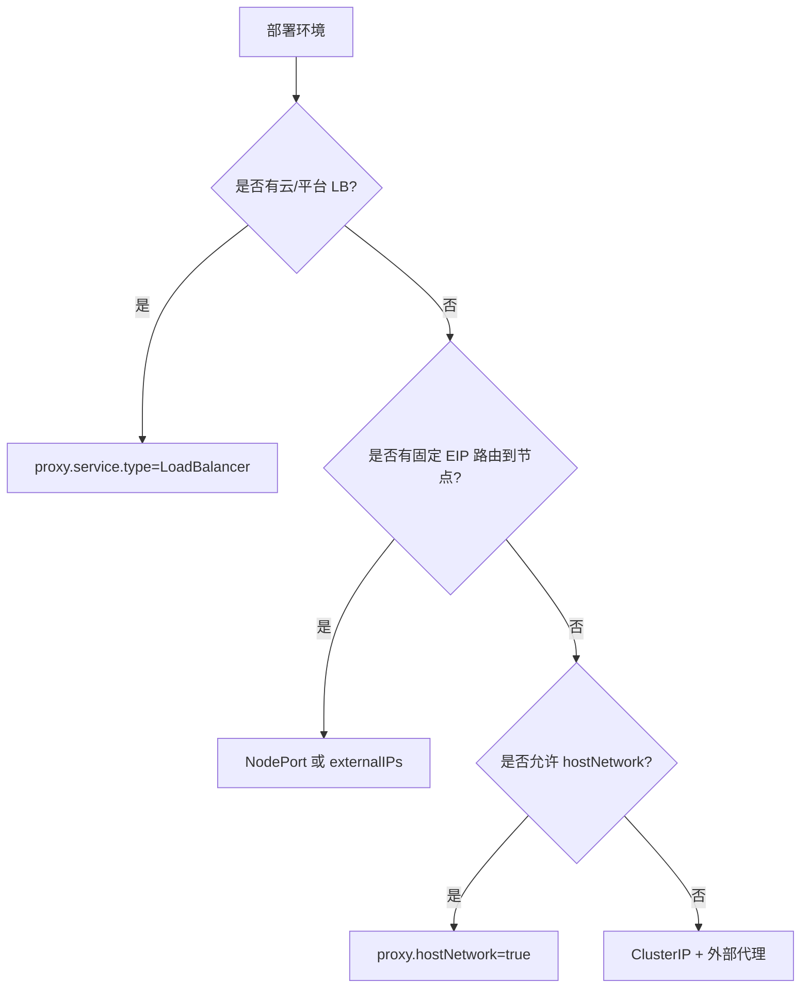
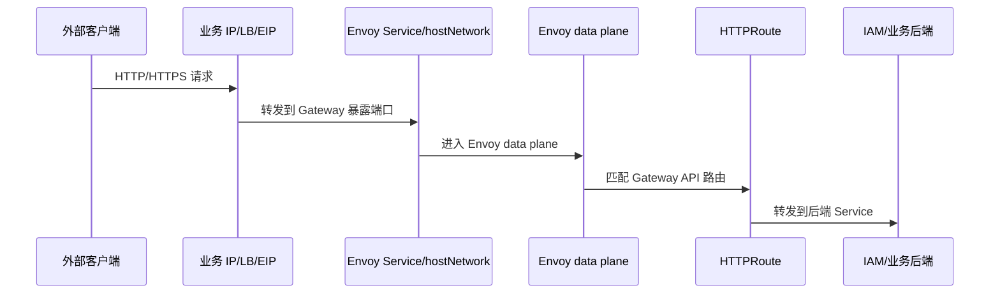

# 支持业务 IP 配置与容器网络前端集成 Story 设计文档

## 2 Story概述

### 2.1 Story需求描述

#### 2.1.1 Story背景描述

1. 简要说明

本 Story 描述 Gateway 作为统一业务入口时如何暴露稳定业务 IP。当前 chart 已支持 NodePort、LoadBalancer、ClusterIP、`externalIPs`、`externalTrafficPolicy` 和 `hostNetwork` 等部署参数，可适配裸金属、容器平台前置负载均衡、节点 EIP 或容器平台前端网络平面。生产环境可通过固定 NodePort、Service externalIPs、LoadBalancer 或 hostNetwork 将前端业务 IP 指向 Envoy data plane。

2. Actor

集群管理员、网络管理员、SRE、业务访问方、Envoy Gateway。

3. 前置条件

容器平台已准备前端网络平面或外部负载均衡；Gateway chart 已安装；业务域名或业务 IP 分配完成；如使用 HTTPS，TLS Secret 已就绪。

4. 最小保证

业务 IP 参数配置失败不影响已有 IAM 数据；回退 values 后可恢复旧暴露方式；后端网络平面不直接暴露 IAM 内部服务。

5. 成功保证

支持首次部署时指定业务入口方式；支持运行期 Helm upgrade 切换 NodePort、LoadBalancer、externalIPs 或 hostNetwork；Gateway 多副本时按平台能力提供多个入口或由前置负载均衡分流；Pod 重建后业务入口仍可访问。

6. 触发事件

首次部署、业务 IP 变更、网络平面迁移、节点故障、Gateway 扩缩容、HTTPS 暴露。

7. 主成功场景

管理员根据环境选择暴露方式：Kind/开发环境默认使用 HTTPS NodePort 30080 和 HTTP NodePort 30085；裸金属或已有 EIP 可配置 `proxy.service.externalIPs`；云或平台环境使用 LoadBalancer；对需要直接监听节点 80/443 的环境启用 `proxy.hostNetwork=true`。Helm upgrade 后 Envoy data plane Service 或 Pod 网络参数更新，外部访问新业务 IP，HTTPRoute 仍转发到 IAM 和业务后端。

8. 扩展场景（包括异常场景）

- 约束：hostNetwork 要求节点端口未被占用，且集群策略允许 Pod 使用 hostNetwork。
- 规格：NodePort 默认 HTTP 30085，HTTPS 30080；Gateway listener 默认 HTTP 80，可选 HTTPS 443。
- 升级：暴露方式通过 Helm values 调整，滚动更新 Envoy data plane。
- 可靠性：多副本需要平台支持多入口或前置负载均衡；Local 策略可能受节点调度影响。
- 性能：hostNetwork 减少 kube-proxy 跳转；NodePort/LoadBalancer 性能取决于平台实现。
- 安全：只暴露 Gateway Service，不暴露 Keycloak、PostgreSQL、OPA 等内部服务。
- 韧性：Pod 重建后 Service 入口保持；hostNetwork 依赖调度节点。
- 可服务：可通过 Service、EndpointSlice、Gateway status、Envoy Pod 所在节点定位。
- 可测试：通过 curl 业务 IP、检查 HTTPRoute Accepted 和 Envoy Service 端口验证。

#### 2.1.2 关联AR信息详情

| AR编号 | AR标题 | 架构元素 | 所属SR编号 | 所属SR标题 | 所属SR详情 | 所属SR关联功能 |
| --- | --- | --- | --- | --- | --- | --- |
| NA | NA | Kubernetes Service、Envoy Gateway、Gateway、EnvoyProxy、Helm values | SR-GW-BUSINESS-IP | 支持业务 IP 配置与容器网络前端集成 | Gateway 通过多种 Service/网络模式暴露稳定业务入口 | NodePort、externalIPs、LoadBalancer、hostNetwork |

### 2.2 Story用户使用场景分析

#### 2.2.1 新增/变更的脚本

| 脚本名称 | 功能描述 | 入参 | 执行权限 |
| --- | --- | --- | --- |
| `da-cluster/scripts/setup.sh` | 默认使用 NodePort 暴露 Gateway | `GATEWAY_PORT` | 集群管理员 |
| Helm values | 配置业务 IP、Service 类型和 hostNetwork | `proxy.service.*`、`proxy.hostNetwork` | 集群管理员 |

### 2.3 升级兼容性

#### 2.3.1 升级设计编码军规

| 序号 | 军规 | 说明 | 例外 |
| --- | --- | --- | --- |
| 1 | 外部接口不能修改 | HTTPRoute 路径不随暴露方式变化 | 无 |
| 2 | 产品限制不能变严 | NodePort 默认行为保留 | 无 |
| 3 | 商用参数必须继承 | Helm values 保持稳定 | 无 |
| 4 | 规格不能下降 | 多种暴露方式保留 | 无 |
| 5 | 新特性默认不能打开 | hostNetwork 默认 false | 无 |
| 6 | 安全 | 内部服务不直接暴露 | 无 |

#### 2.3.2 通用升级兼容性Checklist

| 序号 | 军规 | Check项简述 | 是否涉及 | 是否做了兼容性处理 | 备注说明 |
| --- | --- | --- | --- | --- | --- |
| 1 | Helm 参数 | Service 暴露方式 | 涉及 | 是 | 默认 NodePort 不变 |
| 2 | 外部接口 | Gateway 访问路径 | 涉及 | 是 | 路由路径不变 |
| 3 | 回退 | IP 配置错误 | 涉及 | 是 | helm rollback/values 回退 |
| 4 | 安全 | 内部服务暴露 | 涉及 | 是 | 只暴露 Envoy data plane |
| 5 | 可靠性 | 多副本入口 | 涉及 | 是 | 由 Service/LB/平台网络承载 |

### 2.4 是否影响性能

不同暴露方式会影响网络路径。NodePort 和 LoadBalancer 经过 Service 转发，hostNetwork 直接监听节点网络，延迟更低但调度约束更强。`externalTrafficPolicy=Local` 可保留源 IP，但要求流量打到有 Envoy Pod 的节点。

## 3 Story设计描述

### 3.1 Story设计

Gateway 业务入口由 `aidp-gateway` chart 的 `proxy` values 控制。Service 模式负责常规暴露，hostNetwork 模式负责特殊平台直连需求，Gateway listener 负责 L7 路由入口。业务 IP 不进入 IAM 应用层，IAM 只感知 Gateway 转发后的 HTTP 请求。

### 3.2 Story业务交互流程

#### 3.2.1 暴露模式选择

#### 3.2.2 请求流量路径

### 3.3 运行设计

- 默认开发模式：`proxy.service.type=NodePort`，HTTP `nodePort=30085`，HTTPS `httpsNodePort=30080`。
- HTTPS NodePort 默认 `30080`，HTTP NodePort 默认 `30085`，需配合 TLS listener。
- `proxy.service.externalIPs` 可把已有业务 IP 绑定到 Service。
- `proxy.service.externalTrafficPolicy` 默认 Cluster，Local 可保留源 IP但有节点约束。
- `proxy.hostNetwork=true` 时 Envoy Pod 使用节点网络命名空间，直接监听 Gateway port。
- 多副本下入口高可用由 Service、LB 或平台网络提供。

### 3.4 SFMEA分析

| 失效模式 | 影响 | 检测方式 | 缓解措施 |
| --- | --- | --- | --- |
| NodePort 与平台端口冲突 | 外部无法访问 | curl 业务 IP 失败，Service describe | 修改 `GATEWAY_PORT` 或 values |
| externalIPs 不可达 | 业务 IP 无响应 | 节点路由和 Service 检查 | 网络管理员确认 EIP 路由 |
| hostNetwork 端口被占用 | Envoy Pod 启动失败 | Pod events | 释放端口或关闭 hostNetwork |
| Local 策略打到无 Pod 节点 | 请求失败 | endpoint/node 检查 | 使用 Cluster 或 LB 只打有 Pod 节点 |
| TLS listener 引用 Secret 不存在 | HTTPS 不可用 | Gateway status | 先导入证书或关闭 TLS |

### 3.5 Onetrack设计

NA

### 3.6 可定位设计

1. `kubectl -n aidp-gateway get svc` 查看 Service 类型、NodePort、externalIPs。
2. `kubectl -n aidp-gateway get gateway eg -o yaml` 查看 listener 状态。
3. `kubectl get httproute -A` 查看 Accepted 和 ResolvedRefs。
4. `kubectl -n aidp-gateway get pod -o wide` 查看 Envoy Pod 节点和 IP。
5. curl 业务 IP 的 `/realms/aidp/.well-known/openid-configuration` 验证入口可达。

### 3.7 风险分析

| 风险 | 等级 | 应对 |
| --- | --- | --- |
| 业务 IP 配错导致入口中断 | 高 | 变更前保留旧 values，支持 helm rollback |
| hostNetwork 放宽安全边界 | 中 | 仅在平台要求时启用，限制 Pod 权限 |
| 多副本与固定 IP 模式冲突 | 中 | 使用 LB/DNS 轮询或明确每副本 IP 绑定策略 |
| 源 IP 保留和可用性冲突 | 中 | 默认 Cluster，需要源 IP 时评估 Local 约束 |

## 4 Shard设计描述

### 4.1 Shard 1：NodePort 暴露

- 接口路径：Helm values `proxy.service.type=NodePort`、`proxy.service.nodePort`
- 功能：通过节点 IP + NodePort 暴露 Gateway HTTP 入口。
- 入参：
  - `nodePort`，默认 30080。
  - `httpsNodePort`，默认 30080。
- 返回值：
  - Kubernetes Service 分配固定 NodePort，外部可通过 `nodeIP:nodePort` 访问。

### 4.2 Shard 2：LoadBalancer 暴露

- 接口路径：Helm values `proxy.service.type=LoadBalancer`
- 功能：由云平台或容器平台负载均衡器分配业务 IP。
- 入参：
  - `service.type=LoadBalancer`，可选平台 annotation。
- 返回值：
  - Service `EXTERNAL-IP` 分配完成，业务 IP 可访问。

### 4.3 Shard 3：externalIPs 绑定

- 接口路径：Helm values `proxy.service.externalIPs`
- 功能：将已有外部 IP 绑定到 Envoy Service。
- 入参：
  - `externalIPs[]`，一个或多个业务 IP。
  - `externalTrafficPolicy`。
- 返回值：
  - Service spec 包含 externalIPs，平台路由正确时外部可访问。

### 4.4 Shard 4：hostNetwork 模式

- 接口路径：Helm values `proxy.hostNetwork=true`
- 功能：Envoy data plane 使用节点网络命名空间，直接监听 Gateway listener 端口。
- 入参：
  - `hostNetwork=true`。
  - `gateway.port`、`gateway.tls.port`。
- 返回值：
  - Envoy Pod 在节点 IP 上监听 80/443 或指定端口。

### 4.5 Shard 5：Gateway Listener

- 接口路径：K8s `Gateway` `spec.listeners`
- 功能：配置 HTTP/HTTPS listener、hostname 和 TLS Secret 引用。
- 入参：
  - `gateway.port`、`gateway.tls.enabled`、`gateway.tls.hostname`、`gateway.tls.secretName`。
- 返回值：
  - Gateway listener condition Programmed/Accepted。

### 4.6 Shard 6：业务路由绑定

- 接口路径：K8s `HTTPRoute` `parentRefs.name=eg`
- 功能：把 IAM 或业务应用路径挂载到业务入口 Gateway。
- 入参：
  - `parentRefs`、`matches.path`、`backendRefs`、跨 namespace `ReferenceGrant`。
- 返回值：
  - HTTPRoute `Accepted=True`、`ResolvedRefs=True`，请求可转发。

## 5 验收测试用例

| 用例编号 | 用例名称 | 预置条件 | 测试步骤 | 预期结果 |
| --- | --- | --- | --- | --- |
| IP-AT-001 | 默认 NodePort 可访问 | setup 默认安装 | 1. curl `nodeIP:30080/realms/aidp/.well-known/openid-configuration`。 | 返回 200。 |
| IP-AT-002 | 自定义 NodePort | 可重新安装 | 1. 设置 `GATEWAY_PORT=31080`。 2. setup。 3. curl 31080。 | 返回 200。 |
| IP-AT-003 | LoadBalancer Service | 平台支持 LB | 1. Helm set `proxy.service.type=LoadBalancer`。 2. 查询 EXTERNAL-IP。 | EXTERNAL-IP 分配，curl 成功。 |
| IP-AT-004 | externalIPs 绑定 | IP 路由已配置 | 1. Helm set externalIPs。 2. curl 业务 IP。 | 请求进入 Gateway。 |
| IP-AT-005 | hostNetwork 启用 | 节点 80 可用 | 1. Helm set `proxy.hostNetwork=true`。 2. 查看 Pod 和端口。 | Envoy Pod Ready，节点 IP 可访问。 |
| IP-AT-006 | hostNetwork 端口冲突 | 节点端口被占用 | 1. 启用 hostNetwork。 | Pod 启动失败并有明确 event。 |
| IP-AT-007 | externalTrafficPolicy Cluster | 多节点集群 | 1. 使用默认 Cluster。 2. 从任意节点入口访问。 | 可转发到 Envoy Pod。 |
| IP-AT-008 | externalTrafficPolicy Local | 多节点集群 | 1. 设置 Local。 2. 访问无 Envoy Pod 节点。 | 预期不可达或平台不转发，文档说明约束。 |
| IP-AT-009 | HTTPS listener | TLS Secret 已存在 | 1. 启用 TLS。 2. curl HTTPS。 | HTTPS 握手成功。 |
| IP-AT-010 | HTTPRoute Accepted | 业务路由已创建 | 1. `kubectl get httproute -A`。 | Accepted/ResolvedRefs True。 |
| IP-AT-011 | 业务 IP 变更回退 | 已变更 values | 1. Helm rollback 或恢复旧 values。 | 旧入口恢复可访问。 |
| IP-AT-012 | 内部服务未暴露 | Gateway 已暴露 | 1. 从集群外访问 Keycloak/Postgres Service IP。 | 不能直接访问内部 ClusterIP。 |

## 6 开发自验证用例

### 6.1 开发自验证用例设计

开发环境默认验证 NodePort。具备平台网络能力时补充 LoadBalancer、externalIPs 和 hostNetwork 手工用例。每种暴露方式都以 discovery URL、HTTPRoute status 和业务路径 curl 作为验收信号。

### 6.2 开发自验证用例详情

| Depth | 用例_名称 | 用例_编号 | 用例_级别 | 用例_自动化类型 | 用例_测试活动 | 用例_适用版本 | 用例_当前部署形态 | 用例_支持部署形态 | 关联_需求资源_编号 | 用例_设计描述 | 用例_预置条件 | 用例_测试步骤 | 用例_预期结果 | 用例_备注 |
| --- | --- | --- | --- | --- | --- | --- | --- | --- | --- | --- | --- | --- | --- | --- |
| 1 | 默认 NodePort | IP-001 | L1 | 自动化 | 开发自验证 | v1.8+ | Kind | K8s | SR-GW-BUSINESS-IP | 验证默认入口 | setup 完成 | curl -k https://localhost:30080 discovery | 200 | 默认 |
| 1 | 自定义端口 | IP-002 | L1 | 自动化/手工 | 开发自验证 | v1.8+ | Kind | K8s | SR-GW-BUSINESS-IP | 验证 GATEWAY_PORT | 可重装 | GATEWAY_PORT=31080 setup/test | 200 | 参数 |
| 1 | Service 状态 | IP-003 | L1 | 自动化 | 开发自验证 | v1.8+ | Kind | K8s | SR-GW-BUSINESS-IP | 验证 Service 端口 | Gateway installed | kubectl get svc | NodePort 正确 | K8s |
| 1 | HTTPRoute 状态 | IP-004 | L1 | 自动化 | 开发自验证 | v1.8+ | Kind | K8s | SR-GW-BUSINESS-IP | 验证路由绑定 | routes installed | kubectl get httproute | Accepted True | Gateway API |
| 1 | externalIPs | IP-005 | L2 | 手工 | 平台验证 | v1.8+ | K8s | K8s | SR-GW-BUSINESS-IP | 验证固定业务 IP | IP 路由可用 | Helm set externalIPs 后 curl | 200 | 平台依赖 |
| 1 | LoadBalancer | IP-006 | L2 | 手工 | 平台验证 | v1.8+ | K8s | K8s | SR-GW-BUSINESS-IP | 验证 LB 入口 | 平台支持 LB | Helm set LoadBalancer | EXTERNAL-IP 可用 | 平台依赖 |
| 1 | hostNetwork | IP-007 | L2 | 手工 | 平台验证 | v1.8+ | K8s | K8s | SR-GW-BUSINESS-IP | 验证节点网络入口 | 节点端口可用 | Helm set hostNetwork | 节点 IP 可访问 | 平台依赖 |

## 7 文档评审会议纪要

NA
