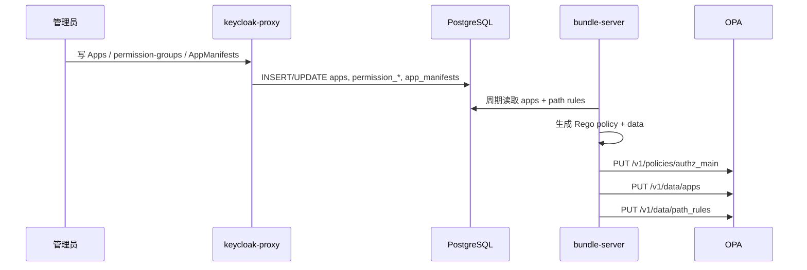
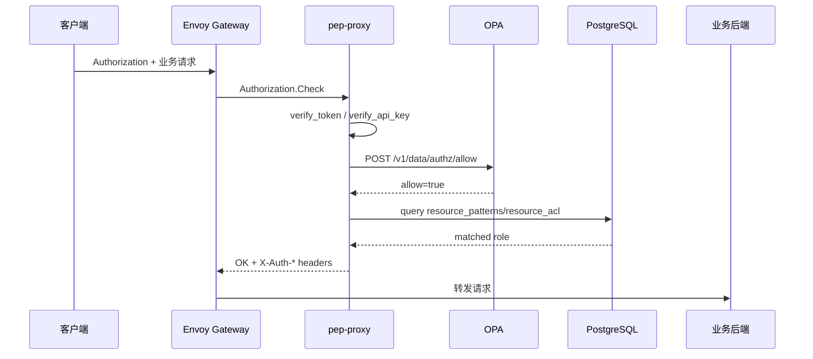

# 支持路径级鉴权与资源访问鉴权 Story 设计文档

## 2 Story概述

### 2.1 Story需求描述

#### 2.1.1 Story背景描述

1. 简要说明

本 Story 实现 Gateway 热路径上的两级鉴权。第一级由 OPA 根据 `apps.enabled`、`path_rules`、用户 `groups` 和 HTTP method 判断路径是否可访问；第二级由 pep-proxy 根据统一 URL 解析出的 `tenant_id`、`object_path` 查询 `resource_acl`，按 Owner、Contributor、Viewer 角色矩阵或应用自定义角色回调判断资源实例是否可访问。所有业务请求通过 Envoy Gateway 的 `SecurityPolicy.extAuth.grpc` 调用 pep-proxy，不把未授权请求转发给后端。

2. Actor

普通用户、租户管理员、业务应用、Envoy Gateway、pep-proxy、bundle-server、OPA、PostgreSQL。

3. 前置条件

Keycloak 已签发包含 groups 的 JWT；`apps`、`permission_groups`、`permission_group_paths`、`permission_group_bindings` 或 `app_manifests` 已写入；bundle-server 已将数据推送到 OPA；业务 HTTPRoute 已绑定 SecurityPolicy。

4. 最小保证

无 token、无路径权限、应用停用、跨租户访问和资源 ACL 不足的请求被拒绝；OPA 或 DB 异常时不误放行；不修改业务应用原始 API。

5. 成功保证

用户访问受保护路径时，路径级规则命中后才进入资源级鉴权；租户管理员和应用管理员按设计绕过本租户或本应用资源级检查；System 路径仅 master-admins 可访问；自定义角色可回调应用判断。

6. 触发事件

业务请求进入 Gateway、管理员调整 permission group、Manifest 注册或删除、应用 enabled 状态变化、resource_acl 变更。

7. 主成功场景

用户携带 JWT 请求业务路径，Envoy Gateway 调用 pep-proxy gRPC Check。pep-proxy 解码并校验 token，构造 OPA input 查询 `/v1/data/authz/allow`。OPA 基于 `path_rules` 返回 allow 后，pep-proxy 解析统一 URL，查询 `resource_patterns` 判断该 namespace 是否受资源级保护，再查询 `resource_acl` 做最长前缀匹配。权限足够时返回 OK，并注入 `X-Auth-User-Id`、`X-Auth-Tenant`、`X-Auth-Groups`。

8. 扩展场景（包括异常场景）

- 约束：资源级鉴权要求业务路径遵循 `/<Namespace>/Tenants/<TenantID>/...`。
- 规格：默认角色矩阵固定为 Owner、Contributor、Viewer；自定义角色通过应用回调扩展。
- 升级：新增 path_rules 和 resource_acl 检查，不改变业务后端接口。
- 可靠性：OPA 查询失败返回 503；resource_patterns 查询失败返回拒绝原因。
- 性能：OPA 查询一次 HTTP 调用，资源级检查一次 DB 前缀查询。
- 安全：默认拒绝；跨租户默认拒绝；System 路径仅 master-admins 特例放行。
- 韧性：OPA 数据由 bundle-server 周期刷新，失败后继续重试。
- 可服务：拒绝响应包含 `rule`、`reason`、`path`、`method`。
- 可测试：`test.sh` 覆盖 no-token、admin、normal-user、app disabled、ACL role matrix 等用例。

#### 2.1.2 关联AR信息详情

| AR编号 | AR标题 | 架构元素 | 所属SR编号 | 所属SR标题 | 所属SR详情 | 所属SR关联功能 |
| --- | --- | --- | --- | --- | --- | --- |
| NA | NA | Envoy Gateway、SecurityPolicy、pep-proxy、bundle-server、OPA、PostgreSQL | SR-PATH-RESOURCE-AUTH | 支持路径级鉴权与资源访问鉴权 | 请求经过 Gateway 时完成路径级和资源级两级鉴权 | ext_authz、OPA path_rules、resource_acl |

### 2.2 Story用户使用场景分析

#### 2.2.1 新增/变更的脚本

| 脚本名称 | 功能描述 | 入参 | 执行权限 |
| --- | --- | --- | --- |
| `da-cluster/scripts/test.sh` | 验证 OPA、SecurityPolicy、路径鉴权和资源 ACL 矩阵 | `REALM`、`GATEWAY_PORT` | 本地开发/CI |
| `da-cluster/scripts/setup.sh` | 安装 OPA、pep-proxy、bundle-server 和 Gateway policy | Helm values | 集群管理员 |

### 2.3 升级兼容性

#### 2.3.1 升级设计编码军规

| 序号 | 军规 | 说明 | 例外 |
| --- | --- | --- | --- |
| 1 | 消息接口前后兼容 | Envoy ext_authz 使用标准 v3 gRPC Check | 无 |
| 2 | 持久化数据兼容 | `permission_*`、`resource_acl` 表幂等创建 | 无 |
| 3 | 老特性不能丢失 | OIDC 登录和 AccessManager 管理接口路径保持 | 无 |
| 4 | 外部接口不能修改 | 业务 API 不需要改路径以外的协议字段 | 无 |
| 5 | 新特性默认不能打开 | 业务路由绑定 SecurityPolicy 后才启用鉴权 | 无 |
| 6 | 模块限制不能变严 | 不要求后端感知 OPA 或 ACL，只消费 `X-Auth-*` | 无 |

#### 2.3.2 通用升级兼容性Checklist

| 序号 | 军规 | Check项简述 | 是否涉及 | 是否做了兼容性处理 | 备注说明 |
| --- | --- | --- | --- | --- | --- |
| 1 | 持久化数据 | 新增 path/ACL 表 | 涉及 | 是 | `CREATE TABLE IF NOT EXISTS` |
| 2 | 外部接口 | Gateway route 和业务 API | 涉及 | 是 | 只新增 policy，业务 API 不变 |
| 3 | 消息接口 | ext_authz gRPC | 涉及 | 是 | 标准 Envoy v3 proto |
| 4 | 安全策略 | 默认拒绝 | 涉及 | 是 | OPA default allow=false |
| 5 | 回退 | 解绑 SecurityPolicy | 涉及 | 是 | 可通过 Helm/业务 chart 移除 policy |

### 2.4 是否影响性能

每个受保护请求增加一次 ext_authz gRPC 调用、一次 OPA REST 查询和在资源级路径下的一次 DB 查询。`path_rules` 和 `apps` 在 OPA 内存中匹配，资源 ACL 使用 `(tenant_id, object_path)` 与 `(tenant_id, user_path)` 索引。高并发场景可增加 pep-proxy 副本，后续如引入缓存需配套 ACL 变更失效机制。

## 3 Story设计描述

### 3.1 Story设计

鉴权链路分为策略生成、路径鉴权、资源鉴权三部分。管理面写入 apps、permission_groups 或 manifests；bundle-server 读取 DB 合成 Rego 与 data，并推送到 OPA；Envoy Gateway 在请求阶段调用 pep-proxy；pep-proxy 先执行 OPA 路径鉴权，再执行 resource_acl 资源鉴权。

### 3.2 Story业务交互流程

#### 3.2.1 策略生成流程

#### 3.2.2 请求鉴权流程

### 3.3 运行设计

- IAM 控制面路由 `keycloak-proxy-route` 和 `acl-api-route` 由 chart 内置 SecurityPolicy 保护。
- 业务应用必须创建自己的 SecurityPolicy，targetRef 指向业务 HTTPRoute。
- `bodyToExtAuth.maxRequestBytes=8192` 允许 pep-proxy 从 body 提取资源 ID。
- OPA Rego 默认 `allow=false`，只有命中 `path_rules` 且用户组匹配时放行。
- pep-proxy 对未知 namespace 且无 `resource_patterns` 的路径跳过资源级检查，用于兼容非资源路径。
- 默认角色矩阵：Viewer 仅 GET，Contributor 可 GET/PUT/PATCH/POST，Owner 可 GET/PUT/PATCH/POST/DELETE。

### 3.4 SFMEA分析

| 失效模式 | 影响 | 检测方式 | 缓解措施 |
| --- | --- | --- | --- |
| OPA 未收到最新数据 | 新权限延迟生效 | 查询 `/v1/data/path_rules` | bundle-server 周期重试，日志记录推送失败 |
| SecurityPolicy 未绑定业务路由 | 请求绕过鉴权 | `kubectl get securitypolicy`，无 token 访问业务路径 | 业务 chart 必须携带 policy，自验证检查 |
| JWT groups 缺失 | 路径级鉴权全部失败 | 解码 token、pep-proxy 日志 | keycloak-init 配置 mapper |
| resource_acl 缺失 | 资源访问 403 | QueryACLs 或 DB 查询 | resource-sync 自动写 owner，pending retry |
| 应用回调超时 | 自定义角色请求拒绝 | pep-proxy callback timeout 日志 | 默认 fail-close，后续支持配置超时 |

### 3.5 Onetrack设计

NA

### 3.6 可定位设计

1. ext_authz 拒绝响应包含 `code`、`reason`、`path`、`method`、`rule`。
2. bundle-server 日志打印 apps 和 path_rules 数量。
3. OPA 可直接查询 `/v1/data/apps` 和 `/v1/data/path_rules`。
4. pep-proxy 日志区分 authentication、path_rule、resource_acl、app_disabled。
5. `QueryACLs` 可验证指定 user/object 的资源权限继承。

### 3.7 风险分析

| 风险 | 等级 | 应对 |
| --- | --- | --- |
| 业务路由漏配 SecurityPolicy | 高 | chart 模板化并纳入集成测试 |
| path_rules 配置过宽 | 高 | permission group 评审，OPA 数据可导出审计 |
| ACL 查询成为瓶颈 | 中 | DB 索引，多副本 pep-proxy，后续缓存 |
| 自定义角色回调不稳定 | 中 | fail-close，超时日志，优先使用内置角色 |

## 4 Shard设计描述

### 4.1 Shard 1：Permission Group 管理接口

- 接口路径：`/AccessManager/Tenants/System/permission-groups`
- 功能：管理路径级授权的业务功能点，每个功能点包含若干 `path_prefix/method` 和绑定的 Keycloak group。
- 入参：
  - `app_name`、`name`、`description`、`paths[{path_prefix,method}]`、`bindings[]`。
- 返回值：
  - `PermissionGroupResponse`，包含 `id`、`paths`、`bindings`。

### 4.2 Shard 2：组权限聚合接口

- 接口路径：`GET /AccessManager/Tenants/{realm}/Permissions`、`PUT /AccessManager/Tenants/{realm}/Groups/{group_id}/Permissions`
- 功能：给前端展示分应用权限清单，并把 Keycloak 组绑定到一批 permission groups。
- 入参：
  - `group_id`。
  - body：`{"permission_group_ids":[1,2,3]}`。
- 返回值：
  - 分应用聚合的 permission groups；或目标组已绑定的 permission groups。

### 4.3 Shard 3：bundle-server OPA 数据刷新

- 接口路径：`GET /api/v1/opa-bundle`、`PUT /v1/policies/authz_main`、`PUT /v1/data/apps`、`PUT /v1/data/path_rules`
- 功能：从 DB 读取应用和权限数据，生成 Rego policy 与 OPA data。
- 入参：
  - DB 表：`apps`、`permission_groups`、`permission_group_paths`、`permission_group_bindings`、`app_manifests`。
  - 环境变量：`OPA_URL`、`DB_URL`、`REFRESH_INTERVAL`。
- 返回值：
  - OPA REST PUT 成功；bundle endpoint 返回 `combined_bundle.tar.gz`。

### 4.4 Shard 4：pep-proxy ext_authz

- 接口路径：`envoy.service.auth.v3.Authorization/Check`、`POST /api/v1/ext-authz`、`POST /api/v1/auth/check`
- 功能：校验 JWT/API Key，调用 OPA 做路径级鉴权，调用资源鉴权函数做资源级鉴权。
- 入参：
  - gRPC CheckRequest：headers、path、method、body。
  - HTTP AuthRequest：`resource`、`path`、`method`、`tenant_id`。
- 返回值：
  - 允许：gRPC OK，注入 `X-Auth-User-Id`、`X-Auth-Tenant`、`X-Auth-Groups`。
  - 拒绝：401/403/404/503，包含结构化 reason。

### 4.5 Shard 5：资源级鉴权函数

- 接口路径：内部函数 `check_resource_auth(request_path, method, tenant_id, user_path, groups)`
- 功能：解析统一 URL，校验租户隔离、管理员绕过、resource pattern 存在性、ACL 前缀继承和角色矩阵。
- 入参：
  - `request_path`、`method`、`tenant_id`、`user_path`、`groups`。
- 返回值：
  - 成功：`None`。
  - 失败：拒绝原因，如 `Cross-tenant access denied`、`No ACL entry`、`Role ... does not permit ...`。

### 4.6 Shard 6：业务路由 SecurityPolicy

- 接口路径：K8s `SecurityPolicy` targetRef 指向 `HTTPRoute`
- 功能：把 IAM 或业务 HTTPRoute 绑定到 `pep-proxy.aidp-iam.svc:9000`。
- 入参：
  - `targetRefs`、`extAuth.grpc.backendRefs`、`failOpen=false`、`bodyToExtAuth.maxRequestBytes=8192`。
- 返回值：
  - 成功：无 token 请求被拒绝，有权限请求被放行。

## 5 验收测试用例

| 用例编号 | 用例名称 | 预置条件 | 测试步骤 | 预期结果 |
| --- | --- | --- | --- | --- |
| AUTHZ-AT-001 | 无 token 拒绝 | 受保护 HTTPRoute 已绑定 SecurityPolicy | 1. 无 Authorization 请求 `/AccessManager/...`。 | 返回 401/403，不到达后端。 |
| AUTHZ-AT-002 | admin 路径放行 | admin token 可用 | 1. GET `/AccessManager/Tenants/System/AppManifests`。 | 返回 200。 |
| AUTHZ-AT-003 | normal-user 管理路径拒绝 | normal-user token 可用 | 1. GET `/AccessManager/Tenants/System/AppManifests`。 | 返回 401/403。 |
| AUTHZ-AT-004 | permission group 新增生效 | 管理员 token 可用 | 1. POST permission-group。 2. 等待 OPA 刷新。 3. 用目标组用户访问路径。 | 目标用户被放行。 |
| AUTHZ-AT-005 | permission group 解绑生效 | 已绑定权限组 | 1. 删除 binding。 2. 等待 OPA 刷新。 3. 再次访问。 | 返回 403。 |
| AUTHZ-AT-006 | 应用 enabled=false 拒绝 | 应用已注册 | 1. PUT `/Apps/{app}` enabled=false。 2. 访问该 app 路径。 | OPA 返回拒绝。 |
| AUTHZ-AT-007 | 跨租户拒绝 | t1 用户 token | 1. 访问 `/App/Tenants/t2/...`。 | 返回 403，reason 为跨租户。 |
| AUTHZ-AT-008 | Viewer 只读 | Viewer ACL 已写入 | 1. GET 资源。 2. PUT/PATCH/DELETE 资源。 | GET 放行，写和删拒绝。 |
| AUTHZ-AT-009 | Contributor 可写不可删 | Contributor ACL 已写入 | 1. GET/PUT/PATCH/POST。 2. DELETE。 | 前者放行，DELETE 拒绝。 |
| AUTHZ-AT-010 | Owner 全操作 | Owner ACL 已写入 | 1. GET/PUT/PATCH/POST/DELETE。 | 全部放行。 |
| AUTHZ-AT-011 | 子资源继承 | 父资源 ACL 已写入 | 1. 访问子资源路径。 | 最长前缀匹配父资源权限。 |
| AUTHZ-AT-012 | System 路径 master-admins | admin 与 normal token | 1. 两个用户分别访问 System 路径。 | master-admins 放行，normal 拒绝。 |
| AUTHZ-AT-013 | OPA 数据可观测 | bundle-server 已启动 | 1. 查询 OPA `/v1/data/apps` 和 `/v1/data/path_rules`。 | 返回 apps 和 path_rules。 |
| AUTHZ-AT-014 | OPA 不可用 fail-close | 模拟 OPA 端口不可达 | 1. 发起受保护请求。 | 返回 503 或拒绝，不误放行。 |
| AUTHZ-AT-015 | SecurityPolicy 漏配检查 | 业务 chart 安装 | 1. 查询业务 SecurityPolicy。 2. 无 token 访问业务路径。 | policy 存在；无 token 拒绝。 |

## 6 开发自验证用例

### 6.1 开发自验证用例设计

执行 `setup.sh` 安装后运行 `test.sh`，自动覆盖公共路由、AccessManager 保护路由、Manifest 派生路径规则、OPA 数据刷新、角色矩阵和 mock-kb 业务路由鉴权。手工补充 OPA 不可用、SecurityPolicy 漏配等故障注入。

### 6.2 开发自验证用例详情

| Depth | 用例_名称 | 用例_编号 | 用例_级别 | 用例_自动化类型 | 用例_测试活动 | 用例_适用版本 | 用例_当前部署形态 | 用例_支持部署形态 | 关联_需求资源_编号 | 用例_设计描述 | 用例_预置条件 | 用例_测试步骤 | 用例_预期结果 | 用例_备注 |
| --- | --- | --- | --- | --- | --- | --- | --- | --- | --- | --- | --- | --- | --- | --- |
| 1 | no-token 拒绝 | AUTHZ-001 | L1 | 自动化 | 开发自验证 | v1.8+ | Kind | K8s | SR-PATH-RESOURCE-AUTH | 验证受保护路由必须认证 | IAM 已部署 | `test.sh` 无 token 请求 | 401/403 | ext_authz |
| 1 | admin 放行 | AUTHZ-002 | L1 | 自动化 | 开发自验证 | v1.8+ | Kind | K8s | SR-PATH-RESOURCE-AUTH | 验证 master-admins 权限 | admin token | GET 管理路径 | 200 | OPA path_rules |
| 1 | normal 拒绝 | AUTHZ-003 | L1 | 自动化 | 开发自验证 | v1.8+ | Kind | K8s | SR-PATH-RESOURCE-AUTH | 验证普通用户不能访问管理路径 | normal token | GET System AppManifests | 403 | OPA path_rules |
| 1 | OPA apps | AUTHZ-004 | L1 | 自动化 | 开发自验证 | v1.8+ | Kind | K8s | SR-PATH-RESOURCE-AUTH | 验证 apps 数据推送 | bundle-server ready | 查询 OPA `/v1/data/apps` | 包含默认 apps | bundle-server |
| 1 | OPA path_rules | AUTHZ-005 | L1 | 自动化 | 开发自验证 | v1.8+ | Kind | K8s | SR-PATH-RESOURCE-AUTH | 验证 path_rules 数据推送 | manifests/permissions 已写入 | 查询 OPA `/v1/data/path_rules` | 包含目标路径 | bundle-server |
| 1 | Viewer 矩阵 | AUTHZ-006 | L1 | 自动化 | 开发自验证 | v1.8+ | Kind | K8s | SR-PATH-RESOURCE-AUTH | 验证只读角色 | ACL 已写入 | GET/PUT 资源 | GET 200，PUT 403 | resource_acl |
| 1 | Contributor 矩阵 | AUTHZ-007 | L1 | 自动化 | 开发自验证 | v1.8+ | Kind | K8s | SR-PATH-RESOURCE-AUTH | 验证贡献者角色 | ACL 已写入 | PUT/DELETE 资源 | PUT 放行，DELETE 403 | resource_acl |
| 1 | Owner 矩阵 | AUTHZ-008 | L1 | 自动化 | 开发自验证 | v1.8+ | Kind | K8s | SR-PATH-RESOURCE-AUTH | 验证 owner 角色 | ACL 已写入 | DELETE 资源 | 放行 | resource_acl |
| 1 | 子资源继承 | AUTHZ-009 | L1 | 自动化 | 开发自验证 | v1.8+ | Kind | K8s | SR-PATH-RESOURCE-AUTH | 验证前缀继承 | 父资源 ACL | 访问子资源 | 放行或按角色拒绝 | prefix |
| 1 | app disabled | AUTHZ-010 | L1 | 自动化 | 开发自验证 | v1.8+ | Kind | K8s | SR-PATH-RESOURCE-AUTH | 验证应用停用 | mock-kb route | enabled=false 后访问 | 403 | License/启停 |
| 1 | OPA 故障 | AUTHZ-011 | L2 | 手工 | 故障注入 | v1.8+ | Kind | K8s | SR-PATH-RESOURCE-AUTH | 验证 fail-close | 可操作 OPA 容器 | 暂停 OPA 后访问 | 503/拒绝 | 手工 |

## 7 文档评审会议纪要

NA
