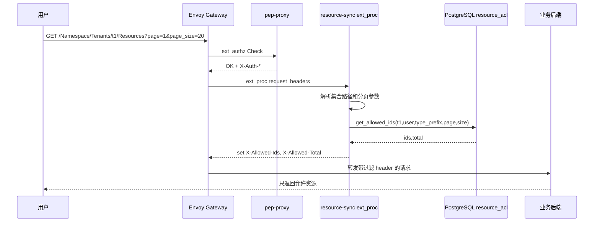
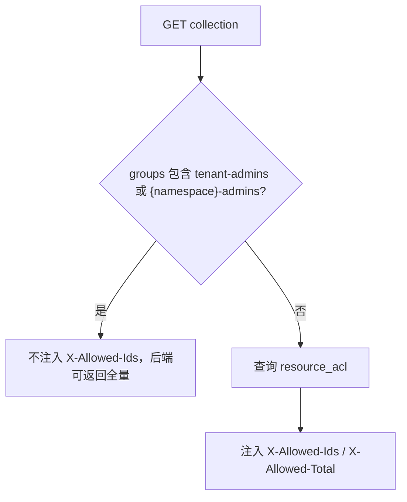

# 支持资源列表过滤 Story 设计文档

## 2 Story概述

### 2.1 Story需求描述

#### 2.1.1 Story背景描述

1. 简要说明

本 Story 解决资源列表接口的可见性问题。用户请求集合路径时，Gateway 通过 Envoy ext_proc 在请求阶段调用 `resource-sync`，根据当前用户和 `resource_acl` 查询该集合下用户可访问的资源 ID，并向后端注入 `X-Allowed-Ids` 和 `X-Allowed-Total`。后端应用读取这些 header 后只返回用户有权限的资源，从而避免列表接口泄露无权限资源。对于无法直接接入 ext_proc header 的应用，也提供 `ListAllowedIds` 管理接口作为查询能力。

2. Actor

普通用户、租户管理员、业务应用、Envoy Gateway、resource-sync、keycloak-proxy、PostgreSQL。

3. 前置条件

业务 HTTPRoute 已绑定 `EnvoyExtensionPolicy` 到 `resource-sync:8082`；用户请求已通过 pep-proxy 鉴权并注入 `X-Auth-*` header；`resource_acl` 已存在资源实例权限记录；业务应用支持按照 `X-Allowed-Ids` 过滤列表。

4. 最小保证

普通用户列表请求不会返回无权限资源；管理员可以绕过过滤；resource-sync 查询失败时不阻断业务请求，但不会注入错误的授权 ID。

5. 成功保证

集合 GET 请求自动注入允许 ID 和总数；分页参数 `page/page_size` 生效；`page_size` 最大限制为 500；管理员或应用管理员请求不注入过滤 header；后端按 header 返回过滤后的结果。

6. 触发事件

用户请求集合 GET、管理员查询列表、业务应用调用 `ListAllowedIds`、ACL 发生分享或撤销后再次查询列表。

7. 主成功场景

用户访问 `/KnowledgeBase/Tenants/aidp/KnowledgeBases?page=1&page_size=20`。Envoy Gateway 先经过 ext_authz，pep-proxy 放行并注入 `X-Auth-User-Id`、`X-Auth-Tenant`、`X-Auth-Groups`。随后 ext_proc request_headers 阶段解析路径，识别为集合 GET，查询 `resource_acl` 中该用户在 `KnowledgeBase/Tenants/aidp/KnowledgeBases/*` 下的可访问对象，向请求添加 `X-Allowed-Ids` 和 `X-Allowed-Total`，后端应用按 ID 过滤返回。

8. 扩展场景（包括异常场景）

- 约束：业务后端需要读取并执行 `X-Allowed-Ids` 过滤；否则只能保证 header 注入，不能保证响应过滤。
- 规格：单页最大 500 个 ID。
- 升级：ext_proc 绑定只影响已配置的业务 HTTPRoute，未绑定业务不受影响。
- 可靠性：resource-sync 查询 DB 失败时 fail-open，不注入 header，错误日志可定位。
- 性能：集合查询会执行一次 ACL ID 查询，按 `tenant_id/user_path/type_prefix` 索引过滤。
- 安全：普通用户无 ACL 时注入空 ID 列表，后端应返回空列表。
- 韧性：ACL 修改后下一次请求实时查询，不依赖缓存。
- 可服务：可通过 resource-sync 日志、`X-Allowed-Total`、`ListAllowedIds` 接口定位。
- 可测试：`test.sh` 和 mock-kb 覆盖列表过滤、分页和分享撤销后的列表变化。

#### 2.1.2 关联AR信息详情

| AR编号 | AR标题 | 架构元素 | 所属SR编号 | 所属SR标题 | 所属SR详情 | 所属SR关联功能 |
| --- | --- | --- | --- | --- | --- | --- |
| NA | NA | Envoy ext_proc、resource-sync、resource_acl、业务后端 | SR-LIST-FILTER | 支持资源列表过滤 | 集合 GET 自动注入可访问资源 ID，后端按 ID 过滤列表 | `X-Allowed-Ids`、`ListAllowedIds` |

### 2.2 Story用户使用场景分析

#### 2.2.1 新增/变更的脚本

| 脚本名称 | 功能描述 | 入参 | 执行权限 |
| --- | --- | --- | --- |
| `da-cluster/scripts/test.sh` | 验证集合 GET、分页、header 注入和 mock-kb 过滤行为 | `GATEWAY_PORT`、`REALM` | 本地开发/CI |
| 业务应用 Helm chart | 创建业务 HTTPRoute 和 EnvoyExtensionPolicy | route name、service、port | 应用部署管理员 |

### 2.3 升级兼容性

#### 2.3.1 升级设计编码军规

| 序号 | 军规 | 说明 | 例外 |
| --- | --- | --- | --- |
| 1 | 消息接口前后兼容 | 使用 Envoy ext_proc v3 标准协议 | 无 |
| 2 | 外部接口不能修改 | 业务列表 API 路径不变，仅新增请求 header | 无 |
| 3 | 老特性不能丢失 | 未绑定 EnvoyExtensionPolicy 的业务不受影响 | 无 |
| 4 | 产品限制不能变严 | 管理员列表能力不收窄 | 无 |
| 5 | 新特性默认不能打开 | 业务路由绑定 ext_proc 后才启用 | 无 |

#### 2.3.2 通用升级兼容性Checklist

| 序号 | 军规 | Check项简述 | 是否涉及 | 是否做了兼容性处理 | 备注说明 |
| --- | --- | --- | --- | --- | --- |
| 1 | 消息接口 | ext_proc gRPC | 涉及 | 是 | 标准 Envoy v3 |
| 2 | 外部接口 | 业务列表 API | 涉及 | 是 | 只新增 header |
| 3 | 持久化数据 | resource_acl 查询 | 涉及 | 是 | 复用既有表 |
| 4 | 安全 | 无权限列表 | 涉及 | 是 | 注入空 ID，后端返回空 |
| 5 | 回退 | 移除 EnvoyExtensionPolicy | 涉及 | 是 | 业务可回到原始列表行为 |

### 2.4 是否影响性能

集合 GET 请求增加一次 ext_proc gRPC 处理和一次 DB 查询。查询只返回当前页 ID，`page_size` 被限制为 500，避免单次 header 过大。管理员请求绕过过滤，不增加 DB 查询。对于资源规模很大的应用，应由业务后端基于 ID 列表执行索引查询。

## 3 Story设计描述

### 3.1 Story设计

列表过滤放在请求阶段，而不是响应阶段。resource-sync 不解析后端响应、不重写响应体，只根据 ACL 注入允许 ID，让业务应用按自己的分页和排序逻辑返回结果。这样可以保留业务应用对列表字段、排序、搜索的控制权，同时统一权限来源。

### 3.2 Story业务交互流程

#### 3.2.1 Header 注入流程

#### 3.2.2 管理员绕过流程

### 3.3 运行设计

- `resource-sync` 在 `request_headers` 阶段识别 `method=GET` 且 `parsed.is_collection=true`。
- 用户身份来自 pep-proxy 注入的 `X-Auth-User-Id`、`X-Auth-Tenant`、`X-Auth-Groups`。
- `page` 默认 1，`page_size` 默认 200，最大 500。
- 查询对象范围为 `type_prefix + "/%"`，并按路径深度限制只返回当前集合下的直接资源 ID。
- 管理员组 `tenant-admins` 和 `{namespace}-admins` 绕过过滤。
- 查询失败时记录错误并继续请求，不注入错误 header。

### 3.4 SFMEA分析

| 失效模式 | 影响 | 检测方式 | 缓解措施 |
| --- | --- | --- | --- |
| 业务后端未使用 X-Allowed-Ids | 列表仍可能返回无权限资源 | mock-kb 对比，代码评审 | 应用接入规范强制要求，测试用例覆盖 |
| resource-sync DB 查询失败 | 请求未注入过滤 header | resource-sync error 日志 | fail-open 保证业务可用，告警后修复 |
| Header 过长 | 代理或后端拒绝请求 | 4xx/431 日志 | `page_size` 限制 500，业务分页 |
| ACL 撤销后列表仍显示 | 用户看到已撤销资源 | 端到端撤销测试 | 实时 DB 查询，无缓存 |
| 管理员组误配置 | 普通用户绕过过滤 | JWT groups 检查 | 仅固定组名绕过，组管理需审计 |

### 3.5 Onetrack设计

NA

### 3.6 可定位设计

1. resource-sync 日志打印 `injecting X-Allowed-Ids count` 和 total。
2. 后端可回显或记录 `X-Allowed-Ids` 用于联调。
3. `POST /AccessManager/Tenants/{tid}/Action/ListAllowedIds` 可直接验证 ACL 查询结果。
4. DB 可通过 `resource_acl` 查询用户对集合的可见资源。

### 3.7 风险分析

| 风险 | 等级 | 应对 |
| --- | --- | --- |
| 后端漏实现过滤 | 高 | 接入模板、mock-kb 示例、验收测试必须检查列表内容 |
| 大列表 ID header 过长 | 中 | 强制分页，限制 page_size |
| fail-open 时短暂返回未过滤数据 | 中 | 后端在缺少 header 时默认返回空列表或要求管理员旁路标识 |
| 非标准列表路径无法识别集合 | 中 | 通过 Manifest/resource_patterns 规范路径，必要时业务调用 ListAllowedIds |

## 4 Shard设计描述

### 4.1 Shard 1：ext_proc 集合请求识别

- 接口路径：`envoy.service.ext_proc.v3.ExternalProcessor/Process`
- 功能：在 `request_headers` 阶段解析统一 URL，识别集合 GET 并准备 ACL 查询。
- 入参：
  - gRPC request headers：`:method`、`:path`、`x-auth-user-id`、`x-auth-tenant`、`x-auth-groups`。
  - query：`page`、`page_size`。
- 返回值：
  - 非集合或非 GET：continue，不修改 header。
  - 集合 GET：继续进入 ACL ID 查询。

### 4.2 Shard 2：允许 ID 查询

- 接口路径：内部函数 `db.get_allowed_ids(tenant_id, user_path, groups, type_prefix, page, size)`
- 功能：查询用户或所属组在集合下可访问的直接资源 ID。
- 入参：
  - `tenant_id`、`user_path`、`groups`、`type_prefix`、`page`、`size`。
- 返回值：
  - `allowed_ids`：当前页 ID 列表。
  - `total`：用户可访问资源总数。

### 4.3 Shard 3：Header 注入

- 接口路径：业务 HTTPRoute 绑定的 `EnvoyExtensionPolicy`
- 功能：将 `X-Allowed-Ids` 和 `X-Allowed-Total` 注入到转发给后端的请求。
- 入参：
  - `allowed_ids`、`total`。
- 返回值：
  - Header mutation：`X-Allowed-Ids=id1,id2`、`X-Allowed-Total=2`。

### 4.4 Shard 4：ListAllowedIds 兼容查询接口

- 接口路径：`POST /AccessManager/Tenants/{tid}/Action/ListAllowedIds`
- 功能：供无法直接消费 ext_proc header 的应用或调试流程查询用户在集合下的可访问资源 ID。
- 入参：
  - `user_path`。
  - `type_prefix`，例如 `KnowledgeBase/Tenants/aidp/KnowledgeBases`。
  - `page`、`page_size`。
- 返回值：
  - `{"ids":["kb-001"],"total":1,"page":1,"page_size":20}`。

### 4.5 Shard 5：业务后端过滤实现

- 接口路径：业务集合 GET，例如 `GET /KnowledgeBase/Tenants/{tenantId}/KnowledgeBases`
- 功能：读取 `X-Allowed-Ids`，只查询或返回这些 ID 对应的资源。
- 入参：
  - Header：`X-Allowed-Ids`、`X-Allowed-Total`。
  - Query：业务原有分页、搜索、排序参数。
- 返回值：
  - 过滤后的资源列表；无 ID 时返回空列表。

## 5 验收测试用例

| 用例编号 | 用例名称 | 预置条件 | 测试步骤 | 预期结果 |
| --- | --- | --- | --- | --- |
| LIST-AT-001 | 集合 GET 注入 header | mock-kb route 已绑定 ext_proc | 1. 用户拥有两个资源 ACL。 2. GET 集合路径。 3. 检查后端回显或日志。 | `X-Allowed-Ids` 包含两个资源 ID，total=2。 |
| LIST-AT-002 | 无 ACL 返回空列表 | 用户无任何资源 ACL | 1. GET 集合路径。 | Header 为空或 `X-Allowed-Ids=`；后端返回空列表。 |
| LIST-AT-003 | Viewer 资源可见 | 用户对资源是 Viewer | 1. GET 集合路径。 | 该资源 ID 出现在 allowed IDs。 |
| LIST-AT-004 | 撤销后不可见 | 用户原有 ACL | 1. DELETE ACL。 2. GET 集合路径。 | 被撤销资源 ID 不再出现。 |
| LIST-AT-005 | 分页第一页 | 用户有多条 ACL | 1. GET `page=1&page_size=1`。 | 返回 1 个 ID，total 为全量可见数。 |
| LIST-AT-006 | 分页第二页 | 用户有多条 ACL | 1. GET `page=2&page_size=1`。 | 返回第二个 ID，total 不变。 |
| LIST-AT-007 | page_size 上限 | 用户有多条 ACL | 1. GET `page_size=9999`。 | 实际最多查询 500。 |
| LIST-AT-008 | tenant-admin 绕过 | 用户在 tenant-admins | 1. GET 集合路径。 | 不注入过滤 header，后端可返回全量。 |
| LIST-AT-009 | app-admin 绕过 | 用户在 `{namespace}-admins` | 1. GET 该 app 集合路径。 | 不注入过滤 header。 |
| LIST-AT-010 | 子资源集合过滤 | 父子资源 ACL 存在 | 1. GET 子资源集合。 | 只返回对应子资源 ID。 |
| LIST-AT-011 | ListAllowedIds API | admin token 可用 | 1. POST `/Action/ListAllowedIds`。 | 返回 ids、total、page、page_size。 |
| LIST-AT-012 | 非集合 GET 不注入 | 访问资源实例路径 | 1. GET `/Resources/{id}`。 | 不注入 `X-Allowed-Ids`。 |
| LIST-AT-013 | 非统一 URL 不处理 | 访问 `/health` 或 legacy 路径 | 1. GET 非统一路径。 | ext_proc continue，无 header 注入。 |
| LIST-AT-014 | DB 异常 fail-open | 模拟 DB 不可用 | 1. GET 集合路径。 | 请求继续，resource-sync 记录错误。 |

## 6 开发自验证用例

### 6.1 开发自验证用例设计

自动化以 mock-kb 为后端，创建多条资源和 ACL，检查集合查询结果是否随 ACL 分享、撤销和分页变化。手工用 `kubectl logs` 查看 resource-sync 注入日志，并直接调用 `ListAllowedIds` 对比。

### 6.2 开发自验证用例详情

| Depth | 用例_名称 | 用例_编号 | 用例_级别 | 用例_自动化类型 | 用例_测试活动 | 用例_适用版本 | 用例_当前部署形态 | 用例_支持部署形态 | 关联_需求资源_编号 | 用例_设计描述 | 用例_预置条件 | 用例_测试步骤 | 用例_预期结果 | 用例_备注 |
| --- | --- | --- | --- | --- | --- | --- | --- | --- | --- | --- | --- | --- | --- | --- |
| 1 | mock-kb 列表过滤 | LIST-001 | L1 | 自动化 | 开发自验证 | v1.8+ | Kind | K8s | SR-LIST-FILTER | 验证普通用户只见有 ACL 资源 | mock-kb 已安装 | `test.sh` 创建资源后 GET 列表 | 仅返回可见资源 | 业务端到端 |
| 1 | 空列表 | LIST-002 | L1 | 自动化 | 开发自验证 | v1.8+ | Kind | K8s | SR-LIST-FILTER | 验证无 ACL 空结果 | 用户无 ACL | GET collection | 空列表 | 安全 |
| 1 | 分享后出现 | LIST-003 | L1 | 自动化 | 开发自验证 | v1.8+ | Kind | K8s | SR-LIST-FILTER | 验证分享改变列表 | owner 授权 Viewer | 目标用户 GET collection | 资源出现 | ACL 联动 |
| 1 | 撤销后消失 | LIST-004 | L1 | 自动化 | 开发自验证 | v1.8+ | Kind | K8s | SR-LIST-FILTER | 验证撤销改变列表 | 已授权资源 | 删除 ACL 后 GET collection | 资源消失 | ACL 联动 |
| 1 | 分页 total | LIST-005 | L1 | 自动化 | 开发自验证 | v1.8+ | Kind | K8s | SR-LIST-FILTER | 验证 total 与分页 | 多资源 ACL | page/page_size 查询 | total 正确 | 分页 |
| 1 | ListAllowedIds | LIST-006 | L1 | 自动化 | 开发自验证 | v1.8+ | Kind | K8s | SR-LIST-FILTER | 验证调试接口 | admin token | POST ListAllowedIds | ids 与列表一致 | 调试 |
| 1 | 管理员绕过 | LIST-007 | L1 | 自动化 | 开发自验证 | v1.8+ | Kind | K8s | SR-LIST-FILTER | 验证管理员不过滤 | admin token | GET collection | 返回全量或未注入 header | bypass |
| 1 | header 注入日志 | LIST-008 | L2 | 手工 | 开发自验证 | v1.8+ | Kind | K8s | SR-LIST-FILTER | 查看注入数量 | resource-sync running | `kubectl logs` grep `X-Allowed-Ids` | count/total 日志存在 | 可定位 |

## 7 文档评审会议纪要

NA
