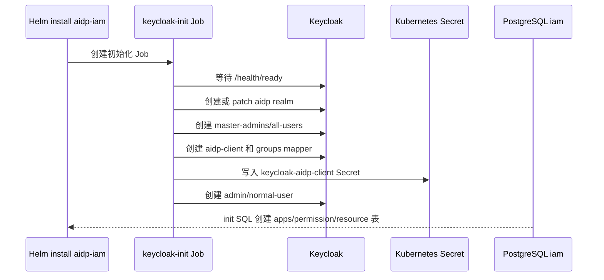
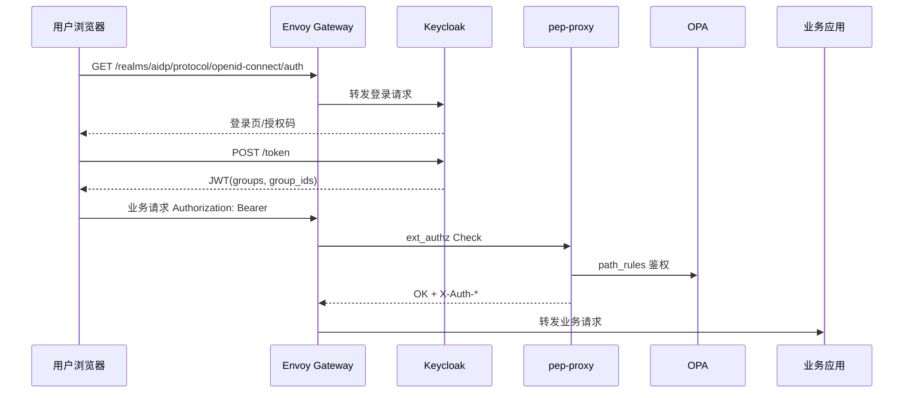
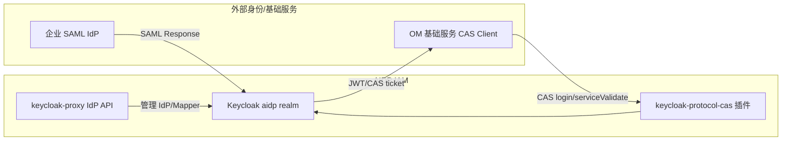

# 支持用户认证、应用注册与外部 IdP 联邦认证 Story 设计文档

## 2 Story概述

### 2.1 Story需求描述

#### 2.1.1 Story背景描述

1. 简要说明

本 Story 基于 Keycloak 构建 AIDP IAM 的用户认证、组权限和应用注册能力。系统部署时由 `keycloak-init` 初始化 `aidp` realm、默认用户、默认组、客户端和 JWT groups mapper；运行期由 `keycloak-proxy` 提供用户、组、密码策略、应用注册、permission group 和外部 IdP 管理接口。用户登录后获取包含 `groups` 与 `group_ids` 的 JWT，Gateway 侧鉴权组件据此完成路径级和资源级权限判断。外部身份源通过 SAML IdP 接入，OM 基础服务需要 CAS 登录时由 Keycloak CAS 协议插件提供兼容入口。

2. Actor

系统管理员、租户管理员、普通用户、外部企业 IdP、OM 基础服务、Keycloak、keycloak-proxy、PostgreSQL。

3. 前置条件

K8s 集群、Gateway、PostgreSQL、Keycloak 和 `iam-services` 已部署；`keycloak-init` Job 已成功执行；`aidp-client` Secret 已写入集群；Gateway 公共路由 `/realms`、`/admin`、`/resources` 已创建。

4. 最小保证

初始化脚本幂等执行，不覆盖用户已修改的 realm 数据；用户、组、应用注册接口失败不影响已登录用户；外部 IdP 配置失败不影响本地账号登录；CAS 插件只增加兼容协议入口，不改变 OIDC 登录链路。

5. 成功保证

支持本地用户登录并获取 JWT；支持用户、组、密码策略管理；支持应用注册和启停；支持 permission group 到 Keycloak group 的绑定；支持 SAML 元数据导入、IdP 实例和 mapper 管理；支持 OM 基础服务通过 CAS 协议跳转到 Keycloak 登录。

6. 触发事件

首次安装或升级、用户登录、管理员创建用户或组、管理员注册应用、管理员调整权限组、管理员接入外部 SAML IdP、OM 基础服务发起 CAS 登录。

7. 主成功场景

系统部署后，`keycloak-init` 创建 `aidp` realm、`master-admins`、`all-users`、默认管理员和普通用户，并把 `all-users` 设置为默认组。管理员通过 AccessManager API 创建用户、组和应用，应用注册会同步 `apps`、`resource_patterns`、`resource_actions` 并创建 `{app}-admins` 组。用户通过 OIDC 或 CAS 登录到 Keycloak，JWT 或 CAS service ticket 返回后，后续业务请求携带认证结果进入 Gateway 鉴权链路。

8. 扩展场景（包括异常场景）

- 约束：当前产品采用单租户 `aidp` realm，`master` realm 只用于 Keycloak 自身管理。
- 规格：用户和组分页由 Keycloak Admin API 支撑，默认列表页大小 50，最大 500。
- 升级：`keycloak-init` 使用 upsert/patch 风格，已有 realm、client、group 和 Secret 可重复更新。
- 可靠性：Keycloak 不可用时新登录和管理接口失败，已签发 token 在有效期内仍可由 pep-proxy 校验。
- 性能：用户、组列表依赖 Keycloak Admin API；权限详情额外查询 PostgreSQL 的 permission group 展开结果。
- 安全：密码策略、暴力破解防护、密码重置、外部 IdP mapper 均由 Keycloak 承载。
- 韧性：IdP 实例删除后仅联邦入口失效，本地用户不受影响。
- 可服务：可通过 `keycloak-init` 日志、Keycloak Admin Console、AccessManager API 和 `keycloak-proxy` 日志定位问题。
- 可测试：`test.sh` 覆盖 OIDC discovery、token 获取、用户组、AppManifests 和权限接口；SAML/CAS 可通过接口和跳转 URL 做手工验证。

#### 2.1.2 关联AR信息详情

| AR编号 | AR标题 | 架构元素 | 所属SR编号 | 所属SR标题 | 所属SR详情 | 所属SR关联功能 |
| --- | --- | --- | --- | --- | --- | --- |
| NA | NA | Keycloak、keycloak-init、keycloak-proxy、PostgreSQL、CAS plugin | SR-USER-AUTH-IDP | 支持用户认证、应用注册与外部 IdP 联邦认证 | 基于 groups 的统一身份模型，支持应用注册和 SAML/CAS 接入 | OIDC、CAS、SAML IdP、Users、Groups、Apps、permission_groups |

### 2.2 Story用户使用场景分析

#### 2.2.1 新增/变更的脚本

| 脚本名称 | 功能描述 | 入参 | 执行权限 |
| --- | --- | --- | --- |
| `da-cluster/images/keycloak-init/init-keycloak.py` | 初始化 `aidp` realm、默认用户、默认组、client、JWT mapper、SMTP 和密码策略 | `AIDP_REALM`、`AIDP_CLIENT_ID`、`AIDP_ADMIN_USER`、`PASSWORD_EXPIRE_DAYS` 等 | Helm Job service account |
| `da-cluster/scripts/setup.sh` | 构建镜像并通过 Helm 安装 IAM 与 Gateway | `--skip-build`、`--skip-init`、`--arch` | 集群管理员 |
| `da-cluster/scripts/test.sh` | 验证登录、token、用户组、应用注册和权限链路 | `REALM`、`CLIENT_ID`、`ADMIN_USER`、`ADMIN_PASSWORD` | 本地开发/CI |

### 2.3 升级兼容性

#### 2.3.1 升级设计编码军规

| 序号 | 军规 | 说明 | 例外 |
| --- | --- | --- | --- |
| 1 | 节点间、组件间、设备间消息接口设计要前后兼容 | OIDC、CAS、SAML 入口均走 Keycloak 标准协议，不修改协议字段 | 无 |
| 2 | 持久化数据要前后兼容 | `apps`、`permission_groups`、`resource_patterns` 使用幂等 SQL 创建和更新 | 无 |
| 3 | 升级后老特性不能丢失 | 本地账号登录、OIDC token、管理接口保留 | 无 |
| 4 | 升级后产品对外限制不能变严 | 新增 IdP/CAS 能力，不要求已有客户端迁移 | 无 |
| 5 | 升级后License控制不能变严 | 应用 enabled 字段只控制应用访问，不改变 License 既有语义 | 无 |
| 6 | 升级后商用参数必须继承 | Helm values 和环境变量保持向后兼容 | 无 |
| 7 | 升级后外部接口不能修改 | 新增 `/AccessManager` 统一接口，Keycloak 原生 `/realms` 路由保持 | 无 |
| 8 | 升级后产品规格不能下降 | 用户、组、应用规模不降低 | 无 |
| 9 | 升级后模块对外的限制不能变严 | 后端业务只依赖 `X-Auth-*` 头，不感知登录协议来源 | 无 |
| 10 | 升级后新特性默认不能打开 | 外部 IdP 需管理员显式创建并启用 | 无 |
| 11 | 禁止修改Apollo版本中的组件 | 不涉及内核、OS、固件 | 无 |
| 12 | 用户态组件需要兼容不同Apollo版本 | 容器用户态服务，不依赖 Apollo 特定内核接口 | 无 |

#### 2.3.2 通用升级兼容性Checklist

| 序号 | 军规 | Check项简述 | 是否涉及 | 是否做了兼容性处理 | 备注说明 |
| --- | --- | --- | --- | --- | --- |
| 1 | 持久化数据要前后兼容 | 初始化 realm、client、group、DB 表 | 涉及 | 是 | Keycloak 走查询后创建或 patch；DB 表 `IF NOT EXISTS` |
| 2 | 外部接口不能修改 | OIDC/CAS/SAML 标准入口 | 涉及 | 是 | 保留 Keycloak 标准路径 |
| 3 | 新特性默认不能打开 | 外部 IdP | 涉及 | 是 | 管理员创建实例后才启用 |
| 4 | License 控制不能变严 | 应用启停 | 涉及 | 是 | 默认应用 enabled=true |
| 5 | Apollo 组件 | 内核/固件 | 不涉及 | NA | 容器应用 |
| 6 | 安全兼容 | 密码策略和初始密码 | 涉及 | 是 | 可通过 Helm/env 配置，首次登录后按策略处理 |

### 2.4 是否影响性能

用户登录主要由 Keycloak 处理；AccessManager 用户、组查询会调用 Keycloak Admin API，详情接口会额外查询 PostgreSQL 展开权限。应用注册会写入 DB 并同步 Keycloak 组，属于管理面低频操作。外部 IdP 和 CAS 只影响登录入口，不增加业务请求热路径开销。

## 3 Story设计描述

### 3.1 Story设计

系统采用 Keycloak 作为认证源，AccessManager 作为管理面聚合层。Keycloak 保存用户、组、客户端、外部 IdP 和协议配置；PostgreSQL 保存应用注册、路径权限和 Manifest 元数据；bundle-server 将应用和 permission group 转换成 OPA 数据；pep-proxy 在业务请求阶段消费 JWT groups。

### 3.2 Story业务交互流程

#### 3.2.1 初始化流程

#### 3.2.2 登录与业务访问流程

#### 3.2.3 外部 IdP 与 CAS 位置

### 3.3 运行设计

- `keycloak-custom:26.5.2` 内置主题、structured group mapper 和 CAS 协议插件。
- `keycloak-init:v2` 负责单租户初始化，默认 realm 为 `aidp`。
- `aidp-client` 是 confidential client，支持 password grant、client credentials 和标准授权码流程。
- `keycloak-proxy` 暴露 `/AccessManager` 管理面，统一转发到 Keycloak Admin API 和 PostgreSQL。
- 应用注册写入 `apps`、`resource_patterns`、`resource_actions`，并 best-effort 创建 `{app}-admins` 组。
- SAML IdP 管理固定使用默认 alias `da-saml-idp`，防止一个 realm 配置多个入口导致登录入口混乱。

### 3.4 SFMEA分析

| 失效模式 | 影响 | 检测方式 | 缓解措施 |
| --- | --- | --- | --- |
| keycloak-init 失败 | realm/client/Secret 不完整，IAM 服务无法管理 Keycloak | Job 日志、Secret 缺失、token 401 | Job backoff，修正配置后重跑 Helm upgrade |
| aidp-client Secret 与 Keycloak client secret 不一致 | keycloak-proxy 获取 admin token 失败 | `Keycloak Admin Auth Failed`、token endpoint 401 | 重新执行 keycloak-init 或同步 Secret |
| groups mapper 缺失 | JWT 不含 groups，业务鉴权失败 | 解码 JWT、OPA 拒绝日志 | init job 安装 structured-group-mapper，失败时回退 names-only mapper |
| SAML 配置缺少 SSO URL | 联邦登录入口不可用 | IdP 创建接口 400 | API 校验 `singleSignOnServiceUrl` |
| CAS 插件缺失 | OM CAS 登录失败 | Keycloak `/protocol/cas` 404 | 镜像构建检查插件，发布包纳入 CAS jar |

### 3.5 Onetrack设计

NA

### 3.6 可定位设计

1. `keycloak-init` 按步骤打印 realm、group、client、mapper、SMTP 配置结果。
2. `keycloak-proxy` 对 KeycloakError 统一返回 `detail` 和状态码。
3. 用户和组详情接口返回 `permissions` 展开结果，便于定位组权限来源。
4. IdP mapper 接口返回简化后的 mapper id、属性和 group 条件。
5. JWT 可通过 `groups`、`group_ids` 判断 mapper 是否生效。

### 3.7 风险分析

| 风险 | 等级 | 应对 |
| --- | --- | --- |
| 初始管理员密码未修改 | 高 | 部署后要求修改，支持密码策略和密码过期 |
| 外部 IdP mapper 错误导致用户进入错误组 | 高 | 管理 API 展示 mapper 条件，变更需评审 |
| CAS 插件版本与 Keycloak 版本不匹配 | 中 | 固定 Keycloak 26.5.2 和 CAS 插件版本，镜像构建 smoke test |
| 应用注册误关闭 enabled | 中 | OPA app_disabled 会立即拒绝，管理界面需确认操作 |

## 4 Shard设计描述

### 4.1 Shard 1：Keycloak 单租户初始化

- 接口路径：K8s Job `keycloak-init`，内部调用 Keycloak Admin API `/admin/realms/*`。
- 功能：创建或修复 `aidp` realm、默认组、默认用户、`aidp-client`、groups mapper、SMTP 和密码策略。
- 入参：
  - 环境变量：`AIDP_REALM`、`AIDP_CLIENT_ID`、`AIDP_ADMIN_USER`、`AIDP_ADMIN_PASSWORD`、`PASSWORD_EXPIRE_DAYS`、`SMTP_HOST`。
  - Keycloak master admin 凭据来自 `keycloak-credentials` Secret。
- 返回值：
  - 成功：Job Completed，`keycloak-aidp-client` Secret 包含 `client-id`、`client-secret`、`realm`、`keycloak-url`。
  - 失败：Job 日志输出具体失败步骤，Pod 进入失败重试。

### 4.2 Shard 2：OIDC 登录与 token 获取

- 接口路径：`GET /realms/{realm}/.well-known/openid-configuration`、`GET /realms/{realm}/protocol/openid-connect/auth`、`POST /realms/{realm}/protocol/openid-connect/token`。
- 功能：提供标准 OIDC discovery、登录入口和 token endpoint。
- 入参：
  - discovery/auth：`realm`、`client_id`、`redirect_uri`、`response_type`。
  - token：`grant_type`、`client_id`、`client_secret`、`username/password` 或 `code`。
- 返回值：
  - discovery：issuer、authorization_endpoint、token_endpoint。
  - token：`access_token`、`refresh_token`、`expires_in`、`token_type`。

### 4.3 Shard 3：用户、组和密码策略管理

- 接口路径：`/AccessManager/Tenants/{realm}/Users`、`/AccessManager/Tenants/{realm}/Groups`、`/AccessManager/Tenants/{realm}/PasswordPolicy`。
- 功能：管理本地用户、组成员、批量导入、密码重置和 realm 密码策略。
- 入参：
  - 用户：`username`、`password`、`groups`、`nickname`、`temporary_password`。
  - 组：`name`、`users`。
  - 密码策略：`expire_days`、`min_length`、`require_uppercase`、`history_count` 等。
- 返回值：
  - 用户/组列表和详情，详情包含 `account_type`、`groups`、`permissions`。
  - 密码策略结构化字段。
  - 删除和密码重置成功返回 204。

### 4.4 Shard 4：应用注册和路径资源模式

- 接口路径：`/AccessManager/Tenants/System/Apps`、`/AccessManager/Tenants/System/Apps/{app_name}/resource-patterns`、`/AccessManager/Tenants/System/Apps/{app_name}/resource-actions`。
- 功能：注册应用，维护应用路径前缀、资源 ID 提取规则、创建/删除动作规则和应用启停状态。
- 入参：
  - App：`app_name`、`path_prefix`、`display_name`、`description`、`resource_patterns`。
  - ResourcePattern：`resource_prefix`、`method`、`id_source`、`id_field`、`id_query_param`、`response_id_field`。
  - ResourceAction：`action`、`method`、`path_suffix`、`success_status`、`min_permission`。
- 返回值：
  - AppResponse，包含应用元数据和展开后的 `resource_patterns/actions`。
  - 删除成功返回 204。

### 4.5 Shard 5：Permission Group 管理

- 接口路径：`/AccessManager/Tenants/System/permission-groups`、`/AccessManager/Tenants/{realm}/Permissions`、`/AccessManager/Tenants/{realm}/Groups/{group_id}/Permissions`。
- 功能：把业务功能点抽象为 permission group，并绑定到 Keycloak group；bundle-server 周期读取后生成 OPA `path_rules`。
- 入参：
  - `app_name`、`name`、`description`、`paths`、`bindings`。
  - group permission 替换入参：`permission_group_ids`。
- 返回值：
  - permission group 详情，包含 paths 和 bindings。
  - 分应用聚合的权限列表。

### 4.6 Shard 6：SAML IdP 与 CAS 协议兼容

- 接口路径：`/AccessManager/Tenants/{realm}/idp/Saml/*`、`/realms/{realm}/protocol/cas/*`。
- 功能：管理 SAML IdP 实例、属性 mapper、group mapper；为 OM 基础服务提供 CAS 登录、serviceValidate、logout 协议入口。
- 入参：
  - SAML：metadata 文件、`singleSignOnServiceUrl`、`displayName`、`enabled`、mapper 条件和目标组。
  - CAS：`service`、`ticket`、`renew` 等 CAS 标准参数。
- 返回值：
  - SAML：IdP 实例、mapper 列表和 mapper id。
  - CAS：登录跳转、service ticket 或 serviceValidate XML/失败响应。

## 5 验收测试用例

| 用例编号 | 用例名称 | 预置条件 | 测试步骤 | 预期结果 |
| --- | --- | --- | --- | --- |
| AUTH-AT-001 | realm 初始化 | 执行 Helm install | 1. 查看 `keycloak-init` Job。 2. 查询 Keycloak realm。 | Job Completed；`aidp` realm 存在且 enabled。 |
| AUTH-AT-002 | 默认组初始化 | realm 已创建 | 1. 查询 groups。 2. 查询 default groups。 | `master-admins`、`all-users` 存在；`all-users` 是默认组。 |
| AUTH-AT-003 | 默认用户初始化 | realm 已创建 | 1. 查询 `admin` 和 `normal-user`。 2. 查询用户组。 | admin 属于 `master-admins/all-users`；normal-user 属于 `all-users`。 |
| AUTH-AT-004 | aidp-client Secret 同步 | init Job 完成 | 1. 读取 `keycloak-aidp-client` Secret。 2. 使用 secret 调 token endpoint。 | Secret 字段完整；password grant 成功。 |
| AUTH-AT-005 | JWT groups mapper | 用户 token 可用 | 1. 解码 access token。 | token 含 `groups` 和 `group_ids`。 |
| AUTH-AT-006 | 用户创建和查询 | 管理员 token 可用 | 1. POST `/Users`。 2. GET `/Users?search=...`。 | 返回新用户，包含 groups 和 account_type。 |
| AUTH-AT-007 | 用户密码重置 | 用户存在 | 1. PUT `/Users/{id}/Password`。 2. 使用新密码登录。 | 重置返回 204；新密码可登录。 |
| AUTH-AT-008 | 组创建和成员维护 | 用户存在 | 1. POST `/Groups`。 2. BatchAdd/BatchRemove 成员。 | member_count 与成员变化一致。 |
| AUTH-AT-009 | 密码策略更新 | 管理员 token 可用 | 1. GET `/PasswordPolicy`。 2. PUT 修改最小长度。 3. 再次 GET。 | 返回结构化策略，修改字段生效。 |
| AUTH-AT-010 | 应用注册 | 管理员 token 可用 | 1. POST `/Apps`，带 resource_patterns。 2. GET `/Apps/{app}`。 | apps 和 resource_patterns 写入；`{app}-admins` 组被创建。 |
| AUTH-AT-011 | 应用停用拦截 | 应用已注册且 OPA 刷新 | 1. PUT `/Apps/{app}` 设置 enabled=false。 2. 请求该 app 路径。 | 请求被 OPA 拒绝。 |
| AUTH-AT-012 | Permission group 绑定 | 已有 Keycloak group | 1. POST `/permission-groups`。 2. PUT `/Groups/{group_id}/Permissions`。 3. 查询 OPA path_rules。 | path_rules 包含绑定组。 |
| AUTH-AT-013 | SAML metadata 导入 | 有 metadata 文件 | 1. POST `/idp/Saml/Import`。 | 返回 SAML 配置字段。 |
| AUTH-AT-014 | SAML IdP 创建校验 | 管理员 token 可用 | 1. 缺少 SSO URL 创建。 2. 补齐后创建。 | 缺失返回 400；补齐后返回实例。 |
| AUTH-AT-015 | SAML group mapper | IdP 实例存在 | 1. POST GroupMappers。 2. GET GroupMappers。 | 返回 mapper id，条件和目标组一致。 |
| AUTH-AT-016 | CAS 协议入口 | CAS 插件镜像已部署 | 1. 访问 `/realms/aidp/protocol/cas/login?service=...`。 2. 使用 ticket 调 serviceValidate。 | 登录可跳转；ticket 校验返回成功或明确失败 XML。 |

## 6 开发自验证用例

### 6.1 开发自验证用例设计

开发自验证以 `setup.sh` 初始化环境，`test.sh` 验证 OIDC、AccessManager 和权限链路。外部 IdP 和 CAS 依赖企业侧服务，可用接口级手工验证和 Keycloak Admin Console 双重确认。

### 6.2 开发自验证用例详情

| Depth | 用例_名称 | 用例_编号 | 用例_级别 | 用例_自动化类型 | 用例_测试活动 | 用例_适用版本 | 用例_当前部署形态 | 用例_支持部署形态 | 关联_需求资源_编号 | 用例_设计描述 | 用例_预置条件 | 用例_测试步骤 | 用例_预期结果 | 用例_备注 |
| --- | --- | --- | --- | --- | --- | --- | --- | --- | --- | --- | --- | --- | --- | --- |
| 1 | OIDC discovery | AUTH-001 | L1 | 自动化 | 开发自验证 | v1.8+ | Kind | K8s | SR-USER-AUTH-IDP | 验证公共 discovery 路由 | Gateway 已安装 | `test.sh` GET discovery | HTTP 200 | 公共路由 |
| 1 | 管理员 token | AUTH-002 | L1 | 自动化 | 开发自验证 | v1.8+ | Kind | K8s | SR-USER-AUTH-IDP | 验证 admin password grant | Secret 已同步 | 调 token endpoint | 返回 access_token | 登录链路 |
| 1 | 普通用户 token | AUTH-003 | L1 | 自动化 | 开发自验证 | v1.8+ | Kind | K8s | SR-USER-AUTH-IDP | 验证 normal-user 登录 | 默认用户存在 | 调 token endpoint | 返回 access_token | 登录链路 |
| 1 | JWT groups | AUTH-004 | L1 | 自动化 | 开发自验证 | v1.8+ | Kind | K8s | SR-USER-AUTH-IDP | 验证 groups mapper | token 可用 | 解码 JWT | 包含 groups/group_ids | mapper |
| 1 | 用户 CRUD | AUTH-005 | L1 | 自动化 | 开发自验证 | v1.8+ | Kind | K8s | SR-USER-AUTH-IDP | 验证创建、查询、删除用户 | admin token | POST/GET/DELETE Users | 状态码符合预期 | 管理面 |
| 1 | 组成员管理 | AUTH-006 | L1 | 自动化 | 开发自验证 | v1.8+ | Kind | K8s | SR-USER-AUTH-IDP | 验证组增删和成员批量操作 | 用户存在 | POST Groups，BatchAdd/Remove | member_count 更新 | 管理面 |
| 1 | 应用注册 | AUTH-007 | L1 | 自动化 | 开发自验证 | v1.8+ | Kind | K8s | SR-USER-AUTH-IDP | 验证 Apps CRUD | admin token | POST/GET/PUT/DELETE Apps | DB 和返回一致 | app registry |
| 1 | permission group | AUTH-008 | L1 | 自动化 | 开发自验证 | v1.8+ | Kind | K8s | SR-USER-AUTH-IDP | 验证路径权限组 | admin token | POST permission-groups | 返回 paths/bindings | path auth |
| 1 | 密码策略 | AUTH-009 | L1 | 手工/自动化 | 开发自验证 | v1.8+ | Kind | K8s | SR-USER-AUTH-IDP | 验证策略读写 | admin token | GET/PUT PasswordPolicy | 策略字段生效 | 安全基线 |
| 1 | SAML IdP API | AUTH-010 | L1 | 手工 | 开发自验证 | v1.8+ | K8s | K8s | SR-USER-AUTH-IDP | 验证 IdP 实例与 mapper | metadata 可用 | Import/Create/List Mapper | 返回实例和 mapper | 外部依赖 |
| 1 | CAS 登录入口 | AUTH-011 | L1 | 手工 | 开发自验证 | v1.8+ | K8s | K8s | SR-USER-AUTH-IDP | 验证 CAS 插件位置 | keycloak-custom 已部署 | 浏览器访问 CAS login | 跳转 Keycloak 登录页 | OM 对接 |

## 7 文档评审会议纪要

NA
