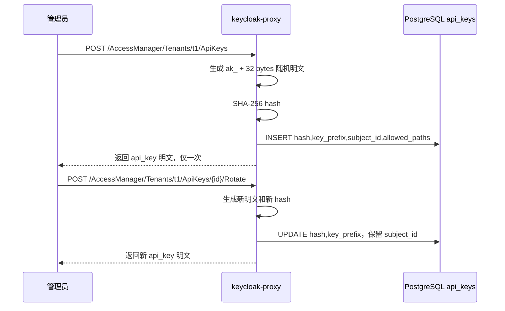
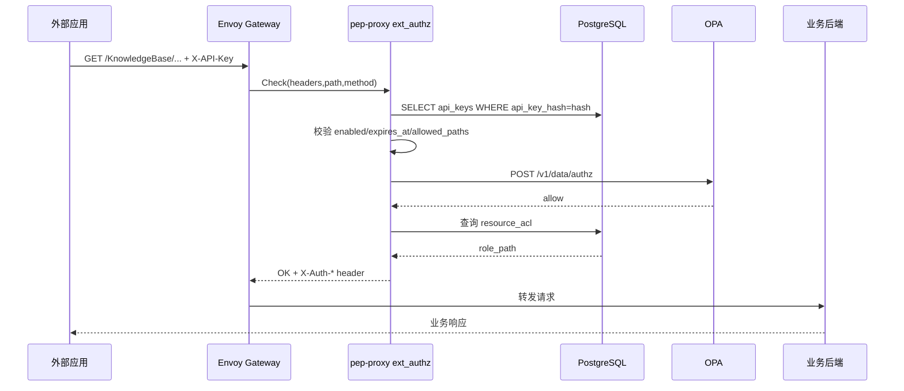
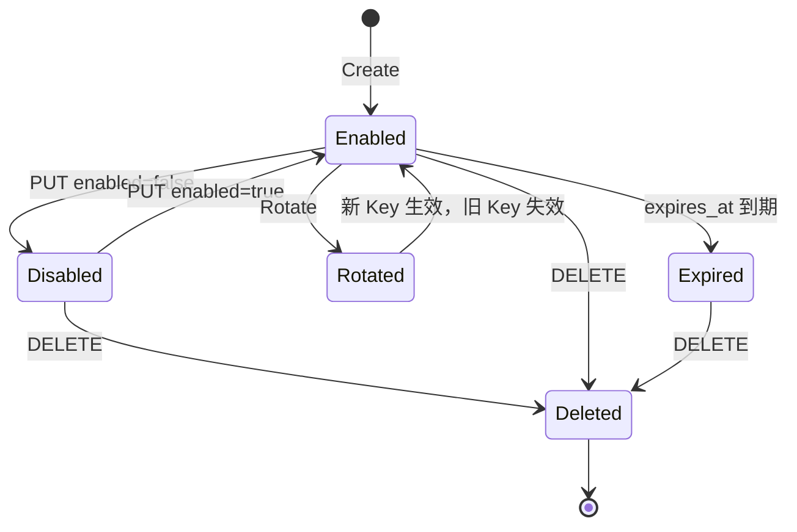

# 支持 API Key 认证与管理 Story 设计文档

## 2 Story概述

### 2.1 Story需求描述

#### 2.1.1 Story背景描述

1. 简要说明

本 Story 支持外部应用通过 API Key 访问受保护业务接口。API Key 由 IAM 管理接口创建，明文只在创建和轮换时返回一次，数据库仅保存 SHA-256 hash、前缀、租户、应用、服务主体、允许路径、启停状态、过期时间等元数据。请求进入 Gateway 后，pep-proxy 在 ext_authz 阶段优先识别 `X-API-Key`，验证成功后合成等效服务账号身份，再复用 OPA 路径级鉴权和 resource_acl 资源级鉴权链路。

2. Actor

租户管理员、外部应用、API Key 使用方、pep-proxy、keycloak-proxy、PostgreSQL。

3. 前置条件

IAM、Gateway、pep-proxy、PostgreSQL 已部署；业务应用路由已绑定 `SecurityPolicy`；目标路径已通过 Manifest 或 permission_groups 写入 OPA 数据；如涉及资源实例访问，需存在对应 `resource_acl`。

4. 最小保证

API Key 明文不落库；禁用、过期、不存在或路径不匹配的 Key 被拒绝；轮换 Key 不改变 `subject_id`，不影响既有资源授权；API Key 认证失败不回退到匿名身份。

5. 成功保证

管理员可创建、查询、更新、删除、轮换 API Key；外部应用携带有效 `X-API-Key` 可访问允许路径；pep-proxy 记录 `last_used_at`；禁用或删除后立即失效；资源权限通过同一套 `resource_acl` 生效。

6. 触发事件

创建 API Key、外部应用访问业务 API、更新 allowed_paths 或 enabled、轮换 Key、删除 Key、Key 到期。

7. 主成功场景

管理员调用 `/AccessManager/Tenants/{tenant}/ApiKeys` 创建 Key，系统返回 `ak_` 开头明文；外部应用请求业务接口时设置 `X-API-Key: ak_xxx`；pep-proxy 对 Key 做 hash 后查询 `api_keys` 表，校验 enabled、expires_at、allowed_paths；校验通过后合成 `subject_id`、tenant、groups，并继续执行 OPA 和资源级 ACL 鉴权；请求放行到后端。

8. 扩展场景（包括异常场景）

- 约束：API Key 只能通过 HTTPS/内网可信链路传输；明文只展示一次。
- 规格：Key 格式为 `ak_` + 32 字节随机数 hex；DB 保存 SHA-256 hash。
- 升级：`api_keys` 表通过幂等 SQL 创建，不影响已有 JWT 登录链路。
- 可靠性：DB 不可用时 API Key 验证失败；JWT 用户仍可依赖 JWKS 缓存继续验证。
- 性能：`api_key_hash` 建唯一索引；验证一次 DB 查询和一次异步更新时间。
- 安全：Key 禁用、删除、过期立即拒绝；allowed_paths 为空表示不做路径白名单限制，非空时按前缀匹配。
- 韧性：轮换保留 `subject_id`，避免 ACL 重新授权。
- 可服务：列表和详情只返回 key_prefix，不返回 hash 和明文；记录 `last_used_at`。
- 可测试：`da-cluster/scripts/test.sh` 覆盖创建、列表、轮换、禁用、删除和业务路径访问。

#### 2.1.2 关联AR信息详情

| AR编号 | AR标题 | 架构元素 | 所属SR编号 | 所属SR标题 | 所属SR详情 | 所属SR关联功能 |
| --- | --- | --- | --- | --- | --- | --- |
| NA | NA | keycloak-proxy、pep-proxy、PostgreSQL、Envoy Gateway | SR-API-KEY | 支持 API Key 认证与管理 | 外部应用通过 API Key 访问受保护接口，支持 Key 生命周期管理 | `api_keys`、`X-API-Key`、ext_authz |

### 2.2 Story用户使用场景分析

#### 2.2.1 新增/变更的脚本

| 脚本名称 | 功能描述 | 入参 | 执行权限 |
| --- | --- | --- | --- |
| `da-cluster/scripts/test.sh` | 验证 API Key 创建、轮换、禁用、删除和访问业务路径 | `REALM`、`GATEWAY_PORT`、用户密码等 | 本地开发/CI |
| `da-cluster/scripts/setup.sh` | 部署包含 `api_keys` 表和 pep-proxy API Key 分支的 IAM | `--skip-build` | 集群管理员 |

### 2.3 升级兼容性

#### 2.3.1 升级设计编码军规

| 序号 | 军规 | 说明 | 例外 |
| --- | --- | --- | --- |
| 1 | 节点间、组件间、设备间消息接口设计要前后兼容 | 不修改 Envoy ext_authz 协议，仅增加 header 认证分支 | 无 |
| 2 | 持久化数据要前后兼容 | `api_keys` 使用 `CREATE TABLE IF NOT EXISTS` 创建 | 无 |
| 3 | 升级后老特性不能丢失 | JWT Bearer Token 认证链路保持不变 | 无 |
| 4 | 升级后产品对外限制不能变严 | 未要求已有 JWT 客户端改造 | 无 |
| 5 | 升级后License控制不能变严 | 不涉及 | 无 |
| 6 | 升级后商用参数必须继承 | API Key 功能不改变已有 Helm 参数语义 | 无 |
| 7 | 升级后外部接口不能修改 | 新增 `/ApiKeys` 接口，不删除旧接口 | 无 |
| 8 | 升级后产品规格不能下降 | API Key 验证索引查询，不降低既有认证能力 | 无 |
| 9 | 升级后模块对外限制不能变严 | 业务仍只接收已鉴权请求，不感知 JWT/API Key 来源差异 | 无 |
| 10 | 升级后新特性默认不能打开 | 仅使用 `X-API-Key` 时进入新认证分支 | 无 |
| 11 | 禁止修改Apollo版本中的组件 | 不涉及 | 无 |
| 12 | 用户态组件需要兼容不同Apollo版本 | 容器用户态服务，不依赖 Apollo 内核接口 | 无 |

#### 2.3.2 通用升级兼容性Checklist

| 序号 | 军规 | Check项简述 | 是否涉及 | 是否做了兼容性处理 | 备注说明 |
| --- | --- | --- | --- | --- | --- |
| 1 | 持久化数据要前后兼容 | 新增 DB 表 | 涉及 | 是 | `api_keys` 幂等建表，新增索引幂等 |
| 2 | 外部接口不能修改 | 已有认证接口兼容 | 涉及 | 是 | JWT/OIDC 路由不变 |
| 3 | 新特性默认不能打开 | 是否影响老客户端 | 涉及 | 是 | 老客户端不传 `X-API-Key`，仍走 JWT |
| 4 | License 不变严 | License 控制 | 不涉及 | NA | 无 License 逻辑 |
| 5 | Apollo 组件 | 内核/OS/固件 | 不涉及 | NA | 容器应用变更 |
| 6 | 安全兼容 | 密钥明文落盘 | 涉及 | 是 | 只存 hash，明文只返回一次 |

### 2.4 是否影响性能

API Key 请求在 pep-proxy 中增加一次 `api_keys.api_key_hash` 索引查询和一次 `last_used_at` 更新。对 JWT 请求无额外影响。Key 的 allowed_paths 为内存数组匹配，路径数量应控制在合理范围；如后续高并发场景需要，可增加短 TTL 缓存，但需配套禁用/轮换后的缓存失效策略。

## 3 Story设计描述

### 3.1 Story设计

本 Story 包含三层设计：

1. 管理面：`keycloak-proxy` 暴露 `/{tenant}/ApiKeys` CRUD，创建和轮换时生成随机明文并存储 hash。
2. 认证面：pep-proxy ext_authz 检测 `x-api-key` header，优先执行 API Key 认证分支；无 API Key 时继续 JWT 分支。
3. 授权面：API Key 被转换为服务主体身份，继续使用 OPA path_rules 和 resource_acl，不新建旁路授权模型。

### 3.2 Story业务交互流程

#### 3.2.1 API Key 创建与轮换流程

#### 3.2.2 API Key 认证与授权流程

#### 3.2.3 API Key 状态机

### 3.3 运行设计

- API Key 管理接口挂载在 `/AccessManager/Tenants/{tenant}/ApiKeys`。
- Key 明文格式为 `ak_` 前缀，便于识别和审计；`key_prefix` 用于列表展示。
- 数据库存储 `api_key_hash`，不存明文；`subject_id` 创建后保持稳定。
- pep-proxy 对 `X-API-Key` 请求返回的身份结构与 JWT 解码结果兼容，包含 `user_id`、`tenant_id`、`groups`、`subject_type`、`app_name`。
- `allowed_paths` 非空时使用 `request_path.startswith(path)` 前缀匹配。
- 禁用、删除和过期均在下一次请求时实时生效。

### 3.4 SFMEA分析

| 失效模式 | 影响 | 检测方式 | 缓解措施 |
| --- | --- | --- | --- |
| API Key 泄露 | 外部应用越权调用允许路径 | 审计 last_used_at、异常来源日志 | 支持禁用、删除、轮换；限制 allowed_paths 和 expires_at |
| 数据库不可用 | API Key 请求无法认证 | pep-proxy 错误日志，401/503 增多 | JWT 用户不受 API Key DB 查询影响；后续可引入短 TTL 缓存 |
| allowed_paths 配置过宽 | 服务账号可访问过多路径 | 配置审计 | 默认按最小路径配置，评审 Key 创建参数 |
| 轮换后客户端未更新 | 外部应用访问失败 | 401 日志，客户端告警 | 双 Key 过渡可作为后续增强；当前轮换立即失效旧 Key |
| 明文重复展示需求 | 管理员无法找回 Key | 用户反馈 | 设计上不支持找回，只能轮换 |

### 3.5 Onetrack设计

NA

### 3.6 可定位设计

1. `api_keys.last_used_at` 记录最近使用时间。
2. 列表接口展示 `key_prefix`、enabled、expires_at、allowed_paths。
3. pep-proxy 对 API Key 失败记录具体原因：不存在、禁用、过期、路径不允许。
4. OPA/资源级拒绝仍返回 path_rule/resource_acl 分类，区分认证失败和授权失败。

### 3.7 风险分析

| 风险 | 等级 | 应对 |
| --- | --- | --- |
| API Key 被当作长期万能凭据使用 | 高 | 强制配置 expires_at 和 allowed_paths 的产品规范；上线前审计 |
| API Key 明文被日志打印 | 高 | 管理接口不打印明文；调用方规范禁止记录完整 Key |
| 大量 API Key 请求造成 DB 压力 | 中 | hash 索引；后续可引入缓存和限流 |
| 服务账号资源权限模型不清晰 | 中 | `subject_id` 固定，并统一写入 `resource_acl`；不复用个人用户 ID |

## 4 Shard设计描述

### 4.1 Shard 1：API Key 生命周期管理接口

该 Shard 由 `keycloak-proxy` 提供，负责 API Key 的创建、查询、更新、删除和轮换。

#### 4.1.1 创建 API Key

- 接口路径：`POST /AccessManager/Tenants/{tenant}/ApiKeys`
- 功能：为指定租户和应用创建 API Key，生成服务主体 `subject_id`，保存密钥 hash，返回明文密钥。
- 入参：
  - 路径参数：`tenant`，租户 ID。
  - Header：`Authorization: Bearer <admin-token>`、`Content-Type: application/json`。
  - Body：`app_name`、`description`、`allowed_paths`、`rate_limit`、`expires_at`。
- 返回值：
  - 成功：`201`，返回 `id`、`key_prefix`、`tenant_id`、`app_name`、`subject_id`、`subject_type`、`allowed_paths`、`rate_limit`、`expires_at`、`enabled`、`api_key`。
  - 失败：`401/403` 未授权；`400` 入参非法。

#### 4.1.2 查询 API Key 列表

- 接口路径：`GET /AccessManager/Tenants/{tenant}/ApiKeys`
- 功能：查询租户下所有 API Key 元数据，不返回明文和 hash。
- 入参：
  - 路径参数：`tenant`。
  - Header：`Authorization: Bearer <admin-token>`。
- 返回值：
  - 成功：API Key 元数据数组，包含 `key_prefix`、`enabled`、`last_used_at`，不包含 `api_key`、`api_key_hash`。

#### 4.1.3 查询 API Key 详情

- 接口路径：`GET /AccessManager/Tenants/{tenant}/ApiKeys/{key_id}`
- 功能：查询单个 API Key 元数据。
- 入参：
  - 路径参数：`tenant`、`key_id`。
- 返回值：
  - 成功：单个 API Key 元数据。
  - 失败：`404` Key 不存在。

#### 4.1.4 更新 API Key

- 接口路径：`PUT /AccessManager/Tenants/{tenant}/ApiKeys/{key_id}`
- 功能：更新 API Key 元数据，包括描述、启停、允许路径、限流值、过期时间。
- 入参：
  - 路径参数：`tenant`、`key_id`。
  - Body：`description`、`enabled`、`allowed_paths`、`rate_limit`、`expires_at`，均为可选。
- 返回值：
  - 成功：更新后的 API Key 元数据。
  - 失败：`400` 无可更新字段；`404` Key 不存在。

#### 4.1.5 删除 API Key

- 接口路径：`DELETE /AccessManager/Tenants/{tenant}/ApiKeys/{key_id}`
- 功能：永久删除 API Key，使该 Key 立即失效。
- 入参：
  - 路径参数：`tenant`、`key_id`。
- 返回值：
  - 成功：`204 No Content`。
  - 失败：`404` Key 不存在。

#### 4.1.6 轮换 API Key

- 接口路径：`POST /AccessManager/Tenants/{tenant}/ApiKeys/{key_id}/Rotate`
- 功能：生成新明文 Key，替换数据库中的 hash 和 prefix，保留 `subject_id`，避免重新配置 ACL。
- 入参：
  - 路径参数：`tenant`、`key_id`。
- 返回值：
  - 成功：返回更新后的元数据和新的 `api_key` 明文。
  - 失败：`404` Key 不存在。

### 4.2 Shard 2：API Key 认证接口

该 Shard 由 `pep-proxy` 在 Gateway ext_authz 阶段执行，不直接暴露为终端 REST API。

#### 4.2.1 X-API-Key 认证分支

- 接口路径：受保护业务路径，例如 `GET /KnowledgeBase/Tenants/{tenant}/KnowledgeBases`，Header 携带 `X-API-Key`。
- 功能：验证 API Key，转换为服务主体身份，继续执行 OPA 路径级鉴权和 resource_acl 资源级鉴权。
- 入参：
  - Header：`X-API-Key: ak_xxx`。
  - Gateway ext_authz 入参：path、method、headers、可选 body。
- 返回值：
  - 成功：Gateway ext_authz 返回 OK，并注入 `x-auth-user-id=<subject_id>`、`x-auth-tenant=<tenant_id>`、`x-auth-groups=all-users`。
  - 失败：`401` Key 不存在/禁用/过期；`403` allowed_paths 不匹配或授权不足；`503` 鉴权依赖不可用。

#### 4.2.2 API Key hash 查询

- 接口路径：内部函数 `verify_api_key(api_key, request_path)`。
- 功能：将明文 Key 做 SHA-256，查询 `api_keys` 表，校验状态和路径白名单，更新 `last_used_at`。
- 入参：
  - `api_key`：客户端传入的明文。
  - `request_path`：当前请求路径，用于 allowed_paths 前缀匹配。
- 返回值：
  - 成功：`{"user_id": subject_id, "tenant_id": tenant_id, "groups": ["all-users"], "subject_type": "service", "app_name": app_name}`。
  - 失败：抛出 HTTPException，映射为 ext_authz 拒绝。

### 4.3 Shard 3：API Key 数据模型

#### 4.3.1 api_keys 表

- 接口路径：PostgreSQL 表 `api_keys`。
- 功能：保存 API Key 元数据和 hash，不保存明文。
- 入参：
  - 写入字段：`id`、`api_key_hash`、`key_prefix`、`tenant_id`、`app_name`、`description`、`subject_id`、`subject_type`、`allowed_paths`、`rate_limit`、`expires_at`、`enabled`、`created_by`。
- 返回值：
  - 查询字段：不返回 `api_key_hash` 给外部接口；创建/轮换时仅返回临时明文 `api_key`。

## 5 验收测试用例

| 用例编号 | 用例名称 | 预置条件 | 测试步骤 | 预期结果 |
| --- | --- | --- | --- | --- |
| AK-AT-001 | 创建 Key 返回明文 | 管理员 token 可用 | 1. POST `/AccessManager/Tenants/{tenant}/ApiKeys`。 2. 检查响应字段。 | HTTP 201；`api_key` 以 `ak_` 开头；返回 `key_prefix`、`subject_id`、`enabled=true`。 |
| AK-AT-002 | DB 不保存明文 | 已创建 Key | 1. 查询 `api_keys` 表。 2. 对比返回明文。 | 表中只有 `api_key_hash` 和 `key_prefix`，无完整明文。 |
| AK-AT-003 | 列表不泄露明文和 hash | 已创建 Key | 1. GET `/ApiKeys`。 | 响应包含 `key_prefix`，不包含 `api_key` 和 `api_key_hash`。 |
| AK-AT-004 | 详情不泄露明文和 hash | 已创建 Key | 1. GET `/ApiKeys/{key_id}`。 | 响应包含元数据，不包含明文和 hash。 |
| AK-AT-005 | 更新 allowed_paths | 已创建 Key | 1. PUT `/ApiKeys/{key_id}` 更新 `allowed_paths`。 2. 用 Key 访问允许路径和非允许路径。 | 允许路径继续进入鉴权；非允许路径返回 403。 |
| AK-AT-006 | 禁用 Key 即时生效 | 已创建 Key | 1. PUT `/ApiKeys/{key_id}` 设置 `enabled=false`。 2. 用旧 Key 访问业务路径。 | 返回 401；`last_used_at` 不作为放行依据。 |
| AK-AT-007 | 启用 Key 恢复 | 已禁用 Key | 1. PUT `/ApiKeys/{key_id}` 设置 `enabled=true`。 2. 访问允许路径。 | 认证通过，继续执行 OPA/resource_acl 鉴权。 |
| AK-AT-008 | 轮换 Key 保留 subject_id | 已创建 Key | 1. 记录旧 `subject_id` 和旧 Key。 2. POST `/Rotate`。 3. GET 详情。 | 返回新明文；`subject_id` 不变；`key_prefix` 更新。 |
| AK-AT-009 | 轮换后旧 Key 失效 | 已轮换 Key | 1. 使用旧 Key 访问业务路径。 2. 使用新 Key 访问业务路径。 | 旧 Key 返回 401；新 Key 可进入鉴权链路。 |
| AK-AT-010 | 删除 Key 即时失效 | 已创建 Key | 1. DELETE `/ApiKeys/{key_id}`。 2. 使用该 Key 访问业务路径。 | DELETE 返回 204；后续访问返回 401。 |
| AK-AT-011 | 过期 Key 拒绝 | 创建 Key 时设置过去时间或修改 expires_at 为过去时间 | 1. 使用过期 Key 访问业务路径。 | 返回 401，原因是 Key expired。 |
| AK-AT-012 | 无效 Key 拒绝 | 无 | 1. 使用 `X-API-Key: ak_invalid_xxx` 访问业务路径。 | 返回 401。 |
| AK-AT-013 | API Key 资源 ACL 生效 | Key 对应 subject_id 已被授权某资源 | 1. 使用 Key 访问有 ACL 资源。 2. 访问无 ACL 资源。 | 有 ACL 资源放行；无 ACL 资源 403。 |
| AK-AT-014 | last_used_at 更新 | 已创建且有效 Key | 1. 使用 Key 成功访问一次。 2. GET `/ApiKeys/{key_id}`。 | `last_used_at` 非空并晚于创建时间。 |

## 6 开发自验证用例

### 6.1 开发自验证用例设计

使用 `da-cluster/scripts/test.sh` 中 API Key section 验证管理接口和认证分支；安装 mock-kb 后补充验证 `X-API-Key` 对业务路由的端到端访问，以及禁用/非法 Key 的拒绝行为。

### 6.2 开发自验证用例详情

| Depth | 用例_名称 | 用例_编号 | 用例_级别 | 用例_自动化类型 | 用例_测试活动 | 用例_适用版本 | 用例_当前部署形态 | 用例_支持部署形态 | 关联_需求资源_编号 | 用例_设计描述 | 用例_预置条件 | 用例_测试步骤 | 用例_预期结果 | 用例_备注 |
| --- | --- | --- | --- | --- | --- | --- | --- | --- | --- | --- | --- | --- | --- | --- |
| 1 | 创建 API Key | AK-001 | L1 | 自动化 | 开发自验证 | v1.8+ | Kind | K8s | SR-API-KEY | 验证 POST 创建 Key | IAM 已部署，管理员 token 可用 | `test.sh` 调用 POST `/ApiKeys` | 返回 `ak_` 明文和 key id | 管理接口 |
| 1 | 列表隐藏明文 | AK-002 | L1 | 自动化 | 开发自验证 | v1.8+ | Kind | K8s | SR-API-KEY | 验证列表只显示 prefix | 已创建 Key | GET `/ApiKeys` | 不包含完整 `api_key` | 安全用例 |
| 1 | 轮换 Key | AK-003 | L1 | 自动化 | 开发自验证 | v1.8+ | Kind | K8s | SR-API-KEY | 验证 Rotate 返回新明文 | 已创建 Key | POST `/ApiKeys/{id}/Rotate` | 返回新 `ak_`，id 不变 | 生命周期 |
| 1 | 禁用 Key | AK-004 | L1 | 自动化 | 开发自验证 | v1.8+ | Kind | K8s | SR-API-KEY | 验证 enabled=false 后拒绝 | 已创建 Key | PUT `enabled=false` 后访问业务路径 | 返回 401 | 认证分支 |
| 1 | 删除 Key | AK-005 | L1 | 自动化 | 开发自验证 | v1.8+ | Kind | K8s | SR-API-KEY | 验证 DELETE 后拒绝 | 已创建 Key | DELETE 后使用旧 Key 访问 | 返回 401 | 生命周期 |
| 1 | 非法 Key 拒绝 | AK-006 | L1 | 自动化 | 开发自验证 | v1.8+ | Kind | K8s | SR-API-KEY | 验证未知 Key 不可访问 | IAM 已部署 | 使用 `ak_invalid_xxx` 访问业务路径 | 返回 401 | 安全用例 |
| 1 | allowed_paths 生效 | AK-007 | L1 | 自动化/手工 | 开发自验证 | v1.8+ | Kind | K8s | SR-API-KEY | 验证路径白名单 | Key 配置 allowed_paths | 分别访问允许和不允许路径 | 允许路径进入鉴权，不允许路径 403 | 可补充手工验证 |
| 1 | API Key 业务路由访问 | AK-008 | L1 | 自动化 | 开发自验证 | v1.8+ | Kind | K8s | SR-API-KEY | 携带 `X-API-Key` 访问 KnowledgeBase | mock-kb route 可用 | GET `/KnowledgeBase/...` | 有效 Key 返回 200 或资源级 403；非法/禁用 Key 401 | mock-kb 未装时跳过 |
| 1 | subject_id 权限保持 | AK-009 | L1 | 手工/自动化 | 开发自验证 | v1.8+ | Kind | K8s | SR-API-KEY | 验证 Rotate 不影响 ACL | Key subject 已写 ACL | Rotate 后用新 Key 访问原资源 | 按原 ACL 放行 | 资源权限用例 |

## 7 文档评审会议纪要

NA
