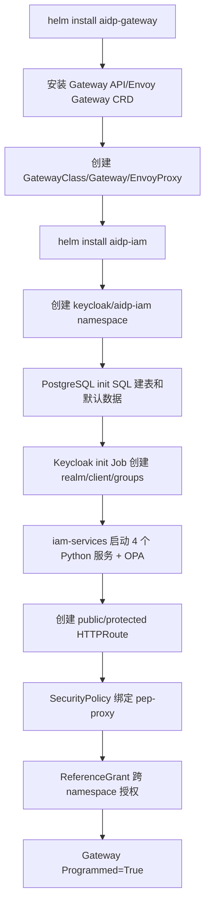
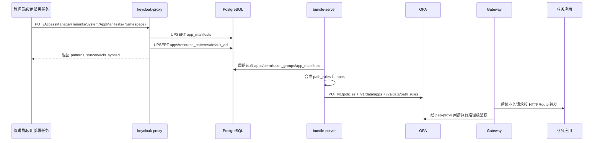
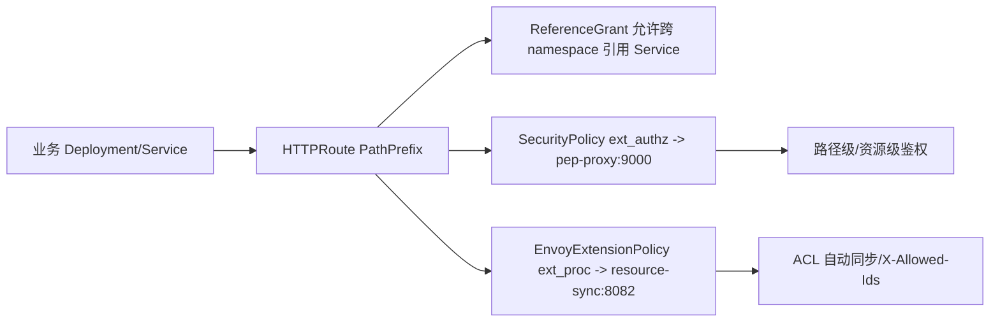

# 支持应用初始化与路由集成 Story 设计文档

## 2 Story概述

### 2.1 Story需求描述

#### 2.1.1 Story背景描述

1. 简要说明

本 Story 支持 IAM 与 Gateway 部署后的应用初始化和路由集成。系统通过 Helm 安装 Gateway/IAM，自动创建 Namespace、Service、HTTPRoute、ReferenceGrant、SecurityPolicy，并通过 PostgreSQL 初始化脚本写入默认应用、权限组、路径绑定和数据表结构。业务应用通过 Manifest API 或 App 注册 API 声明 namespace、base_url、资源路径、默认 ACL 和回调信息，bundle-server 将数据库中的 `apps`、`permission_groups`、`app_manifests` 合成为 OPA `data.apps` 和 `data.path_rules`，业务 chart 通过 HTTPRoute + SecurityPolicy + EnvoyExtensionPolicy 接入统一入口。

2. Actor

集群管理员、IAM 管理员、应用开发者、业务应用 chart、Envoy Gateway、bundle-server、OPA。

3. 前置条件

K8s 集群就绪；Gateway API 和 Envoy Gateway CRD 已安装；离线镜像已导入或在线镜像可拉取；PostgreSQL/Keycloak/IAM 服务可正常启动。

4. 最小保证

初始化脚本幂等；重复 Helm install/upgrade 不破坏已有数据；路由创建失败不修改后端业务数据；未绑定 SecurityPolicy 的业务不会被误接入鉴权链路。

5. 成功保证

部署后 Keycloak 公共路由、AccessManager 受保护路由可访问；默认 `apps` 和 `permission_groups` 已写入；Manifest 注册后 OPA 数据刷新，业务路径进入路径级鉴权；业务 chart 的 HTTPRoute、ReferenceGrant、SecurityPolicy、EnvoyExtensionPolicy 状态正常。

6. 触发事件

管理员执行 `helm install` 或 `setup.sh`；应用团队部署业务 chart；管理员注册/更新应用 Manifest；bundle-server 周期刷新 OPA 数据；业务应用启停或升级。

7. 主成功场景

管理员安装 `aidp-gateway` 和 `aidp-iam`；Postgres 初始化 SQL 创建 IAM 表和默认权限数据；IAM Helm 模板创建 public/protected HTTPRoute 和 SecurityPolicy；应用团队参考 mock-kb chart 创建业务 Service、HTTPRoute、ReferenceGrant、SecurityPolicy 和 EnvoyExtensionPolicy；管理员注册 Manifest；bundle-server 将 Manifest 派生路径规则推送到 OPA；业务请求经 Gateway 路由到后端，并由 pep-proxy/resource-sync 统一处理。

8. 扩展场景（包括异常场景）

- 约束：IAM 控制面路由由 IAM chart 管理，业务路由由业务 chart 管理。
- 规格：业务路由跨 namespace 引用 Service 时必须提供 ReferenceGrant。
- 升级：Postgres 初始化 SQL 使用幂等 DDL/DML，Helm upgrade 保留现有数据。
- 可靠性：Gateway/IAM chart 可重复执行；`wait-for-secret` initContainer 等待 Keycloak init 输出 client secret。
- 性能：OPA 数据由 bundle-server 合成并推送，避免每次请求动态读全部规则。
- 安全：受保护路由绑定 SecurityPolicy；bodyToExtAuth 默认 8192 字节；业务路由按需绑定 ext_proc。
- 韧性：bundle-server/OPA 数据刷新短暂延迟时，已有 OPA 数据仍可服务。
- 可服务：HTTPRoute Accepted、Gateway Programmed、OPA `/v1/data`、bundle-server 日志可定位路由和策略问题。
- 可测试：`test.sh` 验证 public/protected routes、Manifest CRUD、OPA path_rules；mock-kb chart 验证业务接入模板。

#### 2.1.2 关联AR信息详情

| AR编号 | AR标题 | 架构元素 | 所属SR编号 | 所属SR标题 | 所属SR详情 | 所属SR关联功能 |
| --- | --- | --- | --- | --- | --- | --- |
| NA | NA | Helm、Envoy Gateway、Keycloak、PostgreSQL、bundle-server、OPA | SR-APP-INIT-ROUTE | 支持应用初始化与路由集成 | 部署期初始化默认数据和路由，应用通过 Manifest/HTTPRoute 接入 | Helm install、Postgres init、HTTPRoute、SecurityPolicy、Manifest API |

### 2.2 Story用户使用场景分析

#### 2.2.1 新增/变更的脚本

| 脚本名称 | 功能描述 | 入参 | 执行权限 |
| --- | --- | --- | --- |
| `da-cluster/scripts/setup.sh` | 从零创建 Kind 集群、构建镜像、加载镜像、Helm 安装 Gateway/IAM | `--skip-build` | 集群管理员 |
| `da-cluster/scripts/cleanup.sh` | 卸载 release、删除 namespace、清理 Gateway 相关资源 | `CLUSTER_NAME` | 集群管理员 |
| `da-cluster/scripts/test.sh` | 验证初始化、路由、Manifest、OPA、ACL、API Key | 环境变量 | 本地开发/CI |
| `mocks/package-mock-kb/test/test.sh` | 验证业务 chart 接入模板 | `GATEWAY`、`NAMESPACE` | 本地开发/CI |

### 2.3 升级兼容性

#### 2.3.1 升级设计编码军规

| 序号 | 军规 | 说明 | 例外 |
| --- | --- | --- | --- |
| 1 | 节点间、组件间、设备间消息接口设计要前后兼容 | Gateway API/Envoy Gateway CRD 使用标准资源 | 无 |
| 2 | 持久化数据要前后兼容 | 初始化 SQL 幂等，不删除现有数据 | 无 |
| 3 | 升级后老特性不能丢失 | OIDC public routes、AccessManager routes 保持 | 无 |
| 4 | 升级后产品对外限制不能变严 | 默认 Helm 参数保持可用，业务路由由业务方控制 | 无 |
| 5 | 升级后License控制不能变严 | 不涉及 | 无 |
| 6 | 升级后商用参数必须继承 | values 中 namespace、service、image、route 开关继续继承 | 无 |
| 7 | 升级后外部接口不能修改 | 新增 Manifest API，不删除 OIDC 和 AccessManager 基础路径 | 无 |
| 8 | 升级后产品规格不能下降 | 路由和策略对象数量未降低规格 | 无 |
| 9 | 升级后模块对外限制不能变严 | 业务 chart 显式绑定策略，IAM 不强行接管所有业务路由 | 无 |
| 10 | 升级后新特性默认不能打开 | Manifest 未注册前不会派生业务 path_rules | 无 |
| 11 | 禁止修改Apollo版本中的组件 | 不涉及 | 无 |
| 12 | 用户态组件需要兼容不同Apollo版本 | 容器用户态服务，K8s 标准接口 | 无 |

#### 2.3.2 通用升级兼容性Checklist

| 序号 | 军规 | Check项简述 | 是否涉及 | 是否做了兼容性处理 | 备注说明 |
| --- | --- | --- | --- | --- | --- |
| 1 | 持久化数据要前后兼容 | 新增/修改表字段 | 涉及 | 是 | `CREATE TABLE IF NOT EXISTS`、`ON CONFLICT` |
| 2 | 外部接口不能修改 | 路由路径变化 | 涉及 | 是 | public/protected 路由保持；新增 Manifest |
| 3 | 新特性默认不能打开 | 业务路径自动鉴权 | 涉及 | 是 | 需 Manifest 和业务 SecurityPolicy 显式接入 |
| 4 | 产品规格不能下降 | 路由能力 | 涉及 | 是 | Gateway API 标准资源，跨 ns 通过 ReferenceGrant |
| 5 | Apollo 组件 | OS/固件 | 不涉及 | NA | 容器和 Helm 层变更 |
| 6 | 商用参数继承 | Helm values | 涉及 | 是 | 保留 namespace、image、route、replica 等参数 |

### 2.4 是否影响性能

初始化和路由集成主要发生在部署期和配置变更期，对业务请求热路径的影响来自 SecurityPolicy ext_authz、EnvoyExtensionPolicy ext_proc 和 OPA 查询。OPA 数据由 bundle-server 周期合成并推送，避免热路径访问管理数据库读取全部规则；resource_acl 查询按单请求必要数据访问。

## 3 Story设计描述

### 3.1 Story设计

部署和接入分为八个阶段：

1. `aidp-gateway` Helm chart 安装 Gateway API CRD、Envoy Gateway Controller、GatewayClass、Gateway、EnvoyProxy。
2. `aidp-iam` Helm chart 创建 `keycloak`、`aidp-iam` 等 namespace。
3. PostgreSQL init SQL 创建 IAM 数据表并写入默认应用和权限组。
4. Keycloak init Job 创建 realm、client、基础组、用户和 client secret。
5. `iam-services` Deployment 启动 keycloak-proxy、pep-proxy、bundle-server、resource-sync 和 OPA。
6. IAM chart 创建 public HTTPRoute：`/realms`、`/admin`、`/resources`。
7. IAM chart 创建 protected HTTPRoute：`/AccessManager`、`/acl/v1`，并绑定 `pep-proxy` ext_authz。
8. 业务 chart 创建自己的 HTTPRoute、ReferenceGrant、SecurityPolicy、EnvoyExtensionPolicy；应用 Manifest 注册后派生业务 path_rules。

### 3.2 Story业务交互流程

#### 3.2.1 K8s部署流程图

#### 3.2.2 应用 Manifest 注册与 OPA 刷新

#### 3.2.3 业务路由接入模板

### 3.3 运行设计

- IAM 控制面 Service 名称保持稳定：`keycloak-proxy:8090`、`pep-proxy:9000/8000`、`bundle-server:8001`、`opa:8181`、`resource-sync:8080/8082`。
- public routes 不绑定 SecurityPolicy，保证 OIDC discovery 和 Keycloak admin/static 资源可访问。
- protected routes 绑定 `SecurityPolicy`，`failOpen=false`，pep-proxy 不可用时默认拒绝。
- 业务 routes 由业务 chart 管理，参考 mock-kb：HTTPRoute + ReferenceGrant + SecurityPolicy + EnvoyExtensionPolicy。
- `bodyToExtAuth.maxRequestBytes=8192` 使 pep-proxy 可以读取请求体，用于 body 模式资源 ID 提取。
- bundle-server 周期读取数据库并推送 OPA REST API，当前 OPA 使用 `/v1/policies` 和 `/v1/data` 写入。

### 3.4 SFMEA分析

| 失效模式 | 影响 | 检测方式 | 缓解措施 |
| --- | --- | --- | --- |
| ReferenceGrant 缺失 | HTTPRoute ResolvedRefs=False | `kubectl get httproute -A` | 业务 chart 必须带 ReferenceGrant |
| SecurityPolicy 未绑定 | 业务路由未鉴权 | 安全测试、检查 policy targetRefs | 接入模板强制生成 SecurityPolicy |
| EnvoyExtensionPolicy 未绑定 | ACL 不自动同步，列表 header 不注入 | 创建资源后查不到 ACL | 接入模板强制生成 ext_proc policy |
| Manifest 未注册 | OPA 无业务 path_rules | OPA data 检查、请求 403 | 部署后执行 Manifest 注册或应用自注册 |
| bundle-server 推送失败 | 新规则延迟生效 | bundle-server 日志、OPA data 未更新 | 周期重试，保留旧 OPA 数据继续服务 |
| Postgres init 未执行 | IAM 表不存在 | Pod 启动失败、SQL 错误 | StatefulSet init scripts 和 readiness 检查 |

### 3.5 Onetrack设计

NA

### 3.6 可定位设计

1. `kubectl get gateway` 查看 Gateway `PROGRAMMED=True`。
2. `kubectl get httproute -A` 查看 `Accepted=True`、`ResolvedRefs=True`。
3. `kubectl get securitypolicy,envoyextensionpolicy -A` 查看策略是否绑定目标 HTTPRoute。
4. OPA `/v1/data/apps`、`/v1/data/path_rules` 可检查当前应用和路径规则。
5. `GET /AccessManager/Tenants/System/AppManifests` 可查看已注册应用 Manifest。
6. Helm NOTES 输出 IAM/Gateway 后续验证命令。

### 3.7 风险分析

| 风险 | 等级 | 应对 |
| --- | --- | --- |
| 业务团队只创建 HTTPRoute，未创建策略 | 高 | 提供 mock-kb chart 模板；验收必须检查 SecurityPolicy/EnvoyExtensionPolicy |
| Manifest 与 HTTPRoute pathPrefix 不一致 | 高 | 接入评审检查 namespace/path_prefix；test.sh 注册并验证 path_rules |
| OPA 刷新延迟导致新路由短暂 403 | 中 | 部署流程中注册后等待刷新；bundle-server 周期重试 |
| bodyToExtAuth 太小 | 中 | 默认 8192；大请求接口需按业务调大 |
| 清理不干净影响重装 | 中 | cleanup hook 和 `cleanup.sh` 验证 namespace/Gateway 资源清理 |

## 4 Shard设计描述

### 4.1 Shard 1：Gateway 部署初始化接口

该 Shard 由 `aidp-gateway` Helm chart 提供，负责创建统一入口。

#### 4.1.1 Gateway Helm 安装

- 接口路径：`helm install aidp-gateway package-gateway/charts/aidp-gateway --namespace aidp-gateway --create-namespace`
- 功能：安装 Envoy Gateway Controller、Gateway API/Envoy Gateway CRD、GatewayClass、Gateway、EnvoyProxy 和证书管理服务。
- 入参：
  - Helm values：`proxy.service.type`、`proxy.service.nodePort`、`gateway.tls.enabled`、`gateway.tls.secretName`、`certificateManager.enabled`。
- 返回值：
  - 成功：Helm release `aidp-gateway`；Gateway `eg`；Envoy data plane Service；`aidp-gateway-cert-manager` Service。
  - 失败：Helm install 非 0 返回；Gateway 未 Programmed。

#### 4.1.2 Gateway 证书管理接口

- 接口路径：`PUT /GatewayManager/Tenants/System/Certificates/{Alias}`
- 功能：上传 TLS 证书和私钥，创建或覆盖 Gateway TLS Secret。
- 入参：
  - 路径参数：`Alias`。
  - Form：`cert`、`privateKey`、`caCert`、`password`、`isConfirmed`。
- 返回值：
  - 成功：`secret_name`、`secret_namespace`、`status=Ready`、证书有效期和指纹。
  - 失败：`400` 证书/私钥不匹配或过期未确认。

### 4.2 Shard 2：IAM 部署初始化接口

该 Shard 由 `aidp-iam` Helm chart 提供，负责身份认证、鉴权、策略和同步服务部署。

#### 4.2.1 IAM Helm 安装

- 接口路径：`helm install aidp-iam package-iam/charts/aidp-iam --namespace aidp-iam --create-namespace`
- 功能：部署 PostgreSQL、Keycloak、keycloak-init Job、iam-services Deployment、OPA、HTTPRoute、ReferenceGrant、SecurityPolicy。
- 入参：
  - Helm values：`keycloak.keycloak.replicas`、`iam-app.replicas`、`iam-app.podAntiAffinity.enabled`、`routes.enabled`、`routes.gatewayNamespace`。
- 返回值：
  - 成功：`keycloak`、`postgres`、`iam-services` Ready；`keycloak-aidp-client` Secret 创建；AccessManager 路由可访问。
  - 失败：Helm install 超时；init Job 失败；iam-services readiness 失败。

#### 4.2.2 PostgreSQL 初始化 SQL

- 接口路径：`package-iam/charts/aidp-iam/charts/keycloak/templates/postgres-init-configmap.yaml`
- 功能：初始化 IAM 数据表和默认数据，包括 `apps`、`resource_patterns`、`permission_groups`、`permission_group_paths`、`permission_group_bindings`、`resource_acl`、`pending_acl`、`app_manifests`、`api_keys`。
- 入参：
  - PostgreSQL initdb 执行环境。
  - SQL DDL/DML。
- 返回值：
  - 成功：`iam` 数据库和默认应用、权限组存在。
  - 失败：Postgres 初始化日志报错，IAM 依赖表缺失。

### 4.3 Shard 3：IAM 控制面路由接口

#### 4.3.1 Keycloak 公共路由

- 接口路径：
  - `GET /realms/{realm}/.well-known/openid-configuration`
  - `GET /admin/`
  - `GET /resources/...`
- 功能：暴露 OIDC discovery、Keycloak 管理页面和静态资源。
- 入参：
  - HTTP GET，无业务 token 要求。
- 返回值：
  - 成功：OIDC discovery 返回 200；管理页面返回 200/302；静态资源可访问。

#### 4.3.2 AccessManager 受保护路由

- 接口路径：`/AccessManager/*`
- 功能：将 IAM 管理 API 路由到 `keycloak-proxy.aidp-iam.svc:8090`，并通过 `SecurityPolicy` 绑定 pep-proxy ext_authz。
- 入参：
  - Header：`Authorization: Bearer <token>`。
  - 业务请求体：按具体 AccessManager API 定义。
- 返回值：
  - 成功：后端 API 响应。
  - 失败：无 token 或权限不足返回 `401/403`。

#### 4.3.3 ACL 兼容路由

- 接口路径：`/acl/v1/*`
- 功能：保留历史 ACL API 入口，路由到 `resource-sync.aidp-iam.svc:8080`，同样受 pep-proxy 保护。
- 入参：
  - Header：`Authorization: Bearer <token>`。
  - Body/Query：按历史 ACL API 定义。
- 返回值：
  - 成功：resource-sync ACL API 响应。
  - 失败：`401/403/404`。

### 4.4 Shard 4：应用 Manifest 注册接口

#### 4.4.1 注册或更新 Manifest

- 接口路径：`PUT /AccessManager/Tenants/System/AppManifests/{namespace}`
- 功能：注册应用 Manifest，写入 `app_manifests`，同步 `apps`、`resource_patterns` 和默认 ACL。
- 入参：
  - 路径参数：`namespace`。
  - Body：完整 manifest JSON，必须包含 `base_url`，可包含 `callback_url`、`resources`、`default_acl`、`actions`。
- 返回值：
  - 成功：`{"status":"ok","namespace":"...","acls_synced":N,"patterns_synced":N}`
  - 失败：`400` JSON 非法或缺少 `base_url`；`401/403` 无权限。

#### 4.4.2 查询 Manifest 列表

- 接口路径：`GET /AccessManager/Tenants/System/AppManifests`
- 功能：查询所有已注册应用 Manifest 摘要。
- 入参：无。
- 返回值：`{"manifests":[{"namespace":"...","base_url":"...","callback_url":"...","registered_at":"..."}],"count":N}`

#### 4.4.3 查询单个 Manifest

- 接口路径：`GET /AccessManager/Tenants/System/AppManifests/{namespace}`
- 功能：查询某个应用的 Manifest 明细。
- 入参：路径参数 `namespace`。
- 返回值：包含 `namespace`、`base_url`、`callback_url`、`manifest_json`、`registered_at`；不存在返回 `404`。

#### 4.4.4 删除 Manifest

- 接口路径：`DELETE /AccessManager/Tenants/System/AppManifests/{namespace}`
- 功能：删除应用 Manifest 注册记录。
- 入参：路径参数 `namespace`。
- 返回值：`{"status":"deleted","namespace":"..."}`；不存在返回 `404`。

### 4.5 Shard 5：OPA 策略刷新接口

#### 4.5.1 bundle-server 推送 OPA 数据

- 接口路径：
  - `PUT /v1/policies/authz_main`
  - `PUT /v1/data/apps`
  - `PUT /v1/data/path_rules`
- 功能：bundle-server 从 DB 读取应用、权限组和 Manifest，合成 OPA policy/data 并推送到 OPA。
- 入参：
  - `apps`：应用启停和 path_prefix。
  - `path_rules`：路径前缀、HTTP method、required_groups。
  - Rego policy：`authz` 包。
- 返回值：
  - 成功：OPA REST API 返回 200。
  - 失败：bundle-server 记录错误，下个周期重试，OPA 保留旧数据。

### 4.6 Shard 6：业务路由接入接口

#### 4.6.1 业务 HTTPRoute

- 接口路径：K8s `HTTPRoute`，例如 `PathPrefix=/KnowledgeBase` 或 mock-kb `PathPrefix=/kb`。
- 功能：将业务路径转发到业务 Service。
- 入参：
  - `parentRefs` 指向 Gateway `eg`。
  - `backendRefs` 指向业务 namespace 下的 Service。
- 返回值：
  - 成功：HTTPRoute `Accepted=True`、`ResolvedRefs=True`。
  - 失败：ReferenceGrant 缺失或 Service 不存在导致 `ResolvedRefs=False`。

#### 4.6.2 业务 SecurityPolicy

- 接口路径：K8s `SecurityPolicy` targetRef 指向业务 HTTPRoute。
- 功能：将业务路由绑定到 `pep-proxy.aidp-iam.svc:9000`，执行 ext_authz。
- 入参：
  - `targetRefs`：业务 HTTPRoute。
  - `extAuth.grpc.backendRefs`：`pep-proxy`。
  - `bodyToExtAuth.maxRequestBytes`：默认 8192。
- 返回值：
  - 成功：受保护业务请求无 token 返回 401/403，有 token 进入鉴权。

#### 4.6.3 业务 EnvoyExtensionPolicy

- 接口路径：K8s `EnvoyExtensionPolicy` targetRef 指向业务 HTTPRoute。
- 功能：将业务路由绑定到 `resource-sync.aidp-iam.svc:8082`，执行 ext_proc。
- 入参：
  - `targetRefs`：业务 HTTPRoute。
  - `extProc.backendRefs`：`resource-sync`。
  - `processingMode`：请求/响应 body 处理模式。
  - `failOpen`：建议 `true`。
- 返回值：
  - 成功：资源创建/删除触发 ACL 同步，集合查询注入 `X-Allowed-Ids`。

## 5 验收测试用例

| 用例编号 | 用例名称 | 预置条件 | 测试步骤 | 预期结果 |
| --- | --- | --- | --- | --- |
| INIT-AT-001 | Gateway 从零安装 | 空 K8s/Kind 集群 | 1. 执行 `helm install aidp-gateway` 或 `setup.sh`。 2. 查询 Gateway、GatewayClass、EnvoyProxy、Envoy data plane。 | Helm release 成功；Gateway `PROGRAMMED=True`；Envoy Service 可访问。 |
| INIT-AT-002 | IAM 从零安装 | Gateway 已安装 | 1. 执行 `helm install aidp-iam`。 2. 查询 `keycloak`、`postgres`、`iam-services`。 | Pod Ready；`keycloak-aidp-client` Secret 存在；iam-services readiness 通过。 |
| INIT-AT-003 | Postgres 默认数据 | IAM 已安装 | 1. 进入 postgres。 2. 查询 `apps`、`permission_groups`、`permission_group_bindings`。 | 默认应用和系统权限组存在。 |
| INIT-AT-004 | Keycloak OIDC 公共路由 | IAM routes enabled | 1. GET `/realms/aidp/.well-known/openid-configuration`。 | 返回 200，包含 issuer/token_endpoint。 |
| INIT-AT-005 | Keycloak admin 路由 | IAM routes enabled | 1. GET `/admin/`。 | 返回 200/302/303。 |
| INIT-AT-006 | AccessManager 无 token 拒绝 | IAM protected route 已创建 | 1. 无 token GET `/AccessManager/Tenants/System/AppManifests`。 | 返回 401/403。 |
| INIT-AT-007 | AccessManager 管理员 token 放行 | 管理员 token 可用 | 1. GET `/AccessManager/Tenants/System/AppManifests`。 | 返回 200，响应中包含 manifests/count。 |
| INIT-AT-008 | Manifest 注册 | 管理员 token 可用 | 1. PUT `/AccessManager/Tenants/System/AppManifests/TestApp`。 2. Body 包含 `base_url` 和 resources。 | 返回 ok；`patterns_synced`、`acls_synced` 字段存在。 |
| INIT-AT-009 | Manifest 查询 | Manifest 已注册 | 1. GET list。 2. GET 单个 namespace。 | list 包含 TestApp；单个查询返回 manifest_json。 |
| INIT-AT-010 | Manifest 删除 | Manifest 已注册 | 1. DELETE namespace。 2. 再次 GET 单个 namespace。 | DELETE 返回 deleted；再次 GET 返回 404。 |
| INIT-AT-011 | OPA apps 数据刷新 | Manifest 或默认 apps 已存在 | 1. 查询 OPA `/v1/data/apps`。 | 返回默认应用和注册应用，enabled 状态正确。 |
| INIT-AT-012 | OPA path_rules 数据刷新 | Manifest 已注册并等待 bundle-server 刷新 | 1. 查询 OPA `/v1/data/path_rules`。 | 包含 Manifest 派生路径和 required_groups。 |
| INIT-AT-013 | 业务 HTTPRoute 接入 | mock-kb 或业务 chart 已安装 | 1. `kubectl get httproute -A`。 2. 查看 Accepted/ResolvedRefs。 | 业务 HTTPRoute `Accepted=True`、`ResolvedRefs=True`。 |
| INIT-AT-014 | 业务 SecurityPolicy 接入 | 业务 chart 已安装 | 1. 查询 SecurityPolicy targetRefs。 2. 无 token 访问业务路径。 | targetRef 指向业务 HTTPRoute；无 token 返回 401/403。 |
| INIT-AT-015 | 业务 EnvoyExtensionPolicy 接入 | 业务 chart 已安装 | 1. 创建业务资源。 2. 查询 ACL。 | ext_proc 写入 owner ACL。 |
| INIT-AT-016 | 卸载清理 | release 已安装 | 1. 执行 `cleanup.sh` 或 Helm uninstall。 2. 查询 Helm release、namespace、Gateway 资源。 | release 清空；相关 namespace/Gateway 资源无残留。 |

## 6 开发自验证用例

### 6.1 开发自验证用例设计

使用 `setup.sh` 从零安装，使用 `test.sh` 验证核心路由、Manifest、OPA 和权限链路；安装 mock-kb 后验证业务路由模板完整性。发布前还需要执行 cleanup 后重装，确认初始化脚本幂等、卸载清理干净。

### 6.2 开发自验证用例详情

| Depth | 用例_名称 | 用例_编号 | 用例_级别 | 用例_自动化类型 | 用例_测试活动 | 用例_适用版本 | 用例_当前部署形态 | 用例_支持部署形态 | 关联_需求资源_编号 | 用例_设计描述 | 用例_预置条件 | 用例_测试步骤 | 用例_预期结果 | 用例_备注 |
| --- | --- | --- | --- | --- | --- | --- | --- | --- | --- | --- | --- | --- | --- | --- |
| 1 | Gateway 安装验证 | INIT-001 | L1 | 自动化 | 开发自验证 | v1.8+ | Kind | K8s | SR-APP-INIT-ROUTE | 验证 aidp-gateway Helm 安装 | Docker/Kind/Helm 可用 | 执行 `setup.sh` 或单独 Helm install gateway | Gateway Programmed，Envoy data plane Ready | 基础部署 |
| 1 | IAM 安装验证 | INIT-002 | L1 | 自动化 | 开发自验证 | v1.8+ | Kind | K8s | SR-APP-INIT-ROUTE | 验证 aidp-iam Helm 安装 | Gateway 已安装 | 执行 `setup.sh` 或 Helm install IAM | Keycloak/Postgres/iam-services Ready | 基础部署 |
| 1 | 默认数据初始化 | INIT-003 | L1 | 自动化 | 开发自验证 | v1.8+ | Kind | K8s | SR-APP-INIT-ROUTE | 验证 Postgres init SQL 写入默认数据 | IAM 已安装 | `test.sh` 查询 apps/permission_groups | 默认应用和权限组存在 | 初始化幂等 |
| 1 | OIDC 公共路由 | INIT-004 | L1 | 自动化 | 开发自验证 | v1.8+ | Kind | K8s | SR-APP-INIT-ROUTE | 验证 `/realms` 路由 | IAM 已安装 | GET discovery | 200 | public route |
| 1 | AccessManager 保护路由 | INIT-005 | L1 | 自动化 | 开发自验证 | v1.8+ | Kind | K8s | SR-APP-INIT-ROUTE | 验证受保护路由必须鉴权 | IAM 已安装 | 无 token GET `/AccessManager/...` | 401/403 | protected route |
| 1 | 管理员访问保护路由 | INIT-006 | L1 | 自动化 | 开发自验证 | v1.8+ | Kind | K8s | SR-APP-INIT-ROUTE | 验证 admin token 可访问管理 API | 管理员 token 可用 | 带 token GET AppManifests | 200 | ext_authz |
| 1 | Manifest 注册 | INIT-007 | L1 | 自动化 | 开发自验证 | v1.8+ | Kind | K8s | SR-APP-INIT-ROUTE | 注册 TestApp Manifest | 管理员 token 可用 | `test.sh` PUT AppManifests | 返回 ok | Manifest API |
| 1 | Manifest 查询删除 | INIT-008 | L1 | 自动化 | 开发自验证 | v1.8+ | Kind | K8s | SR-APP-INIT-ROUTE | 验证 list/get/delete | 已注册 TestApp | GET list、GET single、DELETE、GET after delete | list/get 成功，删除后 404 | Manifest API |
| 1 | OPA path_rules 刷新 | INIT-009 | L1 | 自动化 | 开发自验证 | v1.8+ | Kind | K8s | SR-APP-INIT-ROUTE | 注册 Manifest 后 OPA path_rules 生效 | Manifest 已注册 | 等待刷新后查询 OPA `/v1/data/path_rules` | 包含 Manifest 派生路径 | bundle-server |
| 1 | 业务 HTTPRoute 模板 | INIT-010 | L1 | 自动化 | 开发自验证 | v1.8+ | Kind | K8s | SR-APP-INIT-ROUTE | 验证业务路由接入 | mock-kb 已安装 | `kubectl get httproute -A` | mock-kb-route Accepted/ResolvedRefs True | 业务 chart |
| 1 | 业务 SecurityPolicy 模板 | INIT-011 | L1 | 自动化 | 开发自验证 | v1.8+ | Kind | K8s | SR-APP-INIT-ROUTE | 验证业务路由绑定 pep-proxy | mock-kb 已安装 | 查询 SecurityPolicy 并无 token 访问业务路径 | 无 token 401/403 | ext_authz |
| 1 | 业务 ext_proc 模板 | INIT-012 | L1 | 自动化 | 开发自验证 | v1.8+ | Kind | K8s | SR-APP-INIT-ROUTE | 验证业务路由绑定 resource-sync | mock-kb 已安装 | 创建资源并查询 ACL | 自动 owner ACL 存在 | ext_proc |
| 1 | 卸载清理验证 | INIT-013 | L1 | 手工/自动化 | 开发自验证 | v1.8+ | Kind | K8s | SR-APP-INIT-ROUTE | 验证卸载后资源清理 | release 已安装 | 执行 cleanup 并 `helm list -A`、`kubectl get ns`、`kubectl get gateway...` | 无残留 release/ns/Gateway 资源 | 发布前检查 |
| 1 | 重装幂等验证 | INIT-014 | L1 | 自动化 | 开发自验证 | v1.8+ | Kind | K8s | SR-APP-INIT-ROUTE | 验证 cleanup 后重装和 test 通过 | 已执行清理 | `setup.sh --skip-build` 后运行 `test.sh` | 测试全 PASS | 发布前检查 |

## 7 文档评审会议纪要

NA
