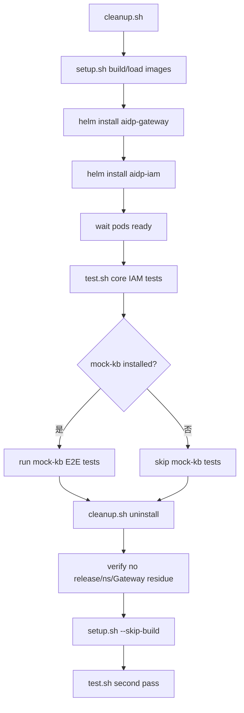

# 支持集成测试与从零部署验证 Story 设计文档

## 2 Story概述

### 2.1 Story需求描述

#### 2.1.1 Story背景描述

1. 简要说明

本 Story 用于保证 IAM、Gateway、mock-kb 等组件在从零部署、卸载清理、重装和发布打包场景下行为稳定。当前项目已经沉淀 `cleanup.sh`、`setup.sh`、`test.sh` 三个核心脚本，覆盖 Kind 集群创建、镜像构建、Helm 安装、公共路由、认证、应用注册、OPA、ACL、API Key、mock-kb 业务路由和卸载清理验证。

2. Actor

开发人员、测试人员、发布工程师、集群管理员。

3. 前置条件

本地具备 Docker、Kind、kubectl、Helm、Git Bash 或 Linux shell；release 环境具备目标架构镜像构建或离线镜像包能力；mock-kb chart 可选安装。

4. 最小保证

测试脚本失败时返回非 0；cleanup 可重复执行；卸载不会误删非本项目资源；mock-kb 未安装时核心 IAM 测试不受影响并显式 skip。

5. 成功保证

从零清理后可一键安装；核心组件 Ready；`test.sh` 全部核心用例通过；安装 mock-kb 后业务端到端用例运行；cleanup 后 Helm release、namespace 和 Gateway 资源清理干净；重装后测试仍通过。

6. 触发事件

功能合入、依赖升级、镜像重打包、release 发布前验证、修复卸载残留问题、mock-kb 接入验证。

7. 主成功场景

开发人员执行 `cleanup.sh` 清空旧环境，执行 `setup.sh` 构建镜像并 Helm install `aidp-gateway`、`aidp-iam`。等待 Pod Ready 后执行 `test.sh`，脚本自动 port-forward Gateway，获取 token，注册 Manifest，验证 OPA、ACL、API Key 和 mock-kb。测试通过后执行 cleanup，确认资源清理干净，再使用 `setup.sh --skip-build` 重装并二次测试。

8. 扩展场景（包括异常场景）

- 约束：Kind 场景要求本地 Docker 可用；已有 K8s 集群使用 `--no-kind`。
- 规格：`test.sh` 使用 PASS/FAIL/TOTAL 统计，mock 后端按 HTTPRoute 自动检测。
- 升级：脚本参数保持兼容，新增测试不能破坏无 mock-kb 环境。
- 可靠性：cleanup 对缺失 release/namespace 忽略错误，可重复执行。
- 性能：测试以功能验证为主，不做压测。
- 安全：测试使用默认开发账号，生产环境发布前应更换凭据。
- 韧性：测试失败保留集群现场，便于查看 Pod、日志和 DB。
- 可服务：脚本输出分 section，便于定位失败模块。
- 可测试：本 Story 本身由脚本和 release 前手工检查验证。

#### 2.1.2 关联AR信息详情

| AR编号 | AR标题 | 架构元素 | 所属SR编号 | 所属SR标题 | 所属SR详情 | 所属SR关联功能 |
| --- | --- | --- | --- | --- | --- | --- |
| NA | NA | setup.sh、cleanup.sh、test.sh、Helm、Kind、mock-kb | SR-INTEGRATION-TEST | 支持集成测试 | 从零部署、卸载、重装和端到端测试 | setup、cleanup、test、mock-kb |

### 2.2 Story用户使用场景分析

#### 2.2.1 新增/变更的脚本

| 脚本名称 | 功能描述 | 入参 | 执行权限 |
| --- | --- | --- | --- |
| `da-cluster/scripts/cleanup.sh` | 卸载 release、删除 namespace，可选删除 Kind 集群 | `CLUSTER_NAME` | 集群管理员 |
| `da-cluster/scripts/setup.sh` | 创建 Kind、构建/加载镜像、Helm 安装 Gateway 和 IAM | `--no-kind`、`--skip-build`、`--skip-init`、`--arch` | 集群管理员 |
| `da-cluster/scripts/test.sh` | 执行 IAM 端到端测试 | `REALM`、`CLIENT_ID`、`GATEWAY_PORT` | 开发/CI |

### 2.3 升级兼容性

#### 2.3.1 升级设计编码军规

| 序号 | 军规 | 说明 | 例外 |
| --- | --- | --- | --- |
| 1 | 外部接口不能修改 | 测试脚本只消费公开 API 和 kubectl/helm 标准接口 | 无 |
| 2 | 老特性不能丢失 | 新增用例不能移除已有认证、ACL、API Key 验证 | 无 |
| 3 | 新特性默认不能打开 | mock-kb 未安装时相关用例 skip | 无 |
| 4 | 持久化数据兼容 | 测试结束清理测试数据，不影响业务数据 | 无 |
| 5 | 产品规格不能下降 | 测试覆盖不降低 release 验收范围 | 无 |

#### 2.3.2 通用升级兼容性Checklist

| 序号 | 军规 | Check项简述 | 是否涉及 | 是否做了兼容性处理 | 备注说明 |
| --- | --- | --- | --- | --- | --- |
| 1 | 外部接口 | Shell 参数 | 涉及 | 是 | 参数向后兼容 |
| 2 | 持久化数据 | 测试数据清理 | 涉及 | 是 | trap 删除 TestApp/测试 ACL |
| 3 | 卸载兼容 | 缺失资源 | 涉及 | 是 | `|| true` 幂等 |
| 4 | 部署兼容 | Kind/已有 K8s | 涉及 | 是 | `--no-kind` |
| 5 | mock 可选 | 后端路由缺失 | 涉及 | 是 | 自动检测并 skip |

### 2.4 是否影响性能

集成测试不在生产热路径运行，不影响线上性能。`test.sh` 会创建临时数据、访问 OPA/DB/Keycloak/Gateway，适合开发环境和发布前环境执行，不建议在生产业务高峰直接运行。

## 3 Story设计描述

### 3.1 Story设计

集成验证按四阶段组织：环境清理、从零安装、端到端测试、卸载重装验证。setup 负责构建和安装，test 负责功能断言，cleanup 负责恢复环境。发布阶段再基于通过验证的镜像和 chart 打包 release assets。

### 3.2 Story业务交互流程

#### 3.2.1 从零验证流程

### 3.3 运行设计

- `setup.sh` 默认创建 `da-cluster` Kind 集群；`--no-kind` 用于已有 K8s。
- 自研镜像包括 `aidp-iam-app:v1`、`keycloak-custom:26.5.2`、`keycloak-init:v2`、`gateway-cert-manager:v1`。
- Helm 安装顺序固定为 `aidp-gateway` 先于 `aidp-iam`。
- `test.sh` 自动 port-forward Gateway 到 `GATEWAY_PORT`，默认 30080。
- `test.sh` 自动检测 mock-kb 和 mock-memory HTTPRoute，缺失时 skip 对应业务后端测试。
- cleanup 先 uninstall release，再删除 `mock-kb`、`aidp-iam`、`keycloak`、`aidp-gateway`、`envoy-gateway-system` namespace。

### 3.4 SFMEA分析

| 失效模式 | 影响 | 检测方式 | 缓解措施 |
| --- | --- | --- | --- |
| 镜像未加载到 Kind | Pod ImagePullBackOff | kubectl describe pod | setup 执行 kind load，发布包提供离线镜像 |
| Gateway 未 Ready | 所有 HTTP 测试失败 | Gateway Programmed 条件、Envoy Pod | setup 等待控制面和数据面 |
| mock-kb 未安装 | 业务测试 skip | test.sh route 检测输出 | 安装 mock-kb 后重跑 |
| cleanup 残留 GatewayClass finalizer | 后续安装报冲突 | `kubectl get gatewayclass` | cleanup hook 先删除 Gateway，必要时人工处理 finalizer |
| 远端脚本参数变化 | CI 调用失败 | shell exit code | 保持参数兼容，新增参数可选 |

### 3.5 Onetrack设计

NA

### 3.6 可定位设计

1. `test.sh` 分 section 输出 PASS/FAIL/SKIP。
2. 失败时保留集群，便于查询 Pod 日志和 DB。
3. `cleanup.sh` 输出 namespace 删除和 Kind 删除结果。
4. `setup.sh` 按 Step 输出构建、加载、Helm 安装和等待状态。

### 3.7 风险分析

| 风险 | 等级 | 应对 |
| --- | --- | --- |
| 测试误删非本项目 namespace | 高 | cleanup namespace 白名单固定 |
| mock-kb skip 被误认为通过 | 中 | 输出 SKIP，发布验证要求安装 mock-kb |
| 本地端口冲突 | 中 | test.sh 自动清理 GATEWAY_PORT 占用，可通过 env 修改 |
| 依赖公网构建失败 | 中 | 支持 `--skip-build` 和离线镜像包 |

## 4 Shard设计描述

### 4.1 Shard 1：清理脚本

- 接口路径：`da-cluster/scripts/cleanup.sh`
- 功能：卸载本项目 Helm release，删除相关 namespace，可选删除 Kind 集群。
- 入参：
  - 环境变量：`CLUSTER_NAME`。
- 返回值：
  - 成功：release 和 namespace 删除完成，输出 `Done.`。

### 4.2 Shard 2：安装脚本

- 接口路径：`da-cluster/scripts/setup.sh`
- 功能：创建集群、构建/加载镜像、安装 Gateway 和 IAM。
- 入参：
  - `--no-kind`、`--skip-build`、`--skip-init`、`--arch`。
  - 环境变量：`CLUSTER_NAME`、`GATEWAY_PORT`、`KEYCLOAK_HOST`。
- 返回值：
  - 成功：Helm release `aidp-gateway`、`aidp-iam` deployed，Pod Ready。

### 4.3 Shard 3：端到端测试脚本

- 接口路径：`da-cluster/scripts/test.sh`
- 功能：执行 IAM 功能测试并统计 PASS/FAIL/TOTAL。
- 入参：
  - `REALM`、`CLIENT_ID`、`ADMIN_USER`、`ADMIN_PASSWORD`、`NORMAL_USER`、`GATEWAY_PORT`。
- 返回值：
  - 成功：FAIL=0，脚本退出 0。
  - 失败：输出失败断言并退出非 0。

### 4.4 Shard 4：mock-kb 可选业务测试

- 接口路径：`helm install aidp-mock-kb mocks/package-mock-kb/charts/aidp-mock-kb`
- 功能：安装 mock 知识库后端，验证业务 HTTPRoute、SecurityPolicy、EnvoyExtensionPolicy、ACL 自动同步和列表过滤。
- 入参：
  - chart values：service、route、policy、image。
- 返回值：
  - 成功：`test.sh` 检测到 mock-kb route 并执行 KB 相关用例。

### 4.5 Shard 5：发布资产验证

- 接口路径：`helm package`、`docker save`、`tar -czf`、`SHA256SUMS`
- 功能：基于通过测试的 chart 和镜像生成 release assets。
- 入参：
  - chart 目录、镜像 tag、目标架构目录。
- 返回值：
  - `.tgz` chart 包、`images-<arch>.tar.gz`、`SHA256SUMS`。

## 5 验收测试用例

| 用例编号 | 用例名称 | 预置条件 | 测试步骤 | 预期结果 |
| --- | --- | --- | --- | --- |
| IT-AT-001 | cleanup 幂等 | 集群可访问 | 1. 连续执行 cleanup 两次。 | 两次均成功，无未处理错误。 |
| IT-AT-002 | Kind 从零创建 | Docker/Kind 可用 | 1. 设置 `CLUSTER_NAME`。 2. 执行 setup。 | Kind 集群创建成功。 |
| IT-AT-003 | 镜像构建 | Docker 可用 | 1. 执行 setup 默认构建。 | 四个自研镜像构建成功。 |
| IT-AT-004 | Gateway Helm 安装 | 集群就绪 | 1. setup 安装 gateway。 2. 查询 Gateway。 | Gateway Programmed，Envoy Pod Ready。 |
| IT-AT-005 | IAM Helm 安装 | Gateway Ready | 1. setup 安装 IAM。 2. 查询 Pod/Secret。 | Keycloak、postgres、iam-services Ready。 |
| IT-AT-006 | 核心测试全通过 | IAM Ready | 1. 执行 `test.sh`。 | FAIL=0。 |
| IT-AT-007 | mock-kb 未安装 skip | 未安装 mock-kb | 1. 执行 `test.sh`。 | KB 用例显示 SKIP，核心用例正常执行。 |
| IT-AT-008 | mock-kb 安装后执行 | mock-kb chart 可用 | 1. Helm install mock-kb。 2. 执行 `test.sh`。 | KB 用例不再 skip，端到端通过。 |
| IT-AT-009 | 卸载清理检查 | release 已安装 | 1. cleanup。 2. `helm list -A`。 3. 查询相关 namespace/Gateway 资源。 | release、namespace、Gateway 资源无残留。 |
| IT-AT-010 | skip-build 重装 | 镜像已存在 | 1. cleanup 后执行 `setup.sh --skip-build`。 | 不重建镜像，Helm 安装成功。 |
| IT-AT-011 | 二轮测试 | skip-build 重装完成 | 1. 再次执行 `test.sh`。 | FAIL=0。 |
| IT-AT-012 | 失败定位 | 制造错误配置 | 1. 修改错误 client secret 或停 OPA。 2. 执行 test。 | 对应 section 出现 FAIL，可定位模块。 |

## 6 开发自验证用例

### 6.1 开发自验证用例设计

每次大改动后至少执行一轮 `setup.sh && test.sh`。发布前执行 cleanup、全量 setup、test、cleanup、skip-build setup、test 的双轮验证，并记录 PASS 数和 skip 原因。

### 6.2 开发自验证用例详情

| Depth | 用例_名称 | 用例_编号 | 用例_级别 | 用例_自动化类型 | 用例_测试活动 | 用例_适用版本 | 用例_当前部署形态 | 用例_支持部署形态 | 关联_需求资源_编号 | 用例_设计描述 | 用例_预置条件 | 用例_测试步骤 | 用例_预期结果 | 用例_备注 |
| --- | --- | --- | --- | --- | --- | --- | --- | --- | --- | --- | --- | --- | --- | --- |
| 1 | 从零安装 | IT-001 | L1 | 自动化 | 开发自验证 | v1.8+ | Kind | K8s | SR-INTEGRATION-TEST | 验证 setup 完整链路 | Docker/Kind/Helm | cleanup 后 setup | release Ready | 基础 |
| 1 | 核心 test | IT-002 | L1 | 自动化 | 开发自验证 | v1.8+ | Kind | K8s | SR-INTEGRATION-TEST | 验证 test.sh 核心用例 | IAM Ready | 执行 test.sh | FAIL=0 | 核心 |
| 1 | mock-kb test | IT-003 | L1 | 自动化 | 开发自验证 | v1.8+ | Kind | K8s | SR-INTEGRATION-TEST | 验证业务后端端到端 | mock-kb 已安装 | test.sh | KB 用例通过 | 业务 |
| 1 | 卸载清理 | IT-004 | L1 | 手工/自动化 | 发布验证 | v1.8+ | Kind | K8s | SR-INTEGRATION-TEST | 验证 cleanup 无残留 | release 已安装 | cleanup 后 kubectl/helm 查询 | 无残留 | 发布 |
| 1 | 重装验证 | IT-005 | L1 | 自动化 | 发布验证 | v1.8+ | Kind | K8s | SR-INTEGRATION-TEST | 验证 skip-build 重装 | 镜像已构建 | setup --skip-build && test | FAIL=0 | 发布 |
| 1 | release 包校验 | IT-006 | L1 | 手工 | 发布验证 | v1.8+ | 本地 | 本地 | SR-INTEGRATION-TEST | 验证 chart/image/SHA | assets 已生成 | helm package、sha256 | 文件齐全 hash 正确 | 发布 |

## 7 文档评审会议纪要

NA
