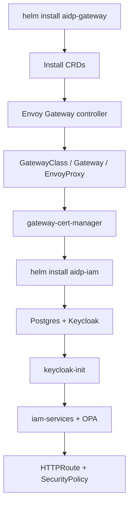
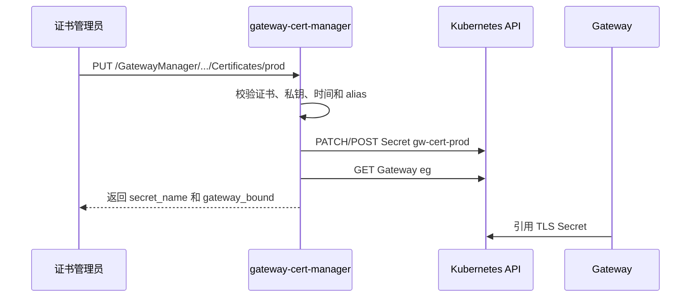

# 支持一键部署与证书管理、可观测性 Story 设计文档

## 2 Story概述

### 2.1 Story需求描述

#### 2.1.1 Story背景描述

1. 简要说明

本 Story 提供 IAM 与 Gateway 的一键部署、升级、卸载、离线打包、TLS 证书导入和基础可观测能力。当前项目通过 `aidp-gateway` Helm chart 安装 Envoy Gateway、GatewayClass、Gateway、EnvoyProxy、cleanup hook 和 gateway-cert-manager；通过 `aidp-iam` Helm chart 安装 Keycloak、PostgreSQL、OPA、pep-proxy、bundle-server、resource-sync、keycloak-proxy 和控制面路由。证书管理由 `gateway-cert-manager` 提供 `/GatewayManager/Tenants/System/Certificates/{Alias}` 接口，将上传的 PEM/DER/PFX 证书转换为 Kubernetes TLS Secret。

2. Actor

部署管理员、证书管理员、SRE、发布工程师。

3. 前置条件

K8s 集群就绪；Helm、kubectl 可用；离线环境已导入所需镜像；若启用 TLS，Gateway listener 引用的 Secret 或证书管理接口可用。

4. 最小保证

安装失败不破坏已有集群资源；卸载可清理本项目创建的 Gateway 资源；证书格式错误不会写入无效 Secret；证书过期默认拒绝导入，除非显式确认。

5. 成功保证

通过 Helm install 完成 Gateway 和 IAM 部署；证书上传后生成 TLS Secret 并可被 Gateway listener 绑定；组件健康检查可用；日志可定位 keycloak-proxy、pep-proxy、bundle-server、resource-sync、OPA、Gateway 和证书管理问题；离线包包含 chart、镜像 tar 和 SHA256。

6. 触发事件

首次部署、版本升级、证书导入或轮换、HTTPS listener 开启、卸载清理、发布打包、线上问题排查。

7. 主成功场景

管理员执行 `helm install aidp-gateway` 安装 Gateway 基础设施，再执行 `helm install aidp-iam` 安装 IAM。证书管理员调用 `/GatewayManager/Tenants/System/Certificates/{Alias}` 上传证书、私钥和 CA，服务校验证书时间和私钥匹配后写入 `gw-cert-{alias}` TLS Secret，并返回 Gateway 绑定状态。SRE 通过 health endpoint、Pod 日志、OPA data endpoint 和 Gateway resource status 定位运行问题。

8. 扩展场景（包括异常场景）

- 约束：国密双证书字段当前不支持，标准 Gateway API TLS Secret 只支持单证书链。
- 规格：支持 PEM/DER 证书、PEM/DER 私钥、PKCS#12/PFX；alias 必须符合 DNS-1123。
- 升级：Helm upgrade 滚动更新，Keycloak/Postgres 数据通过 PVC 保留。
- 可靠性：cleanup pre-delete hook 在 controller 存活时删除 Gateway，降低 finalizer 残留概率。
- 性能：部署和证书管理为低频管理面操作，不在业务请求热路径。
- 安全：证书私钥只写入 Kubernetes Secret；过期证书需 `isConfirmed=true` 才允许导入。
- 韧性：卸载脚本可重复执行；离线包支持无公网环境。
- 可服务：组件 health、日志、K8s status、SHA256SUMS 支持定位和校验。
- 可测试：从零安装、证书导入、cleanup、重装和 test.sh 可自动或手工验证。

#### 2.1.2 关联AR信息详情

| AR编号 | AR标题 | 架构元素 | 所属SR编号 | 所属SR标题 | 所属SR详情 | 所属SR关联功能 |
| --- | --- | --- | --- | --- | --- | --- |
| NA | NA | Helm charts、Gateway API、Envoy Gateway、gateway-cert-manager、cleanup hook | SR-DEPLOY-CERT-OBS | 支持一键部署与证书管理、可观测性 | 一键部署、TLS 证书导入、离线包和基础可观测 | Helm、Certificates API、health/logs |

### 2.2 Story用户使用场景分析

#### 2.2.1 新增/变更的脚本

| 脚本名称 | 功能描述 | 入参 | 执行权限 |
| --- | --- | --- | --- |
| `da-cluster/scripts/setup.sh` | 从零构建并部署 Gateway 与 IAM | `--skip-build`、`--arch`、`KEYCLOAK_HOST` | 集群管理员 |
| `da-cluster/scripts/cleanup.sh` | 卸载 release 和清理 namespace | `CLUSTER_NAME` | 集群管理员 |
| release 打包命令 | 生成 chart 包、镜像包和 SHA256SUMS | `$Assets`、架构、版本号 | 发布工程师 |

### 2.3 升级兼容性

#### 2.3.1 升级设计编码军规

| 序号 | 军规 | 说明 | 例外 |
| --- | --- | --- | --- |
| 1 | 外部接口不能修改 | 证书接口路径稳定为 `/GatewayManager/Tenants/System/Certificates/{Alias}` | 无 |
| 2 | 持久化数据兼容 | Keycloak/Postgres PVC 不随 Helm upgrade 删除 | 无 |
| 3 | 老特性不能丢失 | NodePort、Gateway route、IAM route 保持 | 无 |
| 4 | 新特性默认不能打开 | TLS 默认 disabled，需显式配置 Secret | 无 |
| 5 | 产品规格不能下降 | amd64/arm64 离线包均保留 | 无 |
| 6 | Apollo 组件 | 不修改内核/OS/固件 | 无 |

#### 2.3.2 通用升级兼容性Checklist

| 序号 | 军规 | Check项简述 | 是否涉及 | 是否做了兼容性处理 | 备注说明 |
| --- | --- | --- | --- | --- | --- |
| 1 | Helm values | 参数继承 | 涉及 | 是 | upgrade 使用 values |
| 2 | 外部接口 | 证书 API | 涉及 | 是 | 路径和 multipart 字段稳定 |
| 3 | 持久化数据 | Keycloak/Postgres 数据 | 涉及 | 是 | StatefulSet/PVC |
| 4 | 清理 | Gateway finalizer | 涉及 | 是 | pre-delete cleanup job |
| 5 | 离线 | 镜像和 chart | 涉及 | 是 | tar 包 + SHA256 |

### 2.4 是否影响性能

部署、升级和证书导入均是管理面操作，不影响业务热路径。Gateway 和 IAM 组件副本数影响运行期吞吐，默认 Kind 场景可设为 1，生产环境应按可靠性要求提高副本数。

## 3 Story设计描述

### 3.1 Story设计

部署设计拆为 Gateway 基础设施和 IAM 应用两层。Gateway chart 负责 CRD、Envoy Gateway controller、GatewayClass、Gateway、EnvoyProxy、证书管理和卸载清理；IAM chart 负责认证、授权、策略和控制面路由。证书管理作为独立 Deployment 暴露 ClusterIP Service，内部通过 K8s API 写 Secret。

### 3.2 Story业务交互流程

#### 3.2.1 Helm 部署流程

#### 3.2.2 证书导入流程

### 3.3 运行设计

- `aidp-gateway` chart 默认安装 Envoy Gateway v1.7.2 和 Envoy v1.36.5。
- Gateway HTTP 默认 80，NodePort 默认 30080；TLS 默认关闭。
- `gateway-cert-manager` 支持 `cert`、`privateKey`、`caCert`、`password`、`isConfirmed` 等 multipart 字段。
- cleanup job 使用 `docker.io/alpine/kubectl:1.34.1` 在 Helm pre-delete 阶段删除 Gateway 相关资源。
- IAM chart 的 `routes.enabled` 控制 `/AccessManager`、`/acl/v1` 和 Keycloak public routes。
- 可观测能力以 health endpoint、component logs、OPA data、K8s status 为主，后续可扩展 OTel/Jaeger。

### 3.4 SFMEA分析

| 失效模式 | 影响 | 检测方式 | 缓解措施 |
| --- | --- | --- | --- |
| CRD 未安装 | Gateway/SecurityPolicy 创建失败 | Helm 输出、kubectl api-resources | CRD 放 chart `crds/` 目录 |
| GatewayClass finalizer 残留 | 重新安装冲突 | `kubectl get gatewayclass` | cleanup hook 先删 Gateway |
| 证书私钥不匹配 | HTTPS listener 不可用 | 证书接口 400 | 导入前校验证书与私钥 |
| 过期证书误导入 | TLS 风险 | 证书接口 400 | 需 `isConfirmed=true` 强制导入 |
| 离线镜像缺失 | Pod 拉取失败 | ImagePullBackOff | release assets 包含镜像 tar |

### 3.5 Onetrack设计

NA

### 3.6 可定位设计

1. 每个服务提供 health endpoint：pep-proxy `/health`、resource-sync `/health`、bundle-server `/health`、gateway-cert-manager `/healthz`。
2. supervisord 分别输出 keycloak-proxy、pep-proxy、bundle-server、resource-sync 日志。
3. Gateway 可通过 Gateway status、HTTPRoute Accepted、SecurityPolicy 状态定位。
4. 证书接口返回 fingerprint、not_before、not_after、secret_name、gateway_bound。
5. release assets 通过 SHA256SUMS 校验完整性。

### 3.7 风险分析

| 风险 | 等级 | 应对 |
| --- | --- | --- |
| 生产误用默认密码 | 高 | 发布说明要求安装后修改密码，支持密码策略 |
| TLS Secret 未绑定 Gateway | 中 | 证书接口返回 gateway_bound，部署文档要求检查 |
| cleanup 误删共享 namespace | 中 | namespace 白名单固定，生产卸载前确认 |
| 可观测不足 | 中 | 保留日志和 health，后续接 OTel/Jaeger |

## 4 Shard设计描述

### 4.1 Shard 1：Gateway Helm Chart

- 接口路径：`helm install aidp-gateway package-gateway/charts/aidp-gateway`
- 功能：安装 Gateway API CRD、Envoy Gateway controller、GatewayClass、Gateway、EnvoyProxy、证书管理和 cleanup hook。
- 入参：
  - `gateway.port`、`gateway.tls.enabled`、`gateway.tls.secretName`、`proxy.service.type`、`proxy.service.nodePort`、`proxy.replicas`。
- 返回值：
  - Helm release deployed；Gateway `Programmed=True`；Envoy Pod Ready。

### 4.2 Shard 2：IAM Helm Chart

- 接口路径：`helm install aidp-iam package-iam/charts/aidp-iam`
- 功能：安装 Keycloak、PostgreSQL、keycloak-init、iam-services、OPA、HTTPRoute、SecurityPolicy、ReferenceGrant。
- 入参：
  - `keycloak.keycloak.replicas`、`iam-app.replicas`、`routes.enabled`、`keycloak.keycloak.config.hostname`。
- 返回值：
  - Helm release deployed；Keycloak/Postgres/iam-services Ready；AccessManager routes 可访问。

### 4.3 Shard 3：证书导入接口

- 接口路径：`PUT /GatewayManager/Tenants/System/Certificates/{Alias}`
- 功能：校验证书材料并写入 Kubernetes TLS Secret。
- 入参：
  - path：`Alias`。
  - multipart：`cert`、`privateKey`、`caCert`、`password`、`isConfirmed`、`displayName`、`productName`。
- 返回值：
  - `alias`、`secret_name`、`secret_namespace`、`status`、`gateway_bound`、`not_before`、`not_after`、`fingerprint_sha256`。

### 4.4 Shard 4：卸载清理 Hook

- 接口路径：Helm hook `pre-delete`，模板 `package-gateway/charts/aidp-gateway/templates/cleanup-job.yaml`
- 功能：在 Envoy Gateway controller 还存在时删除 Gateway 资源，减少 finalizer 残留。
- 入参：
  - `cleanup.enabled`、`cleanup.timeoutSeconds`、`cleanup.image`。
- 返回值：
  - Gateway/GatewayClass/HTTPRoute 等资源清理完成或超时日志。

### 4.5 Shard 5：可观测和诊断接口

- 接口路径：`/health`、`/healthz`、`/v1/data/apps`、`/v1/data/path_rules`、K8s status/logs
- 功能：提供组件健康、策略数据和运行状态定位。
- 入参：
  - HTTP health 请求、kubectl logs/get/describe。
- 返回值：
  - 健康状态、OPA data、Pod/Gateway/HTTPRoute condition、组件日志。

### 4.6 Shard 6：离线发布资产

- 接口路径：`helm package`、`docker save`、`tar -czf`、`SHA256SUMS`
- 功能：生成 amd64/arm64 chart 和镜像离线包。
- 入参：
  - chart 目录、镜像 tag、目标 release assets 目录。
- 返回值：
  - `aidp-gateway-*.tgz`、`aidp-iam-*.tgz`、`*-images-amd64.tar.gz`、`*-images-arm64.tar.gz`、`SHA256SUMS`。

## 5 验收测试用例

| 用例编号 | 用例名称 | 预置条件 | 测试步骤 | 预期结果 |
| --- | --- | --- | --- | --- |
| DEPLOY-AT-001 | Gateway chart 安装 | K8s 可用 | 1. Helm install gateway。 2. 查询 CRD/GatewayClass/Gateway。 | 安装成功，Gateway Programmed。 |
| DEPLOY-AT-002 | IAM chart 安装 | Gateway Ready | 1. Helm install IAM。 2. 查询 Pod 和 routes。 | 核心 Pod Ready，公共路由可访问。 |
| DEPLOY-AT-003 | Helm upgrade | 已安装 release | 1. 修改副本或 values。 2. Helm upgrade。 | 滚动成功，服务不中断。 |
| DEPLOY-AT-004 | HTTPS Secret 预置 | TLS Secret 已存在 | 1. 启用 `gateway.tls.enabled`。 2. 查询 Gateway listener。 | HTTPS listener Programmed。 |
| DEPLOY-AT-005 | PEM 证书导入 | cert/key/ca 文件有效 | 1. PUT Certificates alias。 | 返回 Ready，Secret 存在。 |
| DEPLOY-AT-006 | PFX 证书导入 | PFX 文件有效 | 1. 仅上传 cert=PFX 和 password。 | 生成 TLS Secret。 |
| DEPLOY-AT-007 | 私钥不匹配拒绝 | cert/key 不匹配 | 1. PUT Certificates。 | 返回 400，不写入 Secret。 |
| DEPLOY-AT-008 | 过期证书拒绝 | cert 已过期 | 1. 不带 isConfirmed 导入。 | 返回 400。 |
| DEPLOY-AT-009 | 过期证书确认导入 | cert 已过期 | 1. 带 `isConfirmed=true` 导入。 | 成功写 Secret，并返回过期时间。 |
| DEPLOY-AT-010 | 国密字段拒绝 | 上传 encCert 等字段 | 1. PUT Certificates。 | 返回 400，说明不支持双证书。 |
| DEPLOY-AT-011 | cleanup hook | release 已安装 | 1. Helm uninstall gateway。 2. 查询 Gateway 资源。 | 资源清理完成。 |
| DEPLOY-AT-012 | 离线包 SHA | assets 已生成 | 1. 计算 SHA256。 2. 对比 SHA256SUMS。 | 全部匹配。 |
| DEPLOY-AT-013 | health 检查 | IAM Ready | 1. 访问各服务 health。 | 全部 200。 |
| DEPLOY-AT-014 | OPA 数据诊断 | bundle-server Ready | 1. 查询 OPA data。 | apps/path_rules 可读取。 |

## 6 开发自验证用例

### 6.1 开发自验证用例设计

开发自验证执行 `setup.sh`、证书接口 curl、`test.sh` 和 `cleanup.sh`。发布前补充离线包生成、SHA256 校验和 amd64/arm64 镜像包抽检。

### 6.2 开发自验证用例详情

| Depth | 用例_名称 | 用例_编号 | 用例_级别 | 用例_自动化类型 | 用例_测试活动 | 用例_适用版本 | 用例_当前部署形态 | 用例_支持部署形态 | 关联_需求资源_编号 | 用例_设计描述 | 用例_预置条件 | 用例_测试步骤 | 用例_预期结果 | 用例_备注 |
| --- | --- | --- | --- | --- | --- | --- | --- | --- | --- | --- | --- | --- | --- | --- |
| 1 | 一键安装 | DEPLOY-001 | L1 | 自动化 | 开发自验证 | v1.8+ | Kind | K8s | SR-DEPLOY-CERT-OBS | 验证 setup 完成安装 | Docker/Kind/Helm | 执行 setup.sh | release Ready | 部署 |
| 1 | 证书 PEM 导入 | DEPLOY-002 | L1 | 手工/自动化 | 开发自验证 | v1.8+ | K8s | K8s | SR-DEPLOY-CERT-OBS | 验证证书接口 | 有测试证书 | curl -F cert/privateKey/caCert | Secret Ready | 证书 |
| 1 | 证书异常拒绝 | DEPLOY-003 | L1 | 手工 | 开发自验证 | v1.8+ | K8s | K8s | SR-DEPLOY-CERT-OBS | 验证错误材料拒绝 | 错误 key | PUT Certificates | 400 | 证书 |
| 1 | cleanup | DEPLOY-004 | L1 | 手工/自动化 | 开发自验证 | v1.8+ | Kind | K8s | SR-DEPLOY-CERT-OBS | 验证卸载清理 | release installed | cleanup.sh | 无残留 | 清理 |
| 1 | health | DEPLOY-005 | L1 | 自动化 | 开发自验证 | v1.8+ | Kind | K8s | SR-DEPLOY-CERT-OBS | 验证服务健康 | IAM Ready | test.sh Section 1 | 全 200 | 可观测 |
| 1 | release assets | DEPLOY-006 | L1 | 手工 | 发布验证 | v1.8+ | 本地 | 本地 | SR-DEPLOY-CERT-OBS | 验证离线包 | 镜像已构建 | helm package/docker save/tar/SHA | 文件齐全 | 发布 |

## 7 文档评审会议纪要

NA
