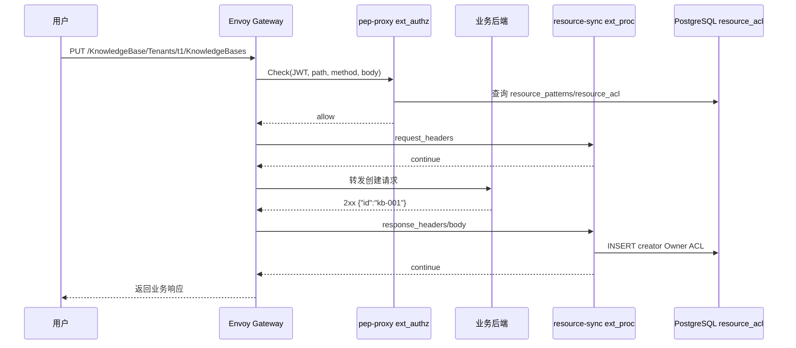
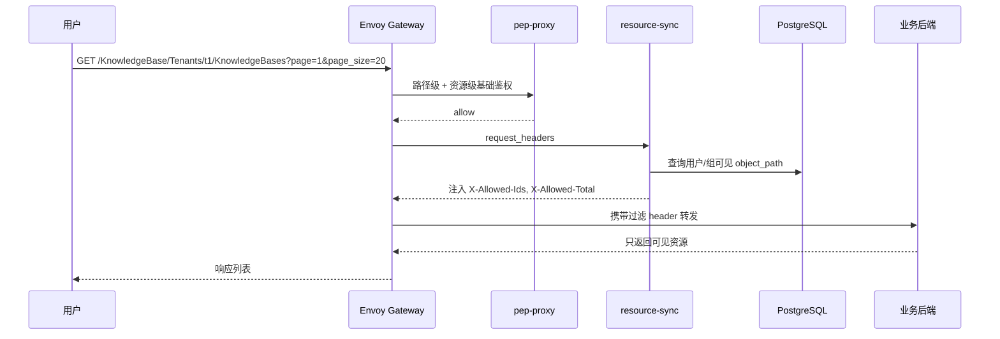
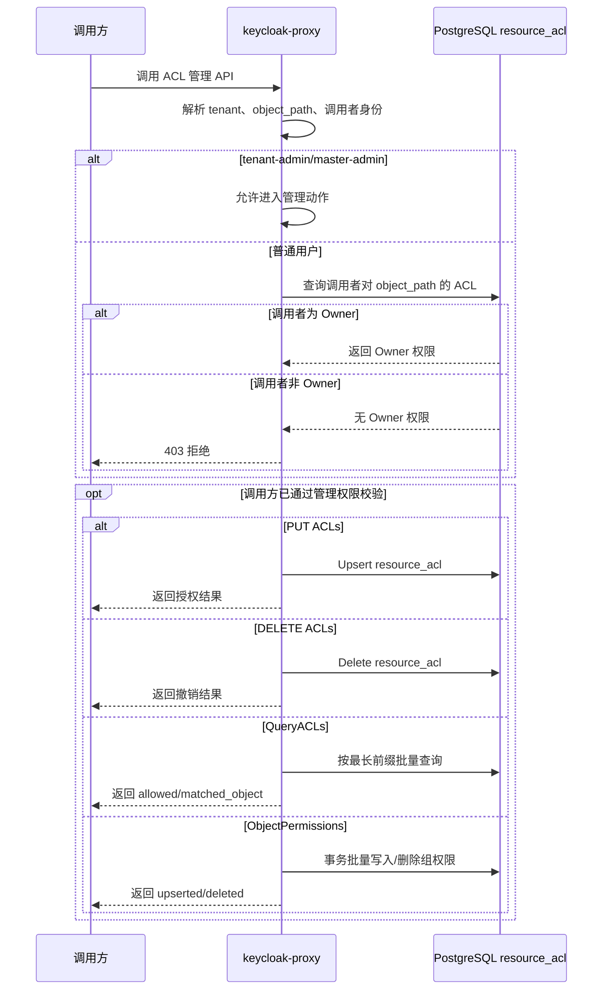

# 支持资源 ACL 自动同步与权限管理 Story 设计文档

## 2 Story概述

### 2.1 Story需求描述

#### 2.1.1 Story背景描述

1. 简要说明

本 Story 提供资源实例级 ACL 自动同步与权限管理能力。业务请求通过 Envoy Gateway 进入后，`resource-sync` 作为 Envoy `ext_proc` 外部处理器在请求和响应阶段参与处理：集合查询时注入 `X-Allowed-Ids` 与 `X-Allowed-Total`，资源创建成功后自动为创建者写入 Owner ACL，资源删除成功后按对象路径前缀级联清理 ACL。系统同时提供 `/AccessManager/Tenants/{tid}/ACLs`、`/Action/QueryACLs`、`/Groups/{group}/ObjectPermissions` 等管理接口，支持资源 owner、租户管理员进行授权、回收、查询和批量权限配置。

2. Actor

普通用户、资源 owner、租户管理员、业务后端服务、Envoy Gateway、resource-sync、pep-proxy。

3. 前置条件

K8s 集群、Envoy Gateway、IAM、PostgreSQL、OPA、pep-proxy、resource-sync 已部署；业务 HTTPRoute 已绑定 `SecurityPolicy` 和 `EnvoyExtensionPolicy`；业务 URL 遵循统一格式 `/<Namespace>/Tenants/<TenantID>/<Type>/<ID>`；应用资源模型已通过 Manifest 或 App 注册接口写入 `resource_patterns`。

4. 最小保证

ACL 同步失败不阻断业务响应；失败写入进入 `pending_acl` 重试队列；未授权请求不能绕过 pep-proxy 直接到达受保护业务接口；跨租户 ACL 写入被拒绝。

5. 成功保证

资源创建成功后创建者获得 Owner；资源删除成功后该资源及子资源 ACL 被清理；owner 可分享、修改、撤销权限；租户管理员可批量配置组级资源权限；资源级鉴权按最长前缀继承规则生效；集合查询只返回调用方可见资源 ID。

6. 触发事件

用户创建资源、删除资源、查询资源列表、访问资源实例；owner 分享或撤销权限；管理员批量配置组权限；`pending_acl` 后台任务到期重试。

7. 主成功场景

用户创建资源，后端返回 2xx 和资源 ID，resource-sync 在响应阶段提取 ID 并写入 `(tenant_id, user_path, object_path, role_path=Owner)`；后续访问该资源时 pep-proxy 查询 `resource_acl` 放行；owner 调用 ACL API 将 Viewer/Contributor/Owner 权限分享给其他用户或组；集合查询由 ext_proc 注入允许访问的 ID 列表，业务后端按 header 过滤返回。

8. 扩展场景（包括异常场景）

- 约束：业务 URL 需符合统一路径规范；创建接口需能从响应体提取资源 ID，或在 `resource_patterns.response_id_field` 中声明。
- 规格：同一租户内，资源 owner 或管理员可对用户/组授予资源权限；跨租户资源不能被授权、查询或访问。
- 升级：平台升级后，已有资源分享关系、资源访问结果和列表可见性保持不变，未接入 ACL 的业务不需要改造。
- 可靠性：资源创建或删除成功后，即使权限同步短暂失败，业务响应不回滚；系统应在恢复后补偿同步，并可通过查询接口看到最终权限状态。
- 性能：ACL 查询按 `tenant_id + object_path/user_path` 建索引；列表查询分页，单页上限 500。
- 安全：pep-proxy 资源级鉴权默认拒绝无 ACL 访问；跨租户对象路径拒绝；只有 owner 或管理员可授权/撤销。
- 韧性：PostgreSQL 短暂不可用时 ACL 同步延迟，恢复后后台重试修复。
- 可服务：关键日志包含 method、path、tenant、user、object_path、pending_acl id。
- 可测试：`da-cluster/scripts/test.sh` 覆盖 ACL CRUD、继承、跨租户拒绝、X-Allowed-Ids 注入；mock-kb 测试覆盖资源生命周期和分享。

#### 2.1.2 关联AR信息详情

| AR编号 | AR标题 | 架构元素 | 所属SR编号 | 所属SR标题 | 所属SR详情 | 所属SR关联功能 |
| --- | --- | --- | --- | --- | --- | --- |
| NA | NA | Envoy Gateway、pep-proxy、resource-sync、PostgreSQL | SR-ACL-SYNC | 支持资源 ACL 自动同步与权限管理 | 资源创建/删除自动同步 ACL，提供 ACL 管理 API 和权限查询能力 | ext_proc、resource_acl、pending_acl、ACL API |

### 2.2 Story用户使用场景分析

#### 2.2.1 新增/变更的脚本

| 脚本名称 | 功能描述 | 入参 | 执行权限 |
| --- | --- | --- | --- |
| `da-cluster/scripts/test.sh` | 端到端验证 ACL API、资源级鉴权、X-Allowed-Ids 注入、跨租户拒绝 | `REALM`、`GATEWAY_PORT`、用户密码等环境变量 | 本地开发/CI，需可访问 kubectl 与 Gateway |
| `mocks/package-mock-kb/test/test.sh` | 业务样例 KB 全生命周期验证，包含自动 owner ACL、分享、修改、撤销、级联清理 | `GATEWAY`、`NAMESPACE`、`POD_LABEL` | 本地开发/CI，需 mock-kb 已安装 |
| `da-cluster/scripts/setup.sh` | 部署 Gateway/IAM，启动 resource-sync 和 pep-proxy | `--skip-build` 等 | 集群管理员 |
| `da-cluster/scripts/cleanup.sh` | 清理 IAM/Gateway/mock-kb 相关资源 | `CLUSTER_NAME` | 集群管理员 |

### 2.3 升级兼容性

#### 2.3.1 升级设计编码军规

| 序号 | 军规 | 说明 | 例外 |
| --- | --- | --- | --- |
| 1 | 节点间、组件间、设备间消息接口设计要前后兼容 | ext_authz/ext_proc 使用 Envoy 标准 gRPC 协议，未修改协议结构 | 无 |
| 2 | 持久化数据要前后兼容 | `resource_acl`、`pending_acl` 建表幂等；新增字段通过兼容 DDL | 无 |
| 3 | 升级后老特性不能丢失 | 路径级鉴权仍由 OPA/permission_groups 负责，资源级 ACL 为增强能力 | 无 |
| 4 | 升级后产品对外限制不能变严 | 未改变已有公共 OIDC、AccessManager 基础接口；受保护业务需按统一 URL 接入 | 无 |
| 5 | 升级后License控制不能变严 | 不涉及 License 控制 | 无 |
| 6 | 升级后商用参数必须继承 | Helm values 保持默认兼容；resource-sync 服务名和端口保持稳定 | 无 |
| 7 | 升级后外部接口不能修改 | 新增 `/AccessManager/Tenants/{tid}/ACLs`，不删除已有 IAM 路由 | 无 |
| 8 | 升级后产品规格不能下降 | ACL 查询分页并有索引，未降低已有业务规格 | 无 |
| 9 | 升级后模块对外限制不能变严 | 业务只需按 header 读取 `X-Allowed-Ids`，单资源访问仍由 pep-proxy 判定 | 无 |
| 10 | 升级后新特性默认不能打开 | 仅对绑定了 SecurityPolicy/EnvoyExtensionPolicy 的路由生效 | 无 |
| 11 | 禁止修改Apollo版本中的组件 | 不涉及内核、OS、固件 | 无 |
| 12 | 用户态组件需要兼容不同Apollo版本 | 用户态 Python 服务部署在容器内，不依赖 Apollo 内核接口 | 无 |

#### 2.3.2 通用升级兼容性Checklist

| 序号 | 军规 | Check项简述 | 是否涉及 | 是否做了兼容性处理 | 备注说明 |
| --- | --- | --- | --- | --- | --- |
| 1 | 持久化数据要前后兼容 | 修改/删除 DB 表字段 | 涉及 | 是 | 仅新增表或幂等新增字段，不删除字段 |
| 2 | 持久化数据要前后兼容 | DB 大小和预留资源变化 | 涉及 | 是 | ACL 表按索引和分页控制查询成本 |
| 3 | 节点间消息兼容 | 修改通信结构体或操作码 | 不涉及 | NA | 使用标准 Envoy gRPC |
| 4 | 升级后外部接口不能修改 | REST 接口变化 | 涉及 | 是 | 新增接口，不强删既有接口 |
| 5 | 升级后新特性默认不能打开 | 新能力默认影响老业务 | 涉及 | 是 | 只有绑定策略的 HTTPRoute 进入 ACL 链路 |
| 6 | 禁止修改 Apollo 组件 | 内核/OS/固件变更 | 不涉及 | NA | 容器用户态变更 |
| 7 | 安全兼容 | 客户端伪造内部头 | 涉及 | 是 | 设计要求 Gateway 清理 `X-Auth-*`、`X-Allowed-Ids` 客户端输入 |
| 8 | 回退兼容 | 升级失败回退 | 涉及 | 是 | DDL 幂等，未删除数据；回退后未使用的新表可保留 |

### 2.4 是否影响性能

资源级鉴权在单资源访问热路径中增加一次 `resource_acl` 查询；集合查询增加一次反向 ACL 查询并注入 header。当前设计通过连接池、索引、分页上限和最长前缀查询控制开销。resource-sync ext_proc 失败时 failOpen，不阻断业务响应；pep-proxy 资源级鉴权查询失败按当前实现记录错误后资源级检查失败保护，路径级鉴权仍由 OPA 先执行。

## 3 Story设计描述

### 3.1 Story设计

本 Story 由四部分组成：

1. 数据模型：`resource_acl` 存储三元组 `(tenant_id, user_path, object_path, role_path)`，支持用户和组作为授权主体；`pending_acl` 存储失败的写入或级联删除任务。
2. 自动同步：`resource-sync` 通过 Envoy `ext_proc` 在请求阶段识别集合查询并注入可见资源 ID，在响应阶段识别创建/删除成功并写入或清理 ACL。
3. 鉴权执行：`pep-proxy` 在 ext_authz 中先做 JWT/API Key 身份认证和 OPA 路径级鉴权，再按统一 URL 查询 `resource_acl` 做资源级鉴权。
4. 管理 API：`keycloak-proxy` 提供 ACL CRUD、批量 QueryACLs、AppObjects、组级 ObjectPermissions，供页面和管理员使用。

### 3.2 Story业务交互流程

#### 3.2.1 资源创建自动写入 ACL

#### 3.2.2 集合查询过滤流程

#### 3.2.3 ACL 管理时序图

### 3.3 运行设计

- `resource-sync` 在 `iam-services` Pod 的 `aidp-iam-app` 容器中运行，HTTP 管理端口为 8080，ext_proc gRPC 端口为 8082。
- `pending_acl` 后台重试任务随 resource-sync 启动，按固定周期扫描 `next_retry <= now` 且未超过最大重试次数的任务。
- ACL 写入采用 `ON CONFLICT` 保证幂等；删除按 `object_path = prefix OR object_path LIKE prefix/%` 级联。
- `resource_acl` 查询采用最长前缀匹配，支持父资源权限继承到子资源。
- 业务路由需绑定 `EnvoyExtensionPolicy`，并将 `failOpen` 设为 `true`，确保 resource-sync 故障不导致业务响应失败。

### 3.4 SFMEA分析

| 子功能 | 子功能输入 | 大类 | 小类 | 故障模式 | 说明 | 是否涉及 | 可能的故障原因 | 已有容错规避措施 | 故障影响（对功能） | 严酷度（影响程度） | 故障恢复步骤和恢复时间 | 故障注入方法 |
| --- | --- | --- | --- | --- | --- | --- | --- | --- | --- | --- | --- | --- |
| ACL 授权更新 | tenant、user_path、object_path、role_path | 管理服务 | 写入失败 | ACL 授权写入失败 | owner 或管理员调用授权接口后权限未保存 | 是 | PostgreSQL 不可用、跨租户 object_path、调用者不是 owner 或管理员、请求体字段错误 | 参数校验；跨租户拒绝；owner/管理员鉴权；写入使用幂等 upsert | 资源无法分享或角色无法调整 | 高 | 1.检查 API 返回错误和 keycloak-proxy 日志 2.修正请求体或调用者权限 3.恢复 DB 后重试授权 4.恢复时间 2min | 使用非 owner 用户 PUT ACL 或停止 PostgreSQL 后授权 |
| ACL 查询 | object_path 或 user_path | 管理服务 | 查询错误 | ACL 查询无结果或结果不准确 | 页面或管理端查询指定对象授权时返回空或遗漏记录 | 是 | 查询条件错误、tenant 不匹配、索引缺失导致超时、DB 数据未写入 | 查询接口要求 object 或 user 二选一；返回 count 便于校验 | 管理员无法确认真实授权状态，影响排障和权限变更 | 中 | 1.确认 tenant 和 object_path/user_path 2.直接查询 DB 核对 3.修复数据或索引后重试 4.恢复时间 3min | 查询不存在的 object_path 或构造大量 ACL 后查询 |
| 资源创建自动 Owner | 创建请求、响应体资源 ID | 同步服务 | 自动同步失败 | 创建资源后未写入 creator Owner ACL | 业务创建返回 2xx，但创建者没有资源 owner 权限 | 是 | 业务响应未返回 ID、`response_id_field` 配置错误、resource-sync 不可用、DB 写入失败 | ext_proc `failOpen=true` 不阻断业务响应；失败任务写入 `pending_acl`；Manifest 可声明 `response_id_field` | 创建者后续无法管理或访问自己创建的资源 | 高 | 1.查看 resource-sync 日志和 `pending_acl` 2.补充 `response_id_field` 或修正业务响应 3.恢复 DB 后等待重试 4.恢复时间 5min | 让 mock 业务创建响应不返回 `id` 或停止 resource-sync |
| 集合查询过滤 | collection path、tenant、user、groups | 同步服务 | Header 注入失败 | `X-Allowed-Ids` 缺失或内容错误 | 集合查询未携带正确可见资源 ID 列表 | 是 | EnvoyExtensionPolicy 未绑定、resource-sync 不可用、ACL 反向查询失败、客户端伪造内部 header 未清理 | 业务路由模板绑定 ext_proc；Gateway 设计要求清理客户端 `X-Auth-*` 和 `X-Allowed-Ids`；resource-sync 失败时 failOpen | 列表结果可能为空、缺数据或包含不应可见资源 | 极高 | 1.检查 EnvoyExtensionPolicy targetRef 2.查看 resource-sync 日志 3.核对 ACL 查询结果 4.恢复时间 5min | 删除 EnvoyExtensionPolicy 或从客户端注入伪造 `X-Allowed-Ids` |
| 资源级鉴权 | request_path、method、token 或 API Key | 鉴权服务 | 鉴权误拒或误放 | resource_acl 判断结果异常 | 单资源访问的放行结果与实际 ACL 不一致 | 是 | URL 解析错误、最长前缀匹配逻辑错误、角色矩阵配置错误、DB 查询失败 | pep-proxy 先执行身份认证和 OPA 路径级鉴权；拒绝响应带 `rule=resource_acl/path_rule/authentication` 分类 | 合法用户无法访问或未授权用户越权访问资源 | 极高 | 1.查看 pep-proxy 拒绝分类 2.调用 QueryACLs 核对匹配对象 3.修复角色矩阵或 ACL 数据 4.恢复时间 5min | 给 Viewer 执行 DELETE 或删除目标 ACL 后访问资源 |
| ACL 级联删除 | 删除响应、object_path | 同步服务 | 残留权限 | 删除资源后 ACL 未级联清理 | 资源删除成功后，原对象或子对象 ACL 仍存在 | 是 | 删除响应未被识别、object_path 前缀计算错误、DB 删除失败、pending worker 未运行 | 删除失败写入 `pending_acl`；后台重试 `delete_prefix`；可通过 ACL 查询巡检 | 若资源 ID 后续复用，可能继承旧权限，影响安全 | 高 | 1.查询对象 ACL 残留 2.查看 `pending_acl` 和 retry worker 日志 3.手工触发重试或删除残留 4.恢复时间 5min | 停止 DB 后删除资源，再恢复 DB 观察 pending 重试 |

### 3.5 Onetrack设计

NA

### 3.6 可定位设计

可定位设计的目的是把“资源创建后没有权限、列表过滤不正确、访问被拒绝、删除后权限残留”拆成可观察的检查点。每个值用于确认问题发生在同步、补偿、鉴权还是管理查询边界。

| 定位项 | 查看方式 | 为什么要查看这个值 | 异常指向 |
| --- | --- | --- | --- |
| resource-sync 请求上下文 | 查看 resource-sync 日志中的 method、path、tenant、user、collection、object_path、写入/删除结果 | 确认系统是否识别到本次业务请求和目标资源；自动写入、级联删除或列表注入失败时先看这里。 | URL 规范不匹配、资源 ID 未提取到、同步逻辑未触发或写入失败。 |
| 补偿任务状态 | 查看 `pending_acl` 的失败动作、错误信息、重试次数、下次重试时间 | 确认失败同步是否进入补偿队列，以及是否仍在重试；资源权限最终一致性问题需要看这个值。 | 数据库短暂不可用、级联删除失败、重试耗尽或后台任务未运行。 |
| 拒绝规则分类 | 查看 pep-proxy 拒绝响应中的 `rule=resource_acl/path_rule/authentication` | 区分失败是身份认证、路径级鉴权还是资源级 ACL；相同 403 的处理路径不同。 | `authentication` 指向 token/API Key；`path_rule` 指向 OPA 路径规则；`resource_acl` 指向资源授权。 |
| 对象当前授权 | 调用 `GET /AccessManager/Tenants/{tid}/ACLs?object=...` | 确认指定资源最终对哪些用户/组授权；用于验证 owner 自动写入、分享、撤销和级联清理结果。 | ACL 未写入、授权对象错误、撤销未生效或跨租户对象被拒绝。 |

### 3.7 风险分析

| 风险 | 等级 | 应对 |
| --- | --- | --- |
| 业务接口不按统一 URL 或不返回资源 ID | 中 | 接入前使用 manifest 和 mock-kb 模板评审；测试覆盖创建、删除、列表 |
| 列表接口未按 `X-Allowed-Ids` 过滤 | 高 | 业务接入规范明确要求；验收必须验证不可见资源不返回 |
| ACL 查询压力过大 | 中 | 加索引、分页、限制页大小，必要时引入缓存和失效通知 |
| 资源级检查异常 fail-open 造成越权 | 中 | 当前路径级 OPA 先执行；后续可将资源级 DB 异常策略调整为可配置 |

## 4 Shard设计描述

接口描述统一汇总如下，后续小节保留每个接口的详细入参、返回值和失败行为。

| Shard | 接口/入口 | 提供方 | 使用方 | 黑盒能力 | 成功可见结果 |
| --- | --- | --- | --- | --- | --- |
| Shard 1 ACL 授权/更新 | `PUT /AccessManager/Tenants/{tid}/ACLs` | `keycloak-proxy` | owner/租户管理员 | 为用户或组授予指定资源角色权限。 | 返回 ok，后续该主体按角色访问资源。 |
| Shard 1 ACL 查询 | `GET /AccessManager/Tenants/{tid}/ACLs?object=...` 或 `?user=...` | `keycloak-proxy` | owner/管理员/页面 | 按对象或授权主体查询 ACL。 | 返回 ACL 列表和 count。 |
| Shard 1 ACL 撤销 | `DELETE /AccessManager/Tenants/{tid}/ACLs` | `keycloak-proxy` | owner/租户管理员 | 撤销某主体对某资源的权限。 | 返回 deleted，后续访问按撤销后权限判断。 |
| Shard 1 批量查询 ACL | `POST /AccessManager/Tenants/{tid}/Action/QueryACLs` | `keycloak-proxy` | 页面/业务管理端 | 批量判断对象权限和继承命中结果。 | 每个查询项返回 allowed、matched_object 和 role_path。 |
| Shard 1 应用资源对象模型 | `GET /AccessManager/Tenants/{tid}/AppObjects` | `keycloak-proxy` | 权限管理页面 | 展示已启用应用的资源对象和操作列表。 | 返回 apps/objects 结构。 |
| Shard 1 组对象权限 | `PUT /AccessManager/Tenants/{tid}/Groups/{group_name}/ObjectPermissions` | `keycloak-proxy` | 租户管理员 | 批量设置或清空组级资源权限。 | 返回 upserted/deleted 数量。 |
| Shard 2 ext_proc 自动同步 | `envoy.service.ext_proc.v3.ExternalProcessor/Process` | `resource-sync` | Envoy Gateway | 在请求/响应阶段完成列表过滤辅助和资源生命周期 ACL 同步。 | 请求继续转发；必要时注入 `X-Allowed-Ids` 或写入 ACL。 |
| Shard 2 pending_acl 重试 | 内部后台任务 | `resource-sync` | 平台运行时 | 补偿失败的 ACL 写入和级联删除。 | 成功后删除 pending 记录，失败时更新重试信息。 |
| Shard 3 ext_authz Check | `envoy.service.auth.v3.Authorization/Check` | `pep-proxy` | Envoy Gateway | 执行身份认证、路径级鉴权和资源级鉴权。 | 允许时注入 `x-auth-*`；拒绝时返回分类错误。 |
| Shard 3 资源级权限检查 | `check_resource_auth(request_path, method, tenant_id, user_path, groups)` | `pep-proxy` | ext_authz 内部流程 | 按统一 URL 和角色矩阵判断资源访问权限。 | 成功返回空拒绝原因；失败返回可定位原因。 |

### 4.1 Shard 1：ACL 管理接口

该 Shard 由 `keycloak-proxy` 提供，对外暴露资源 ACL 的增删改查能力。

#### 4.1.1 授权/更新 ACL

- 接口路径：`PUT /AccessManager/Tenants/{tid}/ACLs`
- 功能：为用户或组授予指定对象的角色权限；已有记录时更新 `role_path`。
- 入参：
  - 路径参数：`tid`，租户 ID。
  - Header：`Authorization: Bearer <token>`；内部鉴权后注入 `x-auth-user-id`、`x-auth-groups`。
  - Body：`user_path`、`object_path`、`role_path`。
- 返回值：
  - 成功：`{"status":"ok","user_path":"...","object_path":"...","role_path":"..."}`
  - 失败：`400` 跨租户对象路径；`403` 非 owner/管理员；`401` 未认证。

#### 4.1.2 查询 ACL

- 接口路径：`GET /AccessManager/Tenants/{tid}/ACLs?object={object_path}` 或 `GET /AccessManager/Tenants/{tid}/ACLs?user={user_path}`
- 功能：按资源对象或授权主体查询 ACL 列表。
- 入参：
  - 路径参数：`tid`。
  - Query：`object` 或 `user` 二选一。
- 返回值：
  - 成功：`{"acls":[{"user_path":"...","object_path":"...","role_path":"...","created_at":"...","created_by":"..."}],"count":1}`
  - 失败：`400` 未提供查询条件；`401/403` 鉴权失败。

#### 4.1.3 撤销 ACL

- 接口路径：`DELETE /AccessManager/Tenants/{tid}/ACLs`
- 功能：删除某个用户/组对某个对象的权限。
- 入参：
  - 路径参数：`tid`。
  - Body：`user_path`、`object_path`。
- 返回值：
  - 成功：`{"status":"deleted","user_path":"...","object_path":"..."}`
  - 失败：`403` 非 owner/管理员；`404` ACL 不存在。

#### 4.1.4 批量查询 ACL

- 接口路径：`POST /AccessManager/Tenants/{tid}/Action/QueryACLs`
- 功能：按最长前缀匹配规则批量查询对象权限，用于页面批量判断资源可操作性。
- 入参：
  - 路径参数：`tid`。
  - Body：`{"queries":[{"user_path":"...","object_path":"..."}]}`
- 返回值：
  - 成功：数组，每项包含 `allowed`、`matched_object`、`role_path`、`user_path`、`object_path` 或拒绝原因。

#### 4.1.5 查询应用资源对象模型

- 接口路径：`GET /AccessManager/Tenants/{tid}/AppObjects`
- 功能：读取已启用应用的 Manifest，展开为权限页面可展示的资源对象和操作列表。
- 入参：
  - 路径参数：`tid`。
- 返回值：
  - 成功：`{"apps":[{"namespace":"...","display_name":"...","objects":[...]}]}`

#### 4.1.6 批量设置组对象权限

- 接口路径：`PUT /AccessManager/Tenants/{tid}/Groups/{group_name}/ObjectPermissions`
- 功能：为指定 Keycloak 组批量设置或清空资源对象权限，供租户管理员配置组级资源授权。
- 入参：
  - 路径参数：`tid`、`group_name`。
  - Body：`{"permissions":[{"object_path":"...","role_path":"AccessManager/Tenants/System/Roles/Viewer"}]}`；`role_path=null` 表示撤销。
- 返回值：
  - 成功：`{"status":"ok","group_path":"...","upserted":1,"deleted":0}`
  - 失败：`403` 非管理员；`400` 跨租户对象路径。

### 4.2 Shard 2：resource-sync 自动同步接口

该 Shard 是 Envoy `ext_proc` gRPC 服务，不由业务方直接调用，由业务 HTTPRoute 的 `EnvoyExtensionPolicy` 绑定。

#### 4.2.1 ext_proc 双向流处理

- 接口路径：`envoy.service.ext_proc.v3.ExternalProcessor/Process`
- 功能：
  - 请求阶段：集合查询时查询 `resource_acl`，注入 `X-Allowed-Ids`、`X-Allowed-Total`。
  - 响应阶段：资源创建 2xx 后提取 ID 并写入 creator Owner ACL；资源删除 2xx 后级联删除 ACL。
- 入参：
  - Envoy ext_proc `ProcessingRequest` 流，包含 request headers、response headers、response body。
  - 依赖内部 header：`x-auth-user-id`、`x-auth-tenant`、`x-auth-groups`。
- 返回值：
  - Envoy ext_proc `ProcessingResponse` 流；正常返回 `CONTINUE`，可附带 header mutation。
  - 写入失败时不阻断业务响应，失败任务写入 `pending_acl`。

#### 4.2.2 pending_acl 后台重试

- 接口路径：内部后台任务，无外部 HTTP 路径。
- 功能：定期扫描 `pending_acl`，重试 `write` 和 `delete_prefix`。
- 入参：
  - 数据表字段：`action`、`tenant_id`、`user_path`、`object_path`、`role_path`、`retry_count`、`next_retry`。
- 返回值：
  - 成功：删除 `pending_acl` 记录。
  - 失败：更新 `retry_count`、`last_error`、`next_retry`。

### 4.3 Shard 3：pep-proxy 资源级鉴权接口

该 Shard 在 Gateway ext_authz 阶段执行，不直接暴露给终端用户。

#### 4.3.1 ext_authz Check

- 接口路径：`envoy.service.auth.v3.Authorization/Check`
- 功能：完成身份认证、OPA 路径级鉴权和 resource_acl 资源级鉴权。
- 入参：
  - Envoy `CheckRequest`，包含 path、method、headers、可选 body。
  - Header：`Authorization: Bearer <JWT>` 或 `X-API-Key`。
- 返回值：
  - 成功：`OK`，并向上游注入 `x-auth-user-id`、`x-auth-tenant`、`x-auth-groups`。
  - 失败：`401/403/503`，错误中包含 `rule=authentication/path_rule/resource_acl/upstream_error`。

#### 4.3.2 资源级权限检查

- 接口路径：内部函数 `check_resource_auth(request_path, method, tenant_id, user_path, groups)`
- 功能：解析统一 URL，按 `resource_patterns` 判断是否需要资源级鉴权，查询 `resource_acl` 并按角色矩阵判断 method 是否允许。
- 入参：
  - `request_path`、`method`、`tenant_id`、`user_path`、`groups`。
- 返回值：
  - 成功：`None`。
  - 失败：拒绝原因字符串，如 `Cross-tenant access denied`、`No ACL entry for ...`。

## 5 验收测试用例

| 用例编号 | 用例名称 | 预置条件 | 测试步骤 | 预期结果 |
| --- | --- | --- | --- | --- |
| ACL-AT-001 | owner 自动写入 | mock-kb 或真实业务路由已绑定 ext_proc；用户 token 可用 | 1. 用户创建资源。 2. 等待 ext_proc 响应处理完成。 3. 查询 `resource_acl` 或调用 ACL 查询接口。 | 创建者对应 `user_path` 对资源实例 `object_path` 拥有 Owner。 |
| ACL-AT-002 | owner 授予 Viewer | 创建者已有 Owner；目标用户存在 | 1. owner 调用 `PUT /AccessManager/Tenants/{tid}/ACLs` 授予 Viewer。 2. 目标用户访问资源 GET。 3. 目标用户尝试 PUT/DELETE。 | GET 放行；写操作因权限不足被拒绝。 |
| ACL-AT-003 | owner 授予 Contributor | 创建者已有 Owner；目标用户存在 | 1. owner 将目标用户 `role_path` 更新为 Contributor。 2. 目标用户执行 GET/PUT/PATCH/POST。 3. 目标用户执行 DELETE。 | GET/PUT/PATCH/POST 放行；DELETE 拒绝。 |
| ACL-AT-004 | owner 授予 Owner | 创建者已有 Owner；目标用户存在 | 1. owner 将目标用户权限更新为 Owner。 2. 目标用户执行 DELETE 或继续分享权限。 | DELETE 放行；目标用户具备 owner 级管理能力。 |
| ACL-AT-005 | 非 owner 授权失败 | 目标用户仅 Viewer 或无 ACL | 1. 非 owner 调用 `PUT /ACLs` 给第三方授权。 | 返回 403，DB 不新增 ACL。 |
| ACL-AT-006 | 查询 object ACL | 已存在多条 ACL | 1. 调用 `GET /AccessManager/Tenants/{tid}/ACLs?object={object_path}`。 | 返回该 object 的 ACL 列表和 count。 |
| ACL-AT-007 | 查询 user ACL | 用户或组已被授权多个对象 | 1. 调用 `GET /AccessManager/Tenants/{tid}/ACLs?user={user_path}`。 | 返回该主体拥有权限的对象列表。 |
| ACL-AT-008 | 撤销 ACL | 已存在目标 ACL | 1. owner 调用 `DELETE /ACLs`。 2. 目标用户再次访问资源。 | ACL 删除成功；目标用户访问被拒绝。 |
| ACL-AT-009 | QueryACLs 前缀继承 | 父资源或资源类型级别存在 ACL | 1. 调用 `POST /Action/QueryACLs` 查询子资源 object_path。 | 返回 `allowed=true`，`matched_object` 为最长匹配父路径。 |
| ACL-AT-010 | 组级 ObjectPermissions | 管理员 token 可用；组存在 | 1. 调用 `PUT /Groups/{group}/ObjectPermissions` 写入 Viewer/Contributor。 2. 组内用户访问对应资源。 | 返回 upserted 数量；组内用户按角色矩阵被放行。 |
| ACL-AT-011 | 组级权限清空 | 已存在组级 ACL | 1. 调用 `PUT /Groups/{group}/ObjectPermissions`，指定 `role_path=null`。 | 返回 deleted 数量；组内用户不再继承该对象权限。 |
| ACL-AT-012 | 删除资源级联清理 | 资源及子资源存在多条 ACL | 1. 删除资源实例。 2. 等待 ext_proc 处理。 3. 查询 `resource_acl`。 | 对象路径及其子路径 ACL 被删除。 |
| ACL-AT-013 | 集合查询注入可见 ID | 用户只拥有部分资源 ACL | 1. 用户 GET collection。 2. 后端回显或日志检查 `X-Allowed-Ids`。 | Header 中只包含用户可见资源 ID，`X-Allowed-Total` 正确。 |
| ACL-AT-014 | 跨租户对象拒绝 | 用户 tenant=t1 | 1. 访问 t2 资源。 2. 调用 ACL API 写入 t2 object_path。 | 访问返回 403；写入返回 400 或 403。 |
| ACL-AT-015 | pending_acl 重试 | 模拟 ACL 写入失败或 DB 短暂不可用 | 1. 触发创建/删除资源。 2. 恢复 DB。 3. 等待 retry worker。 | `pending_acl` 记录最终处理成功并删除。 |

## 6 开发自验证用例

### 6.1 开发自验证用例设计

开发自验证分两层：第一层运行 `da-cluster/scripts/test.sh` 验证平台 ACL API、权限继承、跨租户拒绝和 X-Allowed-Ids；第二层安装 `mocks/package-mock-kb` 后运行 mock-kb 端到端测试，验证真实业务路由下的自动 owner ACL、分享、提升、撤销和级联删除。

### 6.2 开发自验证用例详情

| Depth | 用例_名称 | 用例_编号 | 用例_级别 | 用例_自动化类型 | 用例_测试活动 | 用例_适用版本 | 用例_当前部署形态 | 用例_支持部署形态 | 关联_需求资源_编号 | 用例_设计描述 | 用例_预置条件 | 用例_测试步骤 | 用例_预期结果 | 用例_备注 |
| --- | --- | --- | --- | --- | --- | --- | --- | --- | --- | --- | --- | --- | --- | --- |
| 1 | ACL 授权写入 | ACL-001 | L1 | 自动化 | 开发自验证 | v1.8+ | Kind | K8s | SR-ACL-SYNC | 验证 owner 或管理员可写入 ACL | IAM 已部署，管理员 token 可用 | 运行 `test.sh` ACL Section；或手工 PUT `/AccessManager/Tenants/{tid}/ACLs` | 返回 200/201，查询 DB 存在记录 | 平台接口 |
| 1 | ACL 查询 object | ACL-002 | L1 | 自动化 | 开发自验证 | v1.8+ | Kind | K8s | SR-ACL-SYNC | 验证 object 维度查询 | 已写入 ACL | GET `/ACLs?object=...` | 返回目标 user_path/role_path | 平台接口 |
| 1 | ACL 查询 user | ACL-003 | L1 | 自动化 | 开发自验证 | v1.8+ | Kind | K8s | SR-ACL-SYNC | 验证 user/group 维度查询 | 已写入 ACL | GET `/ACLs?user=...` | 返回对象列表 | 平台接口 |
| 1 | ACL 撤销 | ACL-004 | L1 | 自动化 | 开发自验证 | v1.8+ | Kind | K8s | SR-ACL-SYNC | 验证删除 ACL 后权限失效 | 已写入 ACL | DELETE `/ACLs` 后再次 QueryACLs | QueryACLs 返回 denied 或无 role | 平台接口 |
| 1 | ACL 前缀继承 | ACL-005 | L1 | 自动化 | 开发自验证 | v1.8+ | Kind | K8s | SR-ACL-SYNC | 父对象权限继承到子对象 | IAM 已部署 | QueryACLs 查询子资源 object_path | 返回父对象 `matched_object` 和角色 | 最长前缀匹配 |
| 1 | 跨租户拒绝 | ACL-006 | L1 | 自动化 | 开发自验证 | v1.8+ | Kind | K8s | SR-ACL-SYNC | 验证 t1 用户不能操作 t2 对象 | IAM 已部署 | 访问或授权 t2 object_path | 400/403 | 安全用例 |
| 1 | 组级权限批量设置 | ACL-007 | L1 | 自动化 | 开发自验证 | v1.8+ | Kind | K8s | SR-ACL-SYNC | 验证 ObjectPermissions 批量写入组 ACL | tenant-admin token 可用 | PUT `/Groups/{group}/ObjectPermissions` | 返回 upserted，组内用户继承权限 | 管理页面依赖 |
| 1 | 资源创建自动 owner | ACL-008 | L1 | 自动化 | 开发自验证 | v1.8+ | Kind | K8s | SR-ACL-SYNC | 验证 ext_proc 创建后写 creator Owner | mock-kb 已安装 | 用户创建 KB，查询 `resource_acl` | creator 为 Owner | 业务接入样例 |
| 1 | 资源删除级联清理 | ACL-009 | L1 | 自动化 | 开发自验证 | v1.8+ | Kind | K8s | SR-ACL-SYNC | 验证删除资源后 ACL 清理 | mock-kb 已安装且已有 ACL | 删除 KB，查询 ACL | 对象及子路径 ACL 清空 | ext_proc 响应阶段 |
| 1 | 列表查询注入 ID | ACL-010 | L1 | 自动化 | 开发自验证 | v1.8+ | Kind | K8s | SR-ACL-SYNC | 验证 `X-Allowed-Ids` 注入 | mock-kb route 可用 | GET collection 并检查回显/日志 | 只注入用户可见 ID | resource-sync 请求阶段 |

## 7 文档评审会议纪要

NA
