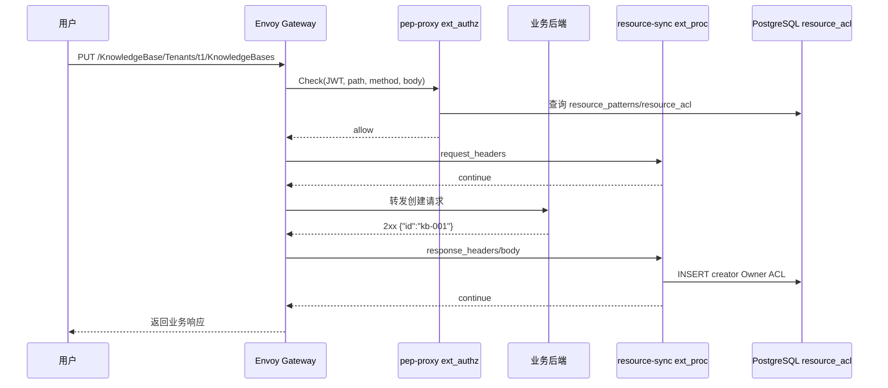
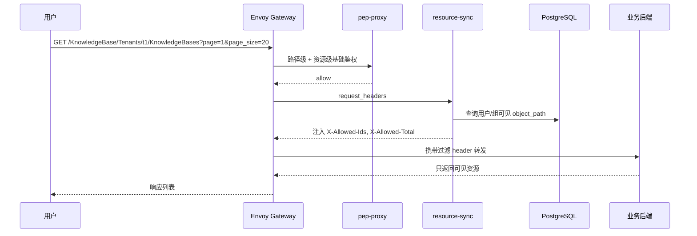
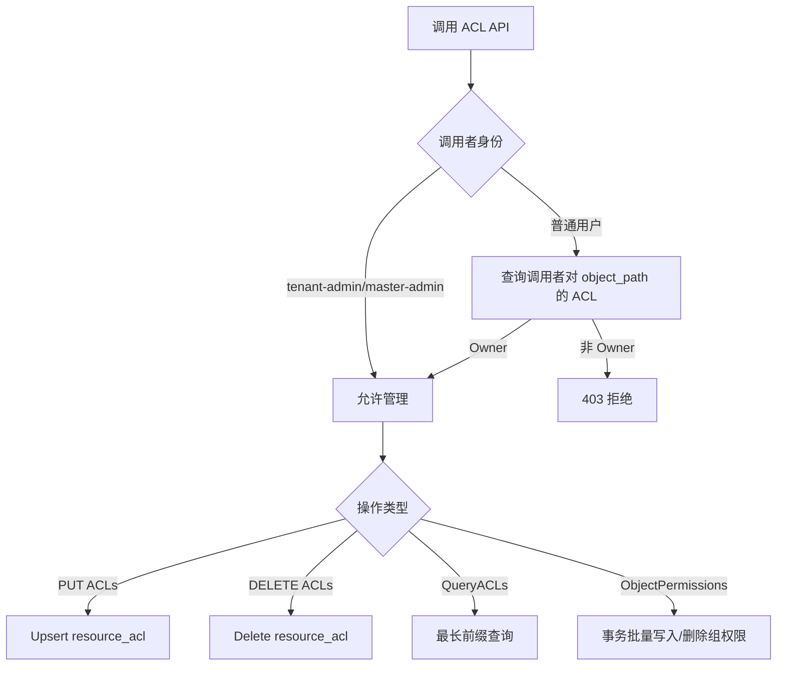

# 支持资源 ACL 自动同步与权限管理 Story 设计文档

## 2 Story概述

### 2.1 Story需求描述

#### 2.1.1 Story背景描述

1. 简要说明

本 Story 提供资源实例级 ACL 自动同步与权限管理能力。业务请求通过 Envoy Gateway 进入后，`resource-sync` 作为 Envoy `ext_proc` 外部处理器在请求和响应阶段参与处理：集合查询时注入 `X-Allowed-Ids` 与 `X-Allowed-Total`，资源创建成功后自动为创建者写入 Owner ACL，资源删除成功后按对象路径前缀级联清理 ACL。系统同时提供 `/AccessManager/Tenants/{tid}/ACLs`、`/Action/QueryACLs`、`/Groups/{group}/ObjectPermissions` 等管理接口，支持资源 owner、租户管理员进行授权、回收、查询和批量权限配置。

2. Actor

普通用户、资源 owner、租户管理员、业务后端服务、Envoy Gateway、resource-sync、pep-proxy。

3. 前置条件

K8s 集群、Envoy Gateway、IAM、PostgreSQL、OPA、pep-proxy、resource-sync 已部署；业务 HTTPRoute 已绑定 `SecurityPolicy` 和 `EnvoyExtensionPolicy`；业务 URL 遵循统一格式 `/<Namespace>/Tenants/<TenantID>/<Type>/<ID>`；应用资源模型已通过 Manifest 或 App 注册接口写入 `resource_patterns`。

4. 最小保证

ACL 同步失败不阻断业务响应；失败写入进入 `pending_acl` 重试队列；未授权请求不能绕过 pep-proxy 直接到达受保护业务接口；跨租户 ACL 写入被拒绝。

5. 成功保证

资源创建成功后创建者获得 Owner；资源删除成功后该资源及子资源 ACL 被清理；owner 可分享、修改、撤销权限；租户管理员可批量配置组级资源权限；资源级鉴权按最长前缀继承规则生效；集合查询只返回调用方可见资源 ID。

6. 触发事件

用户创建资源、删除资源、查询资源列表、访问资源实例；owner 分享或撤销权限；管理员批量配置组权限；`pending_acl` 后台任务到期重试。

7. 主成功场景

用户创建资源，后端返回 2xx 和资源 ID，resource-sync 在响应阶段提取 ID 并写入 `(tenant_id, user_path, object_path, role_path=Owner)`；后续访问该资源时 pep-proxy 查询 `resource_acl` 放行；owner 调用 ACL API 将 Viewer/Contributor/Owner 权限分享给其他用户或组；集合查询由 ext_proc 注入允许访问的 ID 列表，业务后端按 header 过滤返回。

8. 扩展场景（包括异常场景）

- 约束：业务 URL 需符合统一路径规范；创建接口需能从响应体提取资源 ID，或在 `resource_patterns.response_id_field` 中声明。
- 规格：ACL 使用租户级隔离，唯一键为 `(tenant_id, user_path, object_path)`。
- 升级：新增表和字段均使用 `CREATE TABLE IF NOT EXISTS` / `ALTER TABLE ADD COLUMN IF NOT EXISTS`。
- 可靠性：resource-sync ext_proc 配置 `failOpen=true`，业务可用性优先；失败同步进入 `pending_acl`。
- 性能：ACL 查询按 `tenant_id + object_path/user_path` 建索引；列表查询分页，单页上限 500。
- 安全：pep-proxy 资源级鉴权默认拒绝无 ACL 访问；跨租户对象路径拒绝；只有 owner 或管理员可授权/撤销。
- 韧性：PostgreSQL 短暂不可用时 ACL 同步延迟，恢复后后台重试修复。
- 可服务：关键日志包含 method、path、tenant、user、object_path、pending_acl id。
- 可测试：`da-cluster/scripts/test.sh` 覆盖 ACL CRUD、继承、跨租户拒绝、X-Allowed-Ids 注入；mock-kb 测试覆盖资源生命周期和分享。

#### 2.1.2 关联AR信息详情

| AR编号 | AR标题 | 架构元素 | 所属SR编号 | 所属SR标题 | 所属SR详情 | 所属SR关联功能 |
| --- | --- | --- | --- | --- | --- | --- |
| NA | NA | Envoy Gateway、pep-proxy、resource-sync、PostgreSQL | SR-ACL-SYNC | 支持资源 ACL 自动同步与权限管理 | 资源创建/删除自动同步 ACL，提供 ACL 管理 API 和权限查询能力 | ext_proc、resource_acl、pending_acl、ACL API |

### 2.2 Story用户使用场景分析

#### 2.2.1 新增/变更的脚本

| 脚本名称 | 功能描述 | 入参 | 执行权限 |
| --- | --- | --- | --- |
| `da-cluster/scripts/test.sh` | 端到端验证 ACL API、资源级鉴权、X-Allowed-Ids 注入、跨租户拒绝 | `REALM`、`GATEWAY_PORT`、用户密码等环境变量 | 本地开发/CI，需可访问 kubectl 与 Gateway |
| `mocks/package-mock-kb/test/test.sh` | 业务样例 KB 全生命周期验证，包含自动 owner ACL、分享、修改、撤销、级联清理 | `GATEWAY`、`NAMESPACE`、`POD_LABEL` | 本地开发/CI，需 mock-kb 已安装 |
| `da-cluster/scripts/setup.sh` | 部署 Gateway/IAM，启动 resource-sync 和 pep-proxy | `--skip-build` 等 | 集群管理员 |
| `da-cluster/scripts/cleanup.sh` | 清理 IAM/Gateway/mock-kb 相关资源 | `CLUSTER_NAME` | 集群管理员 |

### 2.3 升级兼容性

#### 2.3.1 升级设计编码军规

| 序号 | 军规 | 说明 | 例外 |
| --- | --- | --- | --- |
| 1 | 节点间、组件间、设备间消息接口设计要前后兼容 | ext_authz/ext_proc 使用 Envoy 标准 gRPC 协议，未修改协议结构 | 无 |
| 2 | 持久化数据要前后兼容 | `resource_acl`、`pending_acl` 建表幂等；新增字段通过兼容 DDL | 无 |
| 3 | 升级后老特性不能丢失 | 路径级鉴权仍由 OPA/permission_groups 负责，资源级 ACL 为增强能力 | 无 |
| 4 | 升级后产品对外限制不能变严 | 未改变已有公共 OIDC、AccessManager 基础接口；受保护业务需按统一 URL 接入 | 无 |
| 5 | 升级后License控制不能变严 | 不涉及 License 控制 | 无 |
| 6 | 升级后商用参数必须继承 | Helm values 保持默认兼容；resource-sync 服务名和端口保持稳定 | 无 |
| 7 | 升级后外部接口不能修改 | 新增 `/AccessManager/Tenants/{tid}/ACLs`，不删除已有 IAM 路由 | 无 |
| 8 | 升级后产品规格不能下降 | ACL 查询分页并有索引，未降低已有业务规格 | 无 |
| 9 | 升级后模块对外限制不能变严 | 业务只需按 header 读取 `X-Allowed-Ids`，单资源访问仍由 pep-proxy 判定 | 无 |
| 10 | 升级后新特性默认不能打开 | 仅对绑定了 SecurityPolicy/EnvoyExtensionPolicy 的路由生效 | 无 |
| 11 | 禁止修改Apollo版本中的组件 | 不涉及内核、OS、固件 | 无 |
| 12 | 用户态组件需要兼容不同Apollo版本 | 用户态 Python 服务部署在容器内，不依赖 Apollo 内核接口 | 无 |

#### 2.3.2 通用升级兼容性Checklist

| 序号 | 军规 | Check项简述 | 是否涉及 | 是否做了兼容性处理 | 备注说明 |
| --- | --- | --- | --- | --- | --- |
| 1 | 持久化数据要前后兼容 | 修改/删除 DB 表字段 | 涉及 | 是 | 仅新增表或幂等新增字段，不删除字段 |
| 2 | 持久化数据要前后兼容 | DB 大小和预留资源变化 | 涉及 | 是 | ACL 表按索引和分页控制查询成本 |
| 3 | 节点间消息兼容 | 修改通信结构体或操作码 | 不涉及 | NA | 使用标准 Envoy gRPC |
| 4 | 升级后外部接口不能修改 | REST 接口变化 | 涉及 | 是 | 新增接口，不强删既有接口 |
| 5 | 升级后新特性默认不能打开 | 新能力默认影响老业务 | 涉及 | 是 | 只有绑定策略的 HTTPRoute 进入 ACL 链路 |
| 6 | 禁止修改 Apollo 组件 | 内核/OS/固件变更 | 不涉及 | NA | 容器用户态变更 |
| 7 | 安全兼容 | 客户端伪造内部头 | 涉及 | 是 | 设计要求 Gateway 清理 `X-Auth-*`、`X-Allowed-Ids` 客户端输入 |
| 8 | 回退兼容 | 升级失败回退 | 涉及 | 是 | DDL 幂等，未删除数据；回退后未使用的新表可保留 |

### 2.4 是否影响性能

资源级鉴权在单资源访问热路径中增加一次 `resource_acl` 查询；集合查询增加一次反向 ACL 查询并注入 header。当前设计通过连接池、索引、分页上限和最长前缀查询控制开销。resource-sync ext_proc 失败时 failOpen，不阻断业务响应；pep-proxy 资源级鉴权查询失败按当前实现记录错误后资源级检查失败保护，路径级鉴权仍由 OPA 先执行。

## 3 Story设计描述

### 3.1 Story设计

本 Story 由四部分组成：

1. 数据模型：`resource_acl` 存储三元组 `(tenant_id, user_path, object_path, role_path)`，支持用户和组作为授权主体；`pending_acl` 存储失败的写入或级联删除任务。
2. 自动同步：`resource-sync` 通过 Envoy `ext_proc` 在请求阶段识别集合查询并注入可见资源 ID，在响应阶段识别创建/删除成功并写入或清理 ACL。
3. 鉴权执行：`pep-proxy` 在 ext_authz 中先做 JWT/API Key 身份认证和 OPA 路径级鉴权，再按统一 URL 查询 `resource_acl` 做资源级鉴权。
4. 管理 API：`keycloak-proxy` 提供 ACL CRUD、批量 QueryACLs、AppObjects、组级 ObjectPermissions，供页面和管理员使用。

### 3.2 Story业务交互流程

#### 3.2.1 资源创建自动写入 ACL

#### 3.2.2 集合查询过滤流程

#### 3.2.3 ACL 管理流程

### 3.3 运行设计

- `resource-sync` 在 `iam-services` Pod 的 `aidp-iam-app` 容器中运行，HTTP 管理端口为 8080，ext_proc gRPC 端口为 8082。
- `pending_acl` 后台重试任务随 resource-sync 启动，按固定周期扫描 `next_retry <= now` 且未超过最大重试次数的任务。
- ACL 写入采用 `ON CONFLICT` 保证幂等；删除按 `object_path = prefix OR object_path LIKE prefix/%` 级联。
- `resource_acl` 查询采用最长前缀匹配，支持父资源权限继承到子资源。
- 业务路由需绑定 `EnvoyExtensionPolicy`，并将 `failOpen` 设为 `true`，确保 resource-sync 故障不导致业务响应失败。

### 3.4 SFMEA分析

| 失效模式 | 影响 | 检测方式 | 缓解措施 |
| --- | --- | --- | --- |
| resource-sync 不可用 | ACL 自动同步延迟，列表 header 不注入 | Pod readiness、日志、测试缺少 `X-Allowed-Ids` | ext_proc failOpen，恢复后重试；业务列表缺 header 时返回空或降级 |
| PostgreSQL 短暂不可用 | ACL 查询/写入失败 | pep-proxy/resource-sync 错误日志 | pending_acl 重试；数据库恢复后自动补偿 |
| 业务创建响应无 ID | 无法自动写 owner ACL | resource-sync warning 日志 | 在 manifest/resource_patterns 中配置 `response_id_field`；业务接口返回 ID |
| 客户端伪造内部头 | 越权访问列表资源 | 安全测试 | Gateway 层清理客户端传入的 `X-Auth-*`、`X-Allowed-Ids` |
| ACL 级联删除失败 | 孤儿 ACL 残留 | pending_acl、DB 巡检 | 写入 `pending_acl`，后台重试删除 |

### 3.5 Onetrack设计

NA

### 3.6 可定位设计

1. resource-sync 日志打印 method、path、tenant、user、collection、object_path、写入/删除结果。
2. `pending_acl` 表记录失败动作、错误信息、重试次数和下次重试时间。
3. pep-proxy 拒绝响应带 `rule=resource_acl/path_rule/authentication`，便于定位是身份、路径还是资源权限问题。
4. 可通过 `GET /AccessManager/Tenants/{tid}/ACLs?object=...` 查询指定对象当前授权。

### 3.7 风险分析

| 风险 | 等级 | 应对 |
| --- | --- | --- |
| 业务接口不按统一 URL 或不返回资源 ID | 中 | 接入前使用 manifest 和 mock-kb 模板评审；测试覆盖创建、删除、列表 |
| 列表接口未按 `X-Allowed-Ids` 过滤 | 高 | 业务接入规范明确要求；验收必须验证不可见资源不返回 |
| ACL 查询压力过大 | 中 | 加索引、分页、限制页大小，必要时引入缓存和失效通知 |
| 资源级检查异常 fail-open 造成越权 | 中 | 当前路径级 OPA 先执行；后续可将资源级 DB 异常策略调整为可配置 |

## 4 Shard设计描述

NA。该 Story 不拆分 Shard，功能集中在 `resource-sync`、`pep-proxy`、`keycloak-proxy` 和 IAM PostgreSQL。

## 5 验收测试用例

| 用例 | 预置条件 | 步骤 | 预期结果 |
| --- | --- | --- | --- |
| 创建资源自动 owner ACL | mock-kb 或真实业务路由已绑定 ext_proc | 用户创建资源，查询 `resource_acl` | 创建者拥有 Owner |
| owner 分享 viewer | 创建者已有 Owner | 调用 `PUT /AccessManager/Tenants/{tid}/ACLs` | 目标用户拥有 Viewer，GET 放行，写操作拒绝 |
| 权限提升 contributor | 已存在 Viewer ACL | owner 更新 role_path 为 Contributor | 目标用户可 GET/PUT/PATCH/POST，不可 DELETE |
| 撤销权限 | 已分享权限 | 调用 DELETE ACL | 目标用户再次访问资源被拒绝 |
| 删除资源级联 ACL | 已有资源及多条 ACL | 删除资源成功 | 资源及子资源 ACL 被清理 |
| 集合查询过滤 | 用户仅有部分资源权限 | GET collection | 后端收到 `X-Allowed-Ids`，返回只包含可见资源 |
| 跨租户拒绝 | 用户 tenant=t1 | 访问或写入 t2 对象 | 403/400 |

## 6 开发自验证用例

### 6.1 开发自验证用例设计

使用 `da-cluster/scripts/test.sh` 验证平台级 ACL API 和权限继承；安装 `mocks/package-mock-kb` 后使用 mock-kb 测试业务资源完整生命周期。

### 6.2 开发自验证用例详情

| Depth | 用例_名称 | 用例_编号 | 用例_级别 | 用例_自动化类型 | 用例_测试活动 | 用例_适用版本 | 用例_当前部署形态 | 用例_支持部署形态 | 关联_需求资源_编号 | 用例_设计描述 | 用例_预置条件 | 用例_测试步骤 | 用例_预期结果 | 用例_备注 |
| --- | --- | --- | --- | --- | --- | --- | --- | --- | --- | --- | --- | --- | --- | --- |
| 1 | ACL CRUD 验证 | ACL-001 | L1 | 自动化 | 开发自验证 | v1.8+ | Kind | K8s | SR-ACL-SYNC | 验证 PUT/GET/DELETE ACL | IAM 已部署 | 跑 `da-cluster/scripts/test.sh` Section 7 | 全部 PASS | 基础平台验证 |
| 1 | ACL 继承验证 | ACL-002 | L1 | 自动化 | 开发自验证 | v1.8+ | Kind | K8s | SR-ACL-SYNC | 父对象权限继承到子对象 | IAM 已部署 | QueryACLs 查询子资源 | 返回父对象匹配角色 | 最长前缀匹配 |
| 1 | mock-kb 生命周期 | ACL-003 | L1 | 自动化 | 开发自验证 | v1.8+ | Kind | K8s | SR-ACL-SYNC | 创建、分享、提升、撤销、删除 | mock-kb 已安装 | 跑 `mocks/package-mock-kb/test/test.sh` | 全部 PASS | 业务接入样例 |

## 7 文档评审会议纪要

NA
