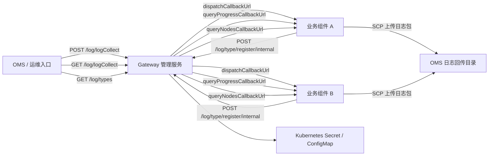
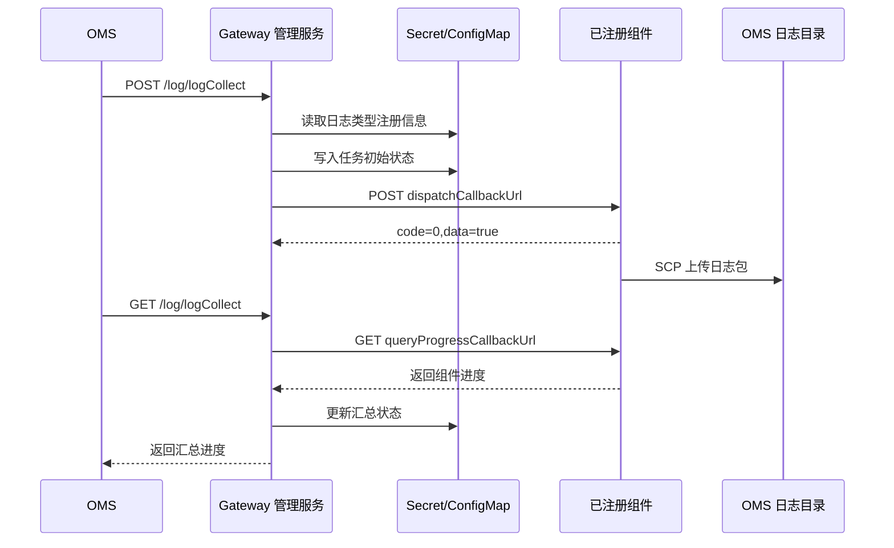

# OMS Log Collect API Design

本文档描述在 `aidp-gateway` 中增加 OMS 场景日志收集接口的设计方案。当前 Gateway 已有证书管理服务 `gateway-cert-manager`，日志收集接口建议作为同一个 Gateway 管理面的能力演进，后续可将镜像和服务重命名为 `gateway-manager`。

## 1. 设计目标

1. 对外提供 OMS 兼容的日志收集接口：
   - `POST /log/logCollect`
   - `GET /log/logCollect`
   - `GET /log/types`
   - `POST /log/type/register/internal`
2. 支持周边组件注册日志类型和回调地址。
3. 日志收集时统一调度已注册组件，由组件自行收集日志并回传到 OMS 指定目录。
4. Gateway 管理服务只负责调度、状态汇总、注册信息管理，不直接进入业务 Pod 收集日志。
5. 保持离线部署和 Helm 安装方式，不强依赖外部数据库。

## 2. 推荐组件形态

### 2.1 当前形态

当前 Gateway 包中已有：

```text
aidp-gateway
├── Envoy Gateway Controller
├── Envoy data plane
└── gateway-cert-manager
    ├── PUT /GatewayManager/Tenants/System/Certificates/{alias}
    └── writes Kubernetes Secret
```

### 2.2 演进形态

推荐把 `gateway-cert-manager` 演进为 Gateway 管理服务：

```text
aidp-gateway
├── Envoy Gateway Controller
├── Envoy data plane
└── gateway-manager
    ├── Certificate API
    ├── Log Collect API
    ├── Registration store
    └── Collect status store
```

初期可以继续复用当前镜像名和 Service 名，新增日志接口；等接口稳定后再重命名，避免一次性改动过大。

## 3. 总体架构



## 4. 需要新增的 Gateway 接口

### 4.1 日志收集

接口路径：`POST /log/logCollect`

功能：接收 OMS 日志收集请求，生成本次收集任务，按已注册日志类型筛选组件并下发回调。

入参：

```json
{
  "collectUser": "admin",
  "scene": "oms_scene",
  "startTime": "2024-01-01 10:00:00",
  "endTime": "2024-01-01 11:00:00",
  "nodeList": [
    {
      "name": "oms-node-1",
      "nodeIp": "192.168.1.100",
      "nodesType": "OMS",
      "status": "READY",
      "product": "OMS",
      "logInfo": ["OMS", "TOMCAT"]
    }
  ]
}
```

处理逻辑：

1. 校验时间格式、时间范围、节点列表。
2. 生成 `collectId`，保存当前任务基础状态。
3. 根据 `nodeList[].logInfo` 和已注册的 `logTypeVos[].logType` 匹配组件。
4. 调用匹配组件的 `dispatchCallbackUrl`。
5. dispatch 成功后将组件状态置为 `COLLECTING`。
6. dispatch 失败不阻塞其他组件，整体状态置为 `PART_FAILED` 或 `FAILED`。

返回值：

```json
{
  "code": 0,
  "data": "log collect success",
  "message": "成功"
}
```

### 4.2 查询日志状态

接口路径：`GET /log/logCollect`

功能：查询当前日志收集任务进度，汇总 Gateway 管理服务本地状态和各组件回调状态。

入参：

```text
collectId: 可选。为空时返回最近一次任务。
```

处理逻辑：

1. 读取当前任务状态。
2. 遍历任务关联组件，调用 `queryProgressCallbackUrl`。
3. 汇总各组件 `progress` 和 `collectState`。
4. 计算总进度和总状态。

返回值：

```json
{
  "code": 0,
  "data": {
    "basicInfo": {
      "collectStatus": "COLLECTING",
      "startTime": "2024-01-01 10:00:00",
      "endTime": "2024-01-01 11:00:00",
      "progress": 50
    },
    "nodeInfos": [
      {
        "name": "component-node-1",
        "nodeIp": "192.168.1.101",
        "nodeType": "ComponentNode",
        "progress": 60,
        "collectState": 1,
        "fileName": "component-node-1.zip"
      }
    ],
    "user": "admin"
  },
  "message": "成功"
}
```

### 4.3 查询日志类型列表

接口路径：`GET /log/types`

功能：返回当前所有已注册组件的日志类型。

入参：

```text
serverName: 可选，按组件名过滤。
```

返回值：

```json
{
  "code": 0,
  "data": [
    {
      "serverName": "ComponentService",
      "logType": "COMPONENT_LOG",
      "nodeType": "ComponentNode",
      "name": "Component Log",
      "nameZh": "组件日志"
    }
  ],
  "message": "成功"
}
```

### 4.4 注册日志类型

接口路径：`POST /log/type/register/internal`

功能：组件注册自身支持的日志类型、节点类型、回调地址和回调鉴权信息。

入参：

```json
{
  "serverName": "ComponentService",
  "dispatchCallbackUrl": "https://component-api.example.com/log/callback/dispatch",
  "queryProgressCallbackUrl": "https://component-api.example.com/log/callback/progress",
  "queryNodesCallbackUrl": "https://component-api.example.com/log/callback/nodes",
  "callbackAuthMethod": "token",
  "callbackAuthToken": "sk-xxxxx",
  "path": "/repo/logCollectComponentService",
  "logTypeVos": [
    {
      "logType": "COMPONENT_LOG",
      "nodeType": "ComponentNode",
      "name": "Component Log",
      "nameZh": "组件日志"
    }
  ]
}
```

处理逻辑：

1. 校验 `serverName` 唯一。
2. 校验三个 callback URL 必填且协议为 `http` 或 `https`。
3. 校验 `callbackAuthMethod` 为 `token`、`jwt` 或 `none`。
4. `callbackAuthMethod=token` 时，`callbackAuthToken` 必填。
5. 保存注册信息。
6. 同一个 `serverName` 重复注册时按 upsert 处理，覆盖旧配置。

返回值：

```json
{
  "code": 0,
  "data": true,
  "message": "成功"
}
```

## 5. 组件需要实现的回调接口

### 5.1 日志下发回调

接口路径：由 `dispatchCallbackUrl` 指定

方法：`POST`

功能：组件接收日志收集任务，异步执行收集。

Gateway 管理服务请求头：

```text
X-Callback-Token: <callbackAuthToken>
```

请求体：

```json
{
  "startTime": "2024-01-01 10:00:00",
  "endTime": "2024-01-01 11:00:00",
  "scene": "oms_scene",
  "collectUser": "admin",
  "path": "/repo/logCollectComponentService",
  "targets": [
    {
      "ip": "192.168.1.100",
      "port": "22",
      "userName": "manager",
      "password": "xxxxxx",
      "opType": "SSH"
    }
  ],
  "nodeList": [
    {
      "name": "component-node-1",
      "status": "READY",
      "nodeType": "ComponentNode",
      "product": "ComponentProduct",
      "nodeIp": "192.168.1.101",
      "logTypes": ["COMPONENT_LOG"]
    }
  ]
}
```

### 5.2 进度查询回调

接口路径：由 `queryProgressCallbackUrl` 指定

方法：`GET`

功能：组件返回当前收集进度。

建议支持查询参数：

```text
collectId: 本次收集任务 ID
```

### 5.3 节点查询回调

接口路径：由 `queryNodesCallbackUrl` 指定

方法：`GET`

功能：组件返回自身管理的节点列表。

建议支持查询参数：

```text
page: 页码，默认 1
limit: 每页数量，默认 100
```

## 6. 状态和注册信息存储设计

当前 Gateway 包没有数据库，建议先使用 Kubernetes 原生对象保存状态。

### 6.1 注册信息

对象：`Secret`

名称：`aidp-gateway-log-registrations`

原因：注册信息中包含 `callbackAuthToken`，不能放 ConfigMap。

内容结构：

```json
{
  "ComponentService": {
    "serverName": "ComponentService",
    "dispatchCallbackUrl": "https://component-api.example.com/log/callback/dispatch",
    "queryProgressCallbackUrl": "https://component-api.example.com/log/callback/progress",
    "queryNodesCallbackUrl": "https://component-api.example.com/log/callback/nodes",
    "callbackAuthMethod": "token",
    "callbackAuthToken": "sk-xxxxx",
    "path": "/repo/logCollectComponentService",
    "logTypeVos": []
  }
}
```

### 6.2 当前收集任务状态

对象：`ConfigMap`

名称：`aidp-gateway-log-collect-status`

原因：状态信息不包含敏感凭据，可读性更好。

内容结构：

```json
{
  "currentCollectId": "20240507113600-admin",
  "tasks": {
    "20240507113600-admin": {
      "collectUser": "admin",
      "scene": "oms_scene",
      "startTime": "2024-01-01 10:00:00",
      "endTime": "2024-01-01 11:00:00",
      "collectStatus": "COLLECTING",
      "progress": 50,
      "components": {
        "ComponentService": {
          "dispatchState": "SUCCESS",
          "lastError": ""
        }
      }
    }
  }
}
```

### 6.3 后续增强

如果需要历史任务、多并发任务、审计和分页查询，应改为数据库表。初期只支持“当前或最近一次任务”时，ConfigMap 足够。

## 7. 调度流程



## 8. Helm 和 RBAC 设计

### 8.1 values.yaml

建议新增：

```yaml
logCollect:
  enabled: true
  registrationSecretName: aidp-gateway-log-registrations
  statusConfigMapName: aidp-gateway-log-collect-status
  callbackTimeoutSeconds: 10
  callbackRetryTimes: 1
  defaultCallbackAuthMethod: token
  defaultPathPrefix: /repo/logCollect
```

### 8.2 RBAC

Gateway 管理服务需要新增权限：

```yaml
resources: ["secrets"]
verbs: ["get", "create", "update", "patch"]

resources: ["configmaps"]
verbs: ["get", "create", "update", "patch"]
```

如果沿用当前 `gateway-cert-manager` 的 ServiceAccount，需要在现有 Role 中补充 ConfigMap 权限。

## 9. 鉴权设计

### 9.1 OMS 调 Gateway 管理服务

当前证书服务没有单独鉴权，依赖集群内访问和网络隔离。日志接口建议至少支持以下一种方式：

1. 集群内 ClusterIP 调用，仅允许 OMS 所在 namespace 访问。
2. 增加固定管理 Token，例如 Header `X-Gateway-Admin-Token`。
3. 后续接入统一 IAM/OIDC 鉴权。

初期建议：ClusterIP + 管理 Token。

### 9.2 Gateway 管理服务调组件

按注册字段支持：

| 鉴权方式 | Header |
| --- | --- |
| token | `X-Callback-Token: <callbackAuthToken>` |
| jwt | `Authorization: Bearer <jwt>` |
| none | 不加鉴权 Header |

## 10. 错误码建议

| HTTP 状态码 | code | 场景 |
| --- | --- | --- |
| 200 | 0 | 成功 |
| 400 | 400001 | 参数格式错误 |
| 400 | 400002 | 时间范围非法 |
| 404 | 404001 | 没有注册的日志类型 |
| 409 | 409001 | 已有收集任务正在执行 |
| 502 | 502001 | 组件回调失败 |
| 500 | 500001 | 状态保存失败 |

## 11. 实现拆分建议

第一阶段：最小可联调版本

1. 新增 `GET /log/types`。
2. 新增 `POST /log/type/register/internal`，注册信息保存到 Secret。
3. 新增 `POST /log/logCollect`，能按注册信息调用组件 dispatch。
4. 新增 `GET /log/logCollect`，能调用组件 progress 并汇总返回。
5. 不做本地日志采集，只做调度。

第二阶段：工程化增强

1. 增加管理 Token。
2. 增加回调超时、重试和失败状态。
3. 增加任务 ID 查询。
4. 增加注册信息删除接口。
5. 增加审计日志。

第三阶段：生产增强

1. 支持数据库保存任务历史。
2. 支持多并发任务。
3. 支持 mTLS 或 OIDC 鉴权。
4. 支持日志包完整性校验。

## 12. 与证书服务的关系

证书服务和日志收集服务都属于 Gateway 管理面能力：

| 能力 | 现有/新增 | 说明 |
| --- | --- | --- |
| 证书管理 | 现有 | 接收证书并写入 Kubernetes TLS Secret |
| 日志类型注册 | 新增 | 接收组件注册信息并持久化 |
| 日志收集调度 | 新增 | 调用组件回调接口触发收集 |
| 日志状态查询 | 新增 | 汇总组件进度并返回 OMS |

因此推荐共用一个 FastAPI 进程和 ClusterIP Service，避免 Gateway 包里再引入一个小服务。

## 13. 需要确认的问题

1. OMS 调用 Gateway 管理服务时是否必须暴露到集群外。
2. `targets` 中 SSH 用户名和密码由 OMS 请求传入，还是 Gateway 管理服务配置。
3. 同一时间是否允许多个日志收集任务并发。
4. 是否需要保存历史任务，保存多久。
5. 组件注册信息是否需要删除/注销接口。
6. `nodesType` 和 `nodeType` 字段是否需要兼容两个拼写。
7. 回调失败时整体状态返回 `FAILED` 还是 `PART_FAILED`。
