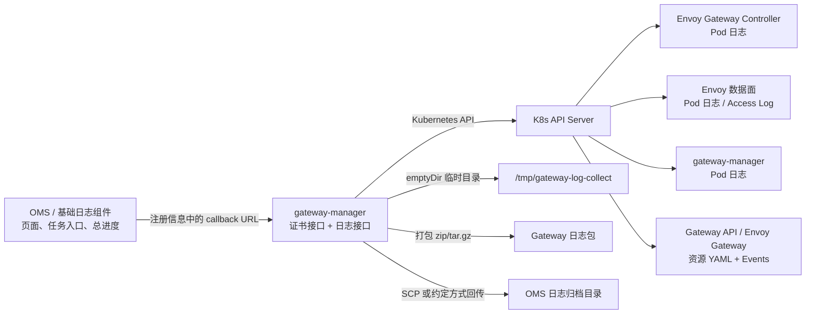
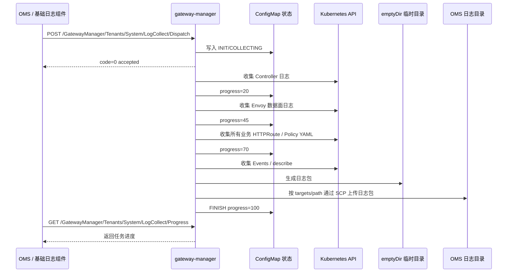

# OMS Log Collect API Design

本文档描述 AIDP Gateway 对接 OMS 日志收集的设计。这里的 Gateway 是 **日志提供组件**：OMS/基础日志组件负责页面入口、任务入口和总进度管理；Gateway 负责收集自己能获取到的 Gateway 相关日志和配置，并把日志包交给 OMS。

## 1. 最终设计口径

| 项目 | 设计结论 |
| --- | --- |
| 镜像名 | `gateway-manager:v1` |
| Service 名称 | `gateway-manager` |
| Service 端口 | `8080` |
| 服务职责 | 证书接口和日志接口都归到 Gateway 管理服务 |
| 任务状态 | 写入 ConfigMap：`aidp-gateway-log-collect-status` |
| 日志临时目录 | 使用 `emptyDir` 挂载到 `/tmp/gateway-log-collect` |
| Pod 重启处理 | 如果 ConfigMap 中存在 `COLLECTING` 任务，启动时恢复为 `FAILED` |
| OMS 对接方式 | 严格使用 OMS 注册后的 callback URL |
| OMS 注册接口 | Gateway 不依赖、不调用；只提供自己的日志接口和日志类型信息 |
| 日志类型列表 | 由 OMS 注册信息中的 `logTypeVos` 声明，Gateway 不再额外提供日志类型查询接口 |
| 收集范围 | 收集所有业务 `HTTPRoute` / Gateway Policy，不只收集 Gateway namespace |
| 日志时间范围 | 简化实现，`startTime` 做 best-effort 起点过滤，`endTime` 只写入 metadata 和文件名 |

默认集群内访问地址：

```text
http://gateway-manager.aidp-gateway.svc.cluster.local:8080
```

## 2. 架构位置



## 3. 提供给 OMS 的注册信息

`POST /log/type/register/internal` 属于 OMS/基础日志组件侧能力。Gateway 侧不需要知道这个接口的真实地址和鉴权方式，也不主动调用它。

Gateway 只需要在交付文档或配置项中提供下面这些信息：Gateway 是哪个日志提供组件、支持哪些日志类型、OMS 应该调用 Gateway 哪些 callback URL。OMS/基础组件按自己的机制读取或注册这些信息后，会自动调用 Gateway 的 callback URL。

Gateway 注册内容示例：

```json
{
  "serverName": "AIDP-Gateway",
  "dispatchCallbackUrl": "http://gateway-manager.aidp-gateway.svc.cluster.local:8080/GatewayManager/Tenants/System/LogCollect/Dispatch",
  "queryProgressCallbackUrl": "http://gateway-manager.aidp-gateway.svc.cluster.local:8080/GatewayManager/Tenants/System/LogCollect/Progress",
  "queryNodesCallbackUrl": "http://gateway-manager.aidp-gateway.svc.cluster.local:8080/GatewayManager/Tenants/System/LogCollect/Nodes",
  "callbackAuthMethod": "token",
  "callbackAuthToken": "change-me",
  "path": "/repo/logCollectAIDPGateway",
  "logTypeVos": [
    {
      "logType": "GATEWAY_CONTROLLER_LOG",
      "nodeType": "AIDP_GATEWAY_CONTROLLER",
      "name": "Gateway Controller Log",
      "nameZh": "Gateway 控制面日志"
    },
    {
      "logType": "GATEWAY_PROXY_LOG",
      "nodeType": "AIDP_GATEWAY_PROXY",
      "name": "Gateway Proxy Log",
      "nameZh": "Gateway 数据面日志"
    },
    {
      "logType": "GATEWAY_MANAGER_LOG",
      "nodeType": "AIDP_GATEWAY_MANAGER",
      "name": "Gateway Manager Log",
      "nameZh": "Gateway 管理面日志"
    },
    {
      "logType": "GATEWAY_RESOURCE_YAML",
      "nodeType": "AIDP_GATEWAY_RESOURCE",
      "name": "Gateway Resource YAML",
      "nameZh": "Gateway 资源配置"
    },
    {
      "logType": "GATEWAY_EVENT",
      "nodeType": "AIDP_GATEWAY_EVENT",
      "name": "Gateway Kubernetes Event",
      "nameZh": "Gateway 事件"
    }
  ]
}
```

说明：

- `dispatchCallbackUrl` 就是 `POST /GatewayManager/Tenants/System/LogCollect/Dispatch` 的完整集群内 URL。
- `queryProgressCallbackUrl` 就是 `GET /GatewayManager/Tenants/System/LogCollect/Progress` 的完整集群内 URL。
- `queryNodesCallbackUrl` 就是 `GET /GatewayManager/Tenants/System/LogCollect/Nodes` 的完整集群内 URL。
- Gateway 可收集的日志类型由注册内容里的 `logTypeVos` 声明，不再额外提供日志类型查询接口。
- Gateway 不需要实现 `/log/type/register/internal`，也不需要安装后自动注册。

## 4. Gateway 对外接口

### 4.1 启动日志收集

接口路径：

```text
POST /GatewayManager/Tenants/System/LogCollect/Dispatch
```

功能：

OMS 根据注册得到的 `dispatchCallbackUrl` 调用该接口，通知 Gateway 开始收集日志。Gateway 创建任务后异步执行收集和打包。

请求示例：

```json
{
  "collectUser": "admin",
  "scene": "oms_scene",
  "startTime": "2024-01-01 10:00:00",
  "endTime": "2024-01-01 11:00:00",
  "path": "/repo/logCollectAIDPGateway",
  "targets": [
    {
      "ip": "192.168.1.100",
      "port": "22",
      "userName": "manager",
      "password": "xxxxxx",
      "opType": "SSH"
    }
  ],
  "nodeList": [
    {
      "name": "aidp-gateway",
      "nodeIp": "127.0.0.1",
      "nodeType": "AIDP_GATEWAY",
      "status": "READY",
      "product": "AIDP",
      "logTypes": [
        "GATEWAY_CONTROLLER_LOG",
        "GATEWAY_PROXY_LOG",
        "GATEWAY_MANAGER_LOG",
        "GATEWAY_RESOURCE_YAML",
        "GATEWAY_EVENT"
      ]
    }
  ]
}
```

处理逻辑：

1. 校验请求参数和 `logTypes`。
2. 创建 `collectId`。
3. 将任务状态写入 ConfigMap `aidp-gateway-log-collect-status`。
4. 在 `/tmp/gateway-log-collect/<collectId>` 下创建临时目录。
5. 按日志类型收集 Gateway 相关日志和资源。
6. 打包为 zip 或 tar.gz。
7. 按 OMS 文档约定，通过 `targets` 指定的 SSH/SCP 信息上传到 `path` 对应目录。
8. 更新任务状态为 `FINISH`、`FAILED` 或 `PART_FAILED`。

返回示例：

```json
{
  "code": 0,
  "data": true,
  "message": "成功"
}
```

### 4.2 查询日志状态

接口路径：

```text
GET /GatewayManager/Tenants/System/LogCollect/Progress
```

功能：

OMS 根据注册得到的 `queryProgressCallbackUrl` 调用该接口，用于页面进度条展示。

可选查询参数：

```text
collectId=<collectId>
```

如果不传 `collectId`，返回最近一次任务状态。

返回示例：

```json
{
  "code": 0,
  "data": {
    "basicInfo": {
      "collectStatus": "COLLECTING",
      "startTime": "2024-01-01 10:00:00",
      "endTime": "2024-01-01 11:00:00",
      "progress": 60,
      "describe": "collecting envoy data-plane logs"
    },
    "nodeInfos": [
      {
        "name": "envoy-gateway-controller",
        "nodeIp": "10.244.0.12",
        "nodeType": "AIDP_GATEWAY_CONTROLLER",
        "progress": 100,
        "collectState": 2,
        "fileName": "controller/envoy-gateway-controller.log"
      },
      {
        "name": "envoy-data-plane",
        "nodeIp": "10.244.0.18",
        "nodeType": "AIDP_GATEWAY_PROXY",
        "progress": 50,
        "collectState": 1,
        "fileName": "proxy/envoy-data-plane.log"
      }
    ],
    "user": "admin"
  },
  "message": "成功"
}
```

状态定义：

| collectStatus | 说明 |
| --- | --- |
| INIT | 任务已创建 |
| COLLECTING | 收集中 |
| FINISH | 全部完成 |
| FAILED | 全部失败 |
| PART_FAILED | 部分失败 |

| collectState | 说明 |
| --- | --- |
| 0 | 初始化 |
| 1 | 收集中 |
| 2 | 成功 |
| 3 | 失败 |
| 4 | 部分失败 |

### 4.3 日志类型声明

Gateway 不额外暴露日志类型查询接口。OMS 从注册信息里的 `logTypeVos` 获取 Gateway 支持的日志类型。

```json
[
  {
    "logType": "GATEWAY_CONTROLLER_LOG",
    "nodeType": "AIDP_GATEWAY_CONTROLLER",
    "name": "Gateway Controller Log",
    "nameZh": "Gateway 控制面日志"
  },
  {
    "logType": "GATEWAY_PROXY_LOG",
    "nodeType": "AIDP_GATEWAY_PROXY",
    "name": "Gateway Proxy Log",
    "nameZh": "Gateway 数据面日志"
  },
  {
    "logType": "GATEWAY_MANAGER_LOG",
    "nodeType": "AIDP_GATEWAY_MANAGER",
    "name": "Gateway Manager Log",
    "nameZh": "Gateway 管理面日志"
  },
  {
    "logType": "GATEWAY_RESOURCE_YAML",
    "nodeType": "AIDP_GATEWAY_RESOURCE",
    "name": "Gateway Resource YAML",
    "nameZh": "Gateway 资源配置"
  },
  {
    "logType": "GATEWAY_EVENT",
    "nodeType": "AIDP_GATEWAY_EVENT",
    "name": "Gateway Kubernetes Event",
    "nameZh": "Gateway 事件"
  }
]
```

### 4.4 查询 Gateway 节点列表

接口路径：

```text
GET /GatewayManager/Tenants/System/LogCollect/Nodes?page=1&limit=100
```

功能：

供 OMS 的 `queryNodesCallbackUrl` 使用，返回 Gateway 当前可收集的逻辑节点。这里的“节点”不一定是物理机，更接近日志收集对象。

返回示例：

```json
{
  "items": [
    {
      "name": "envoy-gateway-controller",
      "status": "READY",
      "nodeType": "AIDP_GATEWAY_CONTROLLER",
      "product": "AIDP",
      "nodeIp": "10.244.0.12"
    },
    {
      "name": "envoy-data-plane",
      "status": "READY",
      "nodeType": "AIDP_GATEWAY_PROXY",
      "product": "AIDP",
      "nodeIp": "10.244.0.18"
    },
    {
      "name": "gateway-manager",
      "status": "READY",
      "nodeType": "AIDP_GATEWAY_MANAGER",
      "product": "AIDP",
      "nodeIp": "10.244.0.20"
    }
  ],
  "total": 3,
  "page": 1,
  "limit": 100
}
```

## 5. Gateway 需要收集的内容

| 日志类型 | 收集内容 |
| --- | --- |
| `GATEWAY_CONTROLLER_LOG` | Envoy Gateway Controller Pod 日志 |
| `GATEWAY_PROXY_LOG` | Envoy 数据面 Pod 日志，包括 stdout access log |
| `GATEWAY_MANAGER_LOG` | `gateway-manager` Pod 日志，包括证书接口和日志接口自身日志 |
| `GATEWAY_RESOURCE_YAML` | 所有业务 `HTTPRoute` / `ReferenceGrant` / `SecurityPolicy` / `EnvoyExtensionPolicy` / `BackendTrafficPolicy` / `ClientTrafficPolicy`，以及 Gateway 自身 `GatewayClass` / `Gateway` / `EnvoyProxy` |
| `GATEWAY_EVENT` | Gateway namespace、Envoy 数据面 namespace、相关业务路由 namespace 的 Kubernetes Events 和 describe 信息 |

日志包目录结构建议：

```text
aidp-gateway-log-<collectId>.zip
├── metadata.json
├── controller/
│   └── envoy-gateway-controller.log
├── proxy/
│   ├── envoy-xxx.log
│   └── envoy-yyy.log
├── manager/
│   └── gateway-manager.log
├── resources/
│   ├── gatewayclass.yaml
│   ├── gateway.yaml
│   ├── envoyproxy.yaml
│   ├── httproutes-all-namespaces.yaml
│   ├── referencegrants-all-namespaces.yaml
│   ├── securitypolicies-all-namespaces.yaml
│   ├── envoyextensionpolicies-all-namespaces.yaml
│   ├── backendtrafficpolicies-all-namespaces.yaml
│   └── clienttrafficpolicies-all-namespaces.yaml
├── events/
│   └── events-all-related-namespaces.yaml
└── describe/
    ├── pods.txt
    ├── services.txt
    └── deployments.txt
```

`metadata.json` 示例：

```json
{
  "serverName": "AIDP-Gateway",
  "collectId": "20240507113600-admin",
  "collectUser": "admin",
  "scene": "oms_scene",
  "startTime": "2024-01-01 10:00:00",
  "endTime": "2024-01-01 11:00:00",
  "gatewayNamespace": "aidp-gateway",
  "gatewayName": "eg",
  "logTypes": [
    "GATEWAY_CONTROLLER_LOG",
    "GATEWAY_PROXY_LOG",
    "GATEWAY_MANAGER_LOG",
    "GATEWAY_RESOURCE_YAML",
    "GATEWAY_EVENT"
  ]
}
```

## 6. 状态持久化和 Pod 重启恢复

任务状态 ConfigMap：

```text
aidp-gateway-log-collect-status
```

建议结构：

```json
{
  "currentCollectId": "20240507113600-admin",
  "tasks": {
    "20240507113600-admin": {
      "collectUser": "admin",
      "scene": "oms_scene",
      "startTime": "2024-01-01 10:00:00",
      "endTime": "2024-01-01 11:00:00",
      "collectStatus": "COLLECTING",
      "progress": 60,
      "describe": "collecting envoy data-plane logs",
      "archiveFile": "",
      "errorCode": "",
      "errorMsg": ""
    }
  }
}
```

启动恢复逻辑：

1. `gateway-manager` 启动时读取 ConfigMap。
2. 如果发现状态为 `COLLECTING` 或 `INIT` 的历史任务，说明上一次收集过程中 Pod 重启或异常退出。
3. 将该任务更新为：

```json
{
  "collectStatus": "FAILED",
  "progress": 100,
  "describe": "gateway-manager restarted during log collection",
  "errorCode": "GATEWAY_LOG_COLLECT_INTERRUPTED"
}
```

这样 OMS 页面不会一直卡在收集中。

临时目录：

```text
/tmp/gateway-log-collect
```

Helm 部署中使用 `emptyDir`：

```yaml
volumes:
- name: gateway-log-collect-tmp
  emptyDir: {}

volumeMounts:
- name: gateway-log-collect-tmp
  mountPath: /tmp/gateway-log-collect
```

## 7. Access Log 检查结论

当前实现状态：

- `package-gateway/charts/aidp-gateway/templates/envoyproxy.yaml` 已配置 `spec.telemetry.accessLog`。
- access log sink 使用 `File`，路径为 `/dev/stdout`。
- `GATEWAY_PROXY_LOG` 会读取 Envoy 数据面 Pod stdout，因此可以收集业务访问日志。

当前 `EnvoyProxy` access log 配置如下：

```yaml
apiVersion: gateway.envoyproxy.io/v1alpha1
kind: EnvoyProxy
spec:
  telemetry:
    accessLog:
      settings:
      - sinks:
        - type: File
          file:
            path: /dev/stdout
        format:
          type: JSON
          json:
            start_time: "%START_TIME%"
            method: "%REQ(:METHOD)%"
            path: "%REQ(X-ENVOY-ORIGINAL-PATH?:PATH)%"
            protocol: "%PROTOCOL%"
            response_code: "%RESPONSE_CODE%"
            response_flags: "%RESPONSE_FLAGS%"
            duration: "%DURATION%"
            upstream_host: "%UPSTREAM_HOST%"
            x_forwarded_for: "%REQ(X-FORWARDED-FOR)%"
            user_agent: "%REQ(USER-AGENT)%"
```

## 8. RBAC 设计

由于需要收集所有业务 `HTTPRoute` / Policy，`gateway-manager` 需要具备跨 namespace 的只读权限。

命名空间内权限：

```yaml
resources: ["pods", "pods/log", "services", "endpoints", "configmaps", "events"]
verbs: ["get", "list"]

resources: ["deployments", "replicasets"]
apiGroups: ["apps"]
verbs: ["get", "list"]
```

集群级只读权限：

```yaml
resources:
  - gateways
  - gatewayclasses
  - httproutes
  - referencegrants
apiGroups: ["gateway.networking.k8s.io"]
verbs: ["get", "list"]

resources:
  - envoyproxies
  - securitypolicies
  - envoyextensionpolicies
  - backendtrafficpolicies
  - clienttrafficpolicies
apiGroups: ["gateway.envoyproxy.io"]
verbs: ["get", "list"]
```

状态写权限：

```yaml
resources: ["configmaps"]
verbs: ["get", "create", "update", "patch"]
```

证书接口仍需要 Secret 写权限：

```yaml
resources: ["secrets"]
verbs: ["get", "create", "update", "patch"]
```

## 9. Helm 变更点

当前实现已经把原 `certificateManager` 演进为统一的 `gatewayManager`：

```yaml
gatewayManager:
  enabled: true
  image:
    repository: gateway-manager
    tag: v1
    pullPolicy: IfNotPresent
  replicas: 1
  service:
    name: gateway-manager
    port: 8080
  certificate:
    secretNamespace: ""
    secretPrefix: gw-cert-
  logCollect:
    statusConfigMapName: aidp-gateway-log-collect-status
    tmpDir: /tmp/gateway-log-collect
    tmpSizeLimit: 1Gi
    archiveRetentionSeconds: 86400
    archiveMaxFiles: 5
```

新文档和新部署统一使用 `gatewayManager`。cleanup job 额外清理旧的 `gateway-cert-manager` label，只用于卸载历史版本残留资源。

## 10. 收集流程



## 11. 已知约束和后续确认项

1. `opType=SSH` 支持两种上传方式：带 `password` 时使用 Python `paramiko==5.0.0` 完成 SSH/SCP 上传；不带 `password` 时使用系统 `scp`，适用于容器内可用 SSH key/免密的环境。
2. `targets[].password` 目前按 OMS 回调请求中的可用凭据处理，gateway-manager 不落盘保存，只在本次上传任务内使用。
3. EnvoyProxy access log 的 JSON 字段是否需要和 OMS 日志解析规则进一步对齐，待联调确认。
4. `startTime/endTime` 按简单方案处理：Kubernetes Pod log 使用 `sinceTime=startTime` 做 best-effort 起点过滤，`endTime` 不做强制截断，只写入 metadata 和文件名。
